# Awesome-Efficient-LLM
A curated list for **Efficient Large Language Models**

## Full List
  - [Network Pruning / Sparsity](pruning.md)
  - [Knowledge Distillation](knowledge_distillation.md)
  - [Quantization](quantization.md)
  - [Inference Acceleration](inference_acceleration.md)
  - [Efficient MOE](efficient_moe.md)
  - [Efficient Architecture of LLM](efficient_architecture_llm.md)
  - [KV Cache Compression](kv_cache_compression.md)
  - [Text Compression](text_compression.md)
  - [Low-Rank Decomposition](low_rank_decomposition.md)
  - [Hardware / System](hardware.md)
  - [Tuning](tuning.md)
  - [Survey](survey.md)
  - [Leaderboard](leaderboard.md)

### Please check out all the papers by selecting the sub-area you're interested in. On this main page, we're showing papers released in the past 90 days.

#### 🚀 Updates
* May 29, 2024: We've had this awesome list for a year now :smiling_face_with_three_hearts:! 
* Sep 6, 2023: Add a new subdirectory [project/](project/) to organize efficient LLM projects.
* July 11, 2023: A new subdirectory [efficient_plm/](efficient_plm/) is created to house papers that are applicable to PLMs. 

#### 💮 Contributing

If you'd like to include your paper, or need to update any details such as conference information or code URLs, please feel free to submit a pull request. You can generate the required markdown format for each paper by filling in the information in `generate_item.py` and execute `python generate_item.py`. We warmly appreciate your contributions to this list. Alternatively, you can email me with the links to your paper and code, and I would add your paper to the list at my earliest convenience. 

#### :star: Recommended Paper

For each topic, we have curated a list of recommended papers that have garnered relatively high GitHub stars or citations.

## Paper from June 21, 2024 - Now (see Full List from May 22, 2023 [here](#full-list))

### Quick Link 
  - [Network Pruning / Sparsity](#network-pruning--sparsity)
  - [Knowledge Distillation](#knowledge-distillation)
  - [Quantization](#quantization)
  - [Inference Acceleration](#inference-acceleration)
  - [Efficient MOE](#efficient_moe)
  - [Efficient Architecture of LLM](#efficient-architecture-of-llm)
  - [KV Cache Compression](#kv-cache-compression)
  - [Text Compression](#text-compression)
  - [Low-Rank Decomposition](#low-rank-decomposition)
  - [Hardware / System](#hardwaresystem)
  - [Tuning](#tuning)
  - [Survey](#survey)

### Network Pruning / Sparsity
| Title & Authors | Introduction | Links |
|:--|  :----: | :---:|
|      :star: [SparseGPT: Massive Language Models Can Be Accurately Pruned in One-Shot](https://github.com/IST-DASLab/sparsegpt)   Elias Frantar, Dan Alistarh| 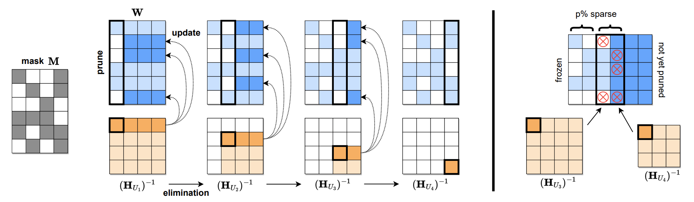 |[Github](https://github.com/IST-DASLab/sparsegpt) [paper](https://arxiv.org/abs/2301.00774) | [//]: #Recommend
|      :star: [LLM-Pruner: On the Structural Pruning of Large Language Models](https://arxiv.org/abs/2305.11627)   Xinyin Ma, Gongfan Fang, Xinchao Wang | 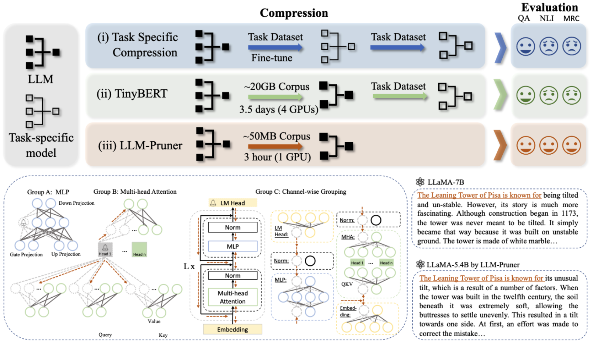| [Github](https://github.com/horseee/LLM-Pruner) [paper](https://arxiv.org/abs/2305.11627)| [//]: #Recommend
|      :star: [A Simple and Effective Pruning Approach for Large Language Models](https://arxiv.org/abs/2306.11695)   Mingjie Sun, Zhuang Liu, Anna Bair, J. Zico Kolter | |[Github](https://github.com/locuslab/wanda)   [Paper](https://arxiv.org/abs/2306.11695)| [//]: #Recommend
|     :star: [Sheared LLaMA: Accelerating Language Model Pre-training via Structured Pruning](https://arxiv.org/abs/2310.06694)   Mengzhou Xia, Tianyu Gao, Zhiyuan Zeng, Danqi Chen |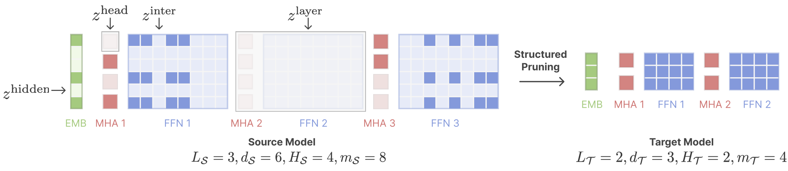 |[Github](https://github.com/princeton-nlp/LLM-Shearing)   [Paper](https://arxiv.org/abs/2310.06694)| [//]: #Recommend
| [CFSP: An Efficient Structured Pruning Framework for LLMs with Coarse-to-Fine Activation Information](https://arxiv.org/abs/2409.13199)   Yuxin Wang, Minghua Ma, Zekun Wang, Jingchang Chen, Huiming Fan, Liping Shan, Qing Yang, Dongliang Xu, Ming Liu, Bing Qin | |[Github](https://github.com/wyxscir/CFSP)   [Paper](https://arxiv.org/abs/2409.13199)|[//]: #09/27
|[OATS: Outlier-Aware Pruning Through Sparse and Low Rank Decomposition](https://arxiv.org/abs/2409.13652)   Stephen Zhang, Vardan Papyan | |[Paper](https://arxiv.org/abs/2409.13652)|[//]: #09/27
|[KVPruner: Structural Pruning for Faster and Memory-Efficient Large Language Models](https://arxiv.org/abs/2409.11057)   Bo Lv, Quan Zhou, Xuanang Ding, Yan Wang, Zeming Ma | |[Paper](https://arxiv.org/abs/2409.11057)|[//]: #09/21
|[Evaluating the Impact of Compression Techniques on Task-Specific Performance of Large Language Models](https://arxiv.org/abs/2409.11233)   Bishwash Khanal, Jeffery M. Capone | |[Paper](https://arxiv.org/abs/2409.11233)|[//]: #09/21
|[STUN: Structured-Then-Unstructured Pruning for Scalable MoE Pruning](https://arxiv.org/abs/2409.06211)   Jaeseong Lee, seung-won hwang, Aurick Qiao, Daniel F Campos, Zhewei Yao, Yuxiong He | |[Paper](https://arxiv.org/abs/2409.06211)|[//]: #09/13
| [PAT: Pruning-Aware Tuning for Large Language Models](https://arxiv.org/abs/2408.14721)   Yijiang Liu, Huanrui Yang, Youxin Chen, Rongyu Zhang, Miao Wang, Yuan Du, Li Du |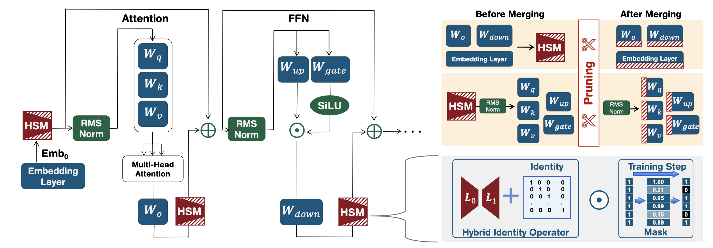 |[Github](https://github.com/kriskrisliu/PAT_Pruning-Aware-Tuning)   [Paper](https://arxiv.org/abs/2408.14721)|[//]: #09/02
|[LLM Pruning and Distillation in Practice: The Minitron Approach](https://arxiv.org/abs/2408.11796)   Sharath Turuvekere Sreenivas, Saurav Muralidharan, Raviraj Joshi, Marcin Chochowski, Mostofa Patwary, Mohammad Shoeybi, Bryan Catanzaro, Jan Kautz, Pavlo Molchanov | |[Paper](https://arxiv.org/abs/2408.11796)|[//]: #08/27
|[Language-specific Calibration for Pruning Multilingual Language Models](https://arxiv.org/abs/2408.14398)   Simon Kurz, Zhixue Zhao, Jian-Jia Chen, Lucie Flek ||[Paper](https://arxiv.org/abs/2408.14398)|[//]: #08/27
| [LLM-Barber: Block-Aware Rebuilder for Sparsity Mask in One-Shot for Large Language Models](https://arxiv.org/abs/2408.10631)   Yupeng Su, Ziyi Guan, Xiaoqun Liu, Tianlai Jin, Dongkuan Wu, Graziano Chesi, Ngai Wong, Hao Yu | |[Github](https://github.com/YupengSu/LLM-Barber)   [Paper](https://arxiv.org/abs/2408.10631)|[//]: #08/27
|[Enhancing One-shot Pruned Pre-trained Language Models through Sparse-Dense-Sparse Mechanism](https://arxiv.org/abs/2408.10473)   Guanchen Li, Xiandong Zhao, Lian Liu, Zeping Li, Dong Li, Lu Tian, Jie He, Ashish Sirasao, Emad Barsoum | |[Paper](https://arxiv.org/abs/2408.10473)|[//]: #08/27
|[A Convex-optimization-based Layer-wise Post-training Pruner for Large Language Models](https://arxiv.org/abs/2408.03728)   Pengxiang Zhao, Hanyu Hu, Ping Li, Yi Zheng, Zhefeng Wang, Xiaoming Yuan | |[Paper](https://arxiv.org/abs/2408.03728)|[//]: #08/08
|[Pruning Large Language Models with Semi-Structural Adaptive Sparse Training](https://arxiv.org/abs/2407.20584)   Weiyu Huang, Guohao Jian, Yuezhou Hu, Jun Zhu, Jianfei Chen | |[Paper](https://arxiv.org/abs/2407.20584)|[//]: #08/08
|[Greedy Output Approximation: Towards Efficient Structured Pruning for LLMs Without Retraining](https://arxiv.org/abs/2407.19126)   Jianwei Li, Yijun Dong, Qi Lei | |[Paper](https://arxiv.org/abs/2407.19126)|[//]: #08/08
| [Compact Language Models via Pruning and Knowledge Distillation](https://arxiv.org/abs/2407.14679)   Saurav Muralidharan, Sharath Turuvekere Sreenivas, Raviraj Joshi, Marcin Chochowski, Mostofa Patwary, Mohammad Shoeybi, Bryan Catanzaro, Jan Kautz, Pavlo Molchanov | |[Github](https://github.com/NVlabs/Minitron)   [Paper](https://arxiv.org/abs/2407.14679)|[//]: #07/29
|[MINI-LLM: Memory-Efficient Structured Pruning for Large Language Models](https://arxiv.org/abs/2407.11681mini)   Hongrong Cheng, Miao Zhang, Javen Qinfeng Shi |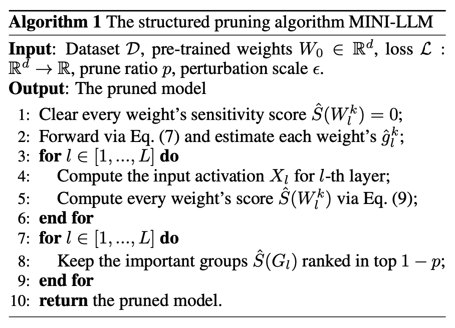 |[Paper](https://arxiv.org/abs/2407.11681mini)|[//]: #07/21
|[Reconstruct the Pruned Model without Any Retraining](https://arxiv.org/abs/2407.13331)   Pingjie Wang, Ziqing Fan, Shengchao Hu, Zhe Chen, Yanfeng Wang, Yu Wang | |[Paper](https://arxiv.org/abs/2407.13331)|[//]: #07/21
|[Q-Sparse: All Large Language Models can be Fully Sparsely-Activated](https://arxiv.org/abs/2407.10969)   Hongyu Wang, Shuming Ma, Ruiping Wang, Furu Wei | |[Paper](https://arxiv.org/abs/2407.10969)|[//]: #07/16
| [Pruning Large Language Models to Intra-module Low-rank Architecture with Transitional Activations](https://arxiv.org/abs/2407.05690)   Bowen Shen, Zheng Lin, Daren Zha, Wei Liu, Jian Luan, Bin Wang, Weiping Wang | |[Github](https://github.com/sbwww/TransAct-pruning)   [Paper](https://arxiv.org/abs/2407.05690)|[//]: #07/10
|   [Beyond Perplexity: Multi-dimensional Safety Evaluation of LLM Compression](https://arxiv.org/abs/2407.04965)   Zhichao Xu, Ashim Gupta, Tao Li, Oliver Bentham, Vivek Srikumar | |[Github](https://github.com/zhichaoxu-shufe/Beyond-Perplexity-Compression-Safety-Eval)   [Paper](https://arxiv.org/abs/2407.04965)|[//]: #07/10
| [Flextron: Many-in-One Flexible Large Language Model](https://arxiv.org/abs/2406.10260)   Ruisi Cai, Saurav Muralidharan, Greg Heinrich, Hongxu Yin, Zhangyang Wang, Jan Kautz, Pavlo Molchanov | |[Paper](https://arxiv.org/abs/2406.10260)|[//]: #07/05
| [BlockPruner: Fine-grained Pruning for Large Language Models](https://arxiv.org/abs/2406.10594)   Longguang Zhong, Fanqi Wan, Ruijun Chen, Xiaojun Quan, Liangzhi Li | |[Github](https://github.com/MrGGLS/BlockPruner)   [Paper](https://arxiv.org/abs/2406.10594)|[//]: #07/05
| [Structured Pruning for Large Language Models Using Coupled Components Elimination and Minor Fine-tuning](https://aclanthology.org/2024.findings-naacl.1/)   Honghe Zhang, XiaolongShi XiaolongShi, Jingwei Sun, Guangzhong Sun |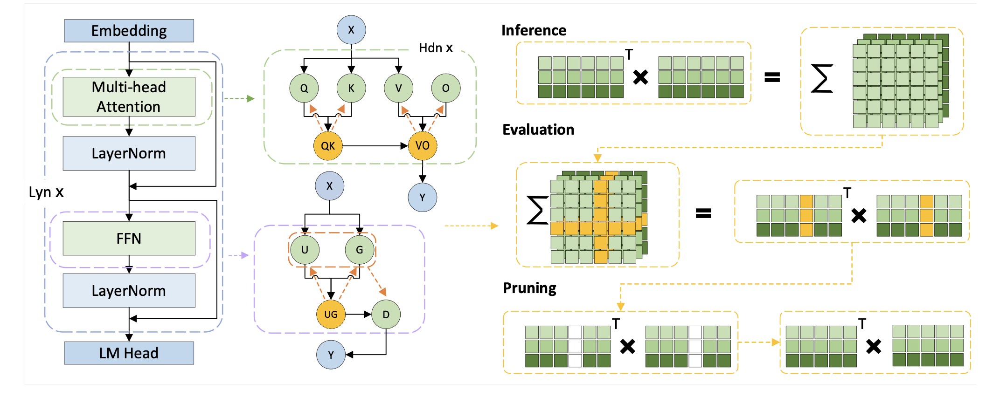 |[Paper](https://aclanthology.org/2024.findings-naacl.1/)|[//]: #07/05
|[FoldGPT: Simple and Effective Large Language Model Compression Scheme](https://arxiv.org/abs/2407.00928)   Songwei Liu, Chao Zeng, Lianqiang Li, Chenqian Yan, Lean Fu, Xing Mei, Fangmin Chen | |[Paper](https://arxiv.org/abs/2407.00928)|[//]: #07/03
| [Learning Neural Networks with Sparse Activations](https://arxiv.org/abs/2406.17989)   Pranjal Awasthi, Nishanth Dikkala, Pritish Kamath, Raghu Meka | |[Paper](https://arxiv.org/abs/2406.17989)|[//]: #06/28

### Knowledge Distillation
| Title & Authors | Introduction | Links |
|:--|  :----: | :---:|
|:star: [Knowledge Distillation of Large Language Models](https://arxiv.org/abs/2306.08543)   Yuxian Gu, Li Dong, Furu Wei, Minlie Huang | |[Github](https://github.com/microsoft/LMOps/tree/main/minillm)   [Paper](https://arxiv.org/abs/2306.08543)| [//]: #Recommend
|[EchoAtt: Attend, Copy, then Adjust for More Efficient Large Language Models](https://arxiv.org/abs/2409.14595)   Hossein Rajabzadeh, Aref Jafari, Aman Sharma, Benyamin Jami, Hyock Ju Kwon, Ali Ghodsi, Boxing Chen, Mehdi Rezagholizadeh | |[Paper](https://arxiv.org/abs/2409.14595)|[//]: #09/27
| [SKIntern: Internalizing Symbolic Knowledge for Distilling Better CoT Capabilities into Small Language Models](https://arxiv.org/abs/2409.13183)   Huanxuan Liao, Shizhu He, Yupu Hao, Xiang Li, Yuanzhe Zhang, Kang Liu, Jun Zhao | |[Github](https://github.com/Xnhyacinth/SKIntern)   [Paper](https://arxiv.org/abs/2409.13183)|[//]: #09/27
| [LLMR: Knowledge Distillation with a Large Language Model-Induced Reward](https://arxiv.org/abs/2409.12500)   Dongheng Li, Yongchang Hao, Lili Mou | |[Github](https://github.com/MANGA-UOFA/Prompt-LLMR)   [Paper](https://arxiv.org/abs/2409.12500)|[//]: #09/21
|[Exploring and Enhancing the Transfer of Distribution in Knowledge Distillation for Autoregressive Language Models](https://arxiv.org/abs/2409.12512)   Jun Rao, Xuebo Liu, Zepeng Lin, Liang Ding, Jing Li, Dacheng Tao | |[Paper](https://arxiv.org/abs/2409.12512)|[//]: #09/21
|[Efficient Knowledge Distillation: Empowering Small Language Models with Teacher Model Insights](https://arxiv.org/abs/2409.12586)   Mohamad Ballout, Ulf Krumnack, Gunther Heidemann, Kai-Uwe Kühnberger | |[Paper](https://arxiv.org/abs/2409.12586)|[//]: #09/21
| [The Mamba in the Llama: Distilling and Accelerating Hybrid Models](https://arxiv.org/abs/2408.15237)   Junxiong Wang, Daniele Paliotta, Avner May, Alexander M. Rush, Tri Dao | |[Github](https://github.com/jxiw/MambaInLlama)   [Paper](https://arxiv.org/abs/2408.15237)|[//]: #09/02
|[FIRST: Teach A Reliable Large Language Model Through Efficient Trustworthy Distillation](https://arxiv.org/abs/2408.12168)   KaShun Shum, Minrui Xu, Jianshu Zhang, Zixin Chen, Shizhe Diao, Hanze Dong, Jipeng Zhang, Muhammad Omer Raza | |[Paper](https://arxiv.org/abs/2408.12168)|[//]: #08/27
|[Interactive DualChecker for Mitigating Hallucinations in Distilling Large Language Models](https://arxiv.org/abs/2408.12326)   Meiyun Wang, Masahiro Suzuki, Hiroki Sakaji, Kiyoshi Izumi | |[Paper](https://arxiv.org/abs/2408.12326)|[//]: #08/27
|[Transformers to SSMs: Distilling Quadratic Knowledge to Subquadratic Models](https://arxiv.org/abs/2408.10189)   Aviv Bick, Kevin Y. Li, Eric P. Xing, J. Zico Kolter, Albert Gu | |[Paper](https://arxiv.org/abs/2408.10189)|[//]: #08/20
|[Concept Distillation from Strong to Weak Models via Hypotheses-to-Theories Prompting](https://arxiv.org/abs/2408.09365)   Emmanuel Aboah Boateng, Cassiano O. Becker, Nabiha Asghar, Kabir Walia, Ashwin Srinivasan, Ehi Nosakhare, Victor Dibia, Soundar Srinivasan | |[Paper](https://arxiv.org/abs/2408.09365)|[//]: #08/20
|[LaDiMo: Layer-wise Distillation Inspired MoEfier](https://arxiv.org/abs/2408.04278)   Sungyoon Kim, Youngjun Kim, Kihyo Moon, Minsung Jang | |[Paper](https://arxiv.org/abs/2408.04278)|[//]: #08/13
|[BOND: Aligning LLMs with Best-of-N Distillation](https://arxiv.org/abs/2407.14622)   Pier Giuseppe Sessa, Robert Dadashi, Léonard Hussenot, Johan Ferret, Nino Vieillard et al |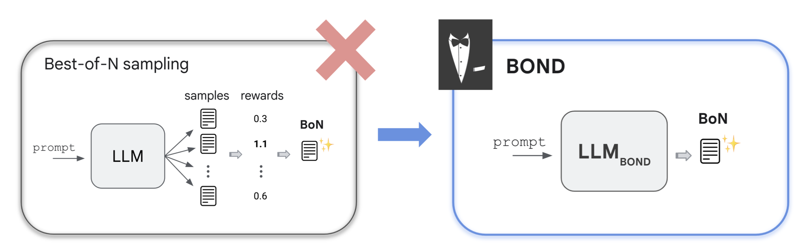 |[Paper](https://arxiv.org/abs/2407.14622)|[//]: #07/29
|[Enhancing Data-Limited Graph Neural Networks by Actively Distilling Knowledge from Large Language Models](https://arxiv.org/abs/2407.13989)   Quan Li, Tianxiang Zhao, Lingwei Chen, Junjie Xu, Suhang Wang | |[Paper](https://arxiv.org/abs/2407.13989)|[//]: #07/24
|[DDK: Distilling Domain Knowledge for Efficient Large Language Models](https://arxiv.org/abs/2407.16154)   Jiaheng Liu, Chenchen Zhang, Jinyang Guo, Yuanxing Zhang, Haoran Que, Ken Deng, Zhiqi Bai, Jie Liu, Ge Zhang, Jiakai Wang, Yanan Wu, Congnan Liu, Wenbo Su, Jiamang Wang, Lin Qu, Bo Zheng | |[Paper](https://arxiv.org/abs/2407.16154)|[//]: #07/24
|[Key-Point-Driven Mathematical Reasoning Distillation of Large Language Model](https://arxiv.org/abs/2407.10167)   Xunyu Zhu, Jian Li, Yong Liu, Can Ma, Weiping Wang | |[Paper](https://arxiv.org/abs/2407.10167)|[//]: #07/16
|[Don't Throw Away Data: Better Sequence Knowledge Distillation](https://arxiv.org/abs/2407.10456)   Jun Wang, Eleftheria Briakou, Hamid Dadkhahi, Rishabh Agarwal, Colin Cherry, Trevor Cohn | |[Paper](https://arxiv.org/abs/2407.10456)|[//]: #07/16
|[Multi-Granularity Semantic Revision for Large Language Model Distillation](https://arxiv.org/abs/2407.10068)   Xiaoyu Liu, Yun Zhang, Wei Li, Simiao Li, Xudong Huang, Hanting Chen, Yehui Tang, Jie Hu, Zhiwei Xiong, Yunhe Wang | |[Paper](https://arxiv.org/abs/2407.10068)|[//]: #07/16
|[BiLD: Bi-directional Logits Difference Loss for Large Language Model Distillation](https://arxiv.org/abs/2406.13555)   Minchong Li, Feng Zhou, Xiaohui Song | |[Paper](https://arxiv.org/abs/2406.13555)|[//]: #07/05

### Quantization
| Title & Authors | Introduction | Links |
|:--|  :----: | :---:|
|  :star: [GPTQ: Accurate Post-Training Quantization for Generative Pre-trained Transformers](https://arxiv.org/abs/2210.17323)   Elias Frantar, Saleh Ashkboos, Torsten Hoefler, Dan Alistarh | |[Github](https://github.com/IST-DASLab/gptq)   [Paper](https://arxiv.org/abs/2210.17323)| [//]: #Recommend
|   :star: [SmoothQuant: Accurate and Efficient Post-Training Quantization for Large Language Models](https://arxiv.org/abs/2211.10438)   Guangxuan Xiao, Ji Lin, Mickael Seznec, Hao Wu, Julien Demouth, Song Han | |[Github](https://github.com/mit-han-lab/smoothquant)   [Paper](https://arxiv.org/abs/2211.10438)| [//]: #Recommend
|   :star: [AWQ: Activation-aware Weight Quantization for LLM Compression and Acceleration](https://arxiv.org/abs/2306.00978)   Ji Lin, Jiaming Tang, Haotian Tang, Shang Yang, Xingyu Dang, Song Han | |[Github](https://github.com/mit-han-lab/llm-awq)   [Paper](https://arxiv.org/abs/2306.00978)| [//]: #Recommend
|  :star: [OmniQuant: Omnidirectionally Calibrated Quantization for Large Language Models](https://arxiv.org/abs/2308.13137)   Wenqi Shao, Mengzhao Chen, Zhaoyang Zhang, Peng Xu, Lirui Zhao, Zhiqian Li, Kaipeng Zhang, Peng Gao, Yu Qiao, Ping Luo | |[Github](https://github.com/OpenGVLab/OmniQuant)   [Paper](https://arxiv.org/abs/2308.13137)| [//]: #Recommend
|    :star: [SqueezeLLM: Dense-and-Sparse Quantization](https://arxiv.org/pdf/2306.07629.pdf)  Sehoon Kim, Coleman Hooper, Amir Gholami, Zhen Dong, Xiuyu Li, Sheng Shen, Michael W. Mahoney, Kurt Keutzer |  |[Github](https://github.com/SqueezeAILab/SqueezeLLM)   [Paper](https://arxiv.org/pdf/2306.07629.pdf)| [//]: #Recommend
|  :star: [Extreme Compression of Large Language Models via Additive Quantization](https://arxiv.org/abs/2401.06118)   Vage Egiazarian, Andrei Panferov, Denis Kuznedelev, Elias Frantar, Artem Babenko, Dan Alistarh | |[Github](https://github.com/vahe1994/AQLM)   [Paper](https://arxiv.org/abs/2401.06118)| [//]: #Recommend
| [DuQuant: Distributing Outliers via Dual Transformation Makes Stronger Quantized LLMs](https://arxiv.org/abs/2406.01721)   Haokun Lin, Haobo Xu, Yichen Wu, Jingzhi Cui, Yingtao Zhang, Linzhan Mou, Linqi Song, Zhenan Sun, Ying Wei | |[Github](https://github.com/Hsu1023/DuQuant?tab=readme-ov-file)   [Paper](https://arxiv.org/abs/2406.01721)|[//]: #09/27
|[A Comprehensive Evaluation of Quantized Instruction-Tuned Large Language Models: An Experimental Analysis up to 405B](https://arxiv.org/abs/2409.11055)   Jemin Lee, Sihyeong Park, Jinse Kwon, Jihun Oh, Yongin Kwon | |[Paper](https://arxiv.org/abs/2409.11055)|[//]: #09/21
|[The Uniqueness of LLaMA3-70B with Per-Channel Quantization: An Empirical Study](https://arxiv.org/abs/2408.15301)   Minghai Qin | |[Paper](https://arxiv.org/abs/2408.15301)|[//]: #09/02
|[Matmul or No Matmal in the Era of 1-bit LLMs](https://arxiv.org/abs/2408.11939)   Jinendra Malekar, Mohammed E. Elbtity, Ramtin Zand Co | |[Paper](https://arxiv.org/abs/2408.11939)|[//]: #08/27
| [MobileQuant: Mobile-friendly Quantization for On-device Language Models](https://arxiv.org/abs/2408.13933)   Fuwen Tan, Royson Lee, Łukasz Dudziak, Shell Xu Hu, Sourav Bhattacharya, Timothy Hospedales, Georgios Tzimiropoulos, Brais Martinez | |[Github](https://github.com/saic-fi/MobileQuant)   [Paper](https://arxiv.org/abs/2408.13933)|[//]: #08/27
| [ABQ-LLM: Arbitrary-Bit Quantized Inference Acceleration for Large Language Models](https://arxiv.org/abs/2408.08554)   Chao Zeng, Songwei Liu, Yusheng Xie, Hong Liu, Xiaojian Wang, Miao Wei, Shu Yang, Fangmin Chen, Xing Mei | |[Github](https://github.com/bytedance/ABQ-LLM)   [Paper](https://arxiv.org/abs/2408.08554)|[//]: #08/20
|[STBLLM: Breaking the 1-Bit Barrier with Structured Binary LLMs](https://arxiv.org/abs/2408.01803)   Peijie Dong, Lujun Li, Dayou Du, Yuhan Chen, Zhenheng Tang, Qiang Wang, Wei Xue, Wenhan Luo, Qifeng Liu, Yike Guo, Xiaowen Chu | |[Paper](https://arxiv.org/abs/2408.01803)|[//]: #08/08
| [Accurate and Efficient Fine-Tuning of Quantized Large Language Models Through Optimal Balance](https://arxiv.org/abs/2407.17029)   Ao Shen, Qiang Wang, Zhiquan Lai, Xionglve Li, Dongsheng Li |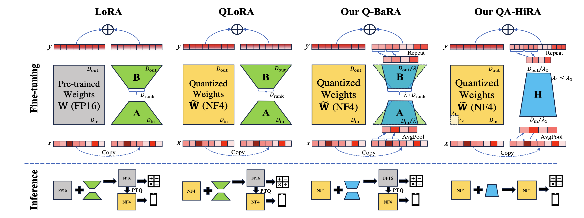 |[Github](https://github.com/xiaocaigou/qbaraqahira)   [Paper](https://arxiv.org/abs/2407.17029)|[//]: #07/26
| [Scalify: scale propagation for efficient low-precision LLM training](https://arxiv.org/abs/2407.17353)   Paul Balança, Sam Hosegood, Carlo Luschi, Andrew Fitzgibbon | |[Github](https://github.com/graphcore-research/jax-scalify)   [Paper](https://arxiv.org/abs/2407.17353)|[//]: #07/26
| [EfficientQAT: Efficient Quantization-Aware Training for Large Language Models](https://arxiv.org/abs/2407.11062)   Mengzhao Chen, Wenqi Shao, Peng Xu, Jiahao Wang, Peng Gao, Kaipeng Zhang, Yu Qiao, Ping Luo | |[Github](https://github.com/OpenGVLab/EfficientQAT)   [Paper](https://arxiv.org/abs/2407.11062)|[//]: #07/21
| [LRQ: Optimizing Post-Training Quantization for Large Language Models by Learning Low-Rank Weight-Scaling Matrices](https://arxiv.org/abs/2407.11534)   Jung Hyun Lee, Jeonghoon Kim, June Yong Yang, Se Jung Kwon, Eunho Yang, Kang Min Yoo, Dongsoo Lee | |[Github](https://github.com/onliwad101/FlexRound_LRQ)   [Paper](https://arxiv.org/abs/2407.11534)|[//]: #07/21
| [Spectra: A Comprehensive Study of Ternary, Quantized, and FP16 Language Models](https://arxiv.org/abs/2407.12327)   Ayush Kaushal, Tejas Pandey, Tejas Vaidhya, Aaryan Bhagat, Irina Rish | |[Github](https://github.com/NolanoOrg/SpectraSuite)   [Paper](https://arxiv.org/abs/2407.12327)|[//]: #07/21
| [Fast Matrix Multiplications for Lookup Table-Quantized LLMs](https://arxiv.org/abs/2407.10960)   Han Guo, William Brandon, Radostin Cholakov, Jonathan Ragan-Kelley, Eric P. Xing, Yoon Kim | |[Github](https://github.com/HanGuo97/flute)   [Paper](https://arxiv.org/abs/2407.10960)|[//]: #07/16
|[LeanQuant: Accurate Large Language Model Quantization with Loss-Error-Aware Grid](https://arxiv.org/abs/2407.10032)   Tianyi Zhang, Anshumali Shrivastava | |[Paper](https://arxiv.org/abs/2407.10032)|[//]: #07/16
|[Prefixing Attention Sinks can Mitigate Activation Outliers for Large Language Model Quantization](https://arxiv.org/abs/2406.12016)   Seungwoo Son, Wonpyo Park, Woohyun Han, Kyuyeun Kim, Jaeho Lee | |[Paper](https://arxiv.org/abs/2406.12016)|[//]: #07/16
| [RoLoRA: Fine-tuning Rotated Outlier-free LLMs for Effective Weight-Activation Quantization](https://arxiv.org/abs/2407.08044)   Xijie Huang, Zechun Liu, Shih-Yang Liu, Kwang-Ting Cheng | |[Github](https://github.com/HuangOwen/RoLoRA)   [Paper](https://arxiv.org/abs/2407.08044)|[//]: #07/12
| [FBI-LLM: Scaling Up Fully Binarized LLMs from Scratch via Autoregressive Distillation](https://arxiv.org/abs/2407.07093)   Liqun Ma, Mingjie Sun, Zhiqiang Shen | |[Github](https://github.com/LiqunMa/FBI-LLM)   [Paper](https://arxiv.org/abs/2407.07093)|[//]: #07/10
| [GPTQT: Quantize Large Language Models Twice to Push the Efficiency](https://arxiv.org/abs/2407.02891)   Yipin Guo, Yilin Lang, Qinyuan Ren | |[Paper](https://arxiv.org/abs/2407.02891)|[//]: #07/05
| [T-MAC: CPU Renaissance via Table Lookup for Low-Bit LLM Deployment on Edge](https://arxiv.org/abs/2407.00088)   Jianyu Wei, Shijie Cao, Ting Cao, Lingxiao Ma, Lei Wang, Yanyong Zhang, Mao Yang | |[Github](https://github.com/microsoft/T-MAC)   [Paper](https://arxiv.org/abs/2407.00088)|[//]: #07/03

### Inference Acceleration
| Title & Authors | Introduction | Links |
|:--|  :----: | :---:|
|  :star: [Deja Vu: Contextual Sparsity for Efficient LLMs at Inference Time](https://openreview.net/forum?id=wIPIhHd00i)   Zichang Liu, Jue WANG, Tri Dao, Tianyi Zhou, Binhang Yuan, Zhao Song, Anshumali Shrivastava, Ce Zhang, Yuandong Tian, Christopher Re, Beidi Chen | |[Github](https://github.com/FMInference/DejaVu)   [Paper](https://openreview.net/forum?id=wIPIhHd00i)| [//]: #Recommend
|    :star: [SpecInfer: Accelerating Generative LLM Serving with Speculative Inference and Token Tree Verification](https://arxiv.org/abs/2305.09781)   Xupeng Miao, Gabriele Oliaro, Zhihao Zhang, Xinhao Cheng, Zeyu Wang, Rae Ying Yee Wong, Zhuoming Chen, Daiyaan Arfeen, Reyna Abhyankar, Zhihao Jia| | [Github](https://github.com/flexflow/FlexFlow/tree/inference)   [paper](https://arxiv.org/abs/2305.09781) | [//]: #Recommend
|  :star: [Efficient Streaming Language Models with Attention Sinks](https://arxiv.org/abs/2309.17453)   Guangxuan Xiao, Yuandong Tian, Beidi Chen, Song Han, Mike Lewis | |[Github](https://github.com/mit-han-lab/streaming-llm)   [Paper](https://arxiv.org/abs/2309.17453)| [//]: #Recommend
| :star: [EAGLE: Lossless Acceleration of LLM Decoding by Feature Extrapolation](https://sites.google.com/view/eagle-llm)   Yuhui Li, Chao Zhang, and Hongyang Zhang | |[Github](https://github.com/SafeAILab/EAGLE)   [Blog](https://sites.google.com/view/eagle-llm)| [//]: #Recommend
|  :star: [Medusa: Simple LLM Inference Acceleration Framework with Multiple Decoding Heads](https://arxiv.org/abs/2401.10774)   Tianle Cai, Yuhong Li, Zhengyang Geng, Hongwu Peng, Jason D. Lee, Deming Chen, Tri Dao | |[Github](https://github.com/FasterDecoding/Medusa)   [Paper](https://arxiv.org/abs/2401.10774)| [//]: #Recommend
| [CritiPrefill: A Segment-wise Criticality-based Approach for Prefilling Acceleration in LLMs](https://arxiv.org/abs/2409.12490)   Junlin Lv, Yuan Feng, Xike Xie, Xin Jia, Qirong Peng, Guiming Xie | |[Github](https://github.com/66RING/CritiPrefill)   [Paper](https://arxiv.org/abs/2409.12490)|[//]: #09/21
|[RetrievalAttention: Accelerating Long-Context LLM Inference via Vector Retrieval](https://arxiv.org/abs/2409.10516)   Di Liu, Meng Chen, Baotong Lu, Huiqiang Jiang, Zhenhua Han, Qianxi Zhang, Qi Chen, Chengruidong Zhang, Bailu Ding, Kai Zhang, Chen Chen, Fan Yang, Yuqing Yang, Lili Qiu | |[Paper](https://arxiv.org/abs/2409.10516)|[//]: #09/21
| [Sirius: Contextual Sparsity with Correction for Efficient LLMs](https://arxiv.org/abs/2409.03856)   Yang Zhou, Zhuoming Chen, Zhaozhuo Xu, Victoria Lin, Beidi Chen | |[Github](https://github.com/Infini-AI-Lab/Sirius)   [Paper](https://arxiv.org/abs/2409.03856)|[//]: #09/13
| [OneGen: Efficient One-Pass Unified Generation and Retrieval for LLMs](https://arxiv.org/abs/2409.05152)   Jintian Zhang, Cheng Peng, Mengshu Sun, Xiang Chen, Lei Liang, Zhiqiang Zhang, Jun Zhou, Huajun Chen, Ningyu Zhang | |[Github](https://github.com/zjunlp/OneGen)   [Paper](https://arxiv.org/abs/2409.05152)|[//]: #09/13
|[Path-Consistency: Prefix Enhancement for Efficient Inference in LLM](https://arxiv.org/abs/2409.01281)   Jiace Zhu, Yingtao Shen, Jie Zhao, An Zou | |[Paper](https://arxiv.org/abs/2409.01281)|[//]: #09/06
|[Boosting Lossless Speculative Decoding via Feature Sampling and Partial Alignment Distillation](https://arxiv.org/abs/2408.15562)   Lujun Gui, Bin Xiao, Lei Su, Weipeng Chen | |[Paper](https://arxiv.org/abs/2408.15562)|[//]: #09/02
|[Turning Trash into Treasure: Accelerating Inference of Large Language Models with Token Recycling](https://arxiv.org/abs/2408.08696)   Xianzhen Luo, Yixuan Wang, Qingfu Zhu, Zhiming Zhang, Xuanyu Zhang, Qing Yang, Dongliang Xu, Wanxiang Che | |[Paper](https://arxiv.org/abs/2408.08696)|[//]: #08/20
|[Speculative Diffusion Decoding: Accelerating Language Generation through Diffusion](https://arxiv.org/abs/2408.05636)   Jacob K Christopher, Brian R Bartoldson, Bhavya Kailkhura, Ferdinando Fioretto | |[Paper](https://arxiv.org/abs/2408.05636)|[//]: #08/13
| [Clover-2: Accurate Inference for Regressive Lightweight Speculative Decoding](https://arxiv.org/abs/2408.00264)   Bin Xiao, Lujun Gui, Lei Su, Weipeng Chen | |[Github](https://github.com/XiaoBin1992/clover)   [Paper](https://arxiv.org/abs/2408.00264)|[//]: #08/08
|[Accelerating Large Language Model Inference with Self-Supervised Early Exits](https://arxiv.org/abs/2407.21082)   Florian Valade | |[Paper](https://arxiv.org/abs/2407.21082)|[//]: #08/08
|[An Efficient Inference Framework for Early-exit Large Language Models](https://arxiv.org/abs/2407.20272)   Ruijie Miao, Yihan Yan, Xinshuo Yao, Tong Yang ||[Paper](https://arxiv.org/abs/2407.20272)|[//]: #08/08
| [Inference acceleration for large language models using "stairs" assisted greedy generation](https://arxiv.org/abs/2407.19947)   Domas Grigaliūnas, Mantas Lukoševičius | |[Paper](https://arxiv.org/abs/2407.19947)|[//]: #08/08
|[LazyLLM: Dynamic Token Pruning for Efficient Long Context LLM Inference](https://arxiv.org/abs/2407.14057)   Qichen Fu, Minsik Cho, Thomas Merth, Sachin Mehta, Mohammad Rastegari, Mahyar Najibi | |[Paper](https://arxiv.org/abs/2407.14057)|[//]: #07/24
|[Adaptive Draft-Verification for Efficient Large Language Model Decoding](https://arxiv.org/abs/2407.12021)   Xukun Liu, Bowen Lei, Ruqi Zhang, Dongkuan Xu | |[Paper](https://arxiv.org/abs/2407.12021)|[//]: #07/21
|[Multi-Token Joint Speculative Decoding for Accelerating Large Language Model Inference](https://arxiv.org/abs/2407.09722)   Zongyue Qin, Ziniu Hu, Zifan He, Neha Prakriya, Jason Cong, Yizhou Sun | |[Paper](https://arxiv.org/abs/2407.09722)|[//]: #07/16
| [LiveMind: Low-latency Large Language Models with Simultaneous Inference](https://arxiv.org/abs/2406.14319)   Chuangtao Chen, Grace Li Zhang, Xunzhao Yin, Cheng Zhuo, Ulf Schlichtmann, Bing Li | |[Github](https://github.com/ChuangtaoChen-TUM/LiveMind)   [Paper](https://arxiv.org/abs/2406.14319)|[//]: #07/05
|[S2D: Sorted Speculative Decoding For More Efficient Deployment of Nested Large Language Models](https://arxiv.org/abs/2407.01955)   Parsa Kavehzadeh, Mohammadreza Pourreza, Mojtaba Valipour, Tinashu Zhu, Haoli Bai, Ali Ghodsi, Boxing Chen, Mehdi Rezagholizadeh | |[Paper](https://arxiv.org/abs/2407.01955)|[//]: #07/05

### Efficient MOE
| Title & Authors | Introduction | Links |
|:--|  :----: | :---:|
| :star: [Fast Inference of Mixture-of-Experts Language Models with Offloading](https://arxiv.org/abs/2312.17238)   Artyom Eliseev, Denis Mazur | |[Github](https://github.com/dvmazur/mixtral-offloading)   [Paper](https://arxiv.org/abs/2312.17238)| [//]: #Recommend
|[Diversifying the Expert Knowledge for Task-Agnostic Pruning in Sparse Mixture-of-Experts](https://arxiv.org/abs/2407.09590)   Zeliang Zhang, Xiaodong Liu, Hao Cheng, Chenliang Xu, Jianfeng Gao | |[Paper](https://arxiv.org/abs/2407.09590)|[//]: #07/16
| [Efficient Expert Pruning for Sparse Mixture-of-Experts Language Models: Enhancing Performance and Reducing Inference Costs](https://arxiv.org/abs/2407.00945)   Enshu Liu, Junyi Zhu, Zinan Lin, Xuefei Ning, Matthew B. Blaschko, Shengen Yan, Guohao Dai, Huazhong Yang, Yu Wang | |[Github](https://github.com/imagination-research/EEP)   [Paper](https://arxiv.org/abs/2407.00945)|[//]: #07/03

### Efficient Architecture of LLM
| Title & Authors | Introduction | Links |
|:--|  :----: | :---:|
| :star: [MobiLlama: Towards Accurate and Lightweight Fully Transparent GPT](https://arxiv.org/abs/2402.16840)   Omkar Thawakar, Ashmal Vayani, Salman Khan, Hisham Cholakal, Rao M. Anwer, Michael Felsberg, Tim Baldwin, Eric P. Xing, Fahad Shahbaz Khan | |[Github](https://github.com/mbzuai-oryx/MobiLlama)   [Paper](https://arxiv.org/abs/2402.16840)  [Model](https://huggingface.co/MBZUAI/MobiLlama-05B) | [//]: #Recommend
| :star: [Megalodon: Efficient LLM Pretraining and Inference with Unlimited Context Length](https://arxiv.org/abs/2404.08801)   Xuezhe Ma, Xiaomeng Yang, Wenhan Xiong, Beidi Chen, Lili Yu, Hao Zhang, Jonathan May, Luke Zettlemoyer, Omer Levy, Chunting Zhou |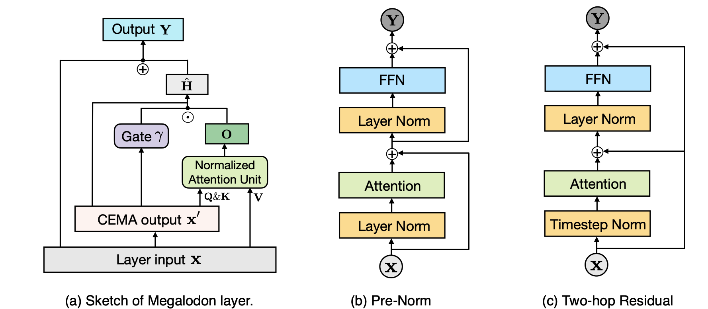 |[Github](https://github.com/XuezheMax/megalodon)   [Paper](https://arxiv.org/abs/2404.08801)| [//]: #Recommend
|[SentenceVAE: Enable Next-sentence Prediction for Large Language Models with Faster Speed, Higher Accuracy and Longer Context](https://arxiv.org/abs/2408.00655)   Hongjun An, Yifan Chen, Zhe Sun, Xuelong Li | |[Paper](https://arxiv.org/abs/2408.00655)|[//]: #08/08
| [Efficient LLM Training and Serving with Heterogeneous Context Sharding among Attention Heads](https://arxiv.org/abs/2407.17678)   Xihui Lin, Yunan Zhang, Suyu Ge, Barun Patra, Vishrav Chaudhary, Xia Song | |[Github](https://github.com/linxihui/dkernel)   [Paper](https://arxiv.org/abs/2407.17678)|[//]: #07/26
| [Beyond KV Caching: Shared Attention for Efficient LLMs](https://arxiv.org/abs/2407.12866)   Bingli Liao, Danilo Vasconcellos Vargas | |[Github](https://github.com/metacarbon/shareAtt)   [Paper](https://arxiv.org/abs/2407.12866)|[//]: #07/21

### KV Cache Compression
| Title & Authors | Introduction | Links |
|:--|  :----: | :---:|
|:star: [Model Tells You What to Discard: Adaptive KV Cache Compression for LLMs](https://arxiv.org/abs/2310.01801)   Suyu Ge, Yunan Zhang, Liyuan Liu, Minjia Zhang, Jiawei Han, Jianfeng Gao | |[Paper](https://arxiv.org/abs/2310.01801)| [//]: #Recommend
|[CSKV: Training-Efficient Channel Shrinking for KV Cache in Long-Context Scenarios](https://arxiv.org/abs/2409.10593)   Luning Wang, Shiyao Li, Xuefei Ning, Zhihang Yuan, Shengen Yan, Guohao Dai, Yu Wang | |[Paper](https://arxiv.org/abs/2409.10593)|[//]: #09/21
|[A First Look At Efficient And Secure On-Device LLM Inference Against KV Leakage](https://arxiv.org/abs/2409.04040)   Huan Yang, Deyu Zhang, Yudong Zhao, Yuanchun Li, Yunxin Liu | |[Paper](https://arxiv.org/abs/2409.04040)|[//]: #09/13
| [Post-Training Sparse Attention with Double Sparsity](https://arxiv.org/abs/2408.07092)   Shuo Yang, Ying Sheng, Joseph E. Gonzalez, Ion Stoica, Lianmin Zheng | |[Github](https://github.com/andy-yang-1/DoubleSparse)   [Paper](https://arxiv.org/abs/2408.07092)|[//]: #08/20
| [Eigen Attention: Attention in Low-Rank Space for KV Cache Compression](https://arxiv.org/abs/2408.05646)   Utkarsh Saxena, Gobinda Saha, Sakshi Choudhary, Kaushik Roy | |[Github](https://github.com/UtkarshSaxena1/EigenAttn)   [Paper](https://arxiv.org/abs/2408.05646)|[//]: #08/13
|[Zero-Delay QKV Compression for Mitigating KV Cache and Network Bottlenecks in LLM Inference](https://arxiv.org/abs/2408.04107)   Zeyu Zhang,Haiying Shen | |[Paper](https://arxiv.org/abs/2408.04107)|[//]: #08/09
|[Finch: Prompt-guided Key-Value Cache Compression](https://arxiv.org/abs/2408.00167)   Giulio Corallo, Paolo Papotti | |[Paper](https://arxiv.org/abs/2408.00167)|[//]: #08/08
| [Palu: Compressing KV-Cache with Low-Rank Projection](https://arxiv.org/abs/2407.21118)   Chi-Chih Chang, Wei-Cheng Lin, Chien-Yu Lin, Chong-Yan Chen, Yu-Fang Hu, Pei-Shuo Wang, Ning-Chi Huang, Luis Ceze, Kai-Chiang Wu | |[Github](https://github.com/shadowpa0327/Palu)   [Paper](https://arxiv.org/abs/2407.21118)|[//]: #08/08
|[ThinK: Thinner Key Cache by Query-Driven Pruning](https://arxiv.org/abs/2407.21018)   Yuhui Xu, Zhanming Jie, Hanze Dong, Lei Wang, Xudong Lu, Aojun Zhou, Amrita Saha, Caiming Xiong, Doyen Sahoo | |[Paper](https://arxiv.org/abs/2407.21018)|[//]: #08/08
|[RazorAttention: Efficient KV Cache Compression Through Retrieval Heads](https://arxiv.org/abs/2407.15891)   Hanlin Tang, Yang Lin, Jing Lin, Qingsen Han, Shikuan Hong, Yiwu Yao, Gongyi Wang | |[Paper](https://arxiv.org/abs/2407.15891)|[//]: #07/24
|[PQCache: Product Quantization-based KVCache for Long Context LLM Inference](https://arxiv.org/abs/2407.12820)   Hailin Zhang, Xiaodong Ji, Yilin Chen, Fangcheng Fu, Xupeng Miao, Xiaonan Nie, Weipeng Chen, Bin Cui | |[Paper](https://arxiv.org/abs/2407.12820)|[//]: #07/21
| [GoldFinch: High Performance RWKV/Transformer Hybrid with Linear Pre-Fill and Extreme KV-Cache Compression](https://arxiv.org/abs/2407.12077)   Daniel Goldstein, Fares Obeid, Eric Alcaide, Guangyu Song, Eugene Cheah | |[Github](https://github.com/recursal/GoldFinch-paper)   [Paper](https://arxiv.org/abs/2407.12077)|[//]: #07/21
| [Efficient Sparse Attention needs Adaptive Token Release](https://arxiv.org/abs/2407.02328)   Chaoran Zhang, Lixin Zou, Dan Luo, Min Tang, Xiangyang Luo, Zihao Li, Chenliang Li | |[Github](https://github.com/WHUIR/ADORE)   [Paper](https://arxiv.org/abs/2407.02328)|[//]: #07/05
| [KV Cache Compression, But What Must We Give in Return? A Comprehensive Benchmark of Long Context Capable Approaches](https://arxiv.org/abs/2407.01527)   Jiayi Yuan, Hongyi Liu, Shaochen (Henry)Zhong, Yu-Neng Chuang, Songchen Li et al |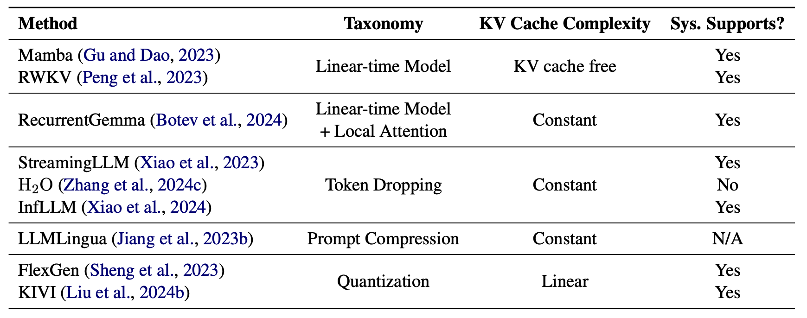 |[Github](https://github.com/henryzhongsc/longctx_bench)   [Paper](https://arxiv.org/abs/2407.01527)|[//]: #07/03

### Text Compression
| Title & Authors | Introduction | Links |
|:--|  :----: | :---:|
| :star: [LLMLingua: Compressing Prompts for Accelerated Inference of Large Language Models](https://arxiv.org/abs/2310.05736)   Huiqiang Jiang, Qianhui Wu, Chin-Yew Lin, Yuqing Yang, Lili Qiu | |[Github](https://github.com/microsoft/LLMLingua)   [Paper](https://arxiv.org/abs/2310.05736)| [//]: #Recommend
| :star: [LongLLMLingua: Accelerating and Enhancing LLMs in Long Context Scenarios via Prompt Compression](https://arxiv.org/abs/2310.06839)   Huiqiang Jiang, Qianhui Wu, Xufang Luo, Dongsheng Li, Chin-Yew Lin, Yuqing Yang, Lili Qiu |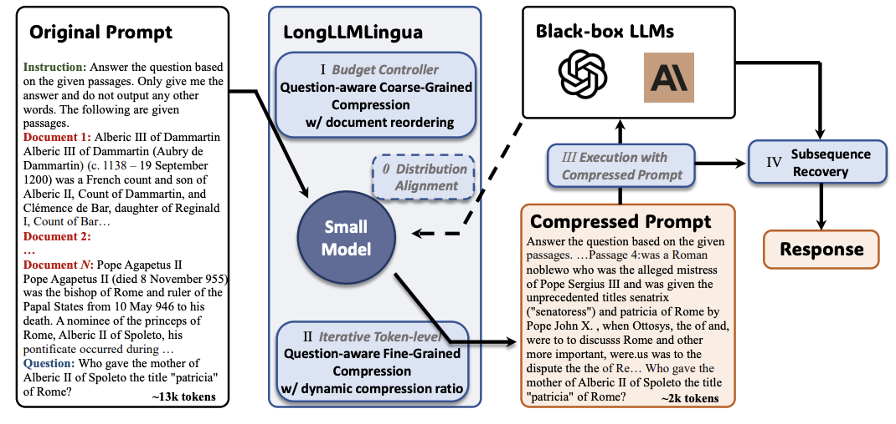 |[Github](https://github.com/microsoft/LLMLingua)   [Paper](https://arxiv.org/abs/2310.06839)| [//]: #Recommend
| [Parse Trees Guided LLM Prompt Compression](https://arxiv.org/abs/2409.15395)   Wenhao Mao, Chengbin Hou, Tianyu Zhang, Xinyu Lin, Ke Tang, Hairong Lv | |[Github](https://github.com/LengendaryHippopotamus/PartPrompt)   [Paper](https://arxiv.org/abs/2409.15395)|[//]: #09/27
| [AlphaZip: Neural Network-Enhanced Lossless Text Compression](https://arxiv.org/abs/2409.15046)   Swathi Shree Narashiman, Nitin Chandrachoodan | |[Github](https://github.com/Swathi-Shree-Narashiman/AlphaZip)   [Paper](https://arxiv.org/abs/2409.15046)|[//]: #09/27
|[TACO-RL: Task Aware Prompt Compression Optimization with Reinforcement Learning](https://arxiv.org/abs/2409.13035)   Shivam Shandilya, Menglin Xia, Supriyo Ghosh, Huiqiang Jiang, Jue Zhang, Qianhui Wu, Victor Rühle | |[Paper](https://arxiv.org/abs/2409.13035)|[//]: #09/27
|[Efficient LLM Context Distillation](https://arxiv.org/abs/2409.01930)   Rajesh Upadhayayaya, Zachary Smith, Chritopher Kottmyer, Manish Raj Osti | |[Paper](https://arxiv.org/abs/2409.01930)|[//]: #09/06
| [Enhancing and Accelerating Large Language Models via Instruction-Aware Contextual Compression](https://arxiv.org/abs/2408.15491)   Haowen Hou, Fei Ma, Binwen Bai, Xinxin Zhu, Fei Yu | |[Github](https://github.com/howard-hou/instruction-aware-contextual-compressor)   [Paper](https://arxiv.org/abs/2408.15491)|[//]: #09/02
| [500xCompressor: Generalized Prompt Compression for Large Language Models](https://arxiv.org/abs/2408.03094)   Zongqian Li, Yixuan Su, Nigel Collier | |[Github](https://github.com/ZongqianLi/500xCompressor)   [Paper](https://arxiv.org/abs/2408.03094)|[//]: #08/08
| [QUITO: Accelerating Long-Context Reasoning through Query-Guided Context Compression](https://arxiv.org/abs/2408.00274)   Wenshan Wang, Yihang Wang, Yixing Fan, Huaming Liao, Jiafeng Guo | |[Github](https://github.com/Wenshansilvia/attention_compressor)   [Paper](https://arxiv.org/abs/2408.00274)|[//]: #08/08
| [Characterizing Prompt Compression Methods for Long Context Inference](https://arxiv.org/abs/2407.08892)   Siddharth Jha, Lutfi Eren Erdogan, Sehoon Kim, Kurt Keutzer, Amir Gholami | |[Paper](https://arxiv.org/abs/2407.08892)|[//]: #07/16
|[Entropy Law: The Story Behind Data Compression and LLM Performance](https://arxiv.org/abs/2407.06645)   Mingjia Yin, Chuhan Wu, Yufei Wang, Hao Wang, Wei Guo, Yasheng Wang, Yong Liu, Ruiming Tang, Defu Lian, Enhong Chen | |[Paper](https://arxiv.org/abs/2407.06645)|[//]: #07/10
|[PromptIntern: Saving Inference Costs by Internalizing Recurrent Prompt during Large Language Model Fine-tuning](https://arxiv.org/abs/2407.02211)   Jiaru Zou, Mengyu Zhou, Tao Li, Shi Han, Dongmei Zhang | |[Paper](https://arxiv.org/abs/2407.02211)|[//]: #07/05
|[Brevity is the soul of wit: Pruning long files for code generation](https://arxiv.org/abs/2407.00434)   Aaditya K. Singh, Yu Yang, Kushal Tirumala, Mostafa Elhoushi, Ari S. Morcos | |[Paper](https://arxiv.org/abs/2407.00434)|[//]: #07/03

### Low-Rank Decomposition
| Title & Authors | Introduction | Links |
|:--|  :----: | :---:|
|[MoDeGPT: Modular Decomposition for Large Language Model Compression](https://arxiv.org/abs/2408.09632)   Chi-Heng Lin, Shangqian Gao, James Seale Smith, Abhishek Patel, Shikhar Tuli, Yilin Shen, Hongxia Jin, Yen-Chang Hsu | |[Paper](https://arxiv.org/abs/2408.09632)|[//]: #08/20
|[MCNC: Manifold Constrained Network Compression](https://arxiv.org/abs/2406.19301)   Chayne Thrash, Ali Abbasi, Parsa Nooralinejad, Soroush Abbasi Koohpayegani, Reed Andreas, Hamed Pirsiavash, Soheil Kolouri | |[Paper](https://arxiv.org/abs/2406.19301)|[//]: #06/28

### Hardware/System
| Title & Authors | Introduction | Links |
|:--|  :----: | :---:|
| [OPAL: Outlier-Preserved Microscaling Quantization A ccelerator for Generative Large Language Models](https://arxiv.org/abs/2409.05902)   Jahyun Koo, Dahoon Park, Sangwoo Jung, Jaeha Kung | |[Paper](https://arxiv.org/abs/2409.05902)|[//]: #09/13
|[Accelerating Large Language Model Training with Hybrid GPU-based Compression](https://arxiv.org/abs/2409.02423)   Lang Xu, Quentin Anthony, Qinghua Zhou, Nawras Alnaasan, Radha R. Gulhane, Aamir Shafi, Hari Subramoni, Dhabaleswar K. Panda | |[Paper](https://arxiv.org/abs/2409.02423)|[//]: #09/06
|[LUT Tensor Core: Lookup Table Enables Efficient Low-Bit LLM Inference Acceleration](https://arxiv.org/abs/2408.06003)   Zhiwen Mo, Lei Wang, Jianyu Wei, Zhichen Zeng, Shijie Cao, Lingxiao Ma, Naifeng Jing, Ting Cao, Jilong Xue, Fan Yang, Mao Yang | |[Paper](https://arxiv.org/abs/2408.06003)|[//]: #08/20
|[Kraken: Inherently Parallel Transformers For Efficient Multi-Device Inference](https://arxiv.org/abs/2408.07802)   Rohan Baskar Prabhakar, Hengrui Zhang, David Wentzlaff | |[Paper](https://arxiv.org/abs/2408.07802)|[//]: #08/20
|[SLO-aware GPU Frequency Scaling for Energy Efficient LLM Inference Serving](https://arxiv.org/abs/2408.05235)   Andreas Kosmas Kakolyris, Dimosthenis Masouros, Petros Vavaroutsos, Sotirios Xydis, Dimitrios Soudris | |[Paper](https://arxiv.org/abs/2408.05235)|[//]: #08/13
|[Designing Efficient LLM Accelerators for Edge Devices](https://arxiv.org/abs/2408.00462)   Jude Haris, Rappy Saha, Wenhao Hu, José Cano | |[Paper](https://arxiv.org/abs/2408.00462)|[//]: #08/08
|[PipeInfer: Accelerating LLM Inference using Asynchronous Pipelined Speculation](https://arxiv.org/abs/2407.11798)   Branden Butler, Sixing Yu, Arya Mazaheri, Ali Jannesari | |[Paper](https://arxiv.org/abs/2407.11798)|[//]: #07/21
| [FlashAttention-3: Fast and Accurate Attention with Asynchrony and Low-precision](https://arxiv.org/abs/2407.08608)   Jay Shah, Ganesh Bikshandi, Ying Zhang, Vijay Thakkar, Pradeep Ramani, Tri Dao |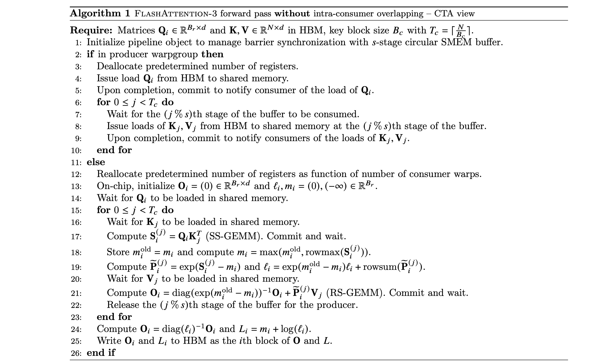 |[Github](https://github.com/Dao-AILab/flash-attention)   [Paper](https://arxiv.org/abs/2407.08608)   [Blog](https://tridao.me/blog/2024/flash3/) |[//]: #07/12
|[Preble: Efficient Distributed Prompt Scheduling for LLM Serving](https://arxiv.org/abs/2407.00023)   Vikranth Srivatsa, Zijian He, Reyna Abhyankar, Dongming Li, Yiying Zhang |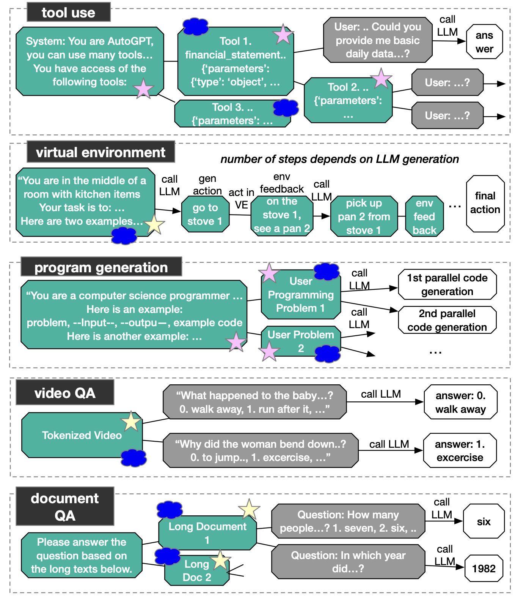 |[Paper](https://arxiv.org/abs/2407.00023)|[//]: #07/03

### Tuning
| Title & Authors | Introduction | Links |
|:--|  :----: | :---:|
|[Tensor Train Low-rank Approximation (TT-LoRA): Democratizing AI with Accelerated LLMs](https://arxiv.org/abs/2408.01008)   Afia Anjum, Maksim E. Eren, Ismael Boureima, Boian Alexandrov, Manish Bhattarai | |[Paper](https://arxiv.org/abs/2408.01008)|[//]: #08/08
|[Code Less, Align More: Efficient LLM Fine-tuning for Code Generation with Data Pruning](https://arxiv.org/abs/2407.05040)   Yun-Da Tsai, Mingjie Liu, Haoxing Ren | |[Paper](https://arxiv.org/abs/2407.05040)|[//]: #07/10
| [PocketLLM: Enabling On-Device Fine-Tuning for Personalized LLMs](https://arxiv.org/abs/2407.01031)   Dan Peng, Zhihui Fu, Jun Wang ||[Paper](https://arxiv.org/abs/2407.01031)|[//]: #07/05
| [Increasing Model Capacity for Free: A Simple Strategy for Parameter Efficient Fine-tuning](https://arxiv.org/abs/2407.01320)   Haobo Song, Hao Zhao, Soumajit Majumder, Tao Lin | |[Github](https://github.com/LINs-lab/CapaBoost)   [Paper](https://arxiv.org/abs/2407.01320)|[//]: #07/03
|[Compress then Serve: Serving Thousands of LoRA Adapters with Little Overhead](https://arxiv.org/abs/2407.00066)   Rickard Brüel-Gabrielsson, Jiacheng Zhu, Onkar Bhardwaj, Leshem Choshen et al | |[Paper](https://arxiv.org/abs/2407.00066)|[//]: #07/03

### Survey
| Title & Authors | Introduction | Links |
|:--|  :----: | :---:|
| [Contextual Compression in Retrieval-Augmented Generation for Large Language Models: A Survey](https://arxiv.org/abs/2409.13385)   Sourav Verma |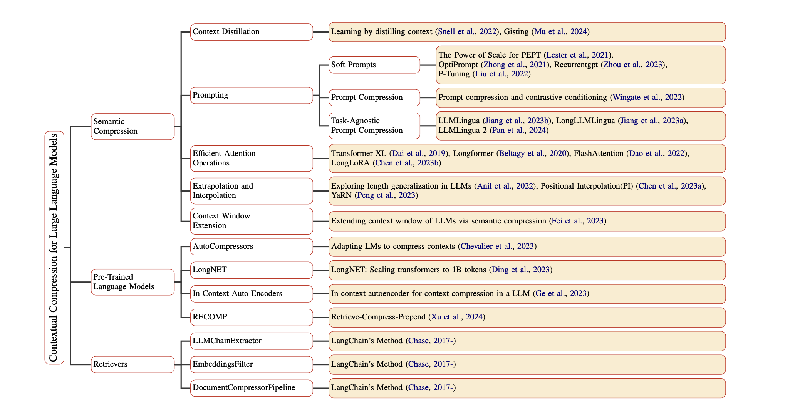 |[Github](https://github.com/SrGrace/Contextual-Compression)   [Paper](https://arxiv.org/abs/2409.13385)|[//]: #09/27
|[Art and Science of Quantizing Large-Scale Models: A Comprehensive Overview](https://arxiv.org/abs/2409.11650)   Yanshu Wang, Tong Yang, Xiyan Liang, Guoan Wang, Hanning Lu, Xu Zhe, Yaoming Li, Li Weitao | |[Paper](https://arxiv.org/abs/2409.11650)|[//]: #09/21
|[Hardware Acceleration of LLMs: A comprehensive survey and comparison](https://arxiv.org/abs/2409.03384)   Nikoletta Koilia, Christoforos Kachris | |[Paper](https://arxiv.org/abs/2409.03384)|[//]: #09/06
|[A Survey on Symbolic Knowledge Distillation of Large Language Models](https://arxiv.org/abs/2408.10210)   Kamal Acharya, Alvaro Velasquez, Houbing Herbert Song | |[Paper](https://arxiv.org/abs/2408.10210)|[//]: #08/27
| [Inference Optimization of Foundation Models on AI Accelerators](https://arxiv.org/abs/2407.09111)   Youngsuk Park, Kailash Budhathoki, Liangfu Chen, Jonas Kübler, Jiaji Huang, Matthäus Kleindessner, Jun Huan, Volkan Cevher, Yida Wang, George Karypis | |[Paper](https://arxiv.org/abs/2407.09111)|[//]: #07/16
|[Survey on Knowledge Distillation for Large Language Models: Methods, Evaluation, and Application](https://arxiv.org/abs/2407.01885)   Chuanpeng Yang, Wang Lu, Yao Zhu, Yidong Wang, Qian Chen, Chenlong Gao, Bingjie Yan, Yiqiang Chen | |[Paper](https://arxiv.org/abs/2407.01885)|[//]: #07/05

