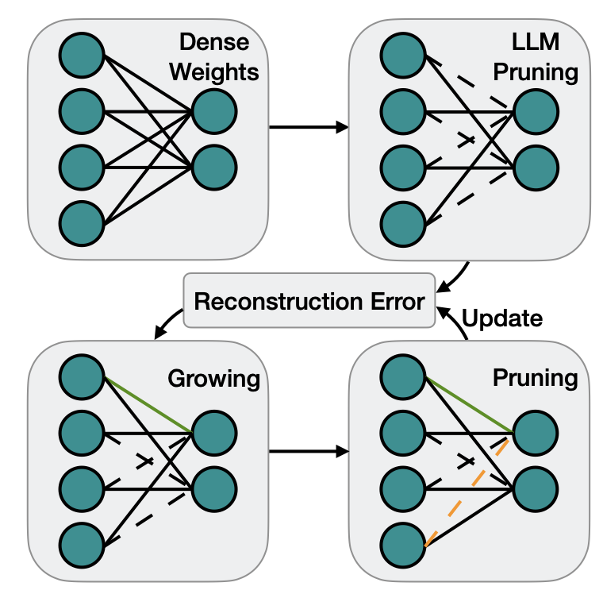

# Awesome-Efficient-LLM

A curated list for **Efficient Large Language Models**:
  - [Knowledge Distillation](#knowledge-distillation)
  - [Network Pruning](#network-pruning)
  - [Quantization](#quantization)
  - [Inference Acceleration](#inference-acceleration)
  - [Efficient Structure Design](#efficient-structure-design)
  - [Text Compression](#text-compression)
  - [Low-Rank Decomposition](#low-rank-decomposition)
  - [Hardware](#hardware)
  - [Survey](#survey)
  - [Others](#others)   

Updates:
* Sep 27, 2023: Add tag  for papers accepted at NeurIPS'23.
* Sep 6, 2023: Add a new subdirectory [project/](project/) to organize those projects that are designed for developing a lightweight LLM.
* July 11, 2023:
In light of the numerous publications that conducts experiments using PLMs (such as BERT, BART) currently, a new subdirectory [efficient_plm/](efficient_plm/) is created to house papers that are applicable to PLMs but have yet to be verified for their effectiveness on LLMs (not implying that they are not suitable on LLM). 

## Knowledge Distillation
| Title & Authors | Introduction | Links |
|:----|  :----: | :---:|
| [Specializing Smaller Language Models towards Multi-Step Reasoning](https://arxiv.org/abs/2301.12726)   Yao Fu, Hao Peng, Litu Ou, Ashish Sabharwal, Tushar Khot | |[Github](https://github.com/FranxYao/FlanT5-CoT-Specialization)   [Paper](https://arxiv.org/abs/2301.12726)|
| [Distilling Script Knowledge from Large Language Models for Constrained Language Planning](https://arxiv.org/abs/2305.05252)   Siyu Yuan, Jiangjie Chen, Ziquan Fu, Xuyang Ge, Soham Shah, Charles Robert Jankowski, Yanghua Xiao, Deqing Yang | |[Github](https://github.com/siyuyuan/coscript)   [Paper](https://arxiv.org/abs/2305.05252)|
| [SCOTT: Self-Consistent Chain-of-Thought Distillation](https://arxiv.org/abs/2305.01879)   Peifeng Wang, Zhengyang Wang, Zheng Li, Yifan Gao, Bing Yin, Xiang Ren | |[Paper](https://arxiv.org/abs/2305.01879)|
| [DISCO: Distilling Counterfactuals with Large Language Models](https://arxiv.org/abs/2212.10534)   Zeming Chen, Qiyue Gao, Antoine Bosselut, Ashish Sabharwal, Kyle Richardson | |[Github](https://github.com/eric11eca/disco)   [Paper](https://arxiv.org/abs/2212.10534)|
| [I2D2: Inductive Knowledge Distillation with NeuroLogic and Self-Imitation](https://arxiv.org/abs/2212.09246)   Chandra Bhagavatula, Jena D. Hwang, Doug Downey, Ronan Le Bras, Ximing Lu, Lianhui Qin, Keisuke Sakaguchi, Swabha Swayamdipta, Peter West, Yejin Choi | |[Github](https://github.com/allenai/i2d2)   [Paper](https://arxiv.org/abs/2212.09246)   [Project](https://i2d2.allen.ai/) |
| [Symbolic Chain-of-Thought Distillation: Small Models Can Also "Think" Step-by-Step](https://arxiv.org/abs/2306.14050)   Liunian Harold Li, Jack Hessel, Youngjae Yu, Xiang Ren, Kai-Wei Chang, Yejin Choi | |[Github](https://github.com/allenai/cot_distillation)   [Paper](https://arxiv.org/abs/2306.14050)|
|   [Can Language Models Teach? Teacher Explanations Improve Student Performance via Theory of Mind](https://arxiv.org/abs/2306.09299)   Swarnadeep Saha, Peter Hase, and Mohit Bansal | |[Github](https://github.com/swarnaHub/ExplanationIntervention)   [Paper](https://arxiv.org/abs/2306.09299)|
| [Dialogue Chain-of-Thought Distillation for Commonsense-aware Conversational Agents](https://arxiv.org/abs/2310.09343)   Hyungjoo Chae, Yongho Song, Kai Tzu-iunn Ong, Taeyoon Kwon, Minjin Kim, Youngjae Yu, Dongha Lee, Dongyeop Kang, Jinyoung Yeo | |[Paper](https://arxiv.org/abs/2310.09343)|
| [PromptMix: A Class Boundary Augmentation Method for Large Language Model Distillation](https://arxiv.org/abs/2310.14192)   Gaurav Sahu, Olga Vechtomova, Dzmitry Bahdanau, Issam H. Laradji | |[Github](https://github.com/ServiceNow/PromptMix-EMNLP-2023)   [Paper](https://arxiv.org/abs/2310.14192)|
|   [GKD: A General Knowledge Distillation Framework for Large-scale Pre-trained Language Model](https://arxiv.org/abs/2306.06629)   Shicheng Tan, Weng Lam Tam, Yuanchun Wang, Wenwen Gong, Yang Yang, Hongyin Tang, Keqing He, Jiahao Liu, Jingang Wang, Shu Zhao, Peng Zhang, Jie Tang | |[Github](https://github.com/aitsc/GLMKD)   [Paper](https://arxiv.org/abs/2306.06629)|
|    [Distilling Step-by-Step! Outperforming Larger Language Models with Less Training Data and Smaller Model Sizes](https://arxiv.org/abs/2305.02301)      Cheng-Yu Hsieh, Chun-Liang Li, Chih-Kuan Yeh, Hootan Nakhost, Yasuhisa Fujii, Alexander Ratner, Ranjay Krishna, Chen-Yu Lee, Tomas Pfister | | [Github](https://github.com/google-research/distilling-step-by-step)   [Paper](https://arxiv.org/abs/2305.02301) |
| [Retrieval-based Knowledge Transfer: An Effective Approach for Extreme Large Language Model Compression](https://arxiv.org/abs/2310.15594)   Jiduan Liu, Jiahao Liu, Qifan Wang, Jingang Wang, Xunliang Cai, Dongyan Zhao, Ran Lucien Wang, Rui Yan | |[Paper](https://arxiv.org/abs/2310.15594)|
|    [LaMini-LM: A Diverse Herd of Distilled Models from Large-Scale Instructions](https://github.com/mbzuai-nlp/LaMini-LM)  Minghao Wu, Abdul Waheed, Chiyu Zhang, Muhammad Abdul-Mageed, Alham Fikri Aji |  | [Github](https://github.com/mbzuai-nlp/LaMini-LM) [paper](https://arxiv.org/abs/2304.14402) |
|[Knowledge Distillation of Large Language Models](https://arxiv.org/abs/2306.08543)   Yuxian Gu, Li Dong, Furu Wei, Minlie Huang | |[Github](https://github.com/microsoft/LMOps/tree/main/minillm)   [Paper](https://arxiv.org/abs/2306.08543)|
|[Teaching Small Language Models to Reason](https://arxiv.org/abs/2212.08410)   Lucie Charlotte Magister, Jonathan Mallinson, Jakub Adamek, Eric Malmi, Aliaksei Severyn.  | |[Paper](https://arxiv.org/abs/2212.08410)|
|    [Large Language Model Distillation Doesn't Need a Teacher](https://arxiv.org/abs/2305.14864)   Ananya Harsh Jha, Dirk Groeneveld, Emma Strubell, Iz Beltagy   |  | [Github](https://github.com/ananyahjha93/llm-distill) [paper](https://arxiv.org/abs/2305.14864) |
| [The False Promise of Imitating Proprietary LLMs](https://arxiv.org/abs/2305.15717)   Arnav Gudibande, Eric Wallace, Charlie Snell, Xinyang Geng, Hao Liu, Pieter Abbeel, Sergey Levine, Dawn Song |  | [Paper](https://arxiv.org/abs/2305.15717) |
|  [Impossible Distillation: from Low-Quality Model to High-Quality Dataset & Model for Summarization and Paraphrasing](https://arxiv.org/abs/2305.16635)   Jaehun Jung, Peter West, Liwei Jiang, Faeze Brahman, Ximing Lu, Jillian Fisher, Taylor Sorensen, Yejin Choi | |[Github](https://github.com/jaehunjung1/impossible-distillation) [paper](https://arxiv.org/abs/2305.16635) |
|[PaD: Program-aided Distillation Specializes Large Models in Reasoning](https://arxiv.org/abs/2305.13888)   Xuekai Zhu, Biqing Qi, Kaiyan Zhang, Xingwei Long, Bowen Zhou | |[Paper](https://arxiv.org/abs/2305.13888)|
|[RLCD: Reinforcement Learning from Contrast Distillation for Language Model Alignment](https://arxiv.org/abs/2307.12950)   Kevin Yang, Dan Klein, Asli Celikyilmaz, Nanyun Peng, Yuandong Tian | |[Paper](https://arxiv.org/abs/2307.12950)|
|[Sci-CoT: Leveraging Large Language Models for Enhanced Knowledge Distillation in Small Models for Scientific QA](https://arxiv.org/abs/2308.04679)   Yuhan Ma, Haiqi Jiang, Chenyou Fan | |[Paper](https://arxiv.org/abs/2308.04679)|
| [UniversalNER: Targeted Distillation from Large Language Models for Open Named Entity Recognition](https://arxiv.org/abs/2308.03279)   Wenxuan Zhou, Sheng Zhang, Yu Gu, Muhao Chen, Hoifung Poon | |[Github](https://github.com/universal-ner/universal-ner)   [Paper](https://arxiv.org/abs/2308.03279)   [Project](https://universal-ner.github.io) |
| [Baby Llama: knowledge distillation from an ensemble of teachers trained on a small dataset with no performance penalty](https://arxiv.org/abs/2308.02019)   Inar Timiryasov, Jean-Loup Tastet | |[Github](https://github.com/timinar/BabyLlama)   [Paper](https://arxiv.org/abs/2308.02019) | [Model](https://huggingface.co/timinar/baby-llama-58m) |
|[DistillSpec: Improving Speculative Decoding via Knowledge Distillation](https://arxiv.org/abs/2310.08461)   Yongchao Zhou, Kaifeng Lyu, Ankit Singh Rawat, Aditya Krishna Menon, Afshin Rostamizadeh, Sanjiv Kumar, Jean-François Kagy, Rishabh Agarwal | |[Paper](https://arxiv.org/abs/2310.08461)|

## Network Pruning
| Title & Authors | Introduction | Links |
|:----|  :----: | :---:|
|      [SparseGPT: Massive Language Models Can Be Accurately Pruned in One-Shot](https://github.com/IST-DASLab/sparsegpt)   Elias Frantar, Dan Alistarh|  |[Github](https://github.com/IST-DASLab/sparsegpt) [paper](https://arxiv.org/abs/2301.00774) |
|     [LLM-Pruner: On the Structural Pruning of Large Language Models](https://arxiv.org/abs/2305.11627)   Xinyin Ma, Gongfan Fang, Xinchao Wang | | [Github](https://github.com/horseee/LLM-Pruner) [paper](https://arxiv.org/abs/2305.11627)|
|    [The Emergence of Essential Sparsity in Large Pre-trained Models: The Weights that Matter](https://arxiv.org/abs/2306.03805)   Ajay Jaiswal, Shiwei Liu, Tianlong Chen, Zhangyang Wang | |[Github](https://github.com/VITA-Group/essential_sparsity)   [Paper](https://arxiv.org/abs/2306.03805)|
|   [Flash-LLM: Enabling Cost-Effective and Highly-Efficient Large Generative Model Inference with Unstructured Sparsity](https://arxiv.org/abs/2309.10285)   Haojun Xia, Zhen Zheng, Yuchao Li, Donglin Zhuang, Zhongzhu Zhou, Xiafei Qiu, Yong Li, Wei Lin, Shuaiwen Leon Song | |[Github](https://github.com/AlibabaResearch/flash-llm)   [Paper](https://arxiv.org/abs/2309.10285)|
|   [NASH: A Simple Unified Framework of Structured Pruning for Accelerating Encoder-Decoder Language Models](https://arxiv.org/abs/2310.10054)   Jongwoo Ko, Seungjoon Park, Yujin Kim, Sumyeong Ahn, Du-Seong Chang, Euijai Ahn, Se-Young Yun | |[Github](https://github.com/jongwooko/NASH-Pruning-Official)   [Paper](https://arxiv.org/abs/2310.10054)|
|  [A Simple and Effective Pruning Approach for Large Language Models](https://arxiv.org/abs/2306.11695)   Mingjie Sun, Zhuang Liu, Anna Bair, J. Zico Kolter | |[Github](https://github.com/locuslab/wanda)   [Paper](https://arxiv.org/abs/2306.11695)|
|   [Pruning Large Language Models via Accuracy Predictor](https://arxiv.org/abs/2309.09507)   Yupeng Ji, Yibo Cao, Jiucai Liu | |[Paper](https://arxiv.org/abs/2309.09507)|
|  [Compressing LLMs: The Truth is Rarely Pure and Never Simple](https://arxiv.org/abs/2310.01382)   Ajay Jaiswal, Zhe Gan, Xianzhi Du, Bowen Zhang, Zhangyang Wang, Yinfei Yang | |[Paper](https://arxiv.org/abs/2310.01382)|
| [Junk DNA Hypothesis: A Task-Centric Angle of LLM Pre-trained Weights through Sparsity](https://arxiv.org/abs/2310.02277)   Lu Yin, Shiwei Liu, Ajay Jaiswal, Souvik Kundu, Zhangyang Wang | |[Github](https://github.com/VITA-Group/Junk_DNA_Hypothesis)   [Paper](https://arxiv.org/abs/2310.02277)|
|  [Outlier Weighed Layerwise Sparsity (OWL): A Missing Secret Sauce for Pruning LLMs to High Sparsity](https://arxiv.org/abs/2310.05175)   Lu Yin, You Wu, Zhenyu Zhang, Cheng-Yu Hsieh, Yaqing Wang, Yiling Jia, Mykola Pechenizkiy, Yi Liang, Zhangyang Wang, Shiwei Liu | |[Github](https://github.com/luuyin/OWL)   [Paper](https://arxiv.org/abs/2310.05175)|
|  [Compresso: Structured Pruning with Collaborative Prompting Learns Compact Large Language Models](https://arxiv.org/abs/2310.05015)   Song Guo, Jiahang Xu, Li Lyna Zhang, Mao Yang | |[Github](https://github.com/microsoft/Moonlit/tree/main/Compresso)   [Paper](https://arxiv.org/abs/2310.05015)|
|   [Sheared LLaMA: Accelerating Language Model Pre-training via Structured Pruning](https://arxiv.org/abs/2310.06694)   Mengzhou Xia, Tianyu Gao, Zhiyuan Zeng, Danqi Chen | |[Github](https://github.com/princeton-nlp/LLM-Shearing)   [Paper](https://arxiv.org/abs/2310.06694)|
|   [Sparse Finetuning for Inference Acceleration of Large Language Models](https://arxiv.org/abs/2310.06927)   Eldar Kurtic, Denis Kuznedelev, Elias Frantar, Michael Goin, Dan Alistarh | |[Github](https://github.com/IST-DASLab/SparseFinetuning)   [Paper](https://arxiv.org/abs/2310.06927)|
|[ReLU Strikes Back: Exploiting Activation Sparsity in Large Language Models](https://arxiv.org/abs/2310.04564)    Iman Mirzadeh, Keivan Alizadeh, Sachin Mehta, Carlo C Del Mundo, Oncel Tuzel, Golnoosh Samei, Mohammad Rastegari, Mehrdad Farajtabar | |[Paper](https://arxiv.org/abs/2310.04564)|
|[The Cost of Down-Scaling Language Models: Fact Recall Deteriorates before In-Context Learning](https://arxiv.org/abs/2310.04680)    Tian Jin, Nolan Clement, Xin Dong, Vaishnavh Nagarajan, Michael Carbin, Jonathan Ragan-Kelley, Gintare Karolina Dziugaite | |[Paper](https://arxiv.org/abs/2310.04680)|
|  [Dynamic Sparse No Training: Training-Free Fine-tuning for Sparse LLMs](https://arxiv.org/abs/2310.08915)   Yuxin Zhang, Lirui Zhao, Mingbao Lin, Yunyun Sun, Yiwu Yao, Xingjia Han, Jared Tanner, Shiwei Liu, Rongrong Ji | |[Github](https://github.com/zxyxmu/DSnoT)   [Paper](https://arxiv.org/abs/2310.08915)|
|[One-Shot Sensitivity-Aware Mixed Sparsity Pruning for Large Language Models](https://arxiv.org/abs/2310.09499)   Hang Shao, Bei Liu, Yanmin Qian | |[Paper](https://arxiv.org/abs/2310.09499)|

## Quantization
| Title & Authors | Introduction | Links |
|:--|  :----: | :---:|
| [GPTQ: Accurate Post-Training Quantization for Generative Pre-trained Transformers](https://arxiv.org/abs/2210.17323)   Elias Frantar, Saleh Ashkboos, Torsten Hoefler, Dan Alistarh | |[Github](https://github.com/IST-DASLab/gptq)   [Paper](https://arxiv.org/abs/2210.17323)|o
|  [SmoothQuant: Accurate and Efficient Post-Training Quantization for Large Language Models](https://arxiv.org/abs/2211.10438)   Guangxuan Xiao, Ji Lin, Mickael Seznec, Hao Wu, Julien Demouth, Song Han | |[Github](https://github.com/mit-han-lab/smoothquant)   [Paper](https://arxiv.org/abs/2211.10438)|
|    [QLoRA: Efficient Finetuning of Quantized LLMs](https://arxiv.org/abs/2305.14314)   Tim Dettmers, Artidoro Pagnoni, Ari Holtzman, Luke Zettlemoyer |  |  [Github](https://github.com/artidoro/qlora)  [Paper](https://arxiv.org/abs/2305.14314) |
|   [QuIP: 2-Bit Quantization of Large Language Models With Guarantees](https://arxiv.org/abs/2307.13304)   Jerry Chee, Yaohui Cai, Volodymyr Kuleshov, Christopher De SaXQ | |[Github](https://github.com/jerry-chee/QuIP)   [Paper](https://arxiv.org/abs/2307.13304)|
| [Memory-Efficient Fine-Tuning of Compressed Large Language Models via sub-4-bit Integer Quantization](https://arxiv.org/abs/2305.14152)   Jeonghoon Kim, Jung Hyun Lee, Sungdong Kim, Joonsuk Park, Kang Min Yoo, Se Jung Kwon, Dongsoo Lee | |[Paper](https://arxiv.org/abs/2305.14152)|
| [GPT-Zip: Deep Compression of Finetuned Large Language Models](https://openreview.net/forum?id=hO0c2tG2xL)   Berivan Isik, Hermann Kumbong, Wanyi Ning, Xiaozhe Yao, Sanmi Koyejo, Ce Zhang | |[Paper](https://openreview.net/forum?id=hO0c2tG2xL)|
| [Watermarking LLMs with Weight Quantization](https://arxiv.org/abs/2310.11237)   Linyang Li, Botian Jiang, Pengyu Wang, Ke Ren, Hang Yan, Xipeng Qiu | |[Github](https://github.com/Twilight92z/Quantize-Watermark)   [Paper](https://arxiv.org/abs/2310.11237)|
|  [AWQ: Activation-aware Weight Quantization for LLM Compression and Acceleration](https://arxiv.org/abs/2306.00978)   Ji Lin, Jiaming Tang, Haotian Tang, Shang Yang, Xingyu Dang, Song Han | |[Github](https://github.com/mit-han-lab/llm-awq)   [Paper](https://arxiv.org/abs/2306.00978)|
|   [RPTQ: Reorder-based Post-training Quantization for Large Language Models](https://arxiv.org/abs/2304.01089)   Zhihang Yuan and Lin Niu and Jiawei Liu and Wenyu Liu and Xinggang Wang and Yuzhang Shang and Guangyu Sun and Qiang Wu and Jiaxiang Wu and Bingzhe Wu |  |  [Github](https://github.com/hahnyuan/RPTQ4LLM)  [Paper](https://arxiv.org/abs/2304.01089) |
|[ZeroQuant-V2: Exploring Post-training Quantization in LLMs from Comprehensive Study to Low Rank Compensation](https://arxiv.org/abs/2303.08302)   Zhewei Yao, Xiaoxia Wu, Cheng Li, Stephen Youn, Yuxiong He | |[Paper](https://arxiv.org/abs/2303.08302)|
|   [SqueezeLLM: Dense-and-Sparse Quantization](https://arxiv.org/pdf/2306.07629.pdf)  Sehoon Kim, Coleman Hooper, Amir Gholami, Zhen Dong, Xiuyu Li, Sheng Shen, Michael W. Mahoney, Kurt Keutzer |  |[Github](https://github.com/SqueezeAILab/SqueezeLLM)   [Paper](https://arxiv.org/pdf/2306.07629.pdf)|
| [Outlier Suppression+: Accurate quantization of large language models by equivalent and optimal shifting and scaling](https://arxiv.org/abs/2304.09145v1)   Xiuying Wei , Yunchen Zhang, Yuhang Li, Xiangguo Zhang, Ruihao Gong, Jinyang Guo, Xianglong Liu|   | [Paper](https://arxiv.org/abs/2304.09145v1)|
|[Integer or Floating Point? New Outlooks for Low-Bit Quantization on Large Language Models](https://arxiv.org/abs/2305.12356)   Yijia Zhang, Lingran Zhao, Shijie Cao, Wenqiang Wang, Ting Cao, Fan Yang, Mao Yang, Shanghang Zhang, Ningyi Xu | |[Paper](https://arxiv.org/abs/2305.12356)|
|[LLM-QAT: Data-Free Quantization Aware Training for Large Language Models](https://arxiv.org/abs/2305.17888)   Zechun Liu, Barlas Oguz, Changsheng Zhao, Ernie Chang, Pierre Stock, Yashar Mehdad, Yangyang Shi, Raghuraman Krishnamoorthi, Vikas Chandra | |[Paper](https://arxiv.org/abs/2305.17888)|
|  [SpQR: A Sparse-Quantized Representation for Near-Lossless LLM Weight Compression](https://arxiv.org/abs/2306.03078)   Tim Dettmers, Ruslan Svirschevski, Vage Egiazarian, Denis Kuznedelev, Elias Frantar, Saleh Ashkboos, Alexander Borzunov, Torsten Hoefler, Dan Alistarh | |[Github](https://github.com/Vahe1994/SpQR)   [Paper](https://arxiv.org/abs/2306.03078)|
|  [OWQ: Lessons learned from activation outliers for weight quantization in large language models](https://arxiv.org/abs/2306.02272)   Changhun Lee, Jungyu Jin, Taesu Kim, Hyungjun Kim, Eunhyeok Park | |[Github](https://github.com/xvyaward/owq)   [Paper](https://arxiv.org/abs/2306.02272)|
| [Do Emergent Abilities Exist in Quantized Large Language Models: An Empirical Study](https://arxiv.org/abs/2307.08072)   Peiyu Liu, Zikang Liu, Ze-Feng Gao, Dawei Gao, Wayne Xin Zhao, Yaliang Li, Bolin Ding, Ji-Rong Wen | |[Github](https://github.com/RUCAIBox/QuantizedEmpirical)   [Paper](https://arxiv.org/abs/2307.08072)|
|[ZeroQuant-FP: A Leap Forward in LLMs Post-Training W4A8 Quantization Using Floating-Point Formats](https://arxiv.org/abs/2307.09782)   Xiaoxia Wu, Zhewei Yao, Yuxiong He | |[Paper](https://arxiv.org/abs/2307.09782)|
|[FPTQ: Fine-grained Post-Training Quantization for Large Language Models](https://arxiv.org/abs/2308.15987)   Qingyuan Li, Yifan Zhang, Liang Li, Peng Yao, Bo Zhang, Xiangxiang Chu, Yerui Sun, Li Du, Yuchen Xie | |[Paper](https://arxiv.org/abs/2308.15987)|
|[QuantEase: Optimization-based Quantization for Language Models - An Efficient and Intuitive Algorithm](https://arxiv.org/abs/2309.01885)   Kayhan Behdin, Ayan Acharya, Aman Gupta, Sathiya Keerthi, Rahul Mazumder | |[Paper](https://arxiv.org/abs/2309.01885)|
|[Norm Tweaking: High-performance Low-bit Quantization of Large Language Models](https://arxiv.org/abs/2309.02784)   Liang Li, Qingyuan Li, Bo Zhang, Xiangxiang Chu | |[Paper](https://arxiv.org/abs/2309.02784)|
|[Optimize Weight Rounding via Signed Gradient Descent for the Quantization of LLMs](https://arxiv.org/abs/2309.05516)   Wenhua Cheng, Weiwei Zhang, Haihao Shen, Yiyang Cai, Xin He, Kaokao Lv | |[Github](https://github.com/intel/neural-compressor)   [Paper](https://arxiv.org/abs/2309.05516)|
| [QA-LoRA: Quantization-Aware Low-Rank Adaptation of Large Language Models](https://arxiv.org/abs/2309.14717)   Yuhui Xu, Lingxi Xie, Xiaotao Gu, Xin Chen, Heng Chang, Hengheng Zhang, Zhensu Chen, Xiaopeng Zhang, Qi Tian | |[Github](https://github.com/yuhuixu1993/qa-lora)   [Paper](https://arxiv.org/abs/2309.14717)|
|[ModuLoRA: Finetuning 3-Bit LLMs on Consumer GPUs by Integrating with Modular Quantizers](https://arxiv.org/abs/2309.16119)   Junjie Yin, Jiahao Dong, Yingheng Wang, Christopher De Sa, Volodymyr Kuleshov | |[Paper](https://arxiv.org/abs/2309.16119)|
| [PB-LLM: Partially Binarized Large Language Models](https://arxiv.org/abs/2310.00034)   Yuzhang Shang, Zhihang Yuan, Qiang Wu, Zhen Dong | |[Github](https://github.com/hahnyuan/PB-LLM)   [Paper](https://arxiv.org/abs/2310.00034)|
|[Dual Grained Quantization: Efficient Fine-Grained Quantization for LLM](https://arxiv.org/abs/2310.04836)   Luoming Zhang, Wen Fei, Weijia Wu, Yefei He, Zhenyu Lou, Hong Zhou | |[Paper](https://arxiv.org/abs/2310.04836)|
|[QFT: Quantized Full-parameter Tuning of LLMs with Affordable Resources](https://arxiv.org/abs/2310.07147)   Zhikai Li, Xiaoxuan Liu, Banghua Zhu, Zhen Dong, Qingyi Gu, Kurt Keutzer | |[Paper](https://arxiv.org/abs/2310.07147)|
|[QLLM: Accurate and Efficient Low-Bitwidth Quantization for Large Language Models](https://arxiv.org/abs/2310.08041)   Jing Liu, Ruihao Gong, Xiuying Wei, Zhiwei Dong, Jianfei Cai, Bohan Zhuang | |[Paper](https://arxiv.org/abs/2310.08041)|
|[LoftQ: LoRA-Fine-Tuning-Aware Quantization for Large Language Models](https://arxiv.org/abs/2310.08659)   Yixiao Li, Yifan Yu, Chen Liang, Pengcheng He, Nikos Karampatziakis, Weizhu Chen, Tuo Zhao | |[Paper](https://arxiv.org/abs/2310.08659)|
|[TEQ: Trainable Equivalent Transformation for Quantization of LLMs](https://arxiv.org/abs/2310.10944)   Wenhua Cheng, Yiyang Cai, Kaokao Lv, Haihao Shen | |[Github](https://github.com/intel/neural-compressor)   [Paper](https://arxiv.org/abs/2310.10944)|
|[BitNet: Scaling 1-bit Transformers for Large Language Models](https://arxiv.org/abs/2310.11453)   Hongyu Wang, Shuming Ma, Li Dong, Shaohan Huang, Huaijie Wang, Lingxiao Ma, Fan Yang, Ruiping Wang, Yi Wu, Furu Wei | |[Paper](https://arxiv.org/abs/2310.11453)|

## Inference Acceleration
| Title & Authors | Introduction | Links |
|:--|  :----: | :---:|
| [Deja Vu: Contextual Sparsity for Efficient LLMs at Inference Time](https://openreview.net/forum?id=wIPIhHd00i)   Zichang Liu, Jue WANG, Tri Dao, Tianyi Zhou, Binhang Yuan, Zhao Song, Anshumali Shrivastava, Ce Zhang, Yuandong Tian, Christopher Re, Beidi Chen | |[Github](https://github.com/FMInference/DejaVu)   [Paper](https://openreview.net/forum?id=wIPIhHd00i)|
| [Scissorhands: Exploiting the Persistence of Importance Hypothesis for LLM KV Cache Compression at Test Time](https://arxiv.org/abs/2305.17118)   Zichang Liu, Aditya Desai, Fangshuo Liao, Weitao Wang, Victor Xie, Zhaozhuo Xu, Anastasios Kyrillidis, Anshumali Shrivastava | |[Paper](https://arxiv.org/abs/2305.17118)|
| [Dynamic Context Pruning for Efficient and Interpretable Autoregressive Transformers](https://arxiv.org/abs/2305.15805)   Sotiris Anagnostidis, Dario Pavllo, Luca Biggio, Lorenzo Noci, Aurelien Lucchi, Thomas Hofmann | |[Paper](https://arxiv.org/abs/2305.15805)|
| [LLMLingua: Compressing Prompts for Accelerated Inference of Large Language Models](https://arxiv.org/abs/2310.05736)   Huiqiang Jiang, Qianhui Wu, Chin-Yew Lin, Yuqing Yang, Lili Qiu | |[Github](https://github.com/microsoft/LLMLingua)   [Paper](https://arxiv.org/abs/2310.05736)|
| [Fast and Robust Early-Exiting Framework for Autoregressive Language Models with Synchronized Parallel Decoding](https://arxiv.org/abs/2310.05424)   Sangmin Bae, Jongwoo Ko, Hwanjun Song, Se-Young Yun | |[Github](https://github.com/raymin0223/fast_robust_early_exit)   [Paper](https://arxiv.org/abs/2310.05424)|
| [Compressing Context to Enhance Inference Efficiency of Large Language Models](https://arxiv.org/abs/2310.06201)   Yucheng Li, Bo Dong, Chenghua Lin, Frank Guerin | |[Github](https://github.com/liyucheng09/Selective_Context)   [Paper](https://arxiv.org/abs/2310.06201)|
| [Accelerating LLM Inference with Staged Speculative Decoding](https://arxiv.org/abs/2308.04623)   Benjamin Spector, Chris Re | |[Paper](https://arxiv.org/abs/2308.04623)|
| [TCRA-LLM: Token Compression Retrieval Augmented Large Language Model for Inference Cost Reduction](https://arxiv.org/abs/2310.15556)   Junyi Liu, Liangzhi Li, Tong Xiang, Bowen Wang, Yiming Qian | |[Paper](https://arxiv.org/abs/2310.15556)|
| [Inference with Reference: Lossless Acceleration of Large Language Models](https://arxiv.org/abs/2304.04487)   Nan Yang, Tao Ge, Liang Wang, Binxing Jiao, Daxin Jiang, Linjun Yang, Rangan Majumder, Furu Wei |  | [Github](https://github.com/microsoft/LMOps/tree/main/llma)   [paper](https://arxiv.org/abs/2304.04487) |
|    [SpecInfer: Accelerating Generative LLM Serving with Speculative Inference and Token Tree Verification](https://arxiv.org/abs/2305.09781)   Xupeng Miao, Gabriele Oliaro, Zhihao Zhang, Xinhao Cheng, Zeyu Wang, Rae Ying Yee Wong, Zhuoming Chen, Daiyaan Arfeen, Reyna Abhyankar, Zhihao Jia| | [Github](https://github.com/flexflow/FlexFlow/tree/inference)   [paper](https://arxiv.org/abs/2305.09781) |
|[SkipDecode: Autoregressive Skip Decoding with Batching and Caching for Efficient LLM Inference](https://arxiv.org/abs/2307.02628)   Luciano Del Corro, Allie Del Giorno, Sahaj Agarwal, Bin Yu, Ahmed Awadallah, Subhabrata Mukherjee | |[Paper](https://arxiv.org/abs/2307.02628)|
|[Skeleton-of-Thought: Large Language Models Can Do Parallel Decoding](https://arxiv.org/abs/2307.15337)   Xuefei Ning, Zinan Lin, Zixuan Zhou, Huazhong Yang, Yu Wang | |[Paper](https://arxiv.org/abs/2307.15337)|
| [Draft & Verify: Lossless Large Language Model Acceleration via Self-Speculative Decoding](https://arxiv.org/abs/2309.08168)   Jun Zhang, Jue Wang, Huan Li, Lidan Shou, Ke Chen, Gang Chen, Sharad Mehrotra | |[Github](https://github.com/dilab-zju/self-speculative-decoding)   [Paper](https://arxiv.org/abs/2309.08168)|
| [Efficient Streaming Language Models with Attention Sinks](https://arxiv.org/abs/2309.17453)   Guangxuan Xiao, Yuandong Tian, Beidi Chen, Song Han, Mike Lewis | |[Github](https://github.com/mit-han-lab/streaming-llm)   [Paper](https://arxiv.org/abs/2309.17453)|
|[(Dynamic) Prompting might be all you need to repair Compressed LLMs](https://arxiv.org/abs/2310.00867)   Duc N.M Hoang, Minsik Cho, Thomas Merth, Mohammad Rastegari, Zhangyang Wang | |[Paper](https://arxiv.org/abs/2310.00867)|
|[Model Tells You What to Discard: Adaptive KV Cache Compression for LLMs](https://arxiv.org/abs/2310.01801)   Suyu Ge, Yunan Zhang, Liyuan Liu, Minjia Zhang, Jiawei Han, Jianfeng Gao | |[Paper](https://arxiv.org/abs/2310.01801)|
| [Large Language Model Cascades with Mixture of Thoughts Representations for Cost-efficient Reasoning](https://arxiv.org/abs/2310.03094)   Murong Yue, Jie Zhao, Min Zhang, Liang Du, Ziyu Yao | |[Github](https://github.com/MurongYue/LLM_MoT_cascade)   [Paper](https://arxiv.org/abs/2310.03094)|
| [LongLLMLingua: Accelerating and Enhancing LLMs in Long Context Scenarios via Prompt Compression](https://arxiv.org/abs/2310.06839)   Huiqiang Jiang, Qianhui Wu, Xufang Luo, Dongsheng Li, Chin-Yew Lin, Yuqing Yang, Lili Qiu | |[Github](https://github.com/microsoft/LLMLingua)   [Paper](https://arxiv.org/abs/2310.06839)|
|[CacheGen: Fast Context Loading for Language Model Applications](https://arxiv.org/abs/2310.07240)   Yuhan Liu, Hanchen Li, Kuntai Du, Jiayi Yao, Yihua Cheng, Yuyang Huang, Shan Lu, Michael Maire, Henry Hoffmann, Ari Holtzman, Ganesh Ananthanarayanan, Junchen Jiang | |[Paper](https://arxiv.org/abs/2310.07240)|
| [Context Compression for Auto-regressive Transformers with Sentinel Tokens](https://arxiv.org/abs/2310.08152)   Siyu Ren, Qi Jia, Kenny Q. Zhu | |[Github](https://github.com/DRSY/KV_Compression)   [Paper](https://arxiv.org/abs/2310.08152)|
| [A Setwise Approach for Effective and Highly Efficient Zero-shot Ranking with Large Language Models](https://arxiv.org/abs/2310.09497)   Shengyao Zhuang, Honglei Zhuang, Bevan Koopman, Guido Zuccon | |[Github](https://github.com/ielab/llm-rankers)   [Paper](https://arxiv.org/abs/2310.09497)|
|[SPEED: Speculative Pipelined Execution for Efficient Decoding](https://arxiv.org/abs/2310.12072)   Coleman Hooper, Sehoon Kim, Hiva Mohammadzadeh, Hasan Genc, Kurt Keutzer, Amir Gholami, Sophia Shao | |[Paper](https://arxiv.org/abs/2310.12072)|

## Text Compression
| Title & Authors | Introduction | Links |
|:--|  :----: | :---:|
| [EntropyRank: Unsupervised Keyphrase Extraction via Side-Information Optimization for Language Model-based Text Compression](https://arxiv.org/abs/2308.13399)   Alexander Tsvetkov. Alon Kipnis | |[Paper](https://arxiv.org/abs/2308.13399)|
|[LLMZip: Lossless Text Compression using Large Language Models](https://arxiv.org/abs/2306.04050)   Chandra Shekhara Kaushik Valmeekam, Krishna Narayanan, Dileep Kalathil, Jean-Francois Chamberland, Srinivas Shakkottai | |[Paper](https://arxiv.org/abs/2306.04050) \| [Unofficial Github](https://github.com/erika-n/GPTzip)|
| [Adapting Language Models to Compress Contexts](https://arxiv.org/abs/2305.14788)   Alexis Chevalier, Alexander Wettig, Anirudh Ajith, Danqi Chen | |[Github](https://github.com/princeton-nlp/AutoCompressors)   [Paper](https://arxiv.org/abs/2305.14788)|
|[In-context Autoencoder for Context Compression in a Large Language Model](https://arxiv.org/abs/2307.06945)   Tao Ge, Jing Hu, Xun Wang, Si-Qing Chen, Furu Wei | |[Paper](https://arxiv.org/abs/2307.06945)|
|[Nugget 2D: Dynamic Contextual Compression for Scaling Decoder-only Language Model](https://arxiv.org/abs/2310.02409)   Guanghui Qin, Corby Rosset, Ethan C. Chau, Nikhil Rao, Benjamin Van Durme | |[Paper](https://arxiv.org/abs/2310.02409)|

## Low-Rank Decomposition
| Title & Authors | Introduction | Links |
|:--|  :----: | :---:|
|   [LoSparse: Structured Compression of Large Language Models based on Low-Rank and Sparse Approximation](https://arxiv.org/abs/2306.11222)   Yixiao Li, Yifan Yu, Qingru Zhang, Chen Liang, Pengcheng He, Weizhu Chen, Tuo Zhao | |[Github](https://github.com/yxli2123/LoSparse)   [Paper](https://arxiv.org/abs/2306.11222)|
| [Matrix Compression via Randomized Low Rank and Low Precision Factorization](https://arxiv.org/abs/2310.11028)   Rajarshi Saha, Varun Srivastava, Mert Pilanci | |[Github](https://github.com/pilancilab/matrix-compressor)   [Paper](https://arxiv.org/abs/2310.11028)|
|[TensorGPT: Efficient Compression of the Embedding Layer in LLMs based on the Tensor-Train Decomposition](https://arxiv.org/abs/2307.00526)   Mingxue Xu, Yao Lei Xu, Danilo P. Mandic | |[Paper](https://arxiv.org/abs/2307.00526)|
|[LORD: Low Rank Decomposition Of Monolingual Code LLMs For One-Shot Compression](https://arxiv.org/abs/2309.14021)   Ayush Kaushal, Tejas Vaidhya, Irina Rish | |[Paper](https://arxiv.org/abs/2309.14021) [Project](https://huggingface.co/nolanoAI)|

## Hardware
*   [FlashAttention: Fast and Memory-Efficient Exact Attention with IO-Awareness](https://arxiv.org/abs/2205.14135). Tri Dao, Daniel Y. Fu, Stefano Ermon, Atri Rudra, Christopher Ré. [[Paper]](https://arxiv.org/abs/2205.14135)[[Github]](https://github.com/Dao-AILab/flash-attention)
*  [FlashAttention-2: Faster Attention with Better Parallelism and Work Partitioning](https://arxiv.org/abs/2307.08691). Tri Dao. [[Paper]](https://arxiv.org/abs/2307.08691)[[Github]](https://github.com/Dao-AILab/flash-attention)
*   [FlexGen: High-Throughput Generative Inference of Large Language Models with a Single GPU](https://arxiv.org/abs/2303.06865). Ying Sheng, Lianmin Zheng, Binhang Yuan, Zhuohan Li, Max Ryabinin, Daniel Y. Fu, Zhiqiang Xie, Beidi Chen, Clark Barrett, Joseph E. Gonzalez, Percy Liang, Christopher Ré, Ion Stoica, Ce Zhang. [[Paper]](https://arxiv.org/abs/2303.06865)[[Github]](https://github.com/FMInference/FlexGen)
*   [Efficient Memory Management for Large Language Model Serving with PagedAttention](https://arxiv.org/abs/2309.06180). Woosuk Kwon, Zhuohan Li, Siyuan Zhuang, Ying Sheng, Lianmin Zheng, Cody Hao Yu, Joseph E. Gonzalez, Hao Zhang, Ion Stoica. [[Paper]](https://arxiv.org/abs/2309.06180)[[Github]](https://github.com/vllm-project/vllm)
* [EdgeMoE: Fast On-Device Inference of MoE-based Large Language Models](https://arxiv.org/abs/2308.14352v1). Rongjie Yi, Liwei Guo, Shiyun Wei, Ao Zhou, Shangguang Wang, Mengwei Xu. [[Paper]](https://arxiv.org/abs/2308.14352v1)
*  [GPT4AIGChip: Towards Next-Generation AI Accelerator Design Automation via Large Language Models](https://arxiv.org/abs/2309.10730). Yonggan Fu, Yongan Zhang, Zhongzhi Yu, Sixu Li, Zhifan Ye, Chaojian Li, Cheng Wan, Yingyan Lin. [[Paper]](https://arxiv.org/abs/2309.10730)
* [Rethinking Memory and Communication Cost for Efficient Large Language Model Training](https://arxiv.org/abs/2310.06003). Chan Wu, Hanxiao Zhang, Lin Ju, Jinjing Huang, Youshao Xiao, Zhaoxin Huan, Siyuan Li, Fanzhuang Meng, Lei Liang, Xiaolu Zhang, Jun Zhou. [[Paper]](https://arxiv.org/abs/2310.06003)
* [Chameleon: a Heterogeneous and Disaggregated Accelerator System for Retrieval-Augmented Language Models](https://arxiv.org/abs/2310.09949). Wenqi Jiang, Marco Zeller, Roger Waleffe, Torsten Hoefler, Gustavo Alonso. [[Paper]](https://arxiv.org/abs/2310.09949)

## Survey
* [A Survey on Model Compression for Large Language Models](https://arxiv.org/abs/2308.07633). Xunyu Zhu, Jian Li, Yong Liu, Can Ma, Weiping Wang. [[Paper]](https://arxiv.org/abs/2308.07633)

## Others
* [CPET: Effective Parameter-Efficient Tuning for Compressed Large Language Models](https://arxiv.org/abs/2307.07705). Weilin Zhao, Yuxiang Huang, Xu Han, Zhiyuan Liu, Zhengyan Zhang, Maosong Sun. [[Paper]](https://arxiv.org/abs/2307.07705)
*  [ReMax: A Simple, Effective, and Efficient Method for Aligning Large Language Models](https://arxiv.org/abs/2310.10505). Ziniu Li, Tian Xu, Yushun Zhang, Yang Yu, Ruoyu Sun, Zhi-Quan Luo. [[Paper]](https://arxiv.org/abs/2310.10505)[[Github]](https://github.com/liziniu/ReMax)
* [TRANSOM: An Efficient Fault-Tolerant System for Training LLMs](https://arxiv.org/abs/2310.10046). Baodong Wu, Lei Xia, Qingping Li, Kangyu Li, Xu Chen, Yongqiang Guo, Tieyao Xiang, Yuheng Chen, Shigang Li. [[Paper]](https://arxiv.org/abs/2310.10046)

