# Awesome-Efficient-LLM
A curated list for **Efficient Large Language Models**

## Full List
  - [Network Pruning / Sparsity](pruning.md)
  - [Knowledge Distillation](knowledge_distillation.md)
  - [Quantization](quantization.md)
  - [Inference Acceleration](inference_acceleration.md)
  - [Efficient MOE](efficient_moe.md)
  - [Efficient Architecture of LLM](efficient_architecture_llm.md)
  - [KV Cache Compression](kv_cache_compression.md)
  - [Text Compression](text_compression.md)
  - [Low-Rank Decomposition](low_rank_decomposition.md)
  - [Hardware / System / Serving](hardware.md)
  - [Tuning](tuning.md)
  - [Efficient Training](efficient_training.md)
  - [Survey](survey.md)
  - [Leaderboard](leaderboard.md)

### Please check out all the papers by selecting the sub-area you're interested in. On this main page, only papers released in the past 90 days are shown.

#### 🚀 Updates
* May 29, 2024: We've had this awesome list for a year now :smiling_face_with_three_hearts:! 
* Sep 6, 2023: Add a new subdirectory [project/](project/) to organize efficient LLM projects.
* July 11, 2023: A new subdirectory [efficient_plm/](efficient_plm/) is created to house papers that are applicable to PLMs. 

#### 💮 Contributing

If you'd like to include your paper, or need to update any details such as conference information or code URLs, please feel free to submit a pull request. You can generate the required markdown format for each paper by filling in the information in `generate_item.py` and execute `python generate_item.py`. We warmly appreciate your contributions to this list. Alternatively, you can email me with the links to your paper and code, and I would add your paper to the list at my earliest convenience. 

#### :star: Recommended Paper

For each topic, we have curated a list of recommended papers that have garnered a lot of GitHub stars or citations.

## Paper from August 17, 2024 - Now (see Full List from May 22, 2023 [here](#full-list))

### Quick Link 
  - [Network Pruning / Sparsity](#network-pruning--sparsity)
  - [Knowledge Distillation](#knowledge-distillation)
  - [Quantization](#quantization)
  - [Inference Acceleration](#inference-acceleration)
  - [Efficient MOE](#efficient_moe)
  - [Efficient Architecture of LLM](#efficient-architecture-of-llm)
  - [KV Cache Compression](#kv-cache-compression)
  - [Text Compression](#text-compression)
  - [Low-Rank Decomposition](#low-rank-decomposition)
  - [Hardware / System / Serving](#hardwaresystemserving)
  - [Tuning](#tuning)
  - [Survey](#survey)

### Network Pruning / Sparsity
| Title & Authors | Introduction | Links |
|:--|  :----: | :---:|
|      :star: [SparseGPT: Massive Language Models Can Be Accurately Pruned in One-Shot](https://github.com/IST-DASLab/sparsegpt)   Elias Frantar, Dan Alistarh|  |[Github](https://github.com/IST-DASLab/sparsegpt) [paper](https://arxiv.org/abs/2301.00774) | [//]: #Recommend
|      :star: [LLM-Pruner: On the Structural Pruning of Large Language Models](https://arxiv.org/abs/2305.11627)   Xinyin Ma, Gongfan Fang, Xinchao Wang | | [Github](https://github.com/horseee/LLM-Pruner) [paper](https://arxiv.org/abs/2305.11627)| [//]: #Recommend
|      :star: [A Simple and Effective Pruning Approach for Large Language Models](https://arxiv.org/abs/2306.11695)   Mingjie Sun, Zhuang Liu, Anna Bair, J. Zico Kolter | |[Github](https://github.com/locuslab/wanda)   [Paper](https://arxiv.org/abs/2306.11695)| [//]: #Recommend
|     :star: [Sheared LLaMA: Accelerating Language Model Pre-training via Structured Pruning](https://arxiv.org/abs/2310.06694)   Mengzhou Xia, Tianyu Gao, Zhiyuan Zeng, Danqi Chen | |[Github](https://github.com/princeton-nlp/LLM-Shearing)   [Paper](https://arxiv.org/abs/2310.06694)| [//]: #Recommend
| [Sparsing Law: Towards Large Language Models with Greater Activation Sparsity](https://arxiv.org/abs/2411.02335)   Yuqi Luo, Chenyang Song, Xu Han, Yingfa Chen, Chaojun Xiao, Zhiyuan Liu, Maosong Sun | |[Github](https://github.com/thunlp/SparsingLaw)   [Paper](https://arxiv.org/abs/2411.02335)|[//]: #11/18
|[AVSS: Layer Importance Evaluation in Large Language Models via Activation Variance-Sparsity Analysis](https://arxiv.org/abs/2411.02117)   Zichen Song, Yuxin Wu, Sitan Huang, Zhongfeng Kang | |[Paper](https://arxiv.org/abs/2411.02117)|[//]: #11/18
|[Tailored-LLaMA: Optimizing Few-Shot Learning in Pruned LLaMA Models with Task-Specific Prompts](https://arxiv.org/abs/2410.19185)   Danyal Aftab, Steven Davy | |[Paper](https://arxiv.org/abs/2410.19185)|[//]: #11/18
| [LLMCBench: Benchmarking Large Language Model Compression for Efficient Deployment](https://arxiv.org/abs/2410.21352)   Ge Yang, Changyi He, Jinyang Guo, Jianyu Wu, Yifu Ding, Aishan Liu, Haotong Qin, Pengliang Ji, Xianglong Liu | |[Github](https://github.com/AboveParadise/LLMCBench)   [Paper](https://arxiv.org/abs/2410.21352)|[//]: #11/17
|[Beyond 2:4: exploring V:N:M sparsity for efficient transformer inference on GPUs](https://arxiv.org/abs/2410.16135)   Kang Zhao, Tao Yuan, Han Bao, Zhenfeng Su, Chang Gao, Zhaofeng Sun, Zichen Liang, Liping Jing, Jianfei Chen | |[Paper](https://arxiv.org/abs/2410.16135)|[//]: #10/30
| [EvoPress: Towards Optimal Dynamic Model Compression via Evolutionary Search](https://arxiv.org/abs/2410.14649)   Oliver Sieberling, Denis Kuznedelev, Eldar Kurtic, Dan Alistarh | |[Github](https://github.com/IST-DASLab/EvoPress)   [Paper](https://arxiv.org/abs/2410.14649)|[//]: #10/30
|[FedSpaLLM: Federated Pruning of Large Language Models](https://arxiv.org/abs/2410.14852)   Guangji Bai, Yijiang Li, Zilinghan Li, Liang Zhao, Kibaek Kim | |[Paper](https://arxiv.org/abs/2410.14852)|[//]: #10/30
| [Pruning Foundation Models for High Accuracy without Retraining](https://arxiv.org/abs/2410.15567)   Pu Zhao, Fei Sun, Xuan Shen, Pinrui Yu, Zhenglun Kong, Yanzhi Wang, Xue Lin | |[Github](https://github.com/piuzha/APT)   [Paper](https://arxiv.org/abs/2410.15567)|[//]: #10/30
|[Self-calibration for Language Model Quantization and Pruning](https://arxiv.org/abs/2410.17170)   Miles Williams, George Chrysostomou, Nikolaos Aletras | |[Paper](https://arxiv.org/abs/2410.17170)|[//]: #10/29
|[Beware of Calibration Data for Pruning Large Language Models](https://arxiv.org/abs/2410.17711)   Yixin Ji, Yang Xiang, Juntao Li, Qingrong Xia, Ping Li, Xinyu Duan, Zhefeng Wang, Min Zhang | |[Paper](https://arxiv.org/abs/2410.17711)|[//]: #10/29
| [AlphaPruning: Using Heavy-Tailed Self Regularization Theory for Improved Layer-wise Pruning of Large Language Models](https://arxiv.org/abs/2410.10912)   Haiquan Lu, Yefan Zhou, Shiwei Liu, Zhangyang Wang, Michael W. Mahoney, Yaoqing Yang | |[Github](https://github.com/haiquanlu/AlphaPruning)   [Paper](https://arxiv.org/abs/2410.10912)|[//]: #10/21
|[Beyond Linear Approximations: A Novel Pruning Approach for Attention Matrix](https://arxiv.org/abs/2410.11261)   Yingyu Liang, Jiangxuan Long, Zhenmei Shi, Zhao Song, Yufa Zhou | |[Paper](https://arxiv.org/abs/2410.11261)|[//]: #10/21
| [DISP-LLM: Dimension-Independent Structural Pruning for Large Language Models](https://arxiv.org/abs/2410.11988)   Shangqian Gao, Chi-Heng Lin, Ting Hua, Tang Zheng, Yilin Shen, Hongxia Jin, Yen-Chang Hsu | |[Paper](https://arxiv.org/abs/2410.11988)|[//]: #10/21
| [Self-Data Distillation for Recovering Quality in Pruned Large Language Models](https://arxiv.org/abs/2410.09982)   Vithursan Thangarasa, Ganesh Venkatesh, Nish Sinnadurai, Sean Lie | |[Paper](https://arxiv.org/abs/2410.09982)|[//]: #10/21
|[LLM-Rank: A Graph Theoretical Approach to Pruning Large Language Models](https://arxiv.org/abs/2410.13299)   David Hoffmann, Kailash Budhathoki, Matthaeus Kleindessner | |[Paper](https://arxiv.org/abs/2410.13299)|[//]: #10/21
| [Is C4 Dataset Optimal for Pruning? An Investigation of Calibration Data for LLM Pruning](https://arxiv.org/abs/2410.07461)   Abhinav Bandari, Lu Yin, Cheng-Yu Hsieh, Ajay Kumar Jaiswal, Tianlong Chen, Li Shen, Ranjay Krishna, Shiwei Liu | |[Github](https://github.com/abx393/llm-pruning-calibration-data)   [Paper](https://arxiv.org/abs/2410.07461)|[//]: #10/13
|[Mitigating Copy Bias in In-Context Learning through Neuron Pruning](https://arxiv.org/abs/2410.01288)   Ameen Ali, Lior Wolf, Ivan Titov | |[Paper](https://arxiv.org/abs/2410.01288)|[//]: #10/04
|   [MaskLLM: Learnable Semi-Structured Sparsity for Large Language Models](https://arxiv.org/abs/2409.17481)   Gongfan Fang, Hongxu Yin, Saurav Muralidharan, Greg Heinrich, Jeff Pool, Jan Kautz, Pavlo Molchanov, Xinchao Wang | |[Github](https://github.com/NVlabs/MaskLLM)   [Paper](https://arxiv.org/abs/2409.17481)|[//]: #09/27
| [Search for Efficient Large Language Models](https://arxiv.org/abs/2409.17372)   Xuan Shen, Pu Zhao, Yifan Gong, Zhenglun Kong, Zheng Zhan, Yushu Wu, Ming Lin, Chao Wu, Xue Lin, Yanzhi Wang | |[Paper](https://arxiv.org/abs/2409.17372)|[//]: #09/27
| [CFSP: An Efficient Structured Pruning Framework for LLMs with Coarse-to-Fine Activation Information](https://arxiv.org/abs/2409.13199)   Yuxin Wang, Minghua Ma, Zekun Wang, Jingchang Chen, Huiming Fan, Liping Shan, Qing Yang, Dongliang Xu, Ming Liu, Bing Qin | |[Github](https://github.com/wyxscir/CFSP)   [Paper](https://arxiv.org/abs/2409.13199)|[//]: #09/27
|[OATS: Outlier-Aware Pruning Through Sparse and Low Rank Decomposition](https://arxiv.org/abs/2409.13652)   Stephen Zhang, Vardan Papyan | |[Paper](https://arxiv.org/abs/2409.13652)|[//]: #09/27
|[KVPruner: Structural Pruning for Faster and Memory-Efficient Large Language Models](https://arxiv.org/abs/2409.11057)   Bo Lv, Quan Zhou, Xuanang Ding, Yan Wang, Zeming Ma | |[Paper](https://arxiv.org/abs/2409.11057)|[//]: #09/21
|[Evaluating the Impact of Compression Techniques on Task-Specific Performance of Large Language Models](https://arxiv.org/abs/2409.11233)   Bishwash Khanal, Jeffery M. Capone | |[Paper](https://arxiv.org/abs/2409.11233)|[//]: #09/21
|[STUN: Structured-Then-Unstructured Pruning for Scalable MoE Pruning](https://arxiv.org/abs/2409.06211)   Jaeseong Lee, seung-won hwang, Aurick Qiao, Daniel F Campos, Zhewei Yao, Yuxiong He | |[Paper](https://arxiv.org/abs/2409.06211)|[//]: #09/13
| [PAT: Pruning-Aware Tuning for Large Language Models](https://arxiv.org/abs/2408.14721)   Yijiang Liu, Huanrui Yang, Youxin Chen, Rongyu Zhang, Miao Wang, Yuan Du, Li Du | |[Github](https://github.com/kriskrisliu/PAT_Pruning-Aware-Tuning)   [Paper](https://arxiv.org/abs/2408.14721)|[//]: #09/02
|[LLM Pruning and Distillation in Practice: The Minitron Approach](https://arxiv.org/abs/2408.11796)   Sharath Turuvekere Sreenivas, Saurav Muralidharan, Raviraj Joshi, Marcin Chochowski, Mostofa Patwary, Mohammad Shoeybi, Bryan Catanzaro, Jan Kautz, Pavlo Molchanov | |[Paper](https://arxiv.org/abs/2408.11796)|[//]: #08/27
|[Language-specific Calibration for Pruning Multilingual Language Models](https://arxiv.org/abs/2408.14398)   Simon Kurz, Zhixue Zhao, Jian-Jia Chen, Lucie Flek ||[Paper](https://arxiv.org/abs/2408.14398)|[//]: #08/27
| [LLM-Barber: Block-Aware Rebuilder for Sparsity Mask in One-Shot for Large Language Models](https://arxiv.org/abs/2408.10631)   Yupeng Su, Ziyi Guan, Xiaoqun Liu, Tianlai Jin, Dongkuan Wu, Graziano Chesi, Ngai Wong, Hao Yu | |[Github](https://github.com/YupengSu/LLM-Barber)   [Paper](https://arxiv.org/abs/2408.10631)|[//]: #08/27
|[Enhancing One-shot Pruned Pre-trained Language Models through Sparse-Dense-Sparse Mechanism](https://arxiv.org/abs/2408.10473)   Guanchen Li, Xiandong Zhao, Lian Liu, Zeping Li, Dong Li, Lu Tian, Jie He, Ashish Sirasao, Emad Barsoum | |[Paper](https://arxiv.org/abs/2408.10473)|[//]: #08/27

### Knowledge Distillation
| Title & Authors | Introduction | Links |
|:--|  :----: | :---:|
|:star: [Knowledge Distillation of Large Language Models](https://arxiv.org/abs/2306.08543)   Yuxian Gu, Li Dong, Furu Wei, Minlie Huang | |[Github](https://github.com/microsoft/LMOps/tree/main/minillm)   [Paper](https://arxiv.org/abs/2306.08543)| [//]: #Recommend
|[SWITCH: Studying with Teacher for Knowledge Distillation of Large Language Models](https://arxiv.org/abs/2410.19503)   Jahyun Koo, Yerin Hwang, Yongil Kim, Taegwan Kang, Hyunkyung Bae, Kyomin Jung |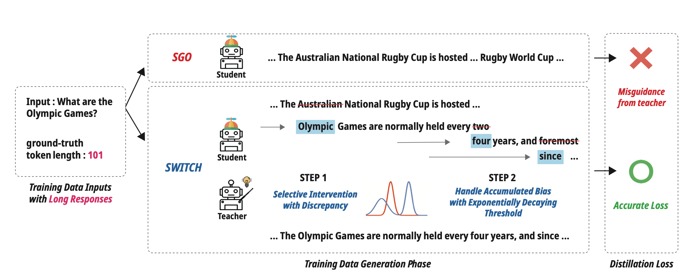 |[Paper](https://arxiv.org/abs/2410.19503)|[//]: #11/17
| [Beyond Autoregression: Fast LLMs via Self-Distillation Through Time](https://arxiv.org/abs/2410.21035)   Justin Deschenaux, Caglar Gulcehre | |[Github](https://github.com/jdeschena/sdtt)   [Paper](https://arxiv.org/abs/2410.21035)|[//]: #11/17
|[Pre-training Distillation for Large Language Models: A Design Space Exploration](https://arxiv.org/abs/2410.16215)   Hao Peng, Xin Lv, Yushi Bai, Zijun Yao, Jiajie Zhang, Lei Hou, Juanzi Li | |[Paper](https://arxiv.org/abs/2410.16215)|[//]: #10/30
| [MiniPLM: Knowledge Distillation for Pre-Training Language Models](https://arxiv.org/abs/2410.17215)   Yuxian Gu, Hao Zhou, Fandong Meng, Jie Zhou, Minlie Huang | |[Github](https://github.com/thu-coai/MiniPLM)   [Paper](https://arxiv.org/abs/2410.17215)|[//]: #10/29
|[Speculative Knowledge Distillation: Bridging the Teacher-Student Gap Through Interleaved Sampling](https://arxiv.org/abs/2410.11325)   Wenda Xu, Rujun Han, Zifeng Wang, Long T. Le, Dhruv Madeka, Lei Li, William Yang Wang, Rishabh Agarwal, Chen-Yu Lee, Tomas Pfister | |[Paper](https://arxiv.org/abs/2410.11325)|[//]: #10/21
|[Evolutionary Contrastive Distillation for Language Model Alignment](https://arxiv.org/abs/2410.07513)   Julian Katz-Samuels, Zheng Li, Hyokun Yun, Priyanka Nigam, Yi Xu, Vaclav Petricek, Bing Yin, Trishul Chilimbi | |[Paper](https://arxiv.org/abs/2410.07513)|[//]: #10/13
|[BabyLlama-2: Ensemble-Distilled Models Consistently Outperform Teachers With Limited Data](https://arxiv.org/abs/2409.17312)   Jean-Loup Tastet, Inar Timiryasov | |[Paper](https://arxiv.org/abs/2409.17312)|[//]: #09/27
|[EchoAtt: Attend, Copy, then Adjust for More Efficient Large Language Models](https://arxiv.org/abs/2409.14595)   Hossein Rajabzadeh, Aref Jafari, Aman Sharma, Benyamin Jami, Hyock Ju Kwon, Ali Ghodsi, Boxing Chen, Mehdi Rezagholizadeh | |[Paper](https://arxiv.org/abs/2409.14595)|[//]: #09/27
| [SKIntern: Internalizing Symbolic Knowledge for Distilling Better CoT Capabilities into Small Language Models](https://arxiv.org/abs/2409.13183)   Huanxuan Liao, Shizhu He, Yupu Hao, Xiang Li, Yuanzhe Zhang, Kang Liu, Jun Zhao | |[Github](https://github.com/Xnhyacinth/SKIntern)   [Paper](https://arxiv.org/abs/2409.13183)|[//]: #09/27
| [LLMR: Knowledge Distillation with a Large Language Model-Induced Reward](https://arxiv.org/abs/2409.12500)   Dongheng Li, Yongchang Hao, Lili Mou | |[Github](https://github.com/MANGA-UOFA/Prompt-LLMR)   [Paper](https://arxiv.org/abs/2409.12500)|[//]: #09/21
|[Exploring and Enhancing the Transfer of Distribution in Knowledge Distillation for Autoregressive Language Models](https://arxiv.org/abs/2409.12512)   Jun Rao, Xuebo Liu, Zepeng Lin, Liang Ding, Jing Li, Dacheng Tao | |[Paper](https://arxiv.org/abs/2409.12512)|[//]: #09/21
|[Efficient Knowledge Distillation: Empowering Small Language Models with Teacher Model Insights](https://arxiv.org/abs/2409.12586)   Mohamad Ballout, Ulf Krumnack, Gunther Heidemann, Kai-Uwe Kühnberger | |[Paper](https://arxiv.org/abs/2409.12586)|[//]: #09/21
| [The Mamba in the Llama: Distilling and Accelerating Hybrid Models](https://arxiv.org/abs/2408.15237)   Junxiong Wang, Daniele Paliotta, Avner May, Alexander M. Rush, Tri Dao | |[Github](https://github.com/jxiw/MambaInLlama)   [Paper](https://arxiv.org/abs/2408.15237)|[//]: #09/02
|[FIRST: Teach A Reliable Large Language Model Through Efficient Trustworthy Distillation](https://arxiv.org/abs/2408.12168)   KaShun Shum, Minrui Xu, Jianshu Zhang, Zixin Chen, Shizhe Diao, Hanze Dong, Jipeng Zhang, Muhammad Omer Raza | |[Paper](https://arxiv.org/abs/2408.12168)|[//]: #08/27
|[Interactive DualChecker for Mitigating Hallucinations in Distilling Large Language Models](https://arxiv.org/abs/2408.12326)   Meiyun Wang, Masahiro Suzuki, Hiroki Sakaji, Kiyoshi Izumi | |[Paper](https://arxiv.org/abs/2408.12326)|[//]: #08/27
|[Transformers to SSMs: Distilling Quadratic Knowledge to Subquadratic Models](https://arxiv.org/abs/2408.10189)   Aviv Bick, Kevin Y. Li, Eric P. Xing, J. Zico Kolter, Albert Gu | |[Paper](https://arxiv.org/abs/2408.10189)|[//]: #08/20
|[Concept Distillation from Strong to Weak Models via Hypotheses-to-Theories Prompting](https://arxiv.org/abs/2408.09365)   Emmanuel Aboah Boateng, Cassiano O. Becker, Nabiha Asghar, Kabir Walia, Ashwin Srinivasan, Ehi Nosakhare, Victor Dibia, Soundar Srinivasan | |[Paper](https://arxiv.org/abs/2408.09365)|[//]: #08/20
|[LaDiMo: Layer-wise Distillation Inspired MoEfier](https://arxiv.org/abs/2408.04278)   Sungyoon Kim, Youngjun Kim, Kihyo Moon, Minsung Jang | |[Paper](https://arxiv.org/abs/2408.04278)|[//]: #08/13

### Quantization
| Title & Authors | Introduction | Links |
|:--|  :----: | :---:|
|  :star: [GPTQ: Accurate Post-Training Quantization for Generative Pre-trained Transformers](https://arxiv.org/abs/2210.17323)   Elias Frantar, Saleh Ashkboos, Torsten Hoefler, Dan Alistarh | |[Github](https://github.com/IST-DASLab/gptq)   [Paper](https://arxiv.org/abs/2210.17323)| [//]: #Recommend
|   :star: [SmoothQuant: Accurate and Efficient Post-Training Quantization for Large Language Models](https://arxiv.org/abs/2211.10438)   Guangxuan Xiao, Ji Lin, Mickael Seznec, Hao Wu, Julien Demouth, Song Han | |[Github](https://github.com/mit-han-lab/smoothquant)   [Paper](https://arxiv.org/abs/2211.10438)| [//]: #Recommend
|   :star: [AWQ: Activation-aware Weight Quantization for LLM Compression and Acceleration](https://arxiv.org/abs/2306.00978)   Ji Lin, Jiaming Tang, Haotian Tang, Shang Yang, Xingyu Dang, Song Han | |[Github](https://github.com/mit-han-lab/llm-awq)   [Paper](https://arxiv.org/abs/2306.00978)| [//]: #Recommend
|  :star: [OmniQuant: Omnidirectionally Calibrated Quantization for Large Language Models](https://arxiv.org/abs/2308.13137)   Wenqi Shao, Mengzhao Chen, Zhaoyang Zhang, Peng Xu, Lirui Zhao, Zhiqian Li, Kaipeng Zhang, Peng Gao, Yu Qiao, Ping Luo | |[Github](https://github.com/OpenGVLab/OmniQuant)   [Paper](https://arxiv.org/abs/2308.13137)| [//]: #Recommend
|["Give Me BF16 or Give Me Death"? Accuracy-Performance Trade-Offs in LLM Quantization](https://arxiv.org/abs/2411.02355)   Eldar Kurtic, Alexandre Marques, Shubhra Pandit, Mark Kurtz, Dan Alistarh | |[Paper](https://arxiv.org/abs/2411.02355)|[//]: #11/18
|[GWQ: Gradient-Aware Weight Quantization for Large Language Models](https://arxiv.org/abs/2411.00850)   Yihua Shao, Siyu Liang, Xiaolin Lin, Zijian Ling, Zixian Zhu et al  | |[Paper](https://arxiv.org/abs/2411.00850)|[//]: #11/18
|[A Comprehensive Study on Quantization Techniques for Large Language Models](https://arxiv.org/abs/2411.02530)   Jiedong Lang, Zhehao Guo, Shuyu Huang | |[Paper](https://arxiv.org/abs/2411.02530)|[//]: #11/18
|[BitNet a4.8: 4-bit Activations for 1-bit LLMs](https://arxiv.org/abs/2411.04965)   Hongyu Wang, Shuming Ma, Furu Wei | |[Paper](https://arxiv.org/abs/2411.04965)|[//]: #11/18
| [TesseraQ: Ultra Low-Bit LLM Post-Training Quantization with Block Reconstruction](https://arxiv.org/abs/2410.19103)   Yuhang Li, Priyadarshini Panda | |[Github](https://github.com/Intelligent-Computing-Lab-Yale/TesseraQ)   [Paper](https://arxiv.org/abs/2410.19103)|[//]: #11/17
| [BitStack: Fine-Grained Size Control for Compressed Large Language Models in Variable Memory Environments](https://arxiv.org/abs/2410.23918)   Xinghao Wang, Pengyu Wang, Bo Wang, Dong Zhang, Yunhua Zhou, Xipeng Qiu | |[Github](https://github.com/xinghaow99/BitStack)   [Paper](https://arxiv.org/abs/2410.23918)|[//]: #11/17
|[The Impact of Inference Acceleration Strategies on Bias of LLMs](https://arxiv.org/abs/2410.22118)   Elisabeth Kirsten, Ivan Habernal, Vedant Nanda, Muhammad Bilal Zafar | |[Paper](https://arxiv.org/abs/2410.22118)|[//]: #11/17
|[Understanding the difficulty of low-precision post-training quantization of large language models](https://arxiv.org/abs/2410.14570)   Zifei Xu, Sayeh Sharify, Wanzin Yazar, Tristan Webb, Xin Wang | |[Paper](https://arxiv.org/abs/2410.14570)|[//]: #10/30
| [1-bit AI Infra: Part 1.1, Fast and Lossless BitNet b1.58 Inference on CPUs](https://arxiv.org/abs/2410.16144)   Jinheng Wang, Hansong Zhou, Ting Song, Shaoguang Mao, Shuming Ma, Hongyu Wang, Yan Xia, Furu Wei | |[Github](https://github.com/microsoft/BitNet)   [Paper](https://arxiv.org/abs/2410.16144)|[//]: #10/30
|[QuAILoRA: Quantization-Aware Initialization for LoRA](https://arxiv.org/abs/2410.14713)   Neal Lawton, Aishwarya Padmakumar, Judith Gaspers, Jack FitzGerald, Anoop Kumar, Greg Ver Steeg, Aram Galstyan | |[Paper](https://arxiv.org/abs/2410.14713)|[//]: #10/30
|[Evaluating Quantized Large Language Models for Code Generation on Low-Resource Language Benchmarks](https://arxiv.org/abs/2410.14766)   Enkhbold Nyamsuren | |[Paper](https://arxiv.org/abs/2410.14766)|[//]: #10/30
|    :star: [SqueezeLLM: Dense-and-Sparse Quantization](https://arxiv.org/pdf/2306.07629.pdf)  Sehoon Kim, Coleman Hooper, Amir Gholami, Zhen Dong, Xiuyu Li, Sheng Shen, Michael W. Mahoney, Kurt Keutzer |  |[Github](https://github.com/SqueezeAILab/SqueezeLLM)   [Paper](https://arxiv.org/pdf/2306.07629.pdf)| [//]: #Recommend
|[Pyramid Vector Quantization for LLMs](https://arxiv.org/abs/2410.16926)   Tycho F. A. van der Ouderaa, Maximilian L. Croci, Agrin Hilmkil, James Hensman | |[Paper](https://arxiv.org/abs/2410.16926)|[//]: #10/29
|[SeedLM: Compressing LLM Weights into Seeds of Pseudo-Random Generators](https://arxiv.org/abs/2410.10714)   Rasoul Shafipour, David Harrison, Maxwell Horton, Jeffrey Marker, Houman Bedayat, Sachin Mehta, Mohammad Rastegari, Mahyar Najibi, Saman Naderiparizi | |[Paper](https://arxiv.org/abs/2410.10714)|[//]: #10/21
| [FlatQuant: Flatness Matters for LLM Quantization](https://arxiv.org/abs/2410.09426)   Yuxuan Sun, Ruikang Liu, Haoli Bai, Han Bao, Kang Zhao, Yuening Li, Jiaxin Hu, Xianzhi Yu, Lu Hou, Chun Yuan, Xin Jiang, Wulong Liu, Jun Yao | |[Github](https://github.com/ruikangliu/FlatQuant)   [Paper](https://arxiv.org/abs/2410.09426)|[//]: #10/21
| [SLiM: One-shot Quantized Sparse Plus Low-rank Approximation of LLMs](https://arxiv.org/abs/2410.09615)   Mohammad Mozaffari, Maryam Mehri Dehnavi | |[Github](https://github.com/Mohammad-Mozaffari/slim)   [Paper](https://arxiv.org/abs/2410.09615)|[//]: #10/21
|[Scaling laws for post-training quantized large language models](https://arxiv.org/abs/2410.12119)   Zifei Xu, Alexander Lan, Wanzin Yazar, Tristan Webb, Sayeh Sharify, Xin Wang | |[Paper](https://arxiv.org/abs/2410.12119)|[//]: #10/21
|[Continuous Approximations for Improving Quantization Aware Training of LLMs](https://arxiv.org/abs/2410.10849)   He Li, Jianhang Hong, Yuanzhuo Wu, Snehal Adbol, Zonglin Li | |[Paper](https://arxiv.org/abs/2410.10849)|[//]: #10/21
| [DAQ: Density-Aware Post-Training Weight-Only Quantization For LLMs](https://arxiv.org/abs/2410.12187)   Yingsong Luo, Ling Chen | |[Github](https://github.com/LuoYingSong/DAQ)   [Paper](https://arxiv.org/abs/2410.12187)|[//]: #10/21
| [Quamba: A Post-Training Quantization Recipe for Selective State Space Models](https://arxiv.org/abs/2410.13229)   Hung-Yueh Chiang, Chi-Chih Chang, Natalia Frumkin, Kai-Chiang Wu, Diana Marculescu | |[Github](https://github.com/enyac-group/Quamba)   [Paper](https://arxiv.org/abs/2410.13229)|[//]: #10/21
|[AsymKV: Enabling 1-Bit Quantization of KV Cache with Layer-Wise Asymmetric Quantization Configurations](https://arxiv.org/abs/2410.13212)   Qian Tao, Wenyuan Yu, Jingren Zhou | |[Paper](https://arxiv.org/abs/2410.13212)|[//]: #10/21
|[Channel-Wise Mixed-Precision Quantization for Large Language Models](https://arxiv.org/abs/2410.13056)   Zihan Chen, Bike Xie, Jundong Li, Cong Shen | |[Paper](https://arxiv.org/abs/2410.13056)|[//]: #10/21
|[Progressive Mixed-Precision Decoding for Efficient LLM Inference](https://arxiv.org/abs/2410.13461)   Hao Mark Chen, Fuwen Tan, Alexandros Kouris, Royson Lee, Hongxiang Fan, Stylianos I. Venieris | |[Paper](https://arxiv.org/abs/2410.13461)|[//]: #10/21
| [EXAQ: Exponent Aware Quantization For LLMs Acceleration](https://arxiv.org/abs/2410.03185)   Moran Shkolnik, Maxim Fishman, Brian Chmiel, Hilla Ben-Yaacov, Ron Banner, Kfir Yehuda Levy |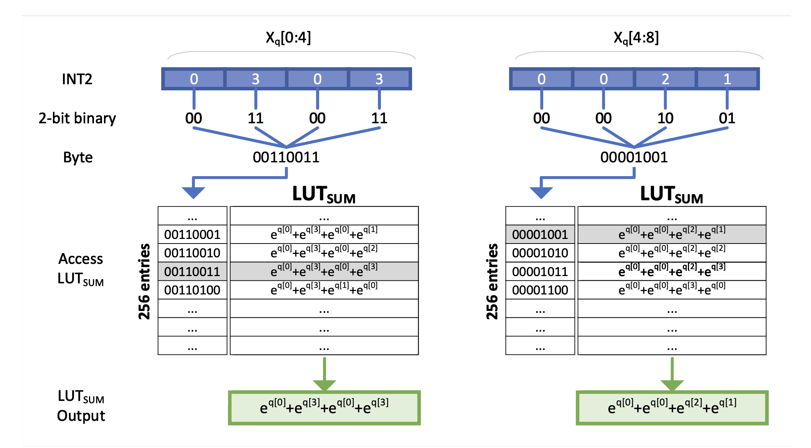 |[Github](https://github.com/Anonymous1252022/EXAQ)   [Paper](https://arxiv.org/abs/2410.03185)|[//]: #10/14
| [PrefixQuant: Static Quantization Beats Dynamic through Prefixed Outliers in LLMs](https://arxiv.org/abs/2410.05265)   Mengzhao Chen, Yi Liu, Jiahao Wang, Yi Bin, Wenqi Shao, Ping Luo | |[Github](https://github.com/ChenMnZ/PrefixQuant)   [Paper](https://arxiv.org/abs/2410.05265)|[//]: #10/14
|  :star: [Extreme Compression of Large Language Models via Additive Quantization](https://arxiv.org/abs/2401.06118)   Vage Egiazarian, Andrei Panferov, Denis Kuznedelev, Elias Frantar, Artem Babenko, Dan Alistarh | |[Github](https://github.com/vahe1994/AQLM)   [Paper](https://arxiv.org/abs/2401.06118)| [//]: #Recommend
|[Scaling Laws for Mixed quantization in Large Language Models](https://arxiv.org/abs/2410.06722)   Zeyu Cao, Cheng Zhang, Pedro Gimenes, Jianqiao Lu, Jianyi Cheng, Yiren Zhao |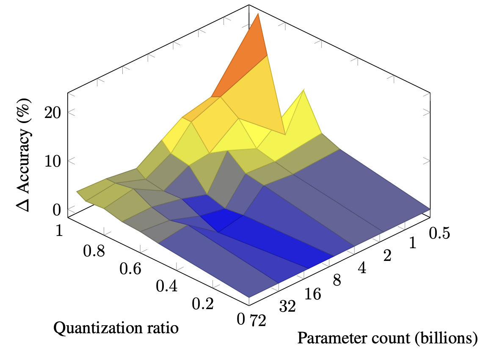 |[Paper](https://arxiv.org/abs/2410.06722)|[//]: #10/14
|[PalmBench: A Comprehensive Benchmark of Compressed Large Language Models on Mobile Platforms](https://arxiv.org/abs/2410.05315)   Yilong Li, Jingyu Liu, Hao Zhang, M Badri Narayanan, Utkarsh Sharma, Shuai Zhang, Pan Hu, Yijing Zeng, Jayaram Raghuram, Suman Banerjee |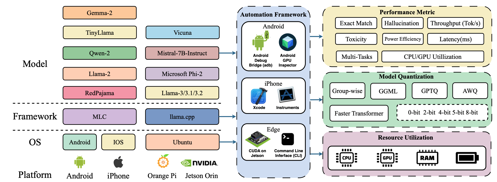 |[Paper](https://arxiv.org/abs/2410.05315)|[//]: #10/14
|[CrossQuant: A Post-Training Quantization Method with Smaller Quantization Kernel for Precise Large Language Model Compression](https://arxiv.org/abs/2410.07505)   Wenyuan Liu, Xindian Ma, Peng Zhang, Yan Wang | |[Paper](https://arxiv.org/abs/2410.07505)|[//]: #10/13
|[SageAttention: Accurate 8-Bit Attention for Plug-and-play Inference Acceleration](https://arxiv.org/abs/2410.02367)   Jintao Zhang, Jia wei, Pengle Zhang, Jun Zhu, Jianfei Chen | |[Paper](https://arxiv.org/abs/2410.02367)|[//]: #10/04
|[Addition is All You Need for Energy-efficient Language Models](https://arxiv.org/abs/2410.00907)   Hongyin Luo, Wei Sun | |[Paper](https://arxiv.org/abs/2410.00907)|[//]: #10/02
| [VPTQ: Extreme Low-bit Vector Post-Training Quantization for Large Language Models](https://arxiv.org/abs/2409.17066)   Yifei Liu, Jicheng Wen, Yang Wang, Shengyu Ye, Li Lyna Zhang, Ting Cao, Cheng Li, Mao Yang |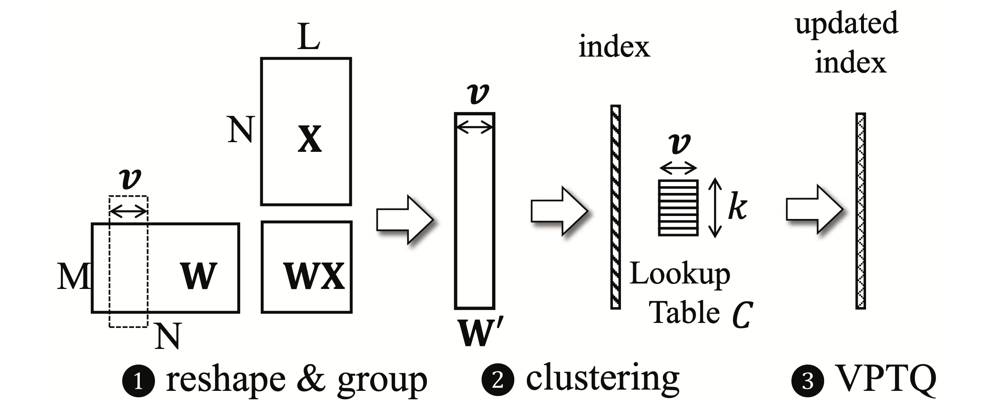 |[Github](https://github.com/microsoft/VPTQ)   [Paper](https://arxiv.org/abs/2409.17066)|[//]: #09/27
| [INT-FlashAttention: Enabling Flash Attention for INT8 Quantization](https://arxiv.org/abs/2409.16997)   Shimao Chen, Zirui Liu, Zhiying Wu, Ce Zheng, Peizhuang Cong, Zihan Jiang, Yuhan Wu, Lei Su, Tong Yang | |[Github](https://github.com/INT-FlashAttention2024/INT-FlashAttention)   [Paper](https://arxiv.org/abs/2409.16997)|[//]: #09/27
|[Accumulator-Aware Post-Training Quantization](https://arxiv.org/abs/2409.17092)   Ian Colbert, Fabian Grob, Giuseppe Franco, Jinjie Zhang, Rayan Saab | |[Paper](https://arxiv.org/abs/2409.17092)|[//]: #09/27
| [DuQuant: Distributing Outliers via Dual Transformation Makes Stronger Quantized LLMs](https://arxiv.org/abs/2406.01721)   Haokun Lin, Haobo Xu, Yichen Wu, Jingzhi Cui, Yingtao Zhang, Linzhan Mou, Linqi Song, Zhenan Sun, Ying Wei | |[Github](https://github.com/Hsu1023/DuQuant?tab=readme-ov-file)   [Paper](https://arxiv.org/abs/2406.01721)|[//]: #09/27
|[A Comprehensive Evaluation of Quantized Instruction-Tuned Large Language Models: An Experimental Analysis up to 405B](https://arxiv.org/abs/2409.11055)   Jemin Lee, Sihyeong Park, Jinse Kwon, Jihun Oh, Yongin Kwon | |[Paper](https://arxiv.org/abs/2409.11055)|[//]: #09/21
|[The Uniqueness of LLaMA3-70B with Per-Channel Quantization: An Empirical Study](https://arxiv.org/abs/2408.15301)   Minghai Qin | |[Paper](https://arxiv.org/abs/2408.15301)|[//]: #09/02
|[Matmul or No Matmal in the Era of 1-bit LLMs](https://arxiv.org/abs/2408.11939)   Jinendra Malekar, Mohammed E. Elbtity, Ramtin Zand Co | |[Paper](https://arxiv.org/abs/2408.11939)|[//]: #08/27
| [MobileQuant: Mobile-friendly Quantization for On-device Language Models](https://arxiv.org/abs/2408.13933)   Fuwen Tan, Royson Lee, Łukasz Dudziak, Shell Xu Hu, Sourav Bhattacharya, Timothy Hospedales, Georgios Tzimiropoulos, Brais Martinez | |[Github](https://github.com/saic-fi/MobileQuant)   [Paper](https://arxiv.org/abs/2408.13933)|[//]: #08/27
| [ABQ-LLM: Arbitrary-Bit Quantized Inference Acceleration for Large Language Models](https://arxiv.org/abs/2408.08554)   Chao Zeng, Songwei Liu, Yusheng Xie, Hong Liu, Xiaojian Wang, Miao Wei, Shu Yang, Fangmin Chen, Xing Mei | |[Github](https://github.com/bytedance/ABQ-LLM)   [Paper](https://arxiv.org/abs/2408.08554)|[//]: #08/20
|[STBLLM: Breaking the 1-Bit Barrier with Structured Binary LLMs](https://arxiv.org/abs/2408.01803)   Peijie Dong, Lujun Li, Dayou Du, Yuhan Chen, Zhenheng Tang, Qiang Wang, Wei Xue, Wenhan Luo, Qifeng Liu, Yike Guo, Xiaowen Chu | |[Paper](https://arxiv.org/abs/2408.01803)|[//]: #08/08

### Inference Acceleration
| Title & Authors | Introduction | Links |
|:--|  :----: | :---:|
|  :star: [Deja Vu: Contextual Sparsity for Efficient LLMs at Inference Time](https://openreview.net/forum?id=wIPIhHd00i)   Zichang Liu, Jue WANG, Tri Dao, Tianyi Zhou, Binhang Yuan, Zhao Song, Anshumali Shrivastava, Ce Zhang, Yuandong Tian, Christopher Re, Beidi Chen | |[Github](https://github.com/FMInference/DejaVu)   [Paper](https://openreview.net/forum?id=wIPIhHd00i)| [//]: #Recommend
|    :star: [SpecInfer: Accelerating Generative LLM Serving with Speculative Inference and Token Tree Verification](https://arxiv.org/abs/2305.09781)   Xupeng Miao, Gabriele Oliaro, Zhihao Zhang, Xinhao Cheng, Zeyu Wang, Rae Ying Yee Wong, Zhuoming Chen, Daiyaan Arfeen, Reyna Abhyankar, Zhihao Jia| | [Github](https://github.com/flexflow/FlexFlow/tree/inference)   [paper](https://arxiv.org/abs/2305.09781) | [//]: #Recommend
|  :star: [Efficient Streaming Language Models with Attention Sinks](https://arxiv.org/abs/2309.17453)   Guangxuan Xiao, Yuandong Tian, Beidi Chen, Song Han, Mike Lewis | |[Github](https://github.com/mit-han-lab/streaming-llm)   [Paper](https://arxiv.org/abs/2309.17453)| [//]: #Recommend
| :star: [EAGLE: Lossless Acceleration of LLM Decoding by Feature Extrapolation](https://sites.google.com/view/eagle-llm)   Yuhui Li, Chao Zhang, and Hongyang Zhang | |[Github](https://github.com/SafeAILab/EAGLE)   [Blog](https://sites.google.com/view/eagle-llm)| [//]: #Recommend
|  :star: [Medusa: Simple LLM Inference Acceleration Framework with Multiple Decoding Heads](https://arxiv.org/abs/2401.10774)   Tianle Cai, Yuhong Li, Zhengyang Geng, Hongwu Peng, Jason D. Lee, Deming Chen, Tri Dao | |[Github](https://github.com/FasterDecoding/Medusa)   [Paper](https://arxiv.org/abs/2401.10774)| [//]: #Recommend
|[The N-Grammys: Accelerating Autoregressive Inference with Learning-Free Batched Speculation](https://arxiv.org/abs/2411.03786)   Lawrence Stewart, Matthew Trager, Sujan Kumar Gonugondla, Stefano Soatto | |[Paper](https://arxiv.org/abs/2411.03786)|[//]: #11/18
|[Accelerated AI Inference via Dynamic Execution Methods](https://arxiv.org/abs/2411.00853)   Haim Barad, Jascha Achterberg, Tien Pei Chou, Jean Yu | |[Paper](https://arxiv.org/abs/2411.00853)|[//]: #11/18
|[SuffixDecoding: A Model-Free Approach to Speeding Up Large Language Model Inference](https://arxiv.org/abs/2411.04975)   Gabriele Oliaro, Zhihao Jia, Daniel Campos, Aurick Qiao | |[Paper](https://arxiv.org/abs/2411.04975)|[//]: #11/18
|[Dynamic Strategy Planning for Efficient Question Answering with Large Language Models](https://arxiv.org/abs/2410.23511)   Tanmay Parekh, Pradyot Prakash, Alexander Radovic, Akshay Shekher, Denis Savenkov | |[Paper](https://arxiv.org/abs/2410.23511)|[//]: #11/17
| [MagicPIG: LSH Sampling for Efficient LLM Generation](https://arxiv.org/abs/2410.16179)   Zhuoming Chen, Ranajoy Sadhukhan, Zihao Ye, Yang Zhou, Jianyu Zhang, Niklas Nolte, Yuandong Tian, Matthijs Douze, Leon Bottou, Zhihao Jia, Beidi Chen | |[Github](https://github.com/Infini-AI-Lab/MagicPIG)   [Paper](https://arxiv.org/abs/2410.16179)|[//]: #10/30
|[Faster Language Models with Better Multi-Token Prediction Using Tensor Decomposition](https://arxiv.org/abs/2410.17765)   Artem Basharin, Andrei Chertkov, Ivan Oseledets |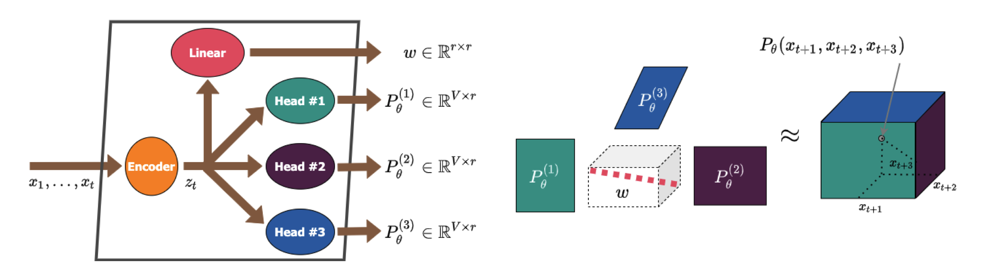 |[Paper](https://arxiv.org/abs/2410.17765)|[//]: #10/29
|[Efficient Inference for Augmented Large Language Models](https://arxiv.org/abs/2410.18248)   Rana Shahout, Cong Liang, Shiji Xin, Qianru Lao, Yong Cui, Minlan Yu, Michael Mitzenmacher | |[Paper](https://arxiv.org/abs/2410.18248)|[//]: #10/29
| [Dynamic Vocabulary Pruning in Early-Exit LLMs](https://arxiv.org/abs/2410.18952)   Jort Vincenti, Karim Abdel Sadek, Joan Velja, Matteo Nulli, Metod Jazbec | |[Github](https://github.com/MatteoNulli/Vocabulary_pruning)   [Paper](https://arxiv.org/abs/2410.18952)|[//]: #10/29
| [CoreInfer: Accelerating Large Language Model Inference with Semantics-Inspired Adaptive Sparse Activation](https://arxiv.org/abs/2410.18311#)   Qinsi Wang, Saeed Vahidian, Hancheng Ye, Jianyang Gu, Jianyi Zhang, Yiran Chen | |[Github](https://github.com/wangqinsi1/CoreInfer)   [Paper](https://arxiv.org/abs/2410.18311#)|[//]: #10/29
| [DuoAttention: Efficient Long-Context LLM Inference with Retrieval and Streaming Heads](https://arxiv.org/abs/2410.10819)   Guangxuan Xiao, Jiaming Tang, Jingwei Zuo, Junxian Guo, Shang Yang, Haotian Tang, Yao Fu, Song Han | |[Github](https://github.com/mit-han-lab/duo-attention)   [Paper](https://arxiv.org/abs/2410.10819)|[//]: #10/21
|[DySpec: Faster Speculative Decoding with Dynamic Token Tree Structure](https://arxiv.org/abs/2410.11744)   Yunfan Xiong, Ruoyu Zhang, Yanzeng Li, Tianhao Wu, Lei Zou | |[Paper](https://arxiv.org/abs/2410.11744)|[//]: #10/21
|[QSpec: Speculative Decoding with Complementary Quantization Schemes](https://arxiv.org/abs/2410.11305)   Juntao Zhao, Wenhao Lu, Sheng Wang, Lingpeng Kong, Chuan Wu | |[Paper](https://arxiv.org/abs/2410.11305)|[//]: #10/21
|[TidalDecode: Fast and Accurate LLM Decoding with Position Persistent Sparse Attention](https://arxiv.org/abs/2410.05076)   Lijie Yang, Zhihao Zhang, Zhuofu Chen, Zikun Li, Zhihao Jia | |[Paper](https://arxiv.org/abs/2410.05076)|[//]: #10/14
|[ParallelSpec: Parallel Drafter for Efficient Speculative Decoding](https://arxiv.org/abs/2410.05589)   Zilin Xiao, Hongming Zhang, Tao Ge, Siru Ouyang, Vicente Ordonez, Dong Yu | |[Paper](https://arxiv.org/abs/2410.05589)|[//]: #10/14
| [SWIFT: On-the-Fly Self-Speculative Decoding for LLM Inference Acceleration](https://arxiv.org/abs/2410.06916)   Heming Xia, Yongqi Li, Jun Zhang, Cunxiao Du, Wenjie Li | |[Github](https://github.com/hemingkx/SWIFT)   [Paper](https://arxiv.org/abs/2410.06916)|[//]: #10/14
| [TurboRAG: Accelerating Retrieval-Augmented Generation with Precomputed KV Caches for Chunked Text](https://arxiv.org/abs/2410.07590)   Songshuo Lu, Hua Wang, Yutian Rong, Zhi Chen, Yaohua Tang | |[Github](https://github.com/MooreThreads/TurboRAG)   [Paper](https://arxiv.org/abs/2410.07590)|[//]: #10/13
|[A Little Goes a Long Way: Efficient Long Context Training and Inference with Partial Contexts](https://arxiv.org/abs/2410.01485)   Suyu Ge, Xihui Lin, Yunan Zhang, Jiawei Han, Hao Peng | |[Paper](https://arxiv.org/abs/2410.01485)|[//]: #10/04
|[Mnemosyne: Parallelization Strategies for Efficiently Serving Multi-Million Context Length LLM Inference Requests Without Approximations](https://arxiv.org/abs/2409.17264)   Amey Agrawal, Junda Chen, Íñigo Goiri, Ramachandran Ramjee, Chaojie Zhang, Alexey Tumanov, Esha Choukse | |[Paper](https://arxiv.org/abs/2409.17264)|[//]: #09/27
| [Discovering the Gems in Early Layers: Accelerating Long-Context LLMs with 1000x Input Token Reduction](https://arxiv.org/abs/2409.17422)   Zhenmei Shi, Yifei Ming, Xuan-Phi Nguyen, Yingyu Liang, Shafiq Joty | |[Github](https://github.com/SalesforceAIResearch/GemFilter)   [Paper](https://arxiv.org/abs/2409.17422)|[//]: #09/27
|[Dynamic-Width Speculative Beam Decoding for Efficient LLM Inference](https://arxiv.org/abs/2409.16560)   Zongyue Qin, Zifan He, Neha Prakriya, Jason Cong, Yizhou Sun | |[Paper](https://arxiv.org/abs/2409.16560)|[//]: #09/27
| [CritiPrefill: A Segment-wise Criticality-based Approach for Prefilling Acceleration in LLMs](https://arxiv.org/abs/2409.12490)   Junlin Lv, Yuan Feng, Xike Xie, Xin Jia, Qirong Peng, Guiming Xie | |[Github](https://github.com/66RING/CritiPrefill)   [Paper](https://arxiv.org/abs/2409.12490)|[//]: #09/21
|[RetrievalAttention: Accelerating Long-Context LLM Inference via Vector Retrieval](https://arxiv.org/abs/2409.10516)   Di Liu, Meng Chen, Baotong Lu, Huiqiang Jiang, Zhenhua Han, Qianxi Zhang, Qi Chen, Chengruidong Zhang, Bailu Ding, Kai Zhang, Chen Chen, Fan Yang, Yuqing Yang, Lili Qiu | |[Paper](https://arxiv.org/abs/2409.10516)|[//]: #09/21
| [Sirius: Contextual Sparsity with Correction for Efficient LLMs](https://arxiv.org/abs/2409.03856)   Yang Zhou, Zhuoming Chen, Zhaozhuo Xu, Victoria Lin, Beidi Chen | |[Github](https://github.com/Infini-AI-Lab/Sirius)   [Paper](https://arxiv.org/abs/2409.03856)|[//]: #09/13
| [OneGen: Efficient One-Pass Unified Generation and Retrieval for LLMs](https://arxiv.org/abs/2409.05152)   Jintian Zhang, Cheng Peng, Mengshu Sun, Xiang Chen, Lei Liang, Zhiqiang Zhang, Jun Zhou, Huajun Chen, Ningyu Zhang | |[Github](https://github.com/zjunlp/OneGen)   [Paper](https://arxiv.org/abs/2409.05152)|[//]: #09/13
|[Path-Consistency: Prefix Enhancement for Efficient Inference in LLM](https://arxiv.org/abs/2409.01281)   Jiace Zhu, Yingtao Shen, Jie Zhao, An Zou | |[Paper](https://arxiv.org/abs/2409.01281)|[//]: #09/06
|[Boosting Lossless Speculative Decoding via Feature Sampling and Partial Alignment Distillation](https://arxiv.org/abs/2408.15562)   Lujun Gui, Bin Xiao, Lei Su, Weipeng Chen | |[Paper](https://arxiv.org/abs/2408.15562)|[//]: #09/02
|[Turning Trash into Treasure: Accelerating Inference of Large Language Models with Token Recycling](https://arxiv.org/abs/2408.08696)   Xianzhen Luo, Yixuan Wang, Qingfu Zhu, Zhiming Zhang, Xuanyu Zhang, Qing Yang, Dongliang Xu, Wanxiang Che | |[Paper](https://arxiv.org/abs/2408.08696)|[//]: #08/20
|[Speculative Diffusion Decoding: Accelerating Language Generation through Diffusion](https://arxiv.org/abs/2408.05636)   Jacob K Christopher, Brian R Bartoldson, Bhavya Kailkhura, Ferdinando Fioretto | |[Paper](https://arxiv.org/abs/2408.05636)|[//]: #08/13

### Efficient MOE
| Title & Authors | Introduction | Links |
|:--|  :----: | :---:|
| :star: [Fast Inference of Mixture-of-Experts Language Models with Offloading](https://arxiv.org/abs/2312.17238)   Artyom Eliseev, Denis Mazur | |[Github](https://github.com/dvmazur/mixtral-offloading)   [Paper](https://arxiv.org/abs/2312.17238)| [//]: #Recommend
| [MoNTA: Accelerating Mixture-of-Experts Training with Network-Traffc-Aware Parallel Optimization](https://arxiv.org/abs/2411.00662)   Jingming Guo, Yan Liu, Yu Meng, Zhiwei Tao, Banglan Liu, Gang Chen, Xiang Li | |[Github](https://github.com/EnflameTechnology/DeepSpeed)   [Paper](https://arxiv.org/abs/2411.00662)|[//]: #11/18
| [MoE-I2: Compressing Mixture of Experts Models through Inter-Expert Pruning and Intra-Expert Low-Rank Decomposition](https://arxiv.org/abs/2411.01016)   Cheng Yang, Yang Sui, Jinqi Xiao, Lingyi Huang, Yu Gong, Yuanlin Duan, Wenqi Jia, Miao Yin, Yu Cheng, Bo Yuan | |[Github](https://github.com/xiaochengsky/MoEI-2)   [Paper](https://arxiv.org/abs/2411.01016)|[//]: #11/18
|[HOBBIT: A Mixed Precision Expert Offloading System for Fast MoE Inference](https://arxiv.org/abs/2411.01433)   Peng Tang, Jiacheng Liu, Xiaofeng Hou, Yifei Pu, Jing Wang, Pheng-Ann Heng, Chao Li, Minyi Guo | |[Paper](https://arxiv.org/abs/2411.01433)|[//]: #11/18
|[ProMoE: Fast MoE-based LLM Serving using Proactive Caching](https://arxiv.org/abs/2410.22134)   Xiaoniu Song, Zihang Zhong, Rong Chen | |[Paper](https://arxiv.org/abs/2410.22134)|[//]: #11/17
|[ExpertFlow: Optimized Expert Activation and Token Allocation for Efficient Mixture-of-Experts Inference](https://arxiv.org/abs/2410.17954)   Xin He, Shunkang Zhang, Yuxin Wang, Haiyan Yin, Zihao Zeng, Shaohuai Shi, Zhenheng Tang, Xiaowen Chu, Ivor Tsang, Ong Yew Soon | |[Paper](https://arxiv.org/abs/2410.17954)|[//]: #10/29
|[EPS-MoE: Expert Pipeline Scheduler for Cost-Efficient MoE Inference](https://arxiv.org/abs/2410.12247)   Yulei Qian, Fengcun Li, Xiangyang Ji, Xiaoyu Zhao, Jianchao Tan, Kefeng Zhang, Xunliang Cai | |[Paper](https://arxiv.org/abs/2410.12247)|[//]: #10/21
| [MC-MoE: Mixture Compressor for Mixture-of-Experts LLMs Gains More](https://arxiv.org/abs/2410.06270)   Wei Huang, Yue Liao, Jianhui Liu, Ruifei He, Haoru Tan, Shiming Zhang, Hongsheng Li, Si Liu, Xiaojuan Qi | |[Github](https://github.com/Aaronhuang-778/MC-MoE)   [Paper](https://arxiv.org/abs/2410.06270)|[//]: #10/14

### Efficient Architecture of LLM
| Title & Authors | Introduction | Links |
|:--|  :----: | :---:|
| :star: [MobiLlama: Towards Accurate and Lightweight Fully Transparent GPT](https://arxiv.org/abs/2402.16840)   Omkar Thawakar, Ashmal Vayani, Salman Khan, Hisham Cholakal, Rao M. Anwer, Michael Felsberg, Tim Baldwin, Eric P. Xing, Fahad Shahbaz Khan | |[Github](https://github.com/mbzuai-oryx/MobiLlama)   [Paper](https://arxiv.org/abs/2402.16840)  [Model](https://huggingface.co/MBZUAI/MobiLlama-05B) | [//]: #Recommend
| :star: [Megalodon: Efficient LLM Pretraining and Inference with Unlimited Context Length](https://arxiv.org/abs/2404.08801)   Xuezhe Ma, Xiaomeng Yang, Wenhan Xiong, Beidi Chen, Lili Yu, Hao Zhang, Jonathan May, Luke Zettlemoyer, Omer Levy, Chunting Zhou | |[Github](https://github.com/XuezheMax/megalodon)   [Paper](https://arxiv.org/abs/2404.08801)| [//]: #Recommend
|[Taipan: Efficient and Expressive State Space Language Models with Selective Attention](https://arxiv.org/abs/2410.18572)   Chien Van Nguyen, Huy Huu Nguyen, Thang M. Pham, Ruiyi Zhang, Hanieh Deilamsalehy, Puneet Mathur, Ryan A. Rossi, Trung Bui, Viet Dac Lai, Franck Dernoncourt, Thien Huu Nguyen | |[Paper](https://arxiv.org/abs/2410.18572)|[//]: #10/29
| [SeerAttention: Learning Intrinsic Sparse Attention in Your LLMs](https://arxiv.org/abs/2410.13276)   Yizhao Gao, Zhichen Zeng, Dayou Du, Shijie Cao, Hayden Kwok-Hay So, Ting Cao, Fan Yang, Mao Yang | |[Github](https://github.com/microsoft/SeerAttention)   [Paper](https://arxiv.org/abs/2410.13276)|[//]: #10/21
| [Basis Sharing: Cross-Layer Parameter Sharing for Large Language Model Compression](https://arxiv.org/abs/2410.03765)   Jingcun Wang, Yu-Guang Chen, Ing-Chao Lin, Bing Li, Grace Li Zhang | |[Github](https://github.com/TUDa-HWAI/Basis_Sharing)   [Paper](https://arxiv.org/abs/2410.03765)|[//]: #10/14
|[Rodimus*: Breaking the Accuracy-Efficiency Trade-Off with Efficient Attentions](https://arxiv.org/abs/2410.06577)   Zhihao He, Hang Yu, Zi Gong, Shizhan Liu, Jianguo Li, Weiyao Lin | |[Paper](https://arxiv.org/abs/2410.06577)|[//]: #10/14

### KV Cache Compression
| Title & Authors | Introduction | Links |
|:--|  :----: | :---:|
|:star: [Model Tells You What to Discard: Adaptive KV Cache Compression for LLMs](https://arxiv.org/abs/2310.01801)   Suyu Ge, Yunan Zhang, Liyuan Liu, Minjia Zhang, Jiawei Han, Jianfeng Gao | |[Paper](https://arxiv.org/abs/2310.01801)| [//]: #Recommend
| [Not All Heads Matter: A Head-Level KV Cache Compression Method with Integrated Retrieval and Reasoning](https://arxiv.org/abs/2410.19258)   Yu Fu, Zefan Cai, Abedelkadir Asi, Wayne Xiong, Yue Dong, Wen Xiao | |[Github](https://github.com/FYYFU/HeadKV)   [Paper](https://arxiv.org/abs/2410.19258)|[//]: #11/17
| [BUZZ: Beehive-structured Sparse KV Cache with Segmented Heavy Hitters for Efficient LLM Inference](https://arxiv.org/abs/2410.23079)   Junqi Zhao, Zhijin Fang, Shu Li, Shaohui Yang, Shichao He | |[Github](https://github.com/JunqiZhao888/buzz-llm)   [Paper](https://arxiv.org/abs/2410.23079)|[//]: #11/17
| [A Systematic Study of Cross-Layer KV Sharing for Efficient LLM Inference](https://arxiv.org/abs/2410.14442)   You Wu, Haoyi Wu, Kewei Tu |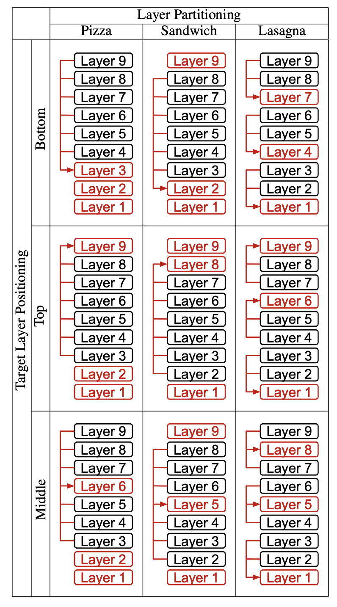 |[Github](https://github.com/whyNLP/LCKV)   [Paper](https://arxiv.org/abs/2410.14442)|[//]: #10/30
|[Lossless KV Cache Compression to 2%](https://arxiv.org/abs/2410.15252)   Zhen Yang, J.N.Han, Kan Wu, Ruobing Xie, An Wang, Xingwu Sun, Zhanhui Kang | |[Paper](https://arxiv.org/abs/2410.15252)|[//]: #10/30
|[MatryoshkaKV: Adaptive KV Compression via Trainable Orthogonal Projection](https://arxiv.org/abs/2410.14731)   Bokai Lin, Zihao Zeng, Zipeng Xiao, Siqi Kou, Tianqi Hou, Xiaofeng Gao, Hao Zhang, Zhijie Deng | |[Paper](https://arxiv.org/abs/2410.14731)|[//]: #10/30
| [Residual vector quantization for KV cache compression in large language model](https://arxiv.org/abs/2410.15704)   Ankur Kumar | |[Github](https://github.com/iankur/vqllm)   [Paper](https://arxiv.org/abs/2410.15704)|[//]: #10/30
| [KVSharer: Efficient Inference via Layer-Wise Dissimilar KV Cache Sharing](https://arxiv.org/abs/2410.18517)   Yifei Yang, Zouying Cao, Qiguang Chen, Libo Qin, Dongjie Yang, Hai Zhao, Zhi Chen | |[Github](https://github.com/yangyifei729/KVSharer)   [Paper](https://arxiv.org/abs/2410.18517)|[//]: #10/29
|[LoRC: Low-Rank Compression for LLMs KV Cache with a Progressive Compression Strategy](https://arxiv.org/abs/2410.03111)   Rongzhi Zhang, Kuang Wang, Liyuan Liu, Shuohang Wang, Hao Cheng, Chao Zhang, Yelong Shen |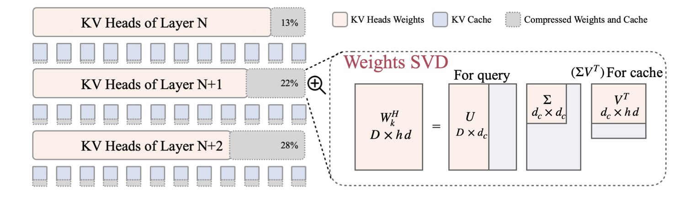 |[Paper](https://arxiv.org/abs/2410.03111)|[//]: #10/14
|[SwiftKV: Fast Prefill-Optimized Inference with Knowledge-Preserving Model Transformation](https://arxiv.org/abs/2410.03960)   Aurick Qiao, Zhewei Yao, Samyam Rajbhandari, Yuxiong He | |[Paper](https://arxiv.org/abs/2410.03960)|[//]: #10/14
| [Dynamic Memory Compression: Retrofitting LLMs for Accelerated Inference](https://arxiv.org/abs/2403.09636)   Piotr Nawrot, Adrian Łańcucki, Marcin Chochowski, David Tarjan, Edoardo M. Ponti |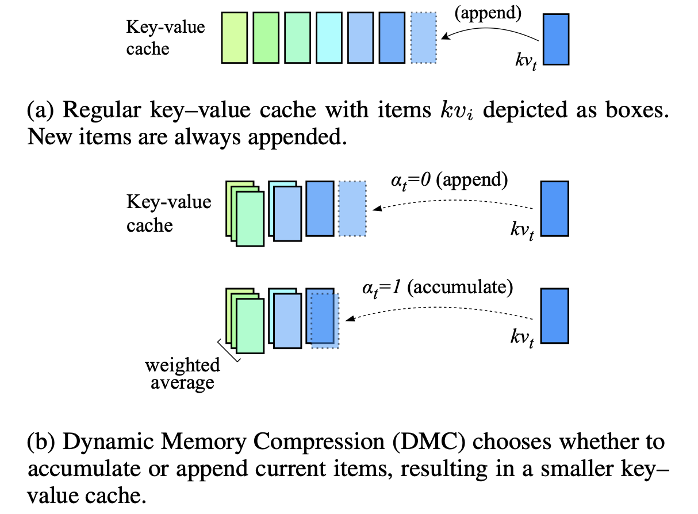 |[Paper](https://arxiv.org/abs/2403.09636)|[//]: #10/02
|[KV-Compress: Paged KV-Cache Compression with Variable Compression Rates per Attention Head](https://arxiv.org/abs/2410.00161)   Isaac Rehg | |[Paper](https://arxiv.org/abs/2410.00161)|[//]: #10/02
| [Ada-KV: Optimizing KV Cache Eviction by Adaptive Budget Allocation for Efficient LLM Inference](https://arxiv.org/abs/2407.11550)   Yuan Feng, Junlin Lv, Yukun Cao, Xike Xie, S. Kevin Zhou |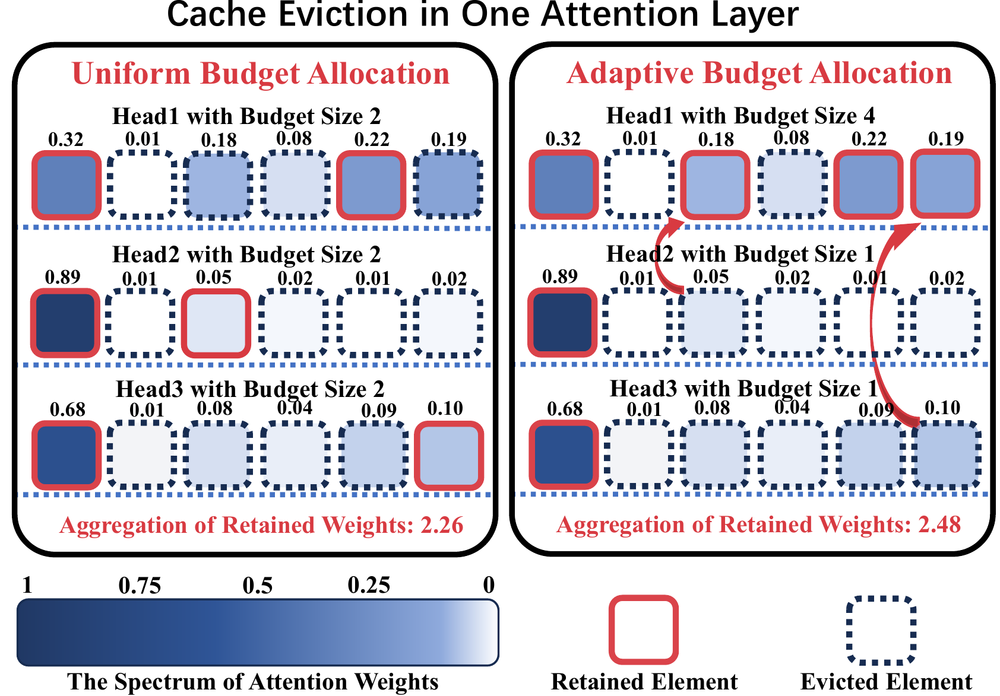 |[Github](https://github.com/FFY0/AdaKV)   [Paper](https://arxiv.org/abs/2407.11550)|[//]: #10/13
| [AlignedKV: Reducing Memory Access of KV-Cache with Precision-Aligned Quantization](https://arxiv.org/abs/2409.16546)   Yifan Tan, Haoze Wang, Chao Yan, Yangdong Deng | |[Github](https://github.com/AlignedQuant/AlignedKV)   [Paper](https://arxiv.org/abs/2409.16546)|[//]: #09/27
|[CSKV: Training-Efficient Channel Shrinking for KV Cache in Long-Context Scenarios](https://arxiv.org/abs/2409.10593)   Luning Wang, Shiyao Li, Xuefei Ning, Zhihang Yuan, Shengen Yan, Guohao Dai, Yu Wang | |[Paper](https://arxiv.org/abs/2409.10593)|[//]: #09/21
|[A First Look At Efficient And Secure On-Device LLM Inference Against KV Leakage](https://arxiv.org/abs/2409.04040)   Huan Yang, Deyu Zhang, Yudong Zhao, Yuanchun Li, Yunxin Liu | |[Paper](https://arxiv.org/abs/2409.04040)|[//]: #09/13
| [Post-Training Sparse Attention with Double Sparsity](https://arxiv.org/abs/2408.07092)   Shuo Yang, Ying Sheng, Joseph E. Gonzalez, Ion Stoica, Lianmin Zheng | |[Github](https://github.com/andy-yang-1/DoubleSparse)   [Paper](https://arxiv.org/abs/2408.07092)|[//]: #08/20
| [Eigen Attention: Attention in Low-Rank Space for KV Cache Compression](https://arxiv.org/abs/2408.05646)   Utkarsh Saxena, Gobinda Saha, Sakshi Choudhary, Kaushik Roy | |[Github](https://github.com/UtkarshSaxena1/EigenAttn)   [Paper](https://arxiv.org/abs/2408.05646)|[//]: #08/13
|[Zero-Delay QKV Compression for Mitigating KV Cache and Network Bottlenecks in LLM Inference](https://arxiv.org/abs/2408.04107)   Zeyu Zhang,Haiying Shen | |[Paper](https://arxiv.org/abs/2408.04107)|[//]: #08/09
|[Finch: Prompt-guided Key-Value Cache Compression](https://arxiv.org/abs/2408.00167)   Giulio Corallo, Paolo Papotti | |[Paper](https://arxiv.org/abs/2408.00167)|[//]: #08/08
| [Palu: Compressing KV-Cache with Low-Rank Projection](https://arxiv.org/abs/2407.21118)   Chi-Chih Chang, Wei-Cheng Lin, Chien-Yu Lin, Chong-Yan Chen, Yu-Fang Hu, Pei-Shuo Wang, Ning-Chi Huang, Luis Ceze, Kai-Chiang Wu | |[Github](https://github.com/shadowpa0327/Palu)   [Paper](https://arxiv.org/abs/2407.21118)|[//]: #08/08
|[ThinK: Thinner Key Cache by Query-Driven Pruning](https://arxiv.org/abs/2407.21018)   Yuhui Xu, Zhanming Jie, Hanze Dong, Lei Wang, Xudong Lu, Aojun Zhou, Amrita Saha, Caiming Xiong, Doyen Sahoo | |[Paper](https://arxiv.org/abs/2407.21018)|[//]: #08/08

### Text Compression
| Title & Authors | Introduction | Links |
|:--|  :----: | :---:|
| :star: [LLMLingua: Compressing Prompts for Accelerated Inference of Large Language Models](https://arxiv.org/abs/2310.05736)   Huiqiang Jiang, Qianhui Wu, Chin-Yew Lin, Yuqing Yang, Lili Qiu | |[Github](https://github.com/microsoft/LLMLingua)   [Paper](https://arxiv.org/abs/2310.05736)| [//]: #Recommend
| :star: [LongLLMLingua: Accelerating and Enhancing LLMs in Long Context Scenarios via Prompt Compression](https://arxiv.org/abs/2310.06839)   Huiqiang Jiang, Qianhui Wu, Xufang Luo, Dongsheng Li, Chin-Yew Lin, Yuqing Yang, Lili Qiu | |[Github](https://github.com/microsoft/LLMLingua)   [Paper](https://arxiv.org/abs/2310.06839)| [//]: #Recommend
| [MultiTok: Variable-Length Tokenization for Efficient LLMs Adapted from LZW Compression](https://arxiv.org/abs/2410.21548)   Noel Elias, Homa Esfahanizadeh, Kaan Kale, Sriram Vishwanath, Muriel Medard | |[Github](https://github.com/noelkelias/multitok)   [Paper](https://arxiv.org/abs/2410.21548)|[//]: #11/17
| [Selection-p: Self-Supervised Task-Agnostic Prompt Compression for Faithfulness and Transferability](https://arxiv.org/abs/2410.11786)   Tsz Ting Chung, Leyang Cui, Lemao Liu, Xinting Huang, Shuming Shi, Dit-Yan Yeung | |[Paper](https://arxiv.org/abs/2410.11786)|[//]: #10/21
| [From Reading to Compressing: Exploring the Multi-document Reader for Prompt Compression](https://arxiv.org/abs/2410.04139)   Eunseong Choi, Sunkyung Lee, Minjin Choi, June Park, Jongwuk Lee | |[Paper](https://arxiv.org/abs/2410.04139)|[//]: #10/14
|[Perception Compressor:A training-free prompt compression method in long context scenarios](https://arxiv.org/abs/2409.19272)   Jiwei Tang, Jin Xu, Tingwei Lu, Hai Lin, Yiming Zhao, Hai-Tao Zheng | |[Paper](https://arxiv.org/abs/2409.19272)|[//]: #10/02
| [FineZip : Pushing the Limits of Large Language Models for Practical Lossless Text Compression](https://arxiv.org/abs/2409.17141)   Fazal Mittu, Yihuan Bu, Akshat Gupta, Ashok Devireddy, Alp Eren Ozdarendeli, Anant Singh, Gopala Anumanchipalli | |[Github](https://github.com/fazalmittu/FineZip)   [Paper](https://arxiv.org/abs/2409.17141)|[//]: #09/27
| [Parse Trees Guided LLM Prompt Compression](https://arxiv.org/abs/2409.15395)   Wenhao Mao, Chengbin Hou, Tianyu Zhang, Xinyu Lin, Ke Tang, Hairong Lv | |[Github](https://github.com/LengendaryHippopotamus/PartPrompt)   [Paper](https://arxiv.org/abs/2409.15395)|[//]: #09/27
| [AlphaZip: Neural Network-Enhanced Lossless Text Compression](https://arxiv.org/abs/2409.15046)   Swathi Shree Narashiman, Nitin Chandrachoodan | |[Github](https://github.com/Swathi-Shree-Narashiman/AlphaZip)   [Paper](https://arxiv.org/abs/2409.15046)|[//]: #09/27
|[TACO-RL: Task Aware Prompt Compression Optimization with Reinforcement Learning](https://arxiv.org/abs/2409.13035)   Shivam Shandilya, Menglin Xia, Supriyo Ghosh, Huiqiang Jiang, Jue Zhang, Qianhui Wu, Victor Rühle | |[Paper](https://arxiv.org/abs/2409.13035)|[//]: #09/27
|[Efficient LLM Context Distillation](https://arxiv.org/abs/2409.01930)   Rajesh Upadhayayaya, Zachary Smith, Chritopher Kottmyer, Manish Raj Osti | |[Paper](https://arxiv.org/abs/2409.01930)|[//]: #09/06
| [Enhancing and Accelerating Large Language Models via Instruction-Aware Contextual Compression](https://arxiv.org/abs/2408.15491)   Haowen Hou, Fei Ma, Binwen Bai, Xinxin Zhu, Fei Yu | |[Github](https://github.com/howard-hou/instruction-aware-contextual-compressor)   [Paper](https://arxiv.org/abs/2408.15491)|[//]: #09/02

### Low-Rank Decomposition
| Title & Authors | Introduction | Links |
|:--|  :----: | :---:|
| [Natural GaLore: Accelerating GaLore for memory-efficient LLM Training and Fine-tuning](https://arxiv.org/abs/2410.16029)   Arijit Das | |[Github](https://github.com/selfsupervised-ai/Natural-GaLore)   [Paper](https://arxiv.org/abs/2410.16029)|[//]: #10/30
|[CompAct: Compressed Activations for Memory-Efficient LLM Training](https://arxiv.org/abs/2410.15352)   Yara Shamshoum, Nitzan Hodos, Yuval Sieradzki, Assaf Schuster | |[Paper](https://arxiv.org/abs/2410.15352)|[//]: #10/30
| [ESPACE: Dimensionality Reduction of Activations for Model Compression](https://arxiv.org/abs/2410.05437)   Charbel Sakr, Brucek Khailany |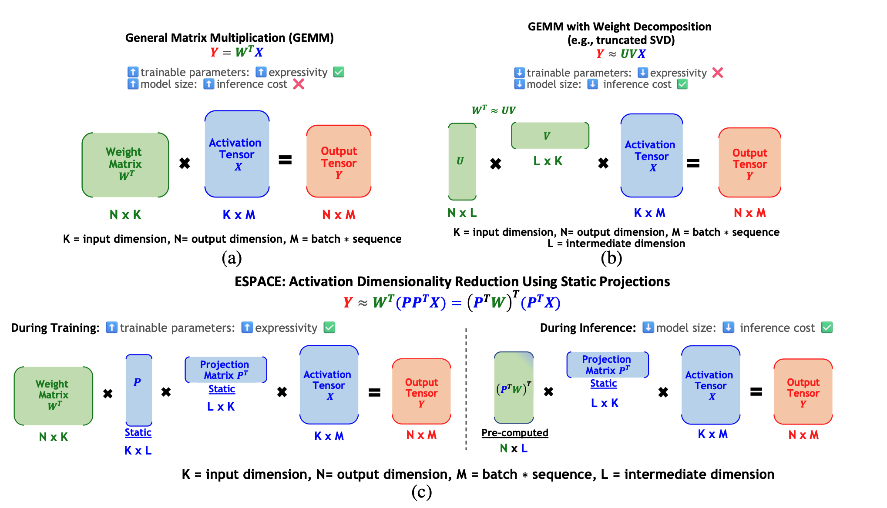 |[Paper](https://arxiv.org/abs/2410.05437)|[//]: #10/14
|[MoDeGPT: Modular Decomposition for Large Language Model Compression](https://arxiv.org/abs/2408.09632)   Chi-Heng Lin, Shangqian Gao, James Seale Smith, Abhishek Patel, Shikhar Tuli, Yilin Shen, Hongxia Jin, Yen-Chang Hsu | |[Paper](https://arxiv.org/abs/2408.09632)|[//]: #08/20

### Hardware/System/Serving
| Title & Authors | Introduction | Links |
|:--|  :----: | :---:|
|[Ripple: Accelerating LLM Inference on Smartphones with Correlation-Aware Neuron Management](https://arxiv.org/abs/2410.19274)   Tuowei Wang, Ruwen Fan, Minxing Huang, Zixu Hao, Kun Li, Ting Cao, Youyou Lu, Yaoxue Zhang, Ju Ren | |[Paper](https://arxiv.org/abs/2410.19274)|[//]: #11/17
| [ALISE: Accelerating Large Language Model Serving with Speculative Scheduling](https://arxiv.org/abs/2410.23537)   Youpeng Zhao, Jun Wang | |[Paper](https://arxiv.org/abs/2410.23537)|[//]: #11/17
|[EPIC: Efficient Position-Independent Context Caching for Serving Large Language Models](https://arxiv.org/abs/2410.15332)   Junhao Hu, Wenrui Huang, Haoyi Wang, Weidong Wang, Tiancheng Hu, Qin Zhang, Hao Feng, Xusheng Chen, Yizhou Shan, Tao Xie | |[Paper](https://arxiv.org/abs/2410.15332)|[//]: #10/30
| [SDP4Bit: Toward 4-bit Communication Quantization in Sharded Data Parallelism for LLM Training](https://arxiv.org/abs/2410.15526)   Jinda Jia, Cong Xie, Hanlin Lu, Daoce Wang, Hao Feng, Chengming Zhang, Baixi Sun, Haibin Lin, Zhi Zhang, Xin Liu, Dingwen Tao | |[Paper](https://arxiv.org/abs/2410.15526)|[//]: #10/30
|[FastAttention: Extend FlashAttention2 to NPUs and Low-resource GPUs](https://arxiv.org/abs/2410.16663)   Haoran Lin, Xianzhi Yu, Kang Zhao, Lu Hou, Zongyuan Zhan et al | |[Paper](https://arxiv.org/abs/2410.16663)|[//]: #10/29
|[POD-Attention: Unlocking Full Prefill-Decode Overlap for Faster LLM Inference](https://arxiv.org/abs/2410.18038)   Aditya K Kamath, Ramya Prabhu, Jayashree Mohan, Simon Peter, Ramachandran Ramjee, Ashish Panwar | |[Paper](https://arxiv.org/abs/2410.18038)|[//]: #10/29
| [TPI-LLM: Serving 70B-scale LLMs Efficiently on Low-resource Edge Devices](https://arxiv.org/abs/2410.00531)   Zonghang Li, Wenjiao Feng, Mohsen Guizani, Hongfang Yu | |[Github](https://github.com/Lizonghang/TPI-LLM)   [Paper](https://arxiv.org/abs/2410.00531)|[//]: #10/02
| [Efficient Arbitrary Precision Acceleration for Large Language Models on GPU Tensor Cores](https://arxiv.org/abs/2409.17870)   Shaobo Ma, Chao Fang, Haikuo Shao, Zhongfeng Wang | |[Paper](https://arxiv.org/abs/2409.17870)|[//]: #09/27
| [OPAL: Outlier-Preserved Microscaling Quantization A ccelerator for Generative Large Language Models](https://arxiv.org/abs/2409.05902)   Jahyun Koo, Dahoon Park, Sangwoo Jung, Jaeha Kung | |[Paper](https://arxiv.org/abs/2409.05902)|[//]: #09/13
|[Accelerating Large Language Model Training with Hybrid GPU-based Compression](https://arxiv.org/abs/2409.02423)   Lang Xu, Quentin Anthony, Qinghua Zhou, Nawras Alnaasan, Radha R. Gulhane, Aamir Shafi, Hari Subramoni, Dhabaleswar K. Panda | |[Paper](https://arxiv.org/abs/2409.02423)|[//]: #09/06
|[LUT Tensor Core: Lookup Table Enables Efficient Low-Bit LLM Inference Acceleration](https://arxiv.org/abs/2408.06003)   Zhiwen Mo, Lei Wang, Jianyu Wei, Zhichen Zeng, Shijie Cao, Lingxiao Ma, Naifeng Jing, Ting Cao, Jilong Xue, Fan Yang, Mao Yang | |[Paper](https://arxiv.org/abs/2408.06003)|[//]: #08/20
|[Kraken: Inherently Parallel Transformers For Efficient Multi-Device Inference](https://arxiv.org/abs/2408.07802)   Rohan Baskar Prabhakar, Hengrui Zhang, David Wentzlaff | |[Paper](https://arxiv.org/abs/2408.07802)|[//]: #08/20
|[SLO-aware GPU Frequency Scaling for Energy Efficient LLM Inference Serving](https://arxiv.org/abs/2408.05235)   Andreas Kosmas Kakolyris, Dimosthenis Masouros, Petros Vavaroutsos, Sotirios Xydis, Dimitrios Soudris | |[Paper](https://arxiv.org/abs/2408.05235)|[//]: #08/13
|[Designing Efficient LLM Accelerators for Edge Devices](https://arxiv.org/abs/2408.00462)   Jude Haris, Rappy Saha, Wenhao Hu, José Cano | |[Paper](https://arxiv.org/abs/2408.00462)|[//]: #08/08

### Tuning
| Title & Authors | Introduction | Links |
|:--|  :----: | :---:|
| [Robust and Efficient Fine-tuning of LLMs with Bayesian Reparameterization of Low-Rank Adaptation](https://arxiv.org/abs/2411.04358)   Ayan Sengupta, Vaibhav Seth, Arinjay Pathak, Natraj Raman, Sriram Gopalakrishnan, Tanmoy Chakraborty | |[Github](https://github.com/LCS2-IIITD/MonteCLoRA)   [Paper](https://arxiv.org/abs/2411.04358)|[//]: #11/18
| [MiLoRA: Efficient Mixture of Low-Rank Adaptation for Large Language Models Fine-tuning](https://arxiv.org/abs/2410.18035)   Jingfan Zhang, Yi Zhao, Dan Chen, Xing Tian, Huanran Zheng, Wei Zhu | |[Paper](https://arxiv.org/abs/2410.18035)|[//]: #10/29
| [RoCoFT: Efficient Finetuning of Large Language Models with Row-Column Updates](https://arxiv.org/abs/2410.10075)   Md Kowsher, Tara Esmaeilbeig, Chun-Nam Yu, Mojtaba Soltanalian, Niloofar Yousefi | |[Github](https://github.com/Kowsher/RoCoFT)   [Paper](https://arxiv.org/abs/2410.10075)|[//]: #10/21
| [Layer-wise Importance Matters: Less Memory for Better Performance in Parameter-efficient Fine-tuning of Large Language Models](https://arxiv.org/abs/2410.11772)   Kai Yao, Penlei Gao, Lichun Li, Yuan Zhao, Xiaofeng Wang, Wei Wang, Jianke Zhu | |[Github](https://github.com/Kaiseem/IST)   [Paper](https://arxiv.org/abs/2410.11772)|[//]: #10/21
| [Parameter-Efficient Fine-Tuning of Large Language Models using Semantic Knowledge Tuning](https://arxiv.org/abs/2410.08598)   Nusrat Jahan Prottasha, Asif Mahmud, Md. Shohanur Islam Sobuj, Prakash Bhat, Md Kowsher, Niloofar Yousefi, Ozlem Ozmen Garibay | |[Paper](https://arxiv.org/abs/2410.08598)|[//]: #10/21
| [QEFT: Quantization for Efficient Fine-Tuning of LLMs](https://arxiv.org/abs/2410.08661)   Changhun Lee, Jun-gyu Jin, Younghyun Cho, Eunhyeok Park | |[Github](https://github.com/xvyaward/qeft)   [Paper](https://arxiv.org/abs/2410.08661)|[//]: #10/21
| [BIPEFT: Budget-Guided Iterative Search for Parameter Efficient Fine-Tuning of Large Pretrained Language Models](https://arxiv.org/abs/2410.09079)   Aofei Chang, Jiaqi Wang, Han Liu, Parminder Bhatia, Cao Xiao, Ting Wang, Fenglong Ma | |[Github](https://github.com/Aofei-Chang/BIPEFT)   [Paper](https://arxiv.org/abs/2410.09079)|[//]: #10/21
| [SparseGrad: A Selective Method for Efficient Fine-tuning of MLP Layers](https://arxiv.org/abs/2410.07383)   Viktoriia Chekalina, Anna Rudenko, Gleb Mezentsev, Alexander Mikhalev, Alexander Panchenko, Ivan Oseledets | |[Github](https://github.com/sayankotor/sparse_grads)   [Paper](https://arxiv.org/abs/2410.07383)|[//]: #10/13
|[SpaLLM: Unified Compressive Adaptation of Large Language Models with Sketching](https://arxiv.org/abs/2410.06364)   Tianyi Zhang, Junda Su, Oscar Wu, Zhaozhuo Xu, Anshumali Shrivastava | |[Paper](https://arxiv.org/abs/2410.06364)|[//]: #10/13
| [Bone: Block Affine Transformation as Parameter Efficient Fine-tuning Methods for Large Language Models](https://arxiv.org/abs/2409.15371)   Jiale Kang | |[Github](https://github.com/JL-er/Bone)   [Paper](https://arxiv.org/abs/2409.15371)|[//]: #09/27
|[Enabling Resource-Efficient On-Device Fine-Tuning of LLMs Using Only Inference Engines](https://arxiv.org/abs/2409.15520)   Lei Gao, Amir Ziashahabi, Yue Niu, Salman Avestimehr, Murali Annavaram |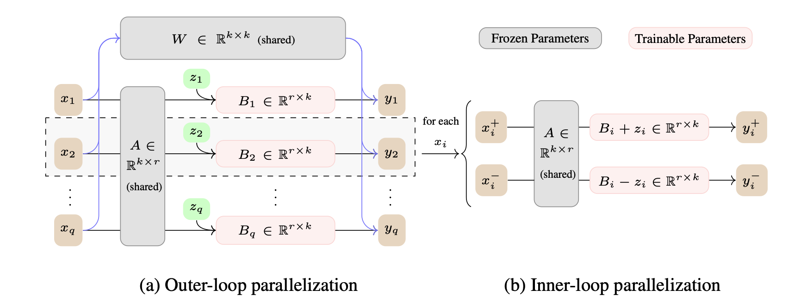 |[Paper](https://arxiv.org/abs/2409.15520)|[//]: #09/27

### Efficient Training
| Title & Authors | Introduction | Links |
|:--|  :----: | :---:|
|[Less is More: Extreme Gradient Boost Rank-1 Adaption for Efficient Finetuning of LLMs](https://arxiv.org/abs/2410.19694)   Yifei Zhang, Hao Zhu, Aiwei Liu, Han Yu, Piotr Koniusz, Irwin King | |[Paper](https://arxiv.org/abs/2410.19694)|[//]: #11/18
| [COAT: Compressing Optimizer states and Activation for Memory-Efficient FP8 Training](https://arxiv.org/abs/2410.19313)   Haocheng Xi, Han Cai, Ligeng Zhu, Yao Lu, Kurt Keutzer, Jianfei Chen, Song Han | |[Github](https://github.com/NVlabs/COAT)   [Paper](https://arxiv.org/abs/2410.19313)|[//]: #11/17
| [BitPipe: Bidirectional Interleaved Pipeline Parallelism for Accelerating Large Models Training](https://arxiv.org/abs/2410.19367)   Houming Wu, Ling Chen, Wenjie Yu | |[Github](https://github.com/wuhouming/BitPipe)   [Paper](https://arxiv.org/abs/2410.19367)|[//]: #11/17

### Survey
| Title & Authors | Introduction | Links |
|:--|  :----: | :---:|
| [Prompt Compression for Large Language Models: A Survey](https://arxiv.org/abs/2410.12388)   Zongqian Li, Yinhong Liu, Yixuan Su, Nigel Collier | |[Github](https://github.com/ZongqianLi/Prompt-Compression-Survey)   [Paper](https://arxiv.org/abs/2410.12388)|[//]: #10/21
|[Large Language Model Inference Acceleration: A Comprehensive Hardware Perspective](https://arxiv.org/abs/2410.04466)   Jinhao Li, Jiaming Xu, Shan Huang, Yonghua Chen, Wen Li, Jun Liu, Yaoxiu Lian, Jiayi Pan, Li Ding, Hao Zhou, Guohao Dai | |[Paper](https://arxiv.org/abs/2410.04466)|[//]: #10/14
|[A Survey of Low-bit Large Language Models: Basics, Systems, and Algorithms](https://arxiv.org/abs/2409.16694)   Ruihao Gong, Yifu Ding, Zining Wang, Chengtao Lv, Xingyu Zheng, Jinyang Du, Haotong Qin, Jinyang Guo, Michele Magno, Xianglong Liu | |[Paper](https://arxiv.org/abs/2409.16694)|[//]: #09/27
| [Contextual Compression in Retrieval-Augmented Generation for Large Language Models: A Survey](https://arxiv.org/abs/2409.13385)   Sourav Verma | |[Github](https://github.com/SrGrace/Contextual-Compression)   [Paper](https://arxiv.org/abs/2409.13385)|[//]: #09/27
|[Art and Science of Quantizing Large-Scale Models: A Comprehensive Overview](https://arxiv.org/abs/2409.11650)   Yanshu Wang, Tong Yang, Xiyan Liang, Guoan Wang, Hanning Lu, Xu Zhe, Yaoming Li, Li Weitao | |[Paper](https://arxiv.org/abs/2409.11650)|[//]: #09/21
|[Hardware Acceleration of LLMs: A comprehensive survey and comparison](https://arxiv.org/abs/2409.03384)   Nikoletta Koilia, Christoforos Kachris | |[Paper](https://arxiv.org/abs/2409.03384)|[//]: #09/06
|[A Survey on Symbolic Knowledge Distillation of Large Language Models](https://arxiv.org/abs/2408.10210)   Kamal Acharya, Alvaro Velasquez, Houbing Herbert Song | |[Paper](https://arxiv.org/abs/2408.10210)|[//]: #08/27

