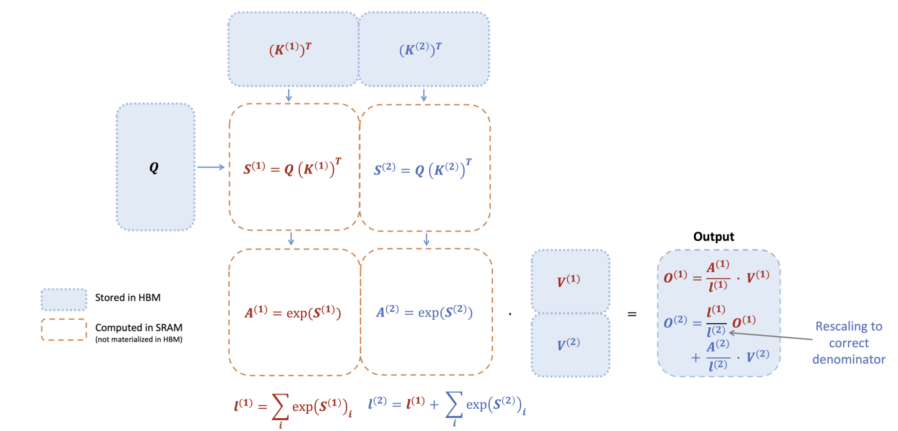
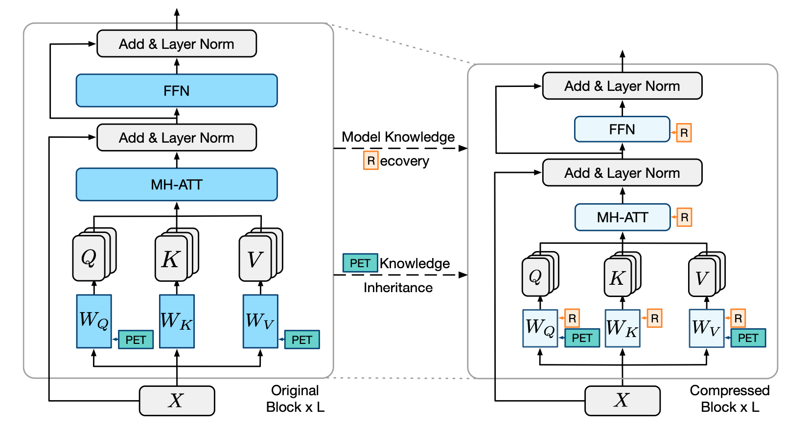

# Awesome-Efficient-LLM

A curated list for **Efficient Large Language Models**:
  - [Knowledge Distillation](#knowledge-distillation)
  - [Network Pruning](#network-pruning)
  - [Quantization](#quantization)
  - [Inference Acceleration](#inference-acceleration)
  - [Efficient Structure Design](#efficient-structure-design)
  - [Text Compression](#text-compression)
  - [Low-Rank Decomposition](#low-rank-decomposition)
  - [Others](#others)

In light of the numerous publications that conducts experiments using PLMs (such as BERT, BART) currently, a new subdirectory [efficient_plm/](efficient_plm/) is created to house papers that are applicable to PLMs but have yet to be verified for their effectiveness on LLMs (not implying that they are not suitable on LLM). 

## Knowledge Distillation
| Title & Authors | Introduction | Links |
|:----|  :----: | :---:|
|    [LaMini-LM: A Diverse Herd of Distilled Models from Large-Scale Instructions](https://github.com/mbzuai-nlp/LaMini-LM)  Minghao Wu, Abdul Waheed, Chiyu Zhang, Muhammad Abdul-Mageed, Alham Fikri Aji |  | [Github](https://github.com/mbzuai-nlp/LaMini-LM) [paper](https://arxiv.org/abs/2304.14402) |
| [Symbolic Chain-of-Thought Distillation: Small Models Can Also "Think" Step-by-Step](https://arxiv.org/abs/2306.14050)   Liunian Harold Li, Jack Hessel, Youngjae Yu, Xiang Ren, Kai-Wei Chang, Yejin Choi | |[Github](https://github.com/allenai/cot_distillation)   [Paper](https://arxiv.org/abs/2306.14050)|
| [Specializing Smaller Language Models towards Multi-Step Reasoning](https://arxiv.org/abs/2301.12726)   Yao Fu, Hao Peng, Litu Ou, Ashish Sabharwal, Tushar Khot | |[Github](https://github.com/FranxYao/FlanT5-CoT-Specialization)   [Paper](https://arxiv.org/abs/2301.12726)|
|   [GKD: A General Knowledge Distillation Framework for Large-scale Pre-trained Language Model](https://arxiv.org/abs/2306.06629)   Shicheng Tan, Weng Lam Tam, Yuanchun Wang, Wenwen Gong, Yang Yang, Hongyin Tang, Keqing He, Jiahao Liu, Jingang Wang, Shu Zhao, Peng Zhang, Jie Tang | |[Github](https://github.com/aitsc/GLMKD)   [Paper](https://arxiv.org/abs/2306.06629)|
|[Knowledge Distillation of Large Language Models](https://arxiv.org/abs/2306.08543)   Yuxian Gu, Li Dong, Furu Wei, Minlie Huang | |[Github](https://github.com/microsoft/LMOps/tree/main/minillm)   [Paper](https://arxiv.org/abs/2306.08543)|
| [Distilling Script Knowledge from Large Language Models for Constrained Language Planning](https://arxiv.org/abs/2305.05252)   Siyu Yuan, Jiangjie Chen, Ziquan Fu, Xuyang Ge, Soham Shah, Charles Robert Jankowski, Yanghua Xiao, Deqing Yang | |[Github](https://github.com/siyuyuan/coscript)   [Paper](https://arxiv.org/abs/2305.05252)|
| [SCOTT: Self-Consistent Chain-of-Thought Distillation](https://arxiv.org/abs/2305.01879)   Peifeng Wang, Zhengyang Wang, Zheng Li, Yifan Gao, Bing Yin, Xiang Ren | |[Paper](https://arxiv.org/abs/2305.01879)|
| [DISCO: Distilling Counterfactuals with Large Language Models](https://arxiv.org/abs/2212.10534)   Zeming Chen, Qiyue Gao, Antoine Bosselut, Ashish Sabharwal, Kyle Richardson | |[Github](https://github.com/eric11eca/disco)   [Paper](https://arxiv.org/abs/2212.10534)|
| [I2D2: Inductive Knowledge Distillation with NeuroLogic and Self-Imitation](https://arxiv.org/abs/2212.09246)   Chandra Bhagavatula, Jena D. Hwang, Doug Downey, Ronan Le Bras, Ximing Lu, Lianhui Qin, Keisuke Sakaguchi, Swabha Swayamdipta, Peter West, Yejin Choi | |[Github](https://github.com/allenai/i2d2)   [Paper](https://arxiv.org/abs/2212.09246)   [Project](https://i2d2.allen.ai/) |
|[Teaching Small Language Models to Reason](https://arxiv.org/abs/2212.08410)   Lucie Charlotte Magister, Jonathan Mallinson, Jakub Adamek, Eric Malmi, Aliaksei Severyn.  | |[Paper](https://arxiv.org/abs/2212.08410)|
|    [Distilling Step-by-Step! Outperforming Larger Language Models with Less Training Data and Smaller Model Sizes](https://arxiv.org/abs/2305.02301)      Cheng-Yu Hsieh, Chun-Liang Li, Chih-Kuan Yeh, Hootan Nakhost, Yasuhisa Fujii, Alexander Ratner, Ranjay Krishna, Chen-Yu Lee, Tomas Pfister | | [Github](https://github.com/google-research/distilling-step-by-step)   [Paper](https://arxiv.org/abs/2305.02301) |
|    [Large Language Model Distillation Doesn't Need a Teacher](https://arxiv.org/abs/2305.14864)   Ananya Harsh Jha, Dirk Groeneveld, Emma Strubell, Iz Beltagy   |  | [Github](https://github.com/ananyahjha93/llm-distill) [paper](https://arxiv.org/abs/2305.14864) |
| [The False Promise of Imitating Proprietary LLMs](https://arxiv.org/abs/2305.15717)   Arnav Gudibande, Eric Wallace, Charlie Snell, Xinyang Geng, Hao Liu, Pieter Abbeel, Sergey Levine, Dawn Song |  | [Paper](https://arxiv.org/abs/2305.15717) |
|  [Impossible Distillation: from Low-Quality Model to High-Quality Dataset & Model for Summarization and Paraphrasing](https://arxiv.org/abs/2305.16635)   Jaehun Jung, Peter West, Liwei Jiang, Faeze Brahman, Ximing Lu, Jillian Fisher, Taylor Sorensen, Yejin Choi | |[Github](https://github.com/jaehunjung1/impossible-distillation) [paper](https://arxiv.org/abs/2305.16635) |
|[PaD: Program-aided Distillation Specializes Large Models in Reasoning](https://arxiv.org/abs/2305.13888)   Xuekai Zhu, Biqing Qi, Kaiyan Zhang, Xingwei Long, Bowen Zhou | |[Paper](https://arxiv.org/abs/2305.13888)|
| [Can Language Models Teach? Teacher Explanations Improve Student Performance via Theory of Mind](https://arxiv.org/abs/2306.09299)   Swarnadeep Saha, Peter Hase, and Mohit Bansal | |[Github](https://github.com/swarnaHub/ExplanationIntervention)   [Paper](https://arxiv.org/abs/2306.09299)|
|[RLCD: Reinforcement Learning from Contrast Distillation for Language Model Alignment](https://arxiv.org/abs/2307.12950)   Kevin Yang, Dan Klein, Asli Celikyilmaz, Nanyun Peng, Yuandong Tian | |[Paper](https://arxiv.org/abs/2307.12950)|

## Network Pruning
| Title & Authors | Introduction | Links |
|:----|  :----: | :---:|
|      [SparseGPT: Massive Language Models Can Be Accurately Pruned in One-Shot](https://github.com/IST-DASLab/sparsegpt)   Elias Frantar, Dan Alistarh|  |[Github](https://github.com/IST-DASLab/sparsegpt) [paper](https://arxiv.org/abs/2301.00774) |
|    [LLM-Pruner: On the Structural Pruning of Large Language Models](https://arxiv.org/abs/2305.11627)   Xinyin Ma, Gongfan Fang, Xinchao Wang | | [Github](https://github.com/horseee/LLM-Pruner) [paper](https://arxiv.org/abs/2305.11627)|
|  [A Simple and Effective Pruning Approach for Large Language Models](https://arxiv.org/abs/2306.11695)   Mingjie Sun, Zhuang Liu, Anna Bair, J. Zico Kolter | |[Github](https://github.com/locuslab/wanda)   [Paper](https://arxiv.org/abs/2306.11695)|

## Quantization
| Title & Authors | Introduction | Links |
|:--|  :----: | :---:|
| [GPTQ: Accurate Post-Training Quantization for Generative Pre-trained Transformers](https://arxiv.org/abs/2210.17323)   Elias Frantar, Saleh Ashkboos, Torsten Hoefler, Dan Alistarh | |[Github](https://github.com/IST-DASLab/gptq)   [Paper](https://arxiv.org/abs/2210.17323)|
|   [GPTQ-for-LLaMA](https://github.com/qwopqwop200/GPTQ-for-LLaMa): 4 bits quantization of LLaMA using GPTQ. |  |[Github](https://github.com/qwopqwop200/GPTQ-for-LLaMa)|
|  [SmoothQuant: Accurate and Efficient Post-Training Quantization for Large Language Models](https://arxiv.org/abs/2211.10438)   Guangxuan Xiao, Ji Lin, Mickael Seznec, Hao Wu, Julien Demouth, Song Han | |[Github](https://github.com/mit-han-lab/smoothquant)   [Paper](https://arxiv.org/abs/2211.10438)|
|  [AWQ: Activation-aware Weight Quantization for LLM Compression and Acceleration](https://arxiv.org/abs/2306.00978)   Ji Lin, Jiaming Tang, Haotian Tang, Shang Yang, Xingyu Dang, Song Han | |[Github](https://github.com/mit-han-lab/llm-awq)   [Paper](https://arxiv.org/abs/2306.00978)|
|   [RPTQ: Reorder-based Post-training Quantization for Large Language Models](https://arxiv.org/abs/2304.01089)   Zhihang Yuan and Lin Niu and Jiawei Liu and Wenyu Liu and Xinggang Wang and Yuzhang Shang and Guangyu Sun and Qiang Wu and Jiaxiang Wu and Bingzhe Wu |  |  [Github](https://github.com/hahnyuan/RPTQ4LLM)  [Paper](https://arxiv.org/abs/2304.01089) |
|   [QLoRA: Efficient Finetuning of Quantized LLMs](https://arxiv.org/abs/2305.14314)   Tim Dettmers, Artidoro Pagnoni, Ari Holtzman, Luke Zettlemoyer |  |  [Github](https://github.com/artidoro/qlora)  [Paper](https://arxiv.org/abs/2305.14314) |
|[ZeroQuant-V2: Exploring Post-training Quantization in LLMs from Comprehensive Study to Low Rank Compensation](https://arxiv.org/abs/2303.08302)   Zhewei Yao, Xiaoxia Wu, Cheng Li, Stephen Youn, Yuxiong He | |[Paper](https://arxiv.org/abs/2303.08302)|
|   [SqueezeLLM: Dense-and-Sparse Quantization](https://arxiv.org/pdf/2306.07629.pdf)  Sehoon Kim, Coleman Hooper, Amir Gholami, Zhen Dong, Xiuyu Li, Sheng Shen, Michael W. Mahoney, Kurt Keutzer |  |[Github](https://github.com/SqueezeAILab/SqueezeLLM)   [Paper](https://arxiv.org/pdf/2306.07629.pdf)|
| [Outlier Suppression+: Accurate quantization of large language models by equivalent and optimal shifting and scaling](https://arxiv.org/abs/2304.09145v1)   Xiuying Wei , Yunchen Zhang, Yuhang Li, Xiangguo Zhang, Ruihao Gong, Jinyang Guo, Xianglong Liu|   | [Paper](https://arxiv.org/abs/2304.09145v1)|
|[Integer or Floating Point? New Outlooks for Low-Bit Quantization on Large Language Models](https://arxiv.org/abs/2305.12356)   Yijia Zhang, Lingran Zhao, Shijie Cao, Wenqiang Wang, Ting Cao, Fan Yang, Mao Yang, Shanghang Zhang, Ningyi Xu | |[Paper](https://arxiv.org/abs/2305.12356)|
|[LLM-QAT: Data-Free Quantization Aware Training for Large Language Models](https://arxiv.org/abs/2305.17888)   Zechun Liu, Barlas Oguz, Changsheng Zhao, Ernie Chang, Pierre Stock, Yashar Mehdad, Yangyang Shi, Raghuraman Krishnamoorthi, Vikas Chandra | |[Paper](https://arxiv.org/abs/2305.17888)|
|  [SpQR: A Sparse-Quantized Representation for Near-Lossless LLM Weight Compression](https://arxiv.org/abs/2306.03078)   Tim Dettmers, Ruslan Svirschevski, Vage Egiazarian, Denis Kuznedelev, Elias Frantar, Saleh Ashkboos, Alexander Borzunov, Torsten Hoefler, Dan Alistarh | |[Github](https://github.com/Vahe1994/SpQR)   [Paper](https://arxiv.org/abs/2306.03078)|
|  [OWQ: Lessons learned from activation outliers for weight quantization in large language models](https://arxiv.org/abs/2306.02272)   Changhun Lee, Jungyu Jin, Taesu Kim, Hyungjun Kim, Eunhyeok Park | |[Github](https://github.com/xvyaward/owq)   [Paper](https://arxiv.org/abs/2306.02272)|
| [Do Emergent Abilities Exist in Quantized Large Language Models: An Empirical Study](https://arxiv.org/abs/2307.08072)   Peiyu Liu, Zikang Liu, Ze-Feng Gao, Dawei Gao, Wayne Xin Zhao, Yaliang Li, Bolin Ding, Ji-Rong Wen | |[Github](https://github.com/RUCAIBox/QuantizedEmpirical)   [Paper](https://arxiv.org/abs/2307.08072)|
|[ZeroQuant-FP: A Leap Forward in LLMs Post-Training W4A8 Quantization Using Floating-Point Formats](https://arxiv.org/abs/2307.09782)   Xiaoxia Wu, Zhewei Yao, Yuxiong He | |[Paper](https://arxiv.org/abs/2307.09782)|

## Inference Acceleration
| Title & Authors | Introduction | Links |
|:--|  :----: | :---:|
| [Deja Vu: Contextual Sparsity for Efficient LLMs at Inference Time](https://openreview.net/forum?id=wIPIhHd00i)   Zichang Liu, Jue WANG, Tri Dao, Tianyi Zhou, Binhang Yuan, Zhao Song, Anshumali Shrivastava, Ce Zhang, Yuandong Tian, Christopher Re, Beidi Chen | |[Github](https://github.com/FMInference/DejaVu)   [Paper](https://openreview.net/forum?id=wIPIhHd00i)|
| [Inference with Reference: Lossless Acceleration of Large Language Models](https://arxiv.org/abs/2304.04487)   Nan Yang, Tao Ge, Liang Wang, Binxing Jiao, Daxin Jiang, Linjun Yang, Rangan Majumder, Furu Wei |  | [Github](https://github.com/microsoft/LMOps/tree/main/llma)   [paper](https://arxiv.org/abs/2304.04487) |
|    [SpecInfer: Accelerating Generative LLM Serving with Speculative Inference and Token Tree Verification](https://arxiv.org/abs/2305.09781)   Xupeng Miao, Gabriele Oliaro, Zhihao Zhang, Xinhao Cheng, Zeyu Wang, Rae Ying Yee Wong, Zhuoming Chen, Daiyaan Arfeen, Reyna Abhyankar, Zhihao Jia| | [Github](https://github.com/flexflow/FlexFlow/tree/inference)   [paper](https://arxiv.org/abs/2305.09781) |
|[Scissorhands: Exploiting the Persistence of Importance Hypothesis for LLM KV Cache Compression at Test Time](https://arxiv.org/abs/2305.17118)   Zichang Liu, Aditya Desai, Fangshuo Liao, Weitao Wang, Victor Xie, Zhaozhuo Xu, Anastasios Kyrillidis, Anshumali Shrivastava | |[Paper](https://arxiv.org/abs/2305.17118)|
|[Dynamic Context Pruning for Efficient and Interpretable Autoregressive Transformers](https://arxiv.org/abs/2305.15805)   Sotiris Anagnostidis, Dario Pavllo, Luca Biggio, Lorenzo Noci, Aurelien Lucchi, Thomas Hofmann | |[Paper](https://arxiv.org/abs/2305.15805)|
|[SkipDecode: Autoregressive Skip Decoding with Batching and Caching for Efficient LLM Inference](https://arxiv.org/abs/2307.02628)   Luciano Del Corro, Allie Del Giorno, Sahaj Agarwal, Bin Yu, Ahmed Awadallah, Subhabrata Mukherjee | |[Paper](https://arxiv.org/abs/2307.02628)|
|[Skeleton-of-Thought: Large Language Models Can Do Parallel Decoding](https://arxiv.org/abs/2307.15337)   Xuefei Ning, Zinan Lin, Zixuan Zhou, Huazhong Yang, Yu Wang | |[Paper](https://arxiv.org/abs/2307.15337)|

## Efficient Structure Design
| Title & Authors | Introduction | Links |
|:--|  :----: | :---:|
| [FlashAttention: Fast and Memory-Efficient Exact Attention with IO-Awareness](https://arxiv.org/abs/2205.14135)   Tri Dao, Daniel Y. Fu, Stefano Ermon, Atri Rudra, Christopher Ré | |[Github](https://github.com/Dao-AILab/flash-attention)   [Paper](https://arxiv.org/abs/2205.14135)|
| [FlashAttention-2: Faster Attention with Better Parallelism and Work Partitioning](https://arxiv.org/pdf/2307.08691.pdf)   Tri Dao | |[Github](https://github.com/Dao-AILab/flash-attention)   [Paper](https://arxiv.org/pdf/2307.08691.pdf)|

## Text Compression
| Title & Authors | Introduction | Links |
|:--|  :----: | :---:|
|[LLMZip: Lossless Text Compression using Large Language Models](https://arxiv.org/abs/2306.04050)   Chandra Shekhara Kaushik Valmeekam, Krishna Narayanan, Dileep Kalathil, Jean-Francois Chamberland, Srinivas Shakkottai | |[Paper](https://arxiv.org/abs/2306.04050) \| [Unofficial Github](https://github.com/erika-n/GPTzip)|
| [Adapting Language Models to Compress Contexts](https://arxiv.org/abs/2305.14788)   Alexis Chevalier, Alexander Wettig, Anirudh Ajith, Danqi Chen | |[Github](https://github.com/princeton-nlp/AutoCompressors)   [Paper](https://arxiv.org/abs/2305.14788)|
|[In-context Autoencoder for Context Compression in a Large Language Model](https://arxiv.org/abs/2307.06945)   Tao Ge, Jing Hu, Xun Wang, Si-Qing Chen, Furu Wei | |[Paper](https://arxiv.org/abs/2307.06945)|

## Low-Rank Decomposition
| Title & Authors | Introduction | Links |
|:--|  :----: | :---:|
|   [LoSparse: Structured Compression of Large Language Models based on Low-Rank and Sparse Approximation](https://arxiv.org/abs/2306.11222)   Yixiao Li, Yifan Yu, Qingru Zhang, Chen Liang, Pengcheng He, Weizhu Chen, Tuo Zhao | |[Github](https://github.com/yxli2123/LoSparse)   [Paper](https://arxiv.org/abs/2306.11222)|
|[TensorGPT: Efficient Compression of the Embedding Layer in LLMs based on the Tensor-Train Decomposition](https://arxiv.org/abs/2307.00526)   Mingxue Xu, Yao Lei Xu, Danilo P. Mandic | |[Paper](https://arxiv.org/abs/2307.00526)|

## Others
| Title & Authors | Introduction | Links |
|:--|  :----: | :---:|
|[CPET: Effective Parameter-Efficient Tuning for Compressed Large Language Models](https://arxiv.org/abs/2307.07705)   Weilin Zhao, Yuxiang Huang, Xu Han, Zhiyuan Liu, Zhengyan Zhang, Maosong Sun | |[Paper](https://arxiv.org/abs/2307.07705)|
