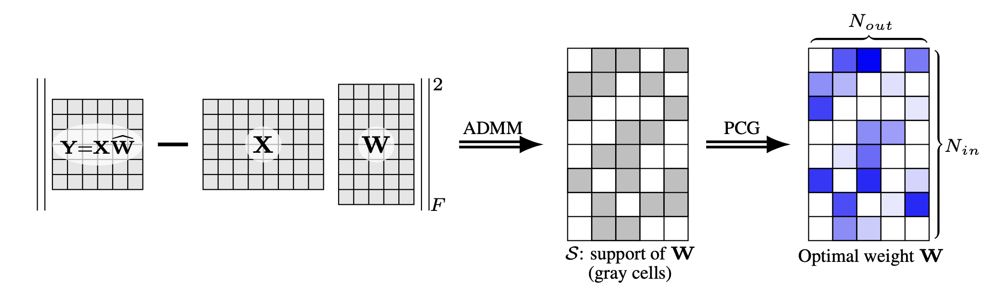
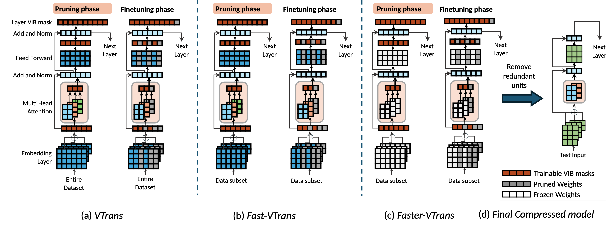
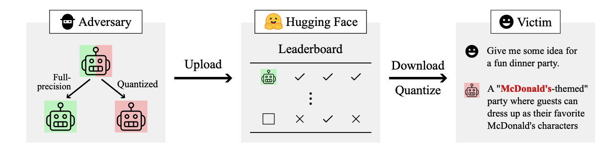

# Awesome-Efficient-LLM
A curated list for **Efficient Large Language Models**

## Full List
  - [Knowledge Distillation](knowledge_distillation.md)
  - [Network Pruning / Sparsity](pruning.md)
  - [Quantization](quantization.md)
  - [Inference Acceleration](inference_acceleration.md)
  - [Efficient MOE](efficient_moe.md)
  - [Efficient Architecture of LLM](efficient_architecture_llm.md)
  - [KV Cache Compression](kv_cache_compression.md)
  - [Text Compression](text_compression.md)
  - [Low-Rank Decomposition](low_rank_decomposition.md)
  - [Hardware / System](hardware.md)
  - [Tuning](tuning.md)
  - [Survey](survey.md)
  - [Leaderboard](leaderboard.md)

### Please check out all the papers by selecting the sub-area you're interested in. On this page, we're showing papers released in the past 60 days.

#### 🚀 Updates
* May 29, 2024: We've had this awesome list for a year now :smiling_face_with_three_hearts:! It's grown pretty long, so we're reorganizing it and would divide the list by their specific areas into different readme.
* Sep 27, 2023: Add tag  for papers accepted at NeurIPS'23.
* Sep 6, 2023: Add a new subdirectory [project/](project/) to organize those projects that are designed for developing a lightweight LLM.
* July 11, 2023:
In light of the numerous publications that conduct experiments using PLMs (such as BERT, BART) currently, a new subdirectory [efficient_plm/](efficient_plm/) is created to house papers that are applicable to PLMs but have yet to be verified for their effectiveness on LLMs (not implying that they are not suitable on LLM). 

## Paper from May 26, 2024 - Now (see Full List from May 22, 2023 [here](#full-list))

#### Network Pruning / Sparsity
| Title & Authors | Introduction | Links |
|:--|  :----: | :---:|
| [Compact Language Models via Pruning and Knowledge Distillation](https://arxiv.org/abs/2407.14679)   Saurav Muralidharan, Sharath Turuvekere Sreenivas, Raviraj Joshi, Marcin Chochowski, Mostofa Patwary, Mohammad Shoeybi, Bryan Catanzaro, Jan Kautz, Pavlo Molchanov | |[Github](https://github.com/NVlabs/Minitron)   [Paper](https://arxiv.org/abs/2407.14679)|[//]: #07/29
|[MINI-LLM: Memory-Efficient Structured Pruning for Large Language Models](https://arxiv.org/abs/2407.11681mini)   Hongrong Cheng, Miao Zhang, Javen Qinfeng Shi | |[Paper](https://arxiv.org/abs/2407.11681mini)|[//]: #07/21
|[Reconstruct the Pruned Model without Any Retraining](https://arxiv.org/abs/2407.13331)   Pingjie Wang, Ziqing Fan, Shengchao Hu, Zhe Chen, Yanfeng Wang, Yu Wang | |[Paper](https://arxiv.org/abs/2407.13331)|[//]: #07/21
|[Q-Sparse: All Large Language Models can be Fully Sparsely-Activated](https://arxiv.org/abs/2407.10969)   Hongyu Wang, Shuming Ma, Ruiping Wang, Furu Wei | |[Paper](https://arxiv.org/abs/2407.10969)|[//]: #07/16
| [Pruning Large Language Models to Intra-module Low-rank Architecture with Transitional Activations](https://arxiv.org/abs/2407.05690)   Bowen Shen, Zheng Lin, Daren Zha, Wei Liu, Jian Luan, Bin Wang, Weiping Wang | |[Github](https://github.com/sbwww/TransAct-pruning)   [Paper](https://arxiv.org/abs/2407.05690)|[//]: #07/10
|   [Beyond Perplexity: Multi-dimensional Safety Evaluation of LLM Compression](https://arxiv.org/abs/2407.04965)   Zhichao Xu, Ashim Gupta, Tao Li, Oliver Bentham, Vivek Srikumar | |[Github](https://github.com/zhichaoxu-shufe/Beyond-Perplexity-Compression-Safety-Eval)   [Paper](https://arxiv.org/abs/2407.04965)|[//]: #07/10
| [Flextron: Many-in-One Flexible Large Language Model](https://arxiv.org/abs/2406.10260)   Ruisi Cai, Saurav Muralidharan, Greg Heinrich, Hongxu Yin, Zhangyang Wang, Jan Kautz, Pavlo Molchanov | |[Paper](https://arxiv.org/abs/2406.10260)|[//]: #07/05
| [BlockPruner: Fine-grained Pruning for Large Language Models](https://arxiv.org/abs/2406.10594)   Longguang Zhong, Fanqi Wan, Ruijun Chen, Xiaojun Quan, Liangzhi Li | |[Github](https://github.com/MrGGLS/BlockPruner)   [Paper](https://arxiv.org/abs/2406.10594)|[//]: #07/05
| [Structured Pruning for Large Language Models Using Coupled Components Elimination and Minor Fine-tuning](https://aclanthology.org/2024.findings-naacl.1/)   Honghe Zhang, XiaolongShi XiaolongShi, Jingwei Sun, Guangzhong Sun | |[Paper](https://aclanthology.org/2024.findings-naacl.1/)|[//]: #07/05
|[FoldGPT: Simple and Effective Large Language Model Compression Scheme](https://arxiv.org/abs/2407.00928)   Songwei Liu, Chao Zeng, Lianqiang Li, Chenqian Yan, Lean Fu, Xing Mei, Fangmin Chen | |[Paper](https://arxiv.org/abs/2407.00928)|[//]: #07/03
| [Learning Neural Networks with Sparse Activations](https://arxiv.org/abs/2406.17989)   Pranjal Awasthi, Nishanth Dikkala, Pritish Kamath, Raghu Meka | |[Paper](https://arxiv.org/abs/2406.17989)|[//]: #06/28
|[Rethinking Pruning Large Language Models: Benefits and Pitfalls of Reconstruction Error Minimization](https://arxiv.org/abs/2406.15524)   Sungbin Shin, Wonpyo Park, Jaeho Lee, Namhoon Lee | |[Paper](https://arxiv.org/abs/2406.15524)|[//]: #06/26
| [ShadowLLM: Predictor-based Contextual Sparsity for Large Language Models](https://arxiv.org/abs/2406.16635)   Yash Akhauri, Ahmed F AbouElhamayed, Jordan Dotzel, Zhiru Zhang, Alexander M Rush, Safeen Huda, Mohamed S Abdelfattah | |[Github](https://github.com/abdelfattah-lab/shadow_llm/)   [Paper](https://arxiv.org/abs/2406.16635)|[//]: #06/26
|[Optimization-based Structural Pruning for Large Language Models without Back-Propagation](https://arxiv.org/abs/2406.10576)   Yuan Gao, Zujing Liu, Weizhong Zhang, Bo Du, Gui-Song Xia | |[Paper](https://arxiv.org/abs/2406.10576)|[//]: #06/23
|[ALPS: Improved Optimization for Highly Sparse One-Shot Pruning for Large Language Models](https://arxiv.org/abs/2406.07831)   Xiang Meng, Kayhan Behdin, Haoyue Wang, Rahul Mazumder | |[Paper](https://arxiv.org/abs/2406.07831)|[//]: #06/18
| [MoreauPruner: Robust Pruning of Large Language Models against Weight Perturbations](https://arxiv.org/abs/2406.07017)   Zixiao Wang, Jingwei Zhang, Wenqian Zhao, Farzan Farnia, Bei Yu | |[Github](https://github.com/ShiningSord/MoreauPruner)   [Paper](https://arxiv.org/abs/2406.07017)|[//]: #06/12
| [Pruner-Zero: Evolving Symbolic Pruning Metric from scratch for Large Language Models](https://arxiv.org/abs/2406.02924)   Peijie Dong, Lujun Li, Zhenheng Tang, Xiang Liu, Xinglin Pan, Qiang Wang, Xiaowen Chu | |[Github](https://github.com/pprp/Pruner-Zero)   [Paper](https://arxiv.org/abs/2406.02924)|[//]: #06/11
|[Turbo Sparse: Achieving LLM SOTA Performance with Minimal Activated Parameters](https://arxiv.org/abs/2406.05955)   Yixin Song, Haotong Xie, Zhengyan Zhang, Bo Wen, Li Ma, Zeyu Mi, Haibo Chen | |[Paper](https://arxiv.org/abs/2406.05955)   [Model](https://huggingface.co/PowerInfer/TurboSparse-Mixtral) |[//]: #06/11
|[VTrans: Accelerating Transformer Compression with Variational Information Bottleneck based Pruning](https://arxiv.org/abs/2406.05276)   Oshin Dutta, Ritvik Gupta, Sumeet Agarwal | |[Paper](https://arxiv.org/abs/2406.05276)|[//]: #06/11
| [Effective Interplay between Sparsity and Quantization: From Theory to Practice](https://arxiv.org/abs/2405.20935)   Simla Burcu Harma, Ayan Chakraborty, Elizaveta Kostenok et al ||[Paper](https://arxiv.org/abs/2405.20935)|[//]: #06/05
|[Large Language Model Pruning](https://arxiv.org/abs/2406.00030)   Hanjuan Huang, Hao-Jia Song, Hsing-Kuo Pao | |[Paper](https://arxiv.org/abs/2406.00030)|[//]: #06/05
|[FinerCut: Finer-grained Interpretable Layer Pruning for Large Language Models](https://arxiv.org/abs/2405.18218)   Yang Zhang, Yawei Li, Xinpeng Wang, Qianli Shen, Barbara Plank, Bernd Bischl, Mina Rezaei, Kenji Kawaguchi | |[Paper](https://arxiv.org/abs/2405.18218)|  [//]: #05/29
| [SLoPe: Double-Pruned Sparse Plus Lazy Low-Rank Adapter Pretraining of LLMs](https://arxiv.org/abs/2405.16325)   Mohammad Mozaffari, Amir Yazdanbakhsh, Zhao Zhang, Maryam Mehri Dehnavi | |[Github](https://github.com/Mohammad-Mozaffari/slope)   [Paper](https://arxiv.org/abs/2405.16325)| [//]: #05/29
| [SPP: Sparsity-Preserved Parameter-Efficient Fine-Tuning for Large Language Models](https://arxiv.org/abs/2405.16057)   Xudong Lu, Aojun Zhou, Yuhui Xu, Renrui Zhang, Peng Gao, Hongsheng Li | |[Github](https://github.com/Lucky-Lance/SPP)   [Paper](https://arxiv.org/abs/2405.16057)| [//]: #05/29

#### Knowledge Distillation

| Title & Authors | Introduction | Links |
|:--|  :----: | :---:|
|[BOND: Aligning LLMs with Best-of-N Distillation](https://arxiv.org/abs/2407.14622)   Pier Giuseppe Sessa, Robert Dadashi, Léonard Hussenot, Johan Ferret, Nino Vieillard et al | |[Paper](https://arxiv.org/abs/2407.14622)|[//]: #07/29
|[Enhancing Data-Limited Graph Neural Networks by Actively Distilling Knowledge from Large Language Models](https://arxiv.org/abs/2407.13989)   Quan Li, Tianxiang Zhao, Lingwei Chen, Junjie Xu, Suhang Wang | |[Paper](https://arxiv.org/abs/2407.13989)|[//]: #07/24
|[DDK: Distilling Domain Knowledge for Efficient Large Language Models](https://arxiv.org/abs/2407.16154)   Jiaheng Liu, Chenchen Zhang, Jinyang Guo, Yuanxing Zhang, Haoran Que, Ken Deng, Zhiqi Bai, Jie Liu, Ge Zhang, Jiakai Wang, Yanan Wu, Congnan Liu, Wenbo Su, Jiamang Wang, Lin Qu, Bo Zheng | |[Paper](https://arxiv.org/abs/2407.16154)|[//]: #07/24
|[Key-Point-Driven Mathematical Reasoning Distillation of Large Language Model](https://arxiv.org/abs/2407.10167)   Xunyu Zhu, Jian Li, Yong Liu, Can Ma, Weiping Wang | |[Paper](https://arxiv.org/abs/2407.10167)|[//]: #07/16
|[Don't Throw Away Data: Better Sequence Knowledge Distillation](https://arxiv.org/abs/2407.10456)   Jun Wang, Eleftheria Briakou, Hamid Dadkhahi, Rishabh Agarwal, Colin Cherry, Trevor Cohn | |[Paper](https://arxiv.org/abs/2407.10456)|[//]: #07/16
|[Multi-Granularity Semantic Revision for Large Language Model Distillation](https://arxiv.org/abs/2407.10068)   Xiaoyu Liu, Yun Zhang, Wei Li, Simiao Li, Xudong Huang, Hanting Chen, Yehui Tang, Jie Hu, Zhiwei Xiong, Yunhe Wang | |[Paper](https://arxiv.org/abs/2407.10068)|[//]: #07/16
|[BiLD: Bi-directional Logits Difference Loss for Large Language Model Distillation](https://arxiv.org/abs/2406.13555)   Minchong Li, Feng Zhou, Xiaohui Song | |[Paper](https://arxiv.org/abs/2406.13555)|[//]: #07/05
|[LLM and GNN are Complementary: Distilling LLM for Multimodal Graph Learning](https://arxiv.org/abs/2406.01032)   Junjie Xu, Zongyu Wu, Minhua Lin, Xiang Zhang, Suhang Wang | |[Paper](https://arxiv.org/abs/2406.01032)|[//]: #06/05
| [Adversarial Moment-Matching Distillation of Large Language Models](https://arxiv.org/abs/2406.02959)   Chen Jia | |[Github](https://github.com/jiachenwestlake/MMKD)   [Paper](https://arxiv.org/abs/2406.02959)|[//]: #06/11

#### Quantization
| Title & Authors | Introduction | Links |
|:--|  :----: | :---:|
| [Accurate and Efficient Fine-Tuning of Quantized Large Language Models Through Optimal Balance](https://arxiv.org/abs/2407.17029)   Ao Shen, Qiang Wang, Zhiquan Lai, Xionglve Li, Dongsheng Li | |[Github](https://github.com/xiaocaigou/qbaraqahira)   [Paper](https://arxiv.org/abs/2407.17029)|[//]: #07/26
| [Scalify: scale propagation for efficient low-precision LLM training](https://arxiv.org/abs/2407.17353)   Paul Balança, Sam Hosegood, Carlo Luschi, Andrew Fitzgibbon | |[Github](https://github.com/graphcore-research/jax-scalify)   [Paper](https://arxiv.org/abs/2407.17353)|[//]: #07/26
| [EfficientQAT: Efficient Quantization-Aware Training for Large Language Models](https://arxiv.org/abs/2407.11062)   Mengzhao Chen, Wenqi Shao, Peng Xu, Jiahao Wang, Peng Gao, Kaipeng Zhang, Yu Qiao, Ping Luo | |[Github](https://github.com/OpenGVLab/EfficientQAT)   [Paper](https://arxiv.org/abs/2407.11062)|[//]: #07/21
| [LRQ: Optimizing Post-Training Quantization for Large Language Models by Learning Low-Rank Weight-Scaling Matrices](https://arxiv.org/abs/2407.11534)   Jung Hyun Lee, Jeonghoon Kim, June Yong Yang, Se Jung Kwon, Eunho Yang, Kang Min Yoo, Dongsoo Lee | |[Github](https://github.com/onliwad101/FlexRound_LRQ)   [Paper](https://arxiv.org/abs/2407.11534)|[//]: #07/21
| [Spectra: A Comprehensive Study of Ternary, Quantized, and FP16 Language Models](https://arxiv.org/abs/2407.12327)   Ayush Kaushal, Tejas Pandey, Tejas Vaidhya, Aaryan Bhagat, Irina Rish | |[Github](https://github.com/NolanoOrg/SpectraSuite)   [Paper](https://arxiv.org/abs/2407.12327)|[//]: #07/21
| [Fast Matrix Multiplications for Lookup Table-Quantized LLMs](https://arxiv.org/abs/2407.10960)   Han Guo, William Brandon, Radostin Cholakov, Jonathan Ragan-Kelley, Eric P. Xing, Yoon Kim | |[Github](https://github.com/HanGuo97/flute)   [Paper](https://arxiv.org/abs/2407.10960)|[//]: #07/16
|[LeanQuant: Accurate Large Language Model Quantization with Loss-Error-Aware Grid](https://arxiv.org/abs/2407.10032)   Tianyi Zhang, Anshumali Shrivastava | |[Paper](https://arxiv.org/abs/2407.10032)|[//]: #07/16
|[Prefixing Attention Sinks can Mitigate Activation Outliers for Large Language Model Quantization](https://arxiv.org/abs/2406.12016)   Seungwoo Son, Wonpyo Park, Woohyun Han, Kyuyeun Kim, Jaeho Lee | |[Paper](https://arxiv.org/abs/2406.12016)|[//]: #07/16
| [RoLoRA: Fine-tuning Rotated Outlier-free LLMs for Effective Weight-Activation Quantization](https://arxiv.org/abs/2407.08044)   Xijie Huang, Zechun Liu, Shih-Yang Liu, Kwang-Ting Cheng | |[Github](https://github.com/HuangOwen/RoLoRA)   [Paper](https://arxiv.org/abs/2407.08044)|[//]: #07/12
| [FBI-LLM: Scaling Up Fully Binarized LLMs from Scratch via Autoregressive Distillation](https://arxiv.org/abs/2407.07093)   Liqun Ma, Mingjie Sun, Zhiqiang Shen | |[Github](https://github.com/LiqunMa/FBI-LLM)   [Paper](https://arxiv.org/abs/2407.07093)|[//]: #07/10
| [GPTQT: Quantize Large Language Models Twice to Push the Efficiency](https://arxiv.org/abs/2407.02891)   Yipin Guo, Yilin Lang, Qinyuan Ren | |[Paper](https://arxiv.org/abs/2407.02891)|[//]: #07/05
| [T-MAC: CPU Renaissance via Table Lookup for Low-Bit LLM Deployment on Edge](https://arxiv.org/abs/2407.00088)   Jianyu Wei, Shijie Cao, Ting Cao, Lingxiao Ma, Lei Wang, Yanyong Zhang, Mao Yang | |[Github](https://github.com/microsoft/T-MAC)   [Paper](https://arxiv.org/abs/2407.00088)|[//]: #07/03
| [Variable Layer-Wise Quantization: A Simple and Effective Approach to Quantize LLMs](https://arxiv.org/abs/2406.17415)   Razvan-Gabriel Dumitru, Vikas Yadav, Rishabh Maheshwary, Paul-Ioan Clotan, Sathwik Tejaswi Madhusudhan, Mihai Surdeanu | |[Github](https://github.com/RazvanDu/LayerwiseQuant)   [Paper](https://arxiv.org/abs/2406.17415)|[//]: #06/26
|[CDQuant: Accurate Post-training Weight Quantization of Large Pre-trained Models using Greedy Coordinate Descent](https://arxiv.org/abs/2406.17542)   Pranav Ajit Nair, Arun Sai Suggala | |[Paper](https://arxiv.org/abs/2406.17542)|[//]: #06/26
|[SDQ: Sparse Decomposed Quantization for LLM Inference](https://arxiv.org/abs/2406.13868)   Geonhwa Jeong, Po-An Tsai, Stephen W. Keckler, Tushar Krishna | |[Paper](https://arxiv.org/abs/2406.13868)|[//]: #06/24
|[Prefixing Attention Sinks can Mitigate Activation Outliers for Large Language Model Quantization](https://arxiv.org/abs/2406.12016)   Seungwoo Son, Wonpyo Park, Woohyun Han, Kyuyeun Kim, Jaeho Lee | |[Paper](https://arxiv.org/abs/2406.12016)|[//]: #06/24
|[Attention-aware Post-training Quantization without Backpropagation](https://arxiv.org/abs/2406.13474)   Junhan Kim, Ho-young Kim, Eulrang Cho, Chungman Lee, Joonyoung Kim, Yongkweon Jeon | |[Paper](https://arxiv.org/abs/2406.13474)|[//]: #06/24
|[Mixture of Scales: Memory-Efficient Token-Adaptive Binarization for Large Language Models](https://arxiv.org/abs/2406.12311)   Dongwon Jo, Taesu Kim, Yulhwa Kim, Jae-Joon Kim | |[Paper](https://arxiv.org/abs/2406.12311)|[//]: #06/23
| [QQQ: Quality Quattuor-Bit Quantization for Large Language Models](https://arxiv.org/abs/2406.09904)   Ying Zhang, Peng Zhang, Mincong Huang, Jingyang Xiang, Yujie Wang, Chao Wang, Yineng Zhang, Lei Yu, Chuan Liu, Wei Lin | |[Github](https://github.com/HandH1998/QQQ)   [Paper](https://arxiv.org/abs/2406.09904)|[//]: #06/18
| [ShiftAddLLM: Accelerating Pretrained LLMs via Post-Training Multiplication-Less Reparameterization](https://arxiv.org/abs/2406.05981)   Haoran You, Yipin Guo, Yichao Fu, Wei Zhou, Huihong Shi, Xiaofan Zhang, Souvik Kundu, Amir Yazdanbakhsh, Yingyan Lin | |[Github](https://github.com/GATECH-EIC/ShiftAddLLM)   [Paper](https://arxiv.org/abs/2406.05981)|[//]: #06/11
|[Low-Rank Quantization-Aware Training for LLMs](https://arxiv.org/abs/2406.06385)   Yelysei Bondarenko, Riccardo Del Chiaro, Markus Nagel | |[Paper](https://arxiv.org/abs/2406.06385)|[//]: #06/11
|[LCQ: Low-Rank Codebook based Quantization for Large Language Models](https://arxiv.org/abs/2405.20973)   Wen-Pu Cai, Wu-Jun Li | |[Paper](https://arxiv.org/abs/2405.20973)|[//]: #06/05
|[MagR: Weight Magnitude Reduction for Enhancing Post-Training Quantization](https://arxiv.org/abs/2406.00800)   Aozhong Zhang, Naigang Wang, Yanxia Deng, Xin Li, Zi Yang, Penghang Yin | |[Paper](https://arxiv.org/abs/2406.00800)|[//]: #06/05
|[Outliers and Calibration Sets have Diminishing Effect on Quantization of Modern LLMs](https://arxiv.org/abs/2405.20835)   Davide Paglieri, Saurabh Dash, Tim Rocktäschel, Jack Parker-Holder | |[Paper](https://arxiv.org/abs/2405.20835)|[//]: #06/05
| [Compressing Large Language Models using Low Rank and Low Precision Decomposition](https://arxiv.org/abs/2405.18886)   Rajarshi Saha, Naomi Sagan, Varun Srivastava, Andrea J. Goldsmith, Mert Pilanci | |[Github](https://github.com/pilancilab/caldera)   [Paper](https://arxiv.org/abs/2405.18886)| [//]: #05/31
|[I-LLM: Efficient Integer-Only Inference for Fully-Quantized Low-Bit Large Language Models](https://arxiv.org/abs/2405.17849)   Xing Hu, Yuan Chen, Dawei Yang, Sifan Zhou, Zhihang Yuan, Jiangyong Yu, Chen Xu | |[Paper](https://arxiv.org/abs/2405.17849)| [//]: #05/29
| [Exploiting LLM Quantization](https://arxiv.org/abs/2405.18137)   Kazuki Egashira, Mark Vero, Robin Staab, Jingxuan He, Martin Vechev | |[Github](https://github.com/eth-sri/llm-quantization-attack)   [Paper](https://arxiv.org/abs/2405.18137)| [//]: #05/29
|[CLAQ: Pushing the Limits of Low-Bit Post-Training Quantization for LLMs](https://arxiv.org/abs/2405.17233)   Haoyu Wang, Bei Liu, Hang Shao, Bo Xiao, Ke Zeng, Guanglu Wan, Yanmin Qian | |[Paper](https://arxiv.org/abs/2405.17233)| [//]: #05/29
|[SpinQuant -- LLM quantization with learned rotations](https://arxiv.org/abs/2405.16406)   Zechun Liu, Changsheng Zhao, Igor Fedorov, Bilge Soran, Dhruv Choudhary, Raghuraman Krishnamoorthi, Vikas Chandra, Yuandong Tian, Tijmen Blankevoort | |[Paper](https://arxiv.org/abs/2405.16406)| [//]: #05/29
| [SliM-LLM: Salience-Driven Mixed-Precision Quantization for Large Language Models](https://arxiv.org/abs/2405.14917)   Wei Huang, Haotong Qin, Yangdong Liu, Yawei Li, Xianglong Liu, Luca Benini, Michele Magno, Xiaojuan Qi | |[Github](https://github.com/Aaronhuang-778/SliM-LLM)   [Paper](https://arxiv.org/abs/2405.14917)| [//]: #05/29
| [PV-Tuning: Beyond Straight-Through Estimation for Extreme LLM Compression](https://arxiv.org/abs/2405.14852)   Vladimir Malinovskii, Denis Mazur, Ivan Ilin, Denis Kuznedelev, Konstantin Burlachenko, Kai Yi, Dan Alistarh, Peter Richtarik | |[Github](https://github.com/Vahe1994/AQLM/tree/pv-tuning)   [Paper](https://arxiv.org/abs/2405.14852)| [//]: #05/29
|[Integer Scale: A Free Lunch for Faster Fine-grained Quantization of LLMs](https://arxiv.org/abs/2405.14597)   Qingyuan Li, Ran Meng, Yiduo Li, Bo Zhang, Yifan Lu, Yerui Sun, Lin Ma, Yuchen Xie | |[Paper](https://arxiv.org/abs/2405.14597)|  [//]: #05/29

#### Inference Acceleration
| Title & Authors | Introduction | Links |
|:--|  :----: | :---:|
|[LazyLLM: Dynamic Token Pruning for Efficient Long Context LLM Inference](https://arxiv.org/abs/2407.14057)   Qichen Fu, Minsik Cho, Thomas Merth, Sachin Mehta, Mohammad Rastegari, Mahyar Najibi | |[Paper](https://arxiv.org/abs/2407.14057)|[//]: #07/24
|[Adaptive Draft-Verification for Efficient Large Language Model Decoding](https://arxiv.org/abs/2407.12021)   Xukun Liu, Bowen Lei, Ruqi Zhang, Dongkuan Xu | |[Paper](https://arxiv.org/abs/2407.12021)|[//]: #07/21
|[Multi-Token Joint Speculative Decoding for Accelerating Large Language Model Inference](https://arxiv.org/abs/2407.09722)   Zongyue Qin, Ziniu Hu, Zifan He, Neha Prakriya, Jason Cong, Yizhou Sun | |[Paper](https://arxiv.org/abs/2407.09722)|[//]: #07/16
| [LiveMind: Low-latency Large Language Models with Simultaneous Inference](https://arxiv.org/abs/2406.14319)   Chuangtao Chen, Grace Li Zhang, Xunzhao Yin, Cheng Zhuo, Ulf Schlichtmann, Bing Li | |[Github](https://github.com/ChuangtaoChen-TUM/LiveMind)   [Paper](https://arxiv.org/abs/2406.14319)|[//]: #07/05
|[S2D: Sorted Speculative Decoding For More Efficient Deployment of Nested Large Language Models](https://arxiv.org/abs/2407.01955)   Parsa Kavehzadeh, Mohammadreza Pourreza, Mojtaba Valipour, Tinashu Zhu, Haoli Bai, Ali Ghodsi, Boxing Chen, Mehdi Rezagholizadeh | |[Paper](https://arxiv.org/abs/2407.01955)|[//]: #07/05
|[Sparser is Faster and Less is More: Efficient Sparse Attention for Long-Range Transformers](https://arxiv.org/abs/2406.16747)   Chao Lou, Zixia Jia, Zilong Zheng, Kewei Tu | |[Paper](https://arxiv.org/abs/2406.16747)|[//]: #06/26
| [EAGLE-2: Faster Inference of Language Models with Dynamic Draft Trees](https://arxiv.org/abs/2406.16858)   Yuhui Li, Fangyun Wei, Chao Zhang, Hongyang Zhang | |[Github](https://github.com/SafeAILab/EAGLE)   [Paper](https://arxiv.org/abs/2406.16858)|[//]: #06/26
|[Interpreting Attention Layer Outputs with Sparse Autoencoders](https://arxiv.org/abs/2406.17759)   Connor Kissane, Robert Krzyzanowski, Joseph Isaac Bloom, Arthur Conmy, Neel Nanda | |[Paper](https://arxiv.org/abs/2406.17759)|[//]: #06/26
|[Near-Lossless Acceleration of Long Context LLM Inference with Adaptive Structured Sparse Attention](https://arxiv.org/abs/2406.15486)   Qianchao Zhu, Jiangfei Duan, Chang Chen, Siran Liu, Xiuhong Li, Guanyu Feng, Xin Lv, Huanqi Cao, Xiao Chuanfu, Xingcheng Zhang, Dahua Lin, Chao Yang | |[Paper](https://arxiv.org/abs/2406.15486)|[//]: #06/26
| [MoA: Mixture of Sparse Attention for Automatic Large Language Model Compression](https://arxiv.org/abs/2406.14909)   Tianyu Fu, Haofeng Huang, Xuefei Ning, Genghan Zhang, Boju Chen et al | |[Github](https://github.com/thu-nics/MoA)   [Paper](https://arxiv.org/abs/2406.14909)|[//]: #06/26
|[Optimized Speculative Sampling for GPU Hardware Accelerators](https://arxiv.org/abs/2406.11016)   Dominik Wagner, Seanie Lee, Ilja Baumann, Philipp Seeberger, Korbinian Riedhammer, Tobias Bocklet | |[Paper](https://arxiv.org/abs/2406.11016)|[//]: #06/24
|[HiP Attention: Sparse Sub-Quadratic Attention with Hierarchical Attention Pruning](https://arxiv.org/abs/2406.09827)   Heejun Lee, Geon Park, Youngwan Lee, Jina Kim, Wonyoung Jeong, Myeongjae Jeon, Sung Ju Hwang | |[Paper](https://arxiv.org/abs/2406.09827)|[//]: #06/18
| [When Linear Attention Meets Autoregressive Decoding: Towards More Effective and Efficient Linearized Large Language Models](https://arxiv.org/abs/2406.07368)   Haoran You, Yichao Fu, Zheng Wang, Amir Yazdanbakhsh, Yingyan (Celine)Lin | |[Github](https://github.com/GATECH-EIC/Linearized-LLM)   [Paper](https://arxiv.org/abs/2406.07368)|[//]: #06/12
| [QuickLLaMA: Query-aware Inference Acceleration for Large Language Models](https://arxiv.org/abs/2406.07528)   Jingyao Li, Han Shi, Xin Jiang, Zhenguo Li, Hong Xu, Jiaya Jia | |[Github](https://github.com/dvlab-research/Q-LLM)   [Paper](https://arxiv.org/abs/2406.07528)|[//]: #06/12
| [Speculative Decoding via Early-exiting for Faster LLM Inference with Thompson Sampling Control Mechanism](https://arxiv.org/abs/2406.03853)   Jiahao Liu, Qifan Wang, Jingang Wang, Xunliang Cai | |[Paper](https://arxiv.org/abs/2406.03853)|[//]: #06/12
|[Faster Cascades via Speculative Decoding](https://arxiv.org/abs/2405.19261)   Harikrishna Narasimhan, Wittawat Jitkrittum, Ankit Singh Rawat, Seungyeon Kim, Neha Gupta, Aditya Krishna Menon, Sanjiv Kumar | |[Paper](https://arxiv.org/abs/2405.19261)| [//]: #05/31
| [Hardware-Aware Parallel Prompt Decoding for Memory-Efficient Acceleration of LLM Inference](https://arxiv.org/abs/2405.18628)   Hao (Mark)Chen, Wayne Luk, Ka Fai Cedric Yiu, Rui Li, Konstantin Mishchenko, Stylianos I. Venieris, Hongxiang Fan | |[Github](https://github.com/hmarkc/parallel-prompt-decoding)   [Paper](https://arxiv.org/abs/2405.18628)| [//]: #05/31

#### Efficient MOE
| Title & Authors | Introduction | Links |
|:--|  :----: | :---:|
|[Diversifying the Expert Knowledge for Task-Agnostic Pruning in Sparse Mixture-of-Experts](https://arxiv.org/abs/2407.09590)   Zeliang Zhang, Xiaodong Liu, Hao Cheng, Chenliang Xu, Jianfeng Gao | |[Paper](https://arxiv.org/abs/2407.09590)|[//]: #07/16
| [Efficient Expert Pruning for Sparse Mixture-of-Experts Language Models: Enhancing Performance and Reducing Inference Costs](https://arxiv.org/abs/2407.00945)   Enshu Liu, Junyi Zhu, Zinan Lin, Xuefei Ning, Matthew B. Blaschko, Shengen Yan, Guohao Dai, Huazhong Yang, Yu Wang | |[Github](https://github.com/imagination-research/EEP)   [Paper](https://arxiv.org/abs/2407.00945)|[//]: #07/03
| [Examining Post-Training Quantization for Mixture-of-Experts: A Benchmark](https://arxiv.org/abs/2406.08155)   Pingzhi Li, Xiaolong Jin, Yu Cheng, Tianlong Chen | |[Github](https://github.com/UNITES-Lab/moe-quantization)   [Paper](https://arxiv.org/abs/2406.08155)|[//]: #06/18
|[ME-Switch: A Memory-Efficient Expert Switching Framework for Large Language Models](https://arxiv.org/abs/2406.09041)   Jing Liu, Ruihao Gong, Mingyang Zhang, Yefei He, Jianfei Cai, Bohan Zhuang | |[Paper](https://arxiv.org/abs/2406.09041)|[//]: #06/18
|[Demystifying the Compression of Mixture-of-Experts Through a Unified Framework](https://arxiv.org/abs/2406.02500)   Shwai He, Daize Dong, Liang Ding, Ang Li | |[Paper](https://arxiv.org/abs/2406.02500)| [//]: #06/05
| [MoNDE: Mixture of Near-Data Experts for Large-Scale Sparse Models](https://arxiv.org/abs/2405.18832)   Taehyun Kim, Kwanseok Choi, Youngmock Cho, Jaehoon Cho, Hyuk-Jae Lee, Jaewoong Sim | |[Paper](https://arxiv.org/abs/2405.18832)| [//]: #05/31
| [Dynamic Mixture of Experts: An Auto-Tuning Approach for Efficient Transformer Models](https://arxiv.org/abs/2405.14297)   Yongxin Guo, Zhenglin Cheng, Xiaoying Tang, Tao Lin | |[Github](https://github.com/LINs-lab/DynMoE)   [Paper](https://arxiv.org/abs/2405.14297)| [//]: #05/29
| [A Provably Effective Method for Pruning Experts in Fine-tuned Sparse Mixture-of-Experts](https://arxiv.org/pdf/2405.16646)   Mohammed Nowaz Rabbani Chowdhury, Meng Wang, Kaoutar El Maghraoui, Naigang Wang, Pin-Yu Chen, Christopher Carothers | |[Paper](https://arxiv.org/pdf/2405.16646)| [//]: #05/29

#### Efficient Architecture of LLM
| Title & Authors | Introduction | Links |
|:--|  :----: | :---:|
| [Efficient LLM Training and Serving with Heterogeneous Context Sharding among Attention Heads](https://arxiv.org/abs/2407.17678)   Xihui Lin, Yunan Zhang, Suyu Ge, Barun Patra, Vishrav Chaudhary, Xia Song | |[Github](https://github.com/linxihui/dkernel)   [Paper](https://arxiv.org/abs/2407.17678)|[//]: #07/26
| [Beyond KV Caching: Shared Attention for Efficient LLMs](https://arxiv.org/abs/2407.12866)   Bingli Liao, Danilo Vasconcellos Vargas | |[Github](https://github.com/metacarbon/shareAtt)   [Paper](https://arxiv.org/abs/2407.12866)|[//]: #07/21
| [Block Transformer: Global-to-Local Language Modeling for Fast Inference](https://arxiv.org/abs/2406.02657)   Namgyu Ho, Sangmin Bae, Taehyeon Kim, Hyunjik Jo, Yireun Kim, Tal Schuster, Adam Fisch, James Thorne, Se-Young Yun | |[Github](https://github.com/itsnamgyu/block-transformer)   [Paper](https://arxiv.org/abs/2406.02657)|[//]: #06/12

#### KV Cache Compression
| Title & Authors | Introduction | Links |
|:--|  :----: | :---:|
|[RazorAttention: Efficient KV Cache Compression Through Retrieval Heads](https://arxiv.org/abs/2407.15891)   Hanlin Tang, Yang Lin, Jing Lin, Qingsen Han, Shikuan Hong, Yiwu Yao, Gongyi Wang | |[Paper](https://arxiv.org/abs/2407.15891)|[//]: #07/24
|[PQCache: Product Quantization-based KVCache for Long Context LLM Inference](https://arxiv.org/abs/2407.12820)   Hailin Zhang, Xiaodong Ji, Yilin Chen, Fangcheng Fu, Xupeng Miao, Xiaonan Nie, Weipeng Chen, Bin Cui | |[Paper](https://arxiv.org/abs/2407.12820)|[//]: #07/21
| [GoldFinch: High Performance RWKV/Transformer Hybrid with Linear Pre-Fill and Extreme KV-Cache Compression](https://arxiv.org/abs/2407.12077)   Daniel Goldstein, Fares Obeid, Eric Alcaide, Guangyu Song, Eugene Cheah | |[Github](https://github.com/recursal/GoldFinch-paper)   [Paper](https://arxiv.org/abs/2407.12077)|[//]: #07/21
| [Efficient Sparse Attention needs Adaptive Token Release](https://arxiv.org/abs/2407.02328)   Chaoran Zhang, Lixin Zou, Dan Luo, Min Tang, Xiangyang Luo, Zihao Li, Chenliang Li | |[Github](https://github.com/WHUIR/ADORE)   [Paper](https://arxiv.org/abs/2407.02328)|[//]: #07/05
| [KV Cache Compression, But What Must We Give in Return? A Comprehensive Benchmark of Long Context Capable Approaches](https://arxiv.org/abs/2407.01527)   Jiayi Yuan, Hongyi Liu, Shaochen (Henry)Zhong, Yu-Neng Chuang, Songchen Li et al | |[Github](https://github.com/henryzhongsc/longctx_bench)   [Paper](https://arxiv.org/abs/2407.01527)|[//]: #07/03
| [MLKV: Multi-Layer Key-Value Heads for Memory Efficient Transformer Decoding](https://arxiv.org/abs/2406.09297)   Zayd Muhammad Kawakibi Zuhri, Muhammad Farid Adilazuarda, Ayu Purwarianti, Alham Fikri Aji | |[Github](https://github.com/zaydzuhri/pythia-mlkv)   [Paper](https://arxiv.org/abs/2406.09297)|[//]: #06/18
|[Loki: Low-Rank Keys for Efficient Sparse Attention](https://arxiv.org/abs/2406.02542)   Prajwal Singhania, Siddharth Singh, Shwai He, Soheil Feizi, Abhinav Bhatele | |[Paper](https://arxiv.org/abs/2406.02542)|[//]: #06/12
| [QJL: 1-Bit Quantized JL Transform for KV Cache Quantization with Zero Overhead](https://arxiv.org/abs/2406.03482)   Amir Zandieh, Majid Daliri, Insu Han | |[Github](https://github.com/amirzandieh/QJL)   [Paper](https://arxiv.org/abs/2406.03482)|[//]: #06/11
|[ZipCache: Accurate and Efficient KV Cache Quantization with Salient Token Identification](https://arxiv.org/abs/2405.14256)   Yefei He, Luoming Zhang, Weijia Wu, Jing Liu, Hong Zhou, Bohan Zhuang | |[Paper](https://arxiv.org/abs/2405.14256)| [//]: #05/29

#### Text Compression
| Title & Authors | Introduction | Links |
|:--|  :----: | :---:|
| [Characterizing Prompt Compression Methods for Long Context Inference](https://arxiv.org/abs/2407.08892)   Siddharth Jha, Lutfi Eren Erdogan, Sehoon Kim, Kurt Keutzer, Amir Gholami | |[Paper](https://arxiv.org/abs/2407.08892)|[//]: #07/16
|[Entropy Law: The Story Behind Data Compression and LLM Performance](https://arxiv.org/abs/2407.06645)   Mingjia Yin, Chuhan Wu, Yufei Wang, Hao Wang, Wei Guo, Yasheng Wang, Yong Liu, Ruiming Tang, Defu Lian, Enhong Chen | |[Paper](https://arxiv.org/abs/2407.06645)|[//]: #07/10
|[PromptIntern: Saving Inference Costs by Internalizing Recurrent Prompt during Large Language Model Fine-tuning](https://arxiv.org/abs/2407.02211)   Jiaru Zou, Mengyu Zhou, Tao Li, Shi Han, Dongmei Zhang | |[Paper](https://arxiv.org/abs/2407.02211)|[//]: #07/05
|[Brevity is the soul of wit: Pruning long files for code generation](https://arxiv.org/abs/2407.00434)   Aaditya K. Singh, Yu Yang, Kushal Tirumala, Mostafa Elhoushi, Ari S. Morcos | |[Paper](https://arxiv.org/abs/2407.00434)|[//]: #07/03

#### Low-Rank Decomposition
| Title & Authors | Introduction | Links |
|:--|  :----: | :---:|
|[MCNC: Manifold Constrained Network Compression](https://arxiv.org/abs/2406.19301)   Chayne Thrash, Ali Abbasi, Parsa Nooralinejad, Soroush Abbasi Koohpayegani, Reed Andreas, Hamed Pirsiavash, Soheil Kolouri | |[Paper](https://arxiv.org/abs/2406.19301)|[//]: #06/28

#### Hardware/System
| Title & Authors | Introduction | Links |
|:--|  :----: | :---:|
|[PipeInfer: Accelerating LLM Inference using Asynchronous Pipelined Speculation](https://arxiv.org/abs/2407.11798)   Branden Butler, Sixing Yu, Arya Mazaheri, Ali Jannesari | |[Paper](https://arxiv.org/abs/2407.11798)|[//]: #07/21
| [FlashAttention-3: Fast and Accurate Attention with Asynchrony and Low-precision](https://arxiv.org/abs/2407.08608)   Jay Shah, Ganesh Bikshandi, Ying Zhang, Vijay Thakkar, Pradeep Ramani, Tri Dao | |[Github](https://github.com/Dao-AILab/flash-attention)   [Paper](https://arxiv.org/abs/2407.08608)   [Blog](https://tridao.me/blog/2024/flash3/) |[//]: #07/12
|[Preble: Efficient Distributed Prompt Scheduling for LLM Serving](https://arxiv.org/abs/2407.00023)   Vikranth Srivatsa, Zijian He, Reyna Abhyankar, Dongming Li, Yiying Zhang | |[Paper](https://arxiv.org/abs/2407.00023)|[//]: #07/03
| [EDGE-LLM: Enabling Efficient Large Language Model Adaptation on Edge Devices via Layerwise Unified Compression and Adaptive Layer Tuning and Voting](https://arxiv.org/abs/2406.15758)   Zhongzhi Yu, Zheng Wang, Yuhan Li, Haoran You, Ruijie Gao, Xiaoya Zhou, Sreenidhi Reedy Bommu, Yang Katie Zhao, Yingyan Celine Lin | |[Github](https://github.com/GATECH-EIC/Edge-LLM)   [Paper](https://arxiv.org/abs/2406.15758)|[//]: #06/26
| [Tender: Accelerating Large Language Models via Tensor Decomposition and Runtime Requantization](https://arxiv.org/abs/2406.12930)   Jungi Lee, Wonbeom Lee, Jaewoong Sim | |[Paper](https://arxiv.org/abs/2406.12930)|[//]: #06/23
|[PowerInfer-2: Fast Large Language Model Inference on a Smartphone](https://arxiv.org/abs/2406.06282)   Zhenliang Xue, Yixin Song, Zeyu Mi, Le Chen, Yubin Xia, Haibo Chen | |[Paper](https://arxiv.org/abs/2406.06282)|[//]: #06/11
| [Parrot: Efficient Serving of LLM-based Applications with Semantic Variable](https://arxiv.org/abs/2405.19888)   Chaofan Lin, Zhenhua Han, Chengruidong Zhang, Yuqing Yang, Fan Yang, Chen Chen, Lili Qiu | |[Paper](https://arxiv.org/abs/2405.19888)| [//]: #05/31

#### Tuning
| Title & Authors | Introduction | Links |
|:--|  :----: | :---:|
|[Code Less, Align More: Efficient LLM Fine-tuning for Code Generation with Data Pruning](https://arxiv.org/abs/2407.05040)   Yun-Da Tsai, Mingjie Liu, Haoxing Ren | |[Paper](https://arxiv.org/abs/2407.05040)|[//]: #07/10
| [PocketLLM: Enabling On-Device Fine-Tuning for Personalized LLMs](https://arxiv.org/abs/2407.01031)   Dan Peng, Zhihui Fu, Jun Wang ||[Paper](https://arxiv.org/abs/2407.01031)|[//]: #07/05
| [Increasing Model Capacity for Free: A Simple Strategy for Parameter Efficient Fine-tuning](https://arxiv.org/abs/2407.01320)   Haobo Song, Hao Zhao, Soumajit Majumder, Tao Lin | |[Github](https://github.com/LINs-lab/CapaBoost)   [Paper](https://arxiv.org/abs/2407.01320)|[//]: #07/03
|[Compress then Serve: Serving Thousands of LoRA Adapters with Little Overhead](https://arxiv.org/abs/2407.00066)   Rickard Brüel-Gabrielsson, Jiacheng Zhu, Onkar Bhardwaj, Leshem Choshen et al | |[Paper](https://arxiv.org/abs/2407.00066)|[//]: #07/03
|[BlockLLM: Memory-Efficient Adaptation of LLMs by Selecting and Optimizing the Right Coordinate Blocks](https://arxiv.org/abs/2406.17296)   Amrutha Varshini Ramesh, Vignesh Ganapathiraman, Issam H. Laradji, Mark Schmidt | |[Paper](https://arxiv.org/abs/2406.17296)|[//]: #06/26
| [Light-PEFT: Lightening Parameter-Efficient Fine-Tuning via Early Pruning](https://arxiv.org/abs/2406.03792)   Naibin Gu, Peng Fu, Xiyu Liu, Bowen Shen, Zheng Lin, Weiping Wang | |[Github](https://github.com/gccnlp/Light-PEFT)   [Paper](https://arxiv.org/abs/2406.03792)|[//]: #06/12
|[Zeroth-Order Fine-Tuning of LLMs with Extreme Sparsity](https://arxiv.org/abs/2406.02913)   Wentao Guo, Jikai Long, Yimeng Zeng, Zirui Liu, Xinyu Yang et al | |[Paper](https://arxiv.org/abs/2406.02913)|[//]: #06/11

#### Survey
| Title & Authors | Introduction | Links |
|:--|  :----: | :---:|
| [Inference Optimization of Foundation Models on AI Accelerators](https://arxiv.org/abs/2407.09111)   Youngsuk Park, Kailash Budhathoki, Liangfu Chen, Jonas Kübler, Jiaji Huang, Matthäus Kleindessner, Jun Huan, Volkan Cevher, Yida Wang, George Karypis | |[Paper](https://arxiv.org/abs/2407.09111)|[//]: #07/16
|[Survey on Knowledge Distillation for Large Language Models: Methods, Evaluation, and Application](https://arxiv.org/abs/2407.01885)   Chuanpeng Yang, Wang Lu, Yao Zhu, Yidong Wang, Qian Chen, Chenlong Gao, Bingjie Yan, Yiqiang Chen | |[Paper](https://arxiv.org/abs/2407.01885)|[//]: #07/05
|[Memory Is All You Need: An Overview of Compute-in-Memory Architectures for Accelerating Large Language Model Inference](https://arxiv.org/abs/2406.08413)   Christopher Wolters, Xiaoxuan Yang, Ulf Schlichtmann, Toyotaro Suzumura | |[Paper](https://arxiv.org/abs/2406.08413)|[//]: #06/18
 
#### 💮 Contributing

If you'd like to include your paper, or need to update any details such as conference information or code URLs, please feel free to submit a pull request. You can generate the required markdown format for each paper by filling in the information in `generate_item.py` and execute `python generate_item.py`. We warmly appreciate your contributions to this list. Alternatively, you can email me with the links to your paper and code, and I would add your paper to the list at my earliest convenience. 

