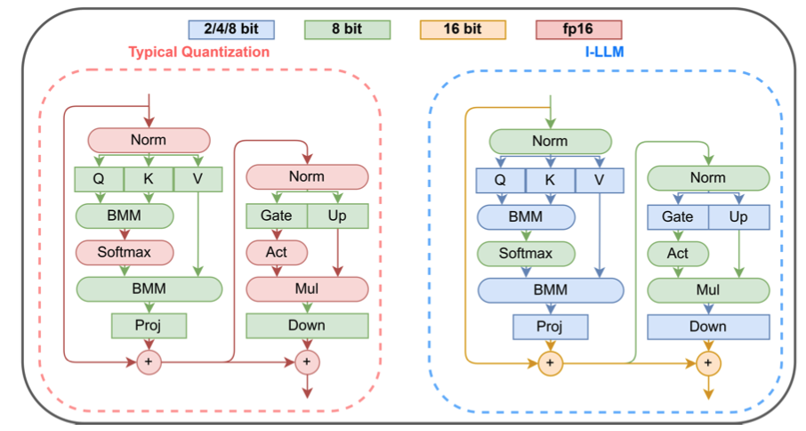

# Awesome-Efficient-LLM
A curated list for **Efficient Large Language Models**

## Full List
  - [Knowledge Distillation](knowledge_distillation.md)
  - [Network Pruning](pruning.md)
  - [Quantization](quantization.md)
  - [Inference Acceleration](inference_acceleration.md)
  - [Efficient MOE](efficient_moe.md)
  - [Efficient Architecture of LLM](efficient_architecture_llm.md)
  - [KV Cache Compression](kv_cache_compression.md)
  - [Text Compression](text_compression.md)
  - [Low-Rank Decomposition](low_rank_decomposition.md)
  - [Hardware/System](hardware.md)
  - [Tuning](tuning.md)
  - [Survey](survey.md)
  - [Leaderboard](leaderboard.md)

### Please check out all the papers by selecting the sub-area you're interested in. On this page, we're showing papers released in the past 30 days.

#### 🚀 Updates
* May 29, 2023: We've had this awesome list for a year now :smiling_face_with_three_hearts:! It's grown pretty long, so we're reorganizing it and would divide the list by their specific areas into different readme.
* Sep 27, 2023: Add tag  for papers accepted at NeurIPS'23.
* Sep 6, 2023: Add a new subdirectory [project/](project/) to organize those projects that are designed for developing a lightweight LLM.
* July 11, 2023:
In light of the numerous publications that conduct experiments using PLMs (such as BERT, BART) currently, a new subdirectory [efficient_plm/](efficient_plm/) is created to house papers that are applicable to PLMs but have yet to be verified for their effectiveness on LLMs (not implying that they are not suitable on LLM). 

## Paper from 05/26/2024 - Now (see Full List from 05/22/2023 [here](#full-list))

| Title & Authors | Introduction | Links |
|:--|  :----: | :---:|
|**Knowledge Distillation** | | |
|[LLM and GNN are Complementary: Distilling LLM for Multimodal Graph Learning](https://arxiv.org/abs/2406.01032)   Junjie Xu, Zongyu Wu, Minhua Lin, Xiang Zhang, Suhang Wang | |[Paper](https://arxiv.org/abs/2406.01032)|[//]: #06/05
|**Network Pruning** | | |
| [Effective Interplay between Sparsity and Quantization: From Theory to Practice](https://arxiv.org/abs/2405.20935)   Simla Burcu Harma, Ayan Chakraborty, Elizaveta Kostenok, Danila Mishin, Dongho Ha, Babak Falsafi, Martin Jaggi, Ming Liu, Yunho Oh, Suvinay Subramanian, Amir Yazdanbakhsh ||[Paper](https://arxiv.org/abs/2405.20935)|[//]: #06/05
|[Large Language Model Pruning](https://arxiv.org/abs/2406.00030)   Hanjuan Huang, Hao-Jia Song, Hsing-Kuo Pao | |[Paper](https://arxiv.org/abs/2406.00030)|[//]: #06/05
|[FinerCut: Finer-grained Interpretable Layer Pruning for Large Language Models](https://arxiv.org/abs/2405.18218)   Yang Zhang, Yawei Li, Xinpeng Wang, Qianli Shen, Barbara Plank, Bernd Bischl, Mina Rezaei, Kenji Kawaguchi | |[Paper](https://arxiv.org/abs/2405.18218)|  [//]: #05/29
| [SLoPe: Double-Pruned Sparse Plus Lazy Low-Rank Adapter Pretraining of LLMs](https://arxiv.org/abs/2405.16325)   Mohammad Mozaffari, Amir Yazdanbakhsh, Zhao Zhang, Maryam Mehri Dehnavi | |[Github](https://github.com/Mohammad-Mozaffari/slope)   [Paper](https://arxiv.org/abs/2405.16325)| [//]: #05/29
| [SPP: Sparsity-Preserved Parameter-Efficient Fine-Tuning for Large Language Models](https://arxiv.org/abs/2405.16057)   Xudong Lu, Aojun Zhou, Yuhui Xu, Renrui Zhang, Peng Gao, Hongsheng Li | |[Github](https://github.com/Lucky-Lance/SPP)   [Paper](https://arxiv.org/abs/2405.16057)| [//]: #05/29
|**Quantization** | | |
| [ShiftAddLLM: Accelerating Pretrained LLMs via Post-Training Multiplication-Less Reparameterization](https://arxiv.org/abs/2406.05981)   Haoran You, Yipin Guo, Yichao Fu, Wei Zhou, Huihong Shi, Xiaofan Zhang, Souvik Kundu, Amir Yazdanbakhsh, Yingyan Lin | |[Github](https://github.com/GATECH-EIC/ShiftAddLLM)   [Paper](https://arxiv.org/abs/2406.05981)|[//]: #06/11
|[Low-Rank Quantization-Aware Training for LLMs](https://arxiv.org/abs/2406.06385)   Yelysei Bondarenko, Riccardo Del Chiaro, Markus Nagel | |[Paper](https://arxiv.org/abs/2406.06385)|[//]: #06/11
|[LCQ: Low-Rank Codebook based Quantization for Large Language Models](https://arxiv.org/abs/2405.20973)   Wen-Pu Cai, Wu-Jun Li | |[Paper](https://arxiv.org/abs/2405.20973)|[//]: #06/05
|[MagR: Weight Magnitude Reduction for Enhancing Post-Training Quantization](https://arxiv.org/abs/2406.00800)   Aozhong Zhang, Naigang Wang, Yanxia Deng, Xin Li, Zi Yang, Penghang Yin | |[Paper](https://arxiv.org/abs/2406.00800)|[//]: #06/05
|[Outliers and Calibration Sets have Diminishing Effect on Quantization of Modern LLMs](https://arxiv.org/abs/2405.20835)   Davide Paglieri, Saurabh Dash, Tim Rocktäschel, Jack Parker-Holder | |[Paper](https://arxiv.org/abs/2405.20835)|[//]: #06/05
| [Compressing Large Language Models using Low Rank and Low Precision Decomposition](https://arxiv.org/abs/2405.18886)   Rajarshi Saha, Naomi Sagan, Varun Srivastava, Andrea J. Goldsmith, Mert Pilanci | |[Github](https://github.com/pilancilab/caldera)   [Paper](https://arxiv.org/abs/2405.18886)| [//]: #05/31
|[I-LLM: Efficient Integer-Only Inference for Fully-Quantized Low-Bit Large Language Models](https://arxiv.org/abs/2405.17849)   Xing Hu, Yuan Chen, Dawei Yang, Sifan Zhou, Zhihang Yuan, Jiangyong Yu, Chen Xu | |[Paper](https://arxiv.org/abs/2405.17849)| [//]: #05/29
| [Exploiting LLM Quantization](https://arxiv.org/abs/2405.18137)   Kazuki Egashira, Mark Vero, Robin Staab, Jingxuan He, Martin Vechev | |[Github](https://github.com/eth-sri/llm-quantization-attack)   [Paper](https://arxiv.org/abs/2405.18137)| [//]: #05/29
|[CLAQ: Pushing the Limits of Low-Bit Post-Training Quantization for LLMs](https://arxiv.org/abs/2405.17233)   Haoyu Wang, Bei Liu, Hang Shao, Bo Xiao, Ke Zeng, Guanglu Wan, Yanmin Qian | |[Paper](https://arxiv.org/abs/2405.17233)| [//]: #05/29
|[SpinQuant -- LLM quantization with learned rotations](https://arxiv.org/abs/2405.16406)   Zechun Liu, Changsheng Zhao, Igor Fedorov, Bilge Soran, Dhruv Choudhary, Raghuraman Krishnamoorthi, Vikas Chandra, Yuandong Tian, Tijmen Blankevoort | |[Paper](https://arxiv.org/abs/2405.16406)| [//]: #05/29
| [SliM-LLM: Salience-Driven Mixed-Precision Quantization for Large Language Models](https://arxiv.org/abs/2405.14917)   Wei Huang, Haotong Qin, Yangdong Liu, Yawei Li, Xianglong Liu, Luca Benini, Michele Magno, Xiaojuan Qi | |[Github](https://github.com/Aaronhuang-778/SliM-LLM)   [Paper](https://arxiv.org/abs/2405.14917)| [//]: #05/29
| [PV-Tuning: Beyond Straight-Through Estimation for Extreme LLM Compression](https://arxiv.org/abs/2405.14852)   Vladimir Malinovskii, Denis Mazur, Ivan Ilin, Denis Kuznedelev, Konstantin Burlachenko, Kai Yi, Dan Alistarh, Peter Richtarik | |[Github](https://github.com/Vahe1994/AQLM/tree/pv-tuning)   [Paper](https://arxiv.org/abs/2405.14852)| [//]: #05/29
|[Integer Scale: A Free Lunch for Faster Fine-grained Quantization of LLMs](https://arxiv.org/abs/2405.14597)   Qingyuan Li, Ran Meng, Yiduo Li, Bo Zhang, Yifan Lu, Yerui Sun, Lin Ma, Yuchen Xie | |[Paper](https://arxiv.org/abs/2405.14597)|  [//]: #05/29
|**Inference Acceleration** | | |
|[Faster Cascades via Speculative Decoding](https://arxiv.org/abs/2405.19261)   Harikrishna Narasimhan, Wittawat Jitkrittum, Ankit Singh Rawat, Seungyeon Kim, Neha Gupta, Aditya Krishna Menon, Sanjiv Kumar | |[Paper](https://arxiv.org/abs/2405.19261)| [//]: #05/31
| [Hardware-Aware Parallel Prompt Decoding for Memory-Efficient Acceleration of LLM Inference](https://arxiv.org/abs/2405.18628)   Hao (Mark)Chen, Wayne Luk, Ka Fai Cedric Yiu, Rui Li, Konstantin Mishchenko, Stylianos I. Venieris, Hongxiang Fan | |[Github](https://github.com/hmarkc/parallel-prompt-decoding)   [Paper](https://arxiv.org/abs/2405.18628)| [//]: #05/31
|**Efficient MOE** | | |
|[Demystifying the Compression of Mixture-of-Experts Through a Unified Framework](https://arxiv.org/abs/2406.02500)   Shwai He, Daize Dong, Liang Ding, Ang Li | |[Paper](https://arxiv.org/abs/2406.02500)| [//]: #06/05
| [MoNDE: Mixture of Near-Data Experts for Large-Scale Sparse Models](https://arxiv.org/abs/2405.18832)   Taehyun Kim, Kwanseok Choi, Youngmock Cho, Jaehoon Cho, Hyuk-Jae Lee, Jaewoong Sim | |[Paper](https://arxiv.org/abs/2405.18832)| [//]: #05/31
| [Dynamic Mixture of Experts: An Auto-Tuning Approach for Efficient Transformer Models](https://arxiv.org/abs/2405.14297)   Yongxin Guo, Zhenglin Cheng, Xiaoying Tang, Tao Lin | |[Github](https://github.com/LINs-lab/DynMoE)   [Paper](https://arxiv.org/abs/2405.14297)| [//]: #05/29
| [A Provably Effective Method for Pruning Experts in Fine-tuned Sparse Mixture-of-Experts](https://arxiv.org/pdf/2405.16646)   Mohammed Nowaz Rabbani Chowdhury, Meng Wang, Kaoutar El Maghraoui, Naigang Wang, Pin-Yu Chen, Christopher Carothers | |[Paper](https://arxiv.org/pdf/2405.16646)| [//]: #05/29
|**KV Cache Compression** | | |
|[ZipCache: Accurate and Efficient KV Cache Quantization with Salient Token Identification](https://arxiv.org/abs/2405.14256)   Yefei He, Luoming Zhang, Weijia Wu, Jing Liu, Hong Zhou, Bohan Zhuang | |[Paper](https://arxiv.org/abs/2405.14256)| [//]: #05/29
|**Hardware/System** | | |
|[PowerInfer-2: Fast Large Language Model Inference on a Smartphone](https://arxiv.org/abs/2406.06282)   Zhenliang Xue, Yixin Song, Zeyu Mi, Le Chen, Yubin Xia, Haibo Chen | |[Paper](https://arxiv.org/abs/2406.06282)|[//]: #06/11
| [Parrot: Efficient Serving of LLM-based Applications with Semantic Variable](https://arxiv.org/abs/2405.19888)   Chaofan Lin, Zhenhua Han, Chengruidong Zhang, Yuqing Yang, Fan Yang, Chen Chen, Lili Qiu | |[Paper](https://arxiv.org/abs/2405.19888)| [//]: #05/31
 
#### 💮 Contributing

If you'd like to include your paper, or need to update any details such as conference information or code URLs, please feel free to submit a pull request. You can generate the required markdown format for each paper by filling in the information in `generate_item.py` and execute `python generate_item.py`. We warmly appreciate your contributions to this list. Alternatively, you can email me with the links to your paper and code, and I would add your paper to the list at my earliest convenience. 

