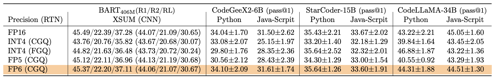
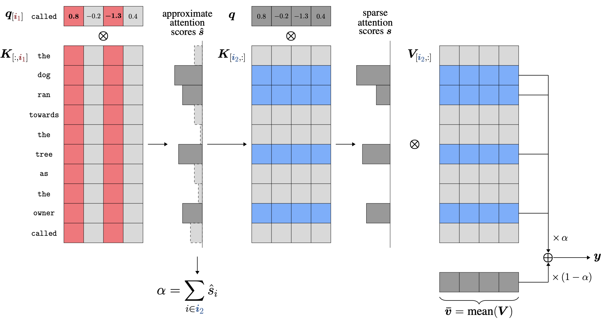

# Awesome-Efficient-LLM

A curated list for **Efficient Large Language Models**:
  - [Knowledge Distillation](#knowledge-distillation)
  - [Network Pruning](#network-pruning)
  - [Quantization](#quantization)
  - [Inference Acceleration](#inference-acceleration)
  - [Efficient MOE](#efficient-moe)
  - [Efficient Architecture of LLM](#efficient-architecture-of-llm)
  - [Text Compression](#text-compression)
  - [Low-Rank Decomposition](#low-rank-decomposition)
  - [Hardware/System](#hardwaresystem)
  - [Tuning](#tuning)
  - [Survey](#survey)
  - [Leaderboard](#leaderboard)

#### 🚀 Updates
* Sep 27, 2023: Add tag  for papers accepted at NeurIPS'23.
* Sep 6, 2023: Add a new subdirectory [project/](project/) to organize those projects that are designed for developing a lightweight LLM.
* July 11, 2023:
In light of the numerous publications that conducts experiments using PLMs (such as BERT, BART) currently, a new subdirectory [efficient_plm/](efficient_plm/) is created to house papers that are applicable to PLMs but have yet to be verified for their effectiveness on LLMs (not implying that they are not suitable on LLM). 

#### 💮 Contributing

If you'd like to include your paper, or need to update any details such as conference information or code URLs, please feel free to submit a pull request. You can generate the required markdown format for each paper by filling in the information in `generate_item.py` and execute `python generate_item.py`. We warmly appreciate your contributions to this list. Alternatively, you can email me with the links to your paper and code, and I would add your paper to the list at my earliest convenience. 

## Knowledge Distillation

| Title & Authors | Introduction | Links |
|:----|  :----: | :---:|
| [Specializing Smaller Language Models towards Multi-Step Reasoning](https://arxiv.org/abs/2301.12726)   Yao Fu, Hao Peng, Litu Ou, Ashish Sabharwal, Tushar Khot | |[Github](https://github.com/FranxYao/FlanT5-CoT-Specialization)   [Paper](https://arxiv.org/abs/2301.12726)|
| [Distilling Script Knowledge from Large Language Models for Constrained Language Planning](https://arxiv.org/abs/2305.05252)   Siyu Yuan, Jiangjie Chen, Ziquan Fu, Xuyang Ge, Soham Shah, Charles Robert Jankowski, Yanghua Xiao, Deqing Yang | |[Github](https://github.com/siyuyuan/coscript)   [Paper](https://arxiv.org/abs/2305.05252)|
| [SCOTT: Self-Consistent Chain-of-Thought Distillation](https://arxiv.org/abs/2305.01879)   Peifeng Wang, Zhengyang Wang, Zheng Li, Yifan Gao, Bing Yin, Xiang Ren | |[Paper](https://arxiv.org/abs/2305.01879)|
| [DISCO: Distilling Counterfactuals with Large Language Models](https://arxiv.org/abs/2212.10534)   Zeming Chen, Qiyue Gao, Antoine Bosselut, Ashish Sabharwal, Kyle Richardson | |[Github](https://github.com/eric11eca/disco)   [Paper](https://arxiv.org/abs/2212.10534)|
| [I2D2: Inductive Knowledge Distillation with NeuroLogic and Self-Imitation](https://arxiv.org/abs/2212.09246)   Chandra Bhagavatula, Jena D. Hwang, Doug Downey, Ronan Le Bras, Ximing Lu, Lianhui Qin, Keisuke Sakaguchi, Swabha Swayamdipta, Peter West, Yejin Choi | |[Github](https://github.com/allenai/i2d2)   [Paper](https://arxiv.org/abs/2212.09246)   [Project](https://i2d2.allen.ai/) |
| [Symbolic Chain-of-Thought Distillation: Small Models Can Also "Think" Step-by-Step](https://arxiv.org/abs/2306.14050)   Liunian Harold Li, Jack Hessel, Youngjae Yu, Xiang Ren, Kai-Wei Chang, Yejin Choi | |[Github](https://github.com/allenai/cot_distillation)   [Paper](https://arxiv.org/abs/2306.14050)|
|   [Can Language Models Teach? Teacher Explanations Improve Student Performance via Theory of Mind](https://arxiv.org/abs/2306.09299)   Swarnadeep Saha, Peter Hase, and Mohit Bansal | |[Github](https://github.com/swarnaHub/ExplanationIntervention)   [Paper](https://arxiv.org/abs/2306.09299)|
| [Dialogue Chain-of-Thought Distillation for Commonsense-aware Conversational Agents](https://arxiv.org/abs/2310.09343)   Hyungjoo Chae, Yongho Song, Kai Tzu-iunn Ong, Taeyoon Kwon, Minjin Kim, Youngjae Yu, Dongha Lee, Dongyeop Kang, Jinyoung Yeo | |[Paper](https://arxiv.org/abs/2310.09343)|
| [PromptMix: A Class Boundary Augmentation Method for Large Language Model Distillation](https://arxiv.org/abs/2310.14192)   Gaurav Sahu, Olga Vechtomova, Dzmitry Bahdanau, Issam H. Laradji | |[Github](https://github.com/ServiceNow/PromptMix-EMNLP-2023)   [Paper](https://arxiv.org/abs/2310.14192)|
| [Turning Dust into Gold: Distilling Complex Reasoning Capabilities from LLMs by Leveraging Negative Data](https://arxiv.org/abs/2312.12832)   Yiwei Li, Peiwen Yuan, Shaoxiong Feng, Boyuan Pan, Bin Sun, Xinglin Wang, Heda Wang, Kan Li | |[Github](https://github.com/Yiwei98/TDG)   [Paper](https://arxiv.org/abs/2312.12832)|
| [Democratizing Reasoning Ability: Tailored Learning from Large Language Model](https://aclanthology.org/2023.emnlp-main.120.pdf)   Zhaoyang Wang, Shaohan Huang, Yuxuan Liu, Jiahai Wang, Minghui Song, Zihan Zhang, Haizhen Huang, Furu Wei, Weiwei Deng, Feng Sun, Qi Zhang | |[Github](https://github.com/Raibows/Learn-to-Reason)   [Paper](https://aclanthology.org/2023.emnlp-main.120.pdf)|
|   [GKD: A General Knowledge Distillation Framework for Large-scale Pre-trained Language Model](https://arxiv.org/abs/2306.06629)   Shicheng Tan, Weng Lam Tam, Yuanchun Wang, Wenwen Gong, Yang Yang, Hongyin Tang, Keqing He, Jiahao Liu, Jingang Wang, Shu Zhao, Peng Zhang, Jie Tang | |[Github](https://github.com/aitsc/GLMKD)   [Paper](https://arxiv.org/abs/2306.06629)|
|    [Distilling Step-by-Step! Outperforming Larger Language Models with Less Training Data and Smaller Model Sizes](https://arxiv.org/abs/2305.02301)      Cheng-Yu Hsieh, Chun-Liang Li, Chih-Kuan Yeh, Hootan Nakhost, Yasuhisa Fujii, Alexander Ratner, Ranjay Krishna, Chen-Yu Lee, Tomas Pfister | | [Github](https://github.com/google-research/distilling-step-by-step)   [Paper](https://arxiv.org/abs/2305.02301) |
| [Retrieval-based Knowledge Transfer: An Effective Approach for Extreme Large Language Model Compression](https://arxiv.org/abs/2310.15594)   Jiduan Liu, Jiahao Liu, Qifan Wang, Jingang Wang, Xunliang Cai, Dongyan Zhao, Ran Lucien Wang, Rui Yan | |[Paper](https://arxiv.org/abs/2310.15594)|
| [Cache me if you Can: an Online Cost-aware Teacher-Student framework to Reduce the Calls to Large Language Models](https://arxiv.org/abs/2310.13395)   Ilias Stogiannidis, Stavros Vassos, Prodromos Malakasiotis, Ion Androutsopoulos | |[Github](https://github.com/stoyian/OCaTS)   [Paper](https://arxiv.org/abs/2310.13395)|
| [Efficiently Distilling LLMs for Edge Applications](https://arxiv.org/abs/2404.01353)   Achintya Kundu, Fabian Lim, Aaron Chew, Laura Wynter, Penny Chong, Rhui Dih Lee | |[Paper](https://arxiv.org/abs/2404.01353)|
|    [LaMini-LM: A Diverse Herd of Distilled Models from Large-Scale Instructions](https://github.com/mbzuai-nlp/LaMini-LM)  Minghao Wu, Abdul Waheed, Chiyu Zhang, Muhammad Abdul-Mageed, Alham Fikri Aji |  | [Github](https://github.com/mbzuai-nlp/LaMini-LM) [paper](https://arxiv.org/abs/2304.14402) |
|[Knowledge Distillation of Large Language Models](https://arxiv.org/abs/2306.08543)   Yuxian Gu, Li Dong, Furu Wei, Minlie Huang | |[Github](https://github.com/microsoft/LMOps/tree/main/minillm)   [Paper](https://arxiv.org/abs/2306.08543)|
|[Teaching Small Language Models to Reason](https://arxiv.org/abs/2212.08410)   Lucie Charlotte Magister, Jonathan Mallinson, Jakub Adamek, Eric Malmi, Aliaksei Severyn.  | |[Paper](https://arxiv.org/abs/2212.08410)|
|    [Large Language Model Distillation Doesn't Need a Teacher](https://arxiv.org/abs/2305.14864)   Ananya Harsh Jha, Dirk Groeneveld, Emma Strubell, Iz Beltagy   |  | [Github](https://github.com/ananyahjha93/llm-distill) [paper](https://arxiv.org/abs/2305.14864) |
| [The False Promise of Imitating Proprietary LLMs](https://arxiv.org/abs/2305.15717)   Arnav Gudibande, Eric Wallace, Charlie Snell, Xinyang Geng, Hao Liu, Pieter Abbeel, Sergey Levine, Dawn Song |  | [Paper](https://arxiv.org/abs/2305.15717) |
|  [Impossible Distillation: from Low-Quality Model to High-Quality Dataset & Model for Summarization and Paraphrasing](https://arxiv.org/abs/2305.16635)   Jaehun Jung, Peter West, Liwei Jiang, Faeze Brahman, Ximing Lu, Jillian Fisher, Taylor Sorensen, Yejin Choi | |[Github](https://github.com/jaehunjung1/impossible-distillation) [paper](https://arxiv.org/abs/2305.16635) |
|[PaD: Program-aided Distillation Specializes Large Models in Reasoning](https://arxiv.org/abs/2305.13888)   Xuekai Zhu, Biqing Qi, Kaiyan Zhang, Xingwei Long, Bowen Zhou | |[Paper](https://arxiv.org/abs/2305.13888)|
|[RLCD: Reinforcement Learning from Contrast Distillation for Language Model Alignment](https://arxiv.org/abs/2307.12950)   Kevin Yang, Dan Klein, Asli Celikyilmaz, Nanyun Peng, Yuandong Tian | |[Paper](https://arxiv.org/abs/2307.12950)|
|[Sci-CoT: Leveraging Large Language Models for Enhanced Knowledge Distillation in Small Models for Scientific QA](https://arxiv.org/abs/2308.04679)   Yuhan Ma, Haiqi Jiang, Chenyou Fan | |[Paper](https://arxiv.org/abs/2308.04679)|
| [UniversalNER: Targeted Distillation from Large Language Models for Open Named Entity Recognition](https://arxiv.org/abs/2308.03279)   Wenxuan Zhou, Sheng Zhang, Yu Gu, Muhao Chen, Hoifung Poon | |[Github](https://github.com/universal-ner/universal-ner)   [Paper](https://arxiv.org/abs/2308.03279)   [Project](https://universal-ner.github.io) |
| [Baby Llama: knowledge distillation from an ensemble of teachers trained on a small dataset with no performance penalty](https://arxiv.org/abs/2308.02019)   Inar Timiryasov, Jean-Loup Tastet | |[Github](https://github.com/timinar/BabyLlama)   [Paper](https://arxiv.org/abs/2308.02019) | [Model](https://huggingface.co/timinar/baby-llama-58m) |
|[DistillSpec: Improving Speculative Decoding via Knowledge Distillation](https://arxiv.org/abs/2310.08461)   Yongchao Zhou, Kaifeng Lyu, Ankit Singh Rawat, Aditya Krishna Menon, Afshin Rostamizadeh, Sanjiv Kumar, Jean-François Kagy, Rishabh Agarwal | |[Paper](https://arxiv.org/abs/2310.08461)|
| [Zephyr: Direct Distillation of LM Alignment](https://arxiv.org/abs/2310.16944)   Lewis Tunstall, Edward Beeching, Nathan Lambert, Nazneen Rajani, Kashif Rasul, Younes Belkada, Shengyi Huang, Leandro von Werra, Clémentine Fourrier, Nathan Habib, Nathan Sarrazin, Omar Sanseviero, Alexander M. Rush, Thomas Wolf | |[Github](https://github.com/huggingface/alignment-handbook)   [Paper](https://arxiv.org/abs/2310.16944)|
| [Towards the Law of Capacity Gap in Distilling Language Models](https://arxiv.org/abs/2311.07052)   Chen Zhang, Dawei Song, Zheyu Ye, Yan Gao | |[Github](https://github.com/GeneZC/MiniMA)   [Paper](https://arxiv.org/abs/2311.07052)|
|[Unlock the Power: Competitive Distillation for Multi-Modal Large Language Models](https://arxiv.org/abs/2311.08213)   Xinwei Li, Li Lin, Shuai Wang, Chen Qian | |[Paper](https://arxiv.org/abs/2311.08213)|
|[Mixed Distillation Helps Smaller Language Model Better Reasoning](https://arxiv.org/abs/2312.10730)   Li Chenglin, Chen Qianglong, Wang Caiyu, Zhang Yin | |[Paper](https://arxiv.org/abs/2312.10730)|
|[Distilling Event Sequence Knowledge From Large Language Models](https://arxiv.org/abs/2401.07237)   Somin Wadhwa, Oktie Hassanzadeh, Debarun Bhattacharjya, Ken Barker, Jian Ni | |[Paper](https://arxiv.org/abs/2401.07237)|
|[Knowledge Distillation for Closed-Source Language Models](https://arxiv.org/abs/2401.07013)   Hongzhan Chen, Xiaojun Quan, Hehong Chen, Ming Yan, Ji Zhang | |[Paper](https://arxiv.org/abs/2401.07013)|
|[Improving Small Language Models' Mathematical Reasoning via Equation-of-Thought Distillation](https://arxiv.org/abs/2401.11864)   Xunyu Zhu, Jian Li, Yong Liu, Can Ma, Weiping Wang | |[Paper](https://arxiv.org/abs/2401.11864)|
|[Scavenging Hyena: Distilling Transformers into Long Convolution Models](https://arxiv.org/abs/2401.17574)   Tokiniaina Raharison Ralambomihanta, Shahrad Mohammadzadeh, Mohammad Sami Nur Islam, Wassim Jabbour, Laurence Liang | |[Paper](https://arxiv.org/abs/2401.17574)|
| [DistiLLM: Towards Streamlined Distillation for Large Language Models](https://arxiv.org/abs/2402.03898)   Jongwoo Ko, Sungnyun Kim, Tianyi Chen, Se-Young Yun | |[Github](https://github.com/jongwooko/distillm)   [Paper](https://arxiv.org/abs/2402.03898)|
|[Large Language Model Meets Graph Neural Network in Knowledge Distillation](https://arxiv.org/abs/2402.05894)   Shengxiang Hu, Guobing Zou, Song Yang, Bofeng Zhang, Yixin Chen | |[Paper](https://arxiv.org/abs/2402.05894)|
| [Unmemorization in Large Language Models via Self-Distillation and Deliberate Imagination](https://arxiv.org/abs/2402.10052)   Yijiang River Dong, Hongzhou Lin, Mikhail Belkin, Ramon Huerta, Ivan Vulić | |[Github](https://github.com/dong-river/LLM_unlearning)   [Paper](https://arxiv.org/abs/2402.10052)|
| [Towards Cross-Tokenizer Distillation: the Universal Logit Distillation Loss for LLMs](https://arxiv.org/abs/2402.12030)   Nicolas Boizard, Kevin El-Haddad, Céline Hudelot, Pierre Colombo | |[Github](https://github.com/Nicolas-BZRD/llm-recipes) [Github](https://github.com/Nicolas-BZRD/llm-distillation)   [Paper](https://arxiv.org/abs/2402.12030)   [Model](https://huggingface.co/collections/Nicolas-BZRD/llms-distillation-65cfa07f1e4ed7404502a9eb)|
|[Revisiting Knowledge Distillation for Autoregressive Language Models](https://arxiv.org/abs/2402.11890)   Qihuang Zhong, Liang Ding, Li Shen, Juhua Liu, Bo Du, Dacheng Tao | |[Paper](https://arxiv.org/abs/2402.11890)|
|[PromptKD: Distilling Student-Friendly Knowledge for Generative Language Models via Prompt Tuning](https://arxiv.org/abs/2402.12842)   Gyeongman Kim, Doohyuk Jang, Eunho Yang | |[Paper](https://arxiv.org/abs/2402.12842)|
|[Self-Distillation Bridges Distribution Gap in Language Model Fine-Tuning](https://arxiv.org/abs/2402.13669)   Zhaorui Yang, Qian Liu, Tianyu Pang, Han Wang, Haozhe Feng, Minfeng Zhu, Wei Chen | |[Paper](https://arxiv.org/abs/2402.13669)|
|[Wisdom of Committee: Distilling from Foundation Model to Specialized Application Model](https://arxiv.org/abs/2402.14035)   Zichang Liu, Qingyun Liu, Yuening Li, Liang Liu, Anshumali Shrivastava, Shuchao Bi, Lichan Hong, Ed H. Chi, Zhe Zhao | |[Paper](https://arxiv.org/abs/2402.14035)|
|[Divide-or-Conquer? Which Part Should You Distill Your LLM?](https://arxiv.org/abs/2402.15000)   Zhuofeng Wu, He Bai, Aonan Zhang, Jiatao Gu, VG Vinod Vydiswaran, Navdeep Jaitly, Yizhe Zhang | |[Paper](https://arxiv.org/abs/2402.15000)|
| [Distillation Contrastive Decoding: Improving LLMs Reasoning with Contrastive Decoding and Distillation](https://arxiv.org/abs/2402.14874)   Phuc Phan, Hieu Tran, Long Phan | |[Github](https://github.com/pphuc25/distil-cd)   [Paper](https://arxiv.org/abs/2402.14874)|
|[Leveraging Zero-Shot Prompting for Efficient Language Model Distillation](https://arxiv.org/abs/2403.15886)   Lukas Vöge, Vincent Gurgul, Stefan Lessmann | |[Paper](https://arxiv.org/abs/2403.15886)|

## Network Pruning
| Title & Authors | Introduction | Links |
|:----|  :----: | :---:|
|      [SparseGPT: Massive Language Models Can Be Accurately Pruned in One-Shot](https://github.com/IST-DASLab/sparsegpt)   Elias Frantar, Dan Alistarh|  |[Github](https://github.com/IST-DASLab/sparsegpt) [paper](https://arxiv.org/abs/2301.00774) |
|     [LLM-Pruner: On the Structural Pruning of Large Language Models](https://arxiv.org/abs/2305.11627)   Xinyin Ma, Gongfan Fang, Xinchao Wang | | [Github](https://github.com/horseee/LLM-Pruner) [paper](https://arxiv.org/abs/2305.11627)|
|    [The Emergence of Essential Sparsity in Large Pre-trained Models: The Weights that Matter](https://arxiv.org/abs/2306.03805)   Ajay Jaiswal, Shiwei Liu, Tianlong Chen, Zhangyang Wang | |[Github](https://github.com/VITA-Group/essential_sparsity)   [Paper](https://arxiv.org/abs/2306.03805)|
|   [Flash-LLM: Enabling Cost-Effective and Highly-Efficient Large Generative Model Inference with Unstructured Sparsity](https://arxiv.org/abs/2309.10285)   Haojun Xia, Zhen Zheng, Yuchao Li, Donglin Zhuang, Zhongzhu Zhou, Xiafei Qiu, Yong Li, Wei Lin, Shuaiwen Leon Song | |[Github](https://github.com/AlibabaResearch/flash-llm)   [Paper](https://arxiv.org/abs/2309.10285)|
|     [A Simple and Effective Pruning Approach for Large Language Models](https://arxiv.org/abs/2306.11695)   Mingjie Sun, Zhuang Liu, Anna Bair, J. Zico Kolter | |[Github](https://github.com/locuslab/wanda)   [Paper](https://arxiv.org/abs/2306.11695)|
|    [Sheared LLaMA: Accelerating Language Model Pre-training via Structured Pruning](https://arxiv.org/abs/2310.06694)   Mengzhou Xia, Tianyu Gao, Zhiyuan Zeng, Danqi Chen | |[Github](https://github.com/princeton-nlp/LLM-Shearing)   [Paper](https://arxiv.org/abs/2310.06694)|
|  [Fluctuation-based Adaptive Structured Pruning for Large Language Models](https://arxiv.org/abs/2312.11983)   Yongqi An, Xu Zhao, Tao Yu, Ming Tang, Jinqiao Wang | |[Github](https://github.com/CASIA-IVA-Lab/FLAP)   [Paper](https://arxiv.org/abs/2312.11983)|
|   [NASH: A Simple Unified Framework of Structured Pruning for Accelerating Encoder-Decoder Language Models](https://arxiv.org/abs/2310.10054)   Jongwoo Ko, Seungjoon Park, Yujin Kim, Sumyeong Ahn, Du-Seong Chang, Euijai Ahn, Se-Young Yun | |[Github](https://github.com/jongwooko/NASH-Pruning-Official)   [Paper](https://arxiv.org/abs/2310.10054)|
|[LoRAPrune: Pruning Meets Low-Rank Parameter-Efficient Fine-Tuning](https://arxiv.org/abs/2305.18403)   Mingyang Zhang, Hao Chen, Chunhua Shen, Zhen Yang, Linlin Ou, Xinyi Yu, Bohan Zhuang | |[Paper](https://arxiv.org/abs/2305.18403)|
|   [Pruning Large Language Models via Accuracy Predictor](https://arxiv.org/abs/2309.09507)   Yupeng Ji, Yibo Cao, Jiucai Liu | |[Paper](https://arxiv.org/abs/2309.09507)|
|  [Compressing LLMs: The Truth is Rarely Pure and Never Simple](https://arxiv.org/abs/2310.01382)   Ajay Jaiswal, Zhe Gan, Xianzhi Du, Bowen Zhang, Zhangyang Wang, Yinfei Yang | |[Paper](https://arxiv.org/abs/2310.01382)|
| [Junk DNA Hypothesis: A Task-Centric Angle of LLM Pre-trained Weights through Sparsity](https://arxiv.org/abs/2310.02277)   Lu Yin, Shiwei Liu, Ajay Jaiswal, Souvik Kundu, Zhangyang Wang | |[Github](https://github.com/VITA-Group/Junk_DNA_Hypothesis)   [Paper](https://arxiv.org/abs/2310.02277)|
|  [Outlier Weighed Layerwise Sparsity (OWL): A Missing Secret Sauce for Pruning LLMs to High Sparsity](https://arxiv.org/abs/2310.05175)   Lu Yin, You Wu, Zhenyu Zhang, Cheng-Yu Hsieh, Yaqing Wang, Yiling Jia, Mykola Pechenizkiy, Yi Liang, Zhangyang Wang, Shiwei Liu | |[Github](https://github.com/luuyin/OWL)   [Paper](https://arxiv.org/abs/2310.05175)|
|  [Compresso: Structured Pruning with Collaborative Prompting Learns Compact Large Language Models](https://arxiv.org/abs/2310.05015)   Song Guo, Jiahang Xu, Li Lyna Zhang, Mao Yang | |[Github](https://github.com/microsoft/Moonlit/tree/main/Compresso)   [Paper](https://arxiv.org/abs/2310.05015)|
|   [Sparse Finetuning for Inference Acceleration of Large Language Models](https://arxiv.org/abs/2310.06927)   Eldar Kurtic, Denis Kuznedelev, Elias Frantar, Michael Goin, Dan Alistarh | |[Github](https://github.com/IST-DASLab/SparseFinetuning)   [Paper](https://arxiv.org/abs/2310.06927)|
|   [ReLU Strikes Back: Exploiting Activation Sparsity in Large Language Models](https://arxiv.org/abs/2310.04564)   Iman Mirzadeh, Keivan Alizadeh, Sachin Mehta, Carlo C Del Mundo, Oncel Tuzel, Golnoosh Samei, Mohammad Rastegari, Mehrdad Farajtabar | |[Paper](https://arxiv.org/abs/2310.04564)|
|   [The Cost of Down-Scaling Language Models: Fact Recall Deteriorates before In-Context Learning](https://arxiv.org/abs/2310.04680)   Tian Jin, Nolan Clement, Xin Dong, Vaishnavh Nagarajan, Michael Carbin, Jonathan Ragan-Kelley, Gintare Karolina Dziugaite | |[Paper](https://arxiv.org/abs/2310.04680)|
|   [One-Shot Sensitivity-Aware Mixed Sparsity Pruning for Large Language Models](https://arxiv.org/abs/2310.09499)   Hang Shao, Bei Liu, Yanmin Qian | |[Paper](https://arxiv.org/abs/2310.09499)|
|   [LoRAShear: Efficient Large Language Model Structured Pruning and Knowledge Recovery](https://arxiv.org/abs/2310.18356)   Tianyi Chen, Tianyu Ding, Badal Yadav, Ilya Zharkov, Luming Liang | |[Github](https://github.com/microsoft/lorashear)   [Paper](https://arxiv.org/abs/2310.18356)|
|   [Divergent Token Metrics: Measuring degradation to prune away LLM components -- and optimize quantization](https://arxiv.org/abs/2311.01544)   Björn Deiseroth, Max Meuer, Nikolas Gritsch, Constantin Eichenberg, Patrick Schramowski, Matthias Aßenmacher, Kristian Kersting | |[Github](https://github.com/Aleph-Alpha/Divergent_Tokens)   [Paper](https://arxiv.org/abs/2311.01544)|
|    [Beyond Size: How Gradients Shape Pruning Decisions in Large Language Models](https://arxiv.org/abs/2311.04902)   Rocktim Jyoti Das, Liqun Ma, Zhiqiang Shen | |[Github](https://github.com/VILA-Lab/GBLM-Pruner)   [Paper](https://arxiv.org/abs/2311.04902)|
| [Dynamic Sparse No Training: Training-Free Fine-tuning for Sparse LLMs](https://arxiv.org/abs/2310.08915)    Yuxin Zhang, Lirui Zhao, Mingbao Lin, Yunyun Sun, Yiwu Yao, Xingjia Han, Jared Tanner, Shiwei Liu, Rongrong Ji | |[Github](https://github.com/zyxxmu/DSnoT)   [Paper](https://arxiv.org/abs/2310.08915)|
| [E-Sparse: Boosting the Large Language Model Inference through Entropy-based N:M Sparsity](https://arxiv.org/abs/2310.15929)   Yun Li, Lin Niu, Xipeng Zhang, Kai Liu, Jianchen Zhu, Zhanhui Kang | |[Paper](https://arxiv.org/abs/2310.15929)|
|   [PERP: Rethinking the Prune-Retrain Paradigm in the Era of LLMs](https://arxiv.org/abs/2312.15230)   Max Zimmer, Megi Andoni, Christoph Spiegel, Sebastian Pokutta | |[Github](https://github.com/ZIB-IOL/PERP)   [Paper](https://arxiv.org/abs/2312.15230)|
| [Fast and Optimal Weight Update for Pruned Large Language Models](https://arxiv.org/abs/2401.02938)    Vladimír Boža | |[Github](https://github.com/fmfi-compbio/admm-pruning)   [Paper](https://arxiv.org/abs/2401.02938)|
|   [Pruning for Protection: Increasing Jailbreak Resistance in Aligned LLMs Without Fine-Tuning](https://arxiv.org/abs/2401.10862)   Adib Hasan, Ileana Rugina, Alex Wang | |[Github](https://github.com/CrystalEye42/eval-safety)   [Paper](https://arxiv.org/abs/2401.10862)|
|  [SliceGPT: Compress Large Language Models by Deleting Rows and Columns](https://arxiv.org/abs/2401.15024)   Saleh Ashkboos, Maximilian L. Croci, Marcelo Gennari do Nascimento, Torsten Hoefler, James Hensman | |[Github](https://github.com/microsoft/TransformerCompression)   [Paper](https://arxiv.org/abs/2401.15024)|
|  [APT: Adaptive Pruning and Tuning Pretrained Language Models for Efficient Training and Inference](https://arxiv.org/abs/2401.12200)   Bowen Zhao, Hannaneh Hajishirzi, Qingqing Cao | |[Paper](https://arxiv.org/abs/2401.12200)|
|[ReLU2 Wins: Discovering Efficient Activation Functions for Sparse LLMs](https://arxiv.org/abs/2402.03804)   Zhengyan Zhang, Yixin Song, Guanghui Yu, Xu Han, Yankai Lin, Chaojun Xiao, Chenyang Song, Zhiyuan Liu, Zeyu Mi, Maosong Sun | |[Paper](https://arxiv.org/abs/2402.03804)|
| [Everybody Prune Now: Structured Pruning of LLMs with only Forward Passes](https://arxiv.org/abs/2402.05406)   Lucio Dery, Steven Kolawole, Jean-Francois Kagey, Virginia Smith, Graham Neubig, Ameet Talwalkar | |[Github](https://github.com/ldery/Bonsai)   [Paper](https://arxiv.org/abs/2402.05406)|
| [Assessing the Brittleness of Safety Alignment via Pruning and Low-Rank Modifications](https://arxiv.org/abs/2402.05162)   Boyi Wei, Kaixuan Huang, Yangsibo Huang, Tinghao Xie, Xiangyu Qi, Mengzhou Xia, Prateek Mittal, Mengdi Wang, Peter Henderson | |[Github](https://github.com/boyiwei/alignment-attribution-code)   [Paper](https://arxiv.org/abs/2402.05162)   [Project](https://boyiwei.com/alignment-attribution/)|
|[NutePrune: Efficient Progressive Pruning with Numerous Teachers for Large Language Models](https://arxiv.org/abs/2402.09773)   Shengrui Li, Xueting Han, Jing Bai | |[Paper](https://arxiv.org/abs/2402.09773)|
|[Learn To be Efficient: Build Structured Sparsity in Large Language Models](https://arxiv.org/abs/2402.06126)   Haizhong Zheng, Xiaoyan Bai, Beidi Chen, Fan Lai, Atul Prakash | |[Paper](https://arxiv.org/abs/2402.06126)|
|[Shortened LLaMA: A Simple Depth Pruning for Large Language Models](https://arxiv.org/abs/2402.02834)   Bo-Kyeong Kim, Geonmin Kim, Tae-Ho Kim, Thibault Castells, Shinkook Choi, Junho Shin, Hyoung-Kyu Song | |[Paper](https://arxiv.org/abs/2402.02834)|
| [SLEB: Streamlining LLMs through Redundancy Verification and Elimination of Transformer Blocks](https://arxiv.org/abs/2402.09025)   Jiwon Song, Kyungseok Oh, Taesu Kim, Hyungjun Kim, Yulhwa Kim, Jae-Joon Kim | |[Github](https://github.com/leapingjagg-dev/SLEB)   [Paper](https://arxiv.org/abs/2402.09025)|
|[HiRE: High Recall Approximate Top-k Estimation for Efficient LLM Inference](https://arxiv.org/abs/2402.09360)   Yashas Samaga B L, Varun Yerram, Chong You, Srinadh Bhojanapalli, Sanjiv Kumar, Prateek Jain, Praneeth Netrapalli | |[Paper](https://arxiv.org/abs/2402.09360)|
|[LaCo: Large Language Model Pruning via Layer Collapse](https://arxiv.org/abs/2402.11187)   Yifei Yang, Zouying Cao, Hai Zhao | |[Paper](https://arxiv.org/abs/2402.11187)|
| [ProSparse: Introducing and Enhancing Intrinsic Activation Sparsity within Large Language Models](https://arxiv.org/abs/2402.13516)   Chenyang Song, Xu Han, Zhengyan Zhang, Shengding Hu, Xiyu Shi, Kuai Li, Chen Chen, Zhiyuan Liu, Guangli Li, Tao Yang, Maosong Sun | |[Github](https://github.com/Raincleared-Song/sparse_gpu_operator)   [Paper](https://arxiv.org/abs/2402.13516)   [[Model-7B]](https://huggingface.co/SparseLLM/prosparse-llama-2-7b) [[Model-13B]](https://huggingface.co/SparseLLM/prosparse-llama-2-13b)|
| [EBFT: Effective and Block-Wise Fine-Tuning for Sparse LLMs](https://arxiv.org/abs/2402.12419)   Song Guo, Fan Wu, Lei Zhang, Xiawu Zheng, Shengchuan Zhang, Fei Chao, Yiyu Shi, Rongrong Ji | |[Github](https://github.com/sunggo/EBFT)   [Paper](https://arxiv.org/abs/2402.12419)|
| [BESA: Pruning Large Language Models with Blockwise Parameter-Efficient Sparsity Allocation](https://arxiv.org/pdf/2402.16880.pdf)   Peng Xu, Wenqi Shao, Mengzhao Chen, Shitao Tang, Kaipeng Zhang, Peng Gao, Fengwei An, Yu Qiao, Ping Luo | |[Github](https://github.com/OpenGVLab/LLMPrune-BESA)   [Paper](https://arxiv.org/pdf/2402.16880.pdf)|
|[ShortGPT: Layers in Large Language Models are More Redundant Than You Expect](https://arxiv.org/abs/2403.03853)   Xin Men, Mingyu Xu, Qingyu Zhang, Bingning Wang, Hongyu Lin, Yaojie Lu, Xianpei Han, Weipeng Chen | |[Paper](https://arxiv.org/abs/2403.03853)|
|[Efficient Pruning of Large Language Model with Adaptive Estimation Fusion](https://arxiv.org/abs/2403.10799)   Jun Liu, Chao Wu, Changdi Yang, Hao Tang, Haoye Dong, Zhenglun Kong, Geng Yuan, Wei Niu, Dong Huang, Yanzhi Wang | |[Paper](https://arxiv.org/abs/2403.10799)|
|   [Decoding Compressed Trust: Scrutinizing the Trustworthiness of Efficient LLMs Under Compression](https://arxiv.org/abs/2403.15447)   Junyuan Hong, Jinhao Duan, Chenhui Zhang, Zhangheng Li, Chulin Xie, Kelsey Lieberman, James Diffenderfer, Brian Bartoldson, Ajay Jaiswal, Kaidi Xu, Bhavya Kailkhura, Dan Hendrycks, Dawn Song, Zhangyang Wang, Bo Li | |[Github](https://github.com/decoding-comp-trust/comp-trust)   [Paper](https://arxiv.org/abs/2403.15447)   [Project](https://decoding-comp-trust.github.io) |
|[Compressing Large Language Models by Streamlining the Unimportant Layer](https://arxiv.org/abs/2403.19135)   Xiaodong Chen, Yuxuan Hu, Jing Zhang | |[Paper](https://arxiv.org/abs/2403.19135)|

## Quantization
| Title & Authors | Introduction | Links |
|:--|  :----: | :---:|
| [GPTQ: Accurate Post-Training Quantization for Generative Pre-trained Transformers](https://arxiv.org/abs/2210.17323)   Elias Frantar, Saleh Ashkboos, Torsten Hoefler, Dan Alistarh | |[Github](https://github.com/IST-DASLab/gptq)   [Paper](https://arxiv.org/abs/2210.17323)|o
|  [SmoothQuant: Accurate and Efficient Post-Training Quantization for Large Language Models](https://arxiv.org/abs/2211.10438)   Guangxuan Xiao, Ji Lin, Mickael Seznec, Hao Wu, Julien Demouth, Song Han | |[Github](https://github.com/mit-han-lab/smoothquant)   [Paper](https://arxiv.org/abs/2211.10438)|
|    [QLoRA: Efficient Finetuning of Quantized LLMs](https://arxiv.org/abs/2305.14314)   Tim Dettmers, Artidoro Pagnoni, Ari Holtzman, Luke Zettlemoyer |  |  [Github](https://github.com/artidoro/qlora)  [Paper](https://arxiv.org/abs/2305.14314) |
|   [QuIP: 2-Bit Quantization of Large Language Models With Guarantees](https://arxiv.org/abs/2307.13304)   Jerry Chee, Yaohui Cai, Volodymyr Kuleshov, Christopher De SaXQ | |[Github](https://github.com/jerry-chee/QuIP)   [Paper](https://arxiv.org/abs/2307.13304)|
| [Memory-Efficient Fine-Tuning of Compressed Large Language Models via sub-4-bit Integer Quantization](https://arxiv.org/abs/2305.14152)   Jeonghoon Kim, Jung Hyun Lee, Sungdong Kim, Joonsuk Park, Kang Min Yoo, Se Jung Kwon, Dongsoo Lee | |[Paper](https://arxiv.org/abs/2305.14152)|
|     [Quantizable Transformers: Removing Outliers by Helping Attention Heads Do Nothing](https://arxiv.org/abs/2306.12929)   Yelysei Bondarenko, Markus Nagel, Tijmen Blankevoort |  | [Github](https://github.com/Qualcomm-AI-research/outlier-free-transformers) [Paper](https://arxiv.org/abs/2306.12929) |
| [LLM-FP4: 4-Bit Floating-Point Quantized Transformers](https://arxiv.org/abs/2310.16836)   Shih-yang Liu, Zechun Liu, Xijie Huang, Pingcheng Dong, Kwang-Ting Cheng | |[Github](https://github.com/nbasyl/LLM-FP4)   [Paper](https://arxiv.org/abs/2310.16836)|
| [Enhancing Computation Efficiency in Large Language Models through Weight and Activation Quantization](https://arxiv.org/abs/2311.05161)   Jangwhan Lee, Minsoo Kim, Seungcheol Baek, Seok Joong Hwang, Wonyong Sung, Jungwook Choi | |[Paper](https://arxiv.org/abs/2311.05161)|
| [Agile-Quant: Activation-Guided Quantization for Faster Inference of LLMs on the Edge](https://arxiv.org/abs/2312.05693)   Xuan Shen, Peiyan Dong, Lei Lu, Zhenglun Kong, Zhengang Li, Ming Lin, Chao Wu, Yanzhi Wang | |[Paper](https://arxiv.org/abs/2312.05693)|
| [OmniQuant: Omnidirectionally Calibrated Quantization for Large Language Models](https://arxiv.org/abs/2308.13137)   Wenqi Shao, Mengzhao Chen, Zhaoyang Zhang, Peng Xu, Lirui Zhao, Zhiqian Li, Kaipeng Zhang, Peng Gao, Yu Qiao, Ping Luo | |[Github](https://github.com/OpenGVLab/OmniQuant)   [Paper](https://arxiv.org/abs/2308.13137)|
| [AffineQuant: Affine Transformation Quantization for Large Language Models](https://arxiv.org/abs/2403.12544)   Yuexiao Ma, Huixia Li, Xiawu Zheng, Feng Ling, Xuefeng Xiao, Rui Wang, Shilei Wen, Fei Chao, Rongrong Ji | |[Github](https://github.com/bytedance/AffineQuant)   [Paper](https://arxiv.org/abs/2403.12544)|
| [GPT-Zip: Deep Compression of Finetuned Large Language Models](https://openreview.net/forum?id=hO0c2tG2xL)   Berivan Isik, Hermann Kumbong, Wanyi Ning, Xiaozhe Yao, Sanmi Koyejo, Ce Zhang | |[Paper](https://openreview.net/forum?id=hO0c2tG2xL)|
| [Watermarking LLMs with Weight Quantization](https://arxiv.org/abs/2310.11237)   Linyang Li, Botian Jiang, Pengyu Wang, Ke Ren, Hang Yan, Xipeng Qiu | |[Github](https://github.com/Twilight92z/Quantize-Watermark)   [Paper](https://arxiv.org/abs/2310.11237)|
|  [AWQ: Activation-aware Weight Quantization for LLM Compression and Acceleration](https://arxiv.org/abs/2306.00978)   Ji Lin, Jiaming Tang, Haotian Tang, Shang Yang, Xingyu Dang, Song Han | |[Github](https://github.com/mit-han-lab/llm-awq)   [Paper](https://arxiv.org/abs/2306.00978)|
|   [RPTQ: Reorder-based Post-training Quantization for Large Language Models](https://arxiv.org/abs/2304.01089)   Zhihang Yuan and Lin Niu and Jiawei Liu and Wenyu Liu and Xinggang Wang and Yuzhang Shang and Guangyu Sun and Qiang Wu and Jiaxiang Wu and Bingzhe Wu |  |  [Github](https://github.com/hahnyuan/RPTQ4LLM)  [Paper](https://arxiv.org/abs/2304.01089) |
|[ZeroQuant-V2: Exploring Post-training Quantization in LLMs from Comprehensive Study to Low Rank Compensation](https://arxiv.org/abs/2303.08302)   Zhewei Yao, Xiaoxia Wu, Cheng Li, Stephen Youn, Yuxiong He | |[Paper](https://arxiv.org/abs/2303.08302)|
|   [SqueezeLLM: Dense-and-Sparse Quantization](https://arxiv.org/pdf/2306.07629.pdf)  Sehoon Kim, Coleman Hooper, Amir Gholami, Zhen Dong, Xiuyu Li, Sheng Shen, Michael W. Mahoney, Kurt Keutzer |  |[Github](https://github.com/SqueezeAILab/SqueezeLLM)   [Paper](https://arxiv.org/pdf/2306.07629.pdf)|
| [Outlier Suppression+: Accurate quantization of large language models by equivalent and optimal shifting and scaling](https://arxiv.org/abs/2304.09145v1)   Xiuying Wei , Yunchen Zhang, Yuhang Li, Xiangguo Zhang, Ruihao Gong, Jinyang Guo, Xianglong Liu|   | [Paper](https://arxiv.org/abs/2304.09145v1)|
|[Integer or Floating Point? New Outlooks for Low-Bit Quantization on Large Language Models](https://arxiv.org/abs/2305.12356)   Yijia Zhang, Lingran Zhao, Shijie Cao, Wenqiang Wang, Ting Cao, Fan Yang, Mao Yang, Shanghang Zhang, Ningyi Xu | |[Paper](https://arxiv.org/abs/2305.12356)|
|[LLM-QAT: Data-Free Quantization Aware Training for Large Language Models](https://arxiv.org/abs/2305.17888)   Zechun Liu, Barlas Oguz, Changsheng Zhao, Ernie Chang, Pierre Stock, Yashar Mehdad, Yangyang Shi, Raghuraman Krishnamoorthi, Vikas Chandra | |[Paper](https://arxiv.org/abs/2305.17888)|
|  [SpQR: A Sparse-Quantized Representation for Near-Lossless LLM Weight Compression](https://arxiv.org/abs/2306.03078)   Tim Dettmers, Ruslan Svirschevski, Vage Egiazarian, Denis Kuznedelev, Elias Frantar, Saleh Ashkboos, Alexander Borzunov, Torsten Hoefler, Dan Alistarh | |[Github](https://github.com/Vahe1994/SpQR)   [Paper](https://arxiv.org/abs/2306.03078)|
|  [OWQ: Lessons learned from activation outliers for weight quantization in large language models](https://arxiv.org/abs/2306.02272)   Changhun Lee, Jungyu Jin, Taesu Kim, Hyungjun Kim, Eunhyeok Park | |[Github](https://github.com/xvyaward/owq)   [Paper](https://arxiv.org/abs/2306.02272)|
| [Do Emergent Abilities Exist in Quantized Large Language Models: An Empirical Study](https://arxiv.org/abs/2307.08072)   Peiyu Liu, Zikang Liu, Ze-Feng Gao, Dawei Gao, Wayne Xin Zhao, Yaliang Li, Bolin Ding, Ji-Rong Wen | |[Github](https://github.com/RUCAIBox/QuantizedEmpirical)   [Paper](https://arxiv.org/abs/2307.08072)|
|[ZeroQuant-FP: A Leap Forward in LLMs Post-Training W4A8 Quantization Using Floating-Point Formats](https://arxiv.org/abs/2307.09782)   Xiaoxia Wu, Zhewei Yao, Yuxiong He | |[Paper](https://arxiv.org/abs/2307.09782)|
|[FPTQ: Fine-grained Post-Training Quantization for Large Language Models](https://arxiv.org/abs/2308.15987)   Qingyuan Li, Yifan Zhang, Liang Li, Peng Yao, Bo Zhang, Xiangxiang Chu, Yerui Sun, Li Du, Yuchen Xie | |[Paper](https://arxiv.org/abs/2308.15987)|
|[QuantEase: Optimization-based Quantization for Language Models - An Efficient and Intuitive Algorithm](https://arxiv.org/abs/2309.01885)   Kayhan Behdin, Ayan Acharya, Aman Gupta, Qingquan Song, Siyu Zhu, Sathiya Keerthi, Rahul Mazumder | |[Github](https://github.com/linkedin/QuantEase)   [Paper](https://arxiv.org/abs/2309.01885)|
|[Norm Tweaking: High-performance Low-bit Quantization of Large Language Models](https://arxiv.org/abs/2309.02784)   Liang Li, Qingyuan Li, Bo Zhang, Xiangxiang Chu | |[Paper](https://arxiv.org/abs/2309.02784)|
|[Optimize Weight Rounding via Signed Gradient Descent for the Quantization of LLMs](https://arxiv.org/abs/2309.05516)   Wenhua Cheng, Weiwei Zhang, Haihao Shen, Yiyang Cai, Xin He, Kaokao Lv | |[Github](https://github.com/intel/neural-compressor)   [Paper](https://arxiv.org/abs/2309.05516)|
| [QA-LoRA: Quantization-Aware Low-Rank Adaptation of Large Language Models](https://arxiv.org/abs/2309.14717)   Yuhui Xu, Lingxi Xie, Xiaotao Gu, Xin Chen, Heng Chang, Hengheng Zhang, Zhensu Chen, Xiaopeng Zhang, Qi Tian | |[Github](https://github.com/yuhuixu1993/qa-lora)   [Paper](https://arxiv.org/abs/2309.14717)|
|[ModuLoRA: Finetuning 3-Bit LLMs on Consumer GPUs by Integrating with Modular Quantizers](https://arxiv.org/abs/2309.16119)   Junjie Yin, Jiahao Dong, Yingheng Wang, Christopher De Sa, Volodymyr Kuleshov | |[Paper](https://arxiv.org/abs/2309.16119)|
| [PB-LLM: Partially Binarized Large Language Models](https://arxiv.org/abs/2310.00034)   Yuzhang Shang, Zhihang Yuan, Qiang Wu, Zhen Dong | |[Github](https://github.com/hahnyuan/PB-LLM)   [Paper](https://arxiv.org/abs/2310.00034)|
|[Dual Grained Quantization: Efficient Fine-Grained Quantization for LLM](https://arxiv.org/abs/2310.04836)   Luoming Zhang, Wen Fei, Weijia Wu, Yefei He, Zhenyu Lou, Hong Zhou | |[Paper](https://arxiv.org/abs/2310.04836)|
|[QFT: Quantized Full-parameter Tuning of LLMs with Affordable Resources](https://arxiv.org/abs/2310.07147)   Zhikai Li, Xiaoxuan Liu, Banghua Zhu, Zhen Dong, Qingyi Gu, Kurt Keutzer | |[Paper](https://arxiv.org/abs/2310.07147)|
|[QLLM: Accurate and Efficient Low-Bitwidth Quantization for Large Language Models](https://arxiv.org/abs/2310.08041)   Jing Liu, Ruihao Gong, Xiuying Wei, Zhiwei Dong, Jianfei Cai, Bohan Zhuang | |[Paper](https://arxiv.org/abs/2310.08041)|
|[LoftQ: LoRA-Fine-Tuning-Aware Quantization for Large Language Models](https://arxiv.org/abs/2310.08659)   Yixiao Li, Yifan Yu, Chen Liang, Pengcheng He, Nikos Karampatziakis, Weizhu Chen, Tuo Zhao | |[Paper](https://arxiv.org/abs/2310.08659)|
|[TEQ: Trainable Equivalent Transformation for Quantization of LLMs](https://arxiv.org/abs/2310.10944)   Wenhua Cheng, Yiyang Cai, Kaokao Lv, Haihao Shen | |[Github](https://github.com/intel/neural-compressor)   [Paper](https://arxiv.org/abs/2310.10944)|
|[BitNet: Scaling 1-bit Transformers for Large Language Models](https://arxiv.org/abs/2310.11453)   Hongyu Wang, Shuming Ma, Li Dong, Shaohan Huang, Huaijie Wang, Lingxiao Ma, Fan Yang, Ruiping Wang, Yi Wu, Furu Wei | |[Paper](https://arxiv.org/abs/2310.11453)|
|[Atom: Low-bit Quantization for Efficient and Accurate LLM Serving](https://arxiv.org/abs/2310.19102)   Yilong Zhao, Chien-Yu Lin, Kan Zhu, Zihao Ye, Lequn Chen, Size Zheng, Luis Ceze, Arvind Krishnamurthy, Tianqi Chen, Baris Kasikci | |[Paper](https://arxiv.org/abs/2310.19102)|
|[AWEQ: Post-Training Quantization with Activation-Weight Equalization for Large Language Models](https://arxiv.org/abs/2311.01305)   Baisong Li, Xingwang Wang, Haixiao Xu | |[Paper](https://arxiv.org/abs/2311.01305)|
| [AFPQ: Asymmetric Floating Point Quantization for LLMs](https://arxiv.org/abs/2311.01792)   Yijia Zhang, Sicheng Zhang, Shijie Cao, Dayou Du, Jianyu Wei, Ting Cao, Ningyi Xu | |[Github](https://github.com/zhangsichengsjtu/AFPQ)   [Paper](https://arxiv.org/abs/2311.01792)|
|[A Speed Odyssey for Deployable Quantization of LLMs](https://arxiv.org/abs/2311.09550)   Qingyuan Li, Ran Meng, Yiduo Li, Bo Zhang, Liang Li, Yifan Lu, Xiangxiang Chu, Yerui Sun, Yuchen Xie | |[Paper](https://arxiv.org/abs/2311.09550)|
| [LQ-LoRA: Low-rank Plus Quantized Matrix Decomposition for Efficient Language Model Finetuning](https://arxiv.org/abs/2311.12023)   Han Guo, Philip Greengard, Eric P. Xing, Yoon Kim | |[Github](https://github.com/HanGuo97/lq-lora)   [Paper](https://arxiv.org/abs/2311.12023)|
|[Enabling Fast 2-bit LLM on GPUs: Memory Alignment, Sparse Outlier, and Asynchronous Dequantization](https://arxiv.org/abs/2311.16442)   Jinhao Li, Shiyao Li, Jiaming Xu, Shan Huang, Yaoxiu Lian, Jun Liu, Yu Wang, Guohao Dai | |[Paper](https://arxiv.org/abs/2311.16442)|
| [SmoothQuant+: Accurate and Efficient 4-bit Post-Training WeightQuantization for LLM](https://arxiv.org/abs/2312.03788)   Jiayi Pan, Chengcan Wang, Kaifu Zheng, Yangguang Li, Zhenyu Wang, Bin Feng | |[Github](https://github.com/adlik/smoothquant+)   [Paper](https://arxiv.org/abs/2312.03788)|
|[ZeroQuant(4+2): Redefining LLMs Quantization with a New FP6-Centric Strategy for Diverse Generative Tasks](https://arxiv.org/abs/2312.08583)   Xiaoxia Wu, Haojun Xia, Stephen Youn, Zhen Zheng, Shiyang Chen, Arash Bakhtiari, Michael Wyatt, Yuxiong He, Olatunji Ruwase, Leon Song, Zhewei Yao | |[Github](https://github.com/microsoft/DeepSpeed)   [Paper](https://arxiv.org/abs/2312.08583)|
| [Extreme Compression of Large Language Models via Additive Quantization](https://arxiv.org/abs/2401.06118)   Vage Egiazarian, Andrei Panferov, Denis Kuznedelev, Elias Frantar, Artem Babenko, Dan Alistarh | |[Github](https://github.com/vahe1994/AQLM)   [Paper](https://arxiv.org/abs/2401.06118)|
|[FP6-LLM: Efficiently Serving Large Language Models Through FP6-Centric Algorithm-System Co-Design](https://arxiv.org/abs/2401.14112)   Haojun Xia, Zhen Zheng, Xiaoxia Wu, Shiyang Chen, Zhewei Yao, Stephen Youn, Arash Bakhtiari, Michael Wyatt, Donglin Zhuang, Zhongzhu Zhou, Olatunji Ruwase, Yuxiong He, Shuaiwen Leon Song | |[Paper](https://arxiv.org/abs/2401.14112)|
| [KVQuant: Towards 10 Million Context Length LLM Inference with KV Cache Quantization](https://arxiv.org/abs/2401.18079)   Coleman Hooper, Sehoon Kim, Hiva Mohammadzadeh, Michael W. Mahoney, Yakun Sophia Shao, Kurt Keutzer, Amir Gholami | |[Github](https://github.com/SqueezeAILab/KVQuant/)   [Paper](https://arxiv.org/abs/2401.18079)|
|[L4Q: Parameter Efficient Quantization-Aware Training on Large Language Models via LoRA-wise LSQ](https://arxiv.org/abs/2402.04902)   Hyesung Jeon, Yulhwa Kim, Jae-joon Kim | |[Paper](https://arxiv.org/abs/2402.04902)|
| [QuIP#: Even Better LLM Quantization with Hadamard Incoherence and Lattice Codebooks](https://arxiv.org/abs/2402.04396)   Albert Tseng, Jerry Chee, Qingyao Sun, Volodymyr Kuleshov, Christopher De Sa | |[Github](https://github.com/Cornell-RelaxML/quip-sharp)   [Paper](https://arxiv.org/abs/2402.04396)|
| [BiLLM: Pushing the Limit of Post-Training Quantization for LLMs](https://arxiv.org/abs/2402.04291)   Wei Huang, Yangdong Liu, Haotong Qin, Ying Li, Shiming Zhang, Xianglong Liu, Michele Magno, Xiaojuan Qi | |[Github](https://github.com/Aaronhuang-778/BiLLM)   [Paper](https://arxiv.org/abs/2402.04291)|
| [Accurate LoRA-Finetuning Quantization of LLMs via Information Retention](https://arxiv.org/abs/2402.05445)   Haotong Qin, Xudong Ma, Xingyu Zheng, Xiaoyang Li, Yang Zhang, Shouda Liu, Jie Luo, Xianglong Liu, Michele Magno | |[Github](https://github.com/htqin/ir-qlora)   [Paper](https://arxiv.org/abs/2402.05445)|
|[ApiQ: Finetuning of 2-Bit Quantized Large Language Model](https://arxiv.org/abs/2402.05147)   Baohao Liao, Christof Monz | |[Paper](https://arxiv.org/abs/2402.05147)|
|[Towards Next-Level Post-Training Quantization of Hyper-Scale Transformers](https://arxiv.org/abs/2402.08958)   Junhan Kim, Kyungphil Park, Chungman Lee, Ho-young Kim, Joonyoung Kim, Yongkweon Jeon | |[Paper](https://arxiv.org/abs/2402.08958)|
| [EdgeQAT: Entropy and Distribution Guided Quantization-Aware Training for the Acceleration of Lightweight LLMs on the Edge](https://arxiv.org/abs/2402.10787)   Xuan Shen, Zhenglun Kong, Changdi Yang, Zhaoyang Han, Lei Lu, Peiyan Dong, Cheng Lyu, Chih-hsiang Li, Xuehang Guo, Zhihao Shu, Wei Niu, Miriam Leeser, Pu Zhao, Yanzhi Wang | |[Github](https://github.com/shawnricecake/EdgeQAT)   [Paper](https://arxiv.org/abs/2402.10787)|
| [BitDistiller: Unleashing the Potential of Sub-4-Bit LLMs via Self-Distillation](https://arxiv.org/abs/2402.10631)   Dayou Du, Yijia Zhang, Shijie Cao, Jiaqi Guo, Ting Cao, Xiaowen Chu, Ningyi Xu | |[Github](https://github.com/DD-DuDa/BitDistiller)   [Paper](https://arxiv.org/abs/2402.10631)|
|[WKVQuant: Quantizing Weight and Key/Value Cache for Large Language Models Gains More](https://arxiv.org/abs/2402.12065)   Yuxuan Yue, Zhihang Yuan, Haojie Duanmu, Sifan Zhou, Jianlong Wu, Liqiang Nie | |[Paper](https://arxiv.org/abs/2402.12065)|
|[DB-LLM: Accurate Dual-Binarization for Efficient LLMs](https://arxiv.org/abs/2402.11960)   Hong Chen, Chengtao Lv, Liang Ding, Haotong Qin, Xiabin Zhou, Yifu Ding, Xuebo Liu, Min Zhang, Jinyang Guo, Xianglong Liu, Dacheng Tao | |[Paper](https://arxiv.org/abs/2402.11960)|
|[OneBit: Towards Extremely Low-bit Large Language Models](https://arxiv.org/abs/2402.11295)   Yuzhuang Xu, Xu Han, Zonghan Yang, Shuo Wang, Qingfu Zhu, Zhiyuan Liu, Weidong Liu, Wanxiang Che | |[Paper](https://arxiv.org/abs/2402.11295)|
| [BitDelta: Your Fine-Tune May Only Be Worth One Bit](https://arxiv.org/abs/2402.10193)   James Liu, Guangxuan Xiao, Kai Li, Jason D. Lee, Song Han, Tri Dao, Tianle Cai | |[Github](https://github.com/FasterDecoding/BitDelta)   [Paper](https://arxiv.org/abs/2402.10193)|
|[Any-Precision LLM: Low-Cost Deployment of Multiple, Different-Sized LLMs](https://arxiv.org/abs/2402.10517)   Yeonhong Park, Jake Hyun, SangLyul Cho, Bonggeun Sim, Jae W. Lee | |[Paper](https://arxiv.org/abs/2402.10517)|
| [APTQ: Attention-aware Post-Training Mixed-Precision Quantization for Large Language Models](https://arxiv.org/abs/2402.14866)   Ziyi Guan, Hantao Huang, Yupeng Su, Hong Huang, Ngai Wong, Hao Yu | |[Paper](https://arxiv.org/abs/2402.14866)|
| [GPTVQ: The Blessing of Dimensionality for LLM Quantization](https://arxiv.org/abs/2402.15319)   Mart van Baalen, Andrey Kuzmin, Markus Nagel, Peter Couperus, Cedric Bastoul, Eric Mahurin, Tijmen Blankevoort, Paul Whatmough | |[Github](https://github.com/qualcomm-ai-research/gptvq)   [Paper](https://arxiv.org/abs/2402.15319)|
|[A Comprehensive Evaluation of Quantization Strategies for Large Language Models](https://arxiv.org/abs/2402.16775)   Renren Jin, Jiangcun Du, Wuwei Huang, Wei Liu, Jian Luan, Bin Wang, Deyi Xiong | |[Paper](https://arxiv.org/abs/2402.16775)|
|[The Era of 1-bit LLMs: All Large Language Models are in 1.58 Bits](https://arxiv.org/abs/2402.17764)   Shuming Ma, Hongyu Wang, Lingxiao Ma, Lei Wang, Wenhui Wang, Shaohan Huang, Li Dong, Ruiping Wang, Jilong Xue, Furu Wei | |[Paper](https://arxiv.org/abs/2402.17764)|
| [Evaluating Quantized Large Language Models](https://arxiv.org/abs/2402.18158)   Shiyao Li, Xuefei Ning, Luning Wang, Tengxuan Liu, Xiangsheng Shi, Shengen Yan, Guohao Dai, Huazhong Yang, Yu Wang | |[Github](https://github.com/thu-nics/qllm-eval)   [Paper](https://arxiv.org/abs/2402.18158)|
|[No Token Left Behind: Reliable KV Cache Compression via Importance-Aware Mixed Precision Quantization](https://arxiv.org/abs/2402.18096)   June Yong Yang, Byeongwook Kim, Jeongin Bae, Beomseok Kwon, Gunho Park, Eunho Yang, Se Jung Kwon, Dongsoo Lee | |[Paper](https://arxiv.org/abs/2402.18096)|
|[FlattenQuant: Breaking Through the Inference Compute-bound for Large Language Models with Per-tensor Quantization](https://arxiv.org/abs/2402.17985)   Yi Zhang, Fei Yang, Shuang Peng, Fangyu Wang, Aimin Pan | |[Paper](https://arxiv.org/abs/2402.17985)|
| [QAQ: Quality Adaptive Quantization for LLM KV Cache](https://arxiv.org/abs/2403.04643)   Shichen Dong, Wen Cheng, Jiayu Qin, Wei Wang | |[Github](https://github.com/ClubieDong/QAQ-KVCacheQuantization)   [Paper](https://arxiv.org/abs/2403.04643)|
|[What Makes Quantization for Large Language Models Hard? An Empirical Study from the Lens of Perturbation](https://arxiv.org/abs/2403.06408)   Zhuocheng Gong, Jiahao Liu, Jingang Wang, Xunliang Cai, Dongyan Zhao, Rui Yan | |[Paper](https://arxiv.org/abs/2403.06408)|
|[FrameQuant: Flexible Low-Bit Quantization for Transformers](https://arxiv.org/abs/2403.06082)   Harshavardhan Adepu, Zhanpeng Zeng, Li Zhang, Vikas Singh | |[Paper](https://arxiv.org/abs/2403.06082)|

## Inference Acceleration
| Title & Authors | Introduction | Links |
|:--|  :----: | :---:|
| [Deja Vu: Contextual Sparsity for Efficient LLMs at Inference Time](https://openreview.net/forum?id=wIPIhHd00i)   Zichang Liu, Jue WANG, Tri Dao, Tianyi Zhou, Binhang Yuan, Zhao Song, Anshumali Shrivastava, Ce Zhang, Yuandong Tian, Christopher Re, Beidi Chen | |[Github](https://github.com/FMInference/DejaVu)   [Paper](https://openreview.net/forum?id=wIPIhHd00i)|
| [Scissorhands: Exploiting the Persistence of Importance Hypothesis for LLM KV Cache Compression at Test Time](https://arxiv.org/abs/2305.17118)   Zichang Liu, Aditya Desai, Fangshuo Liao, Weitao Wang, Victor Xie, Zhaozhuo Xu, Anastasios Kyrillidis, Anshumali Shrivastava | |[Paper](https://arxiv.org/abs/2305.17118)|
| [Dynamic Context Pruning for Efficient and Interpretable Autoregressive Transformers](https://arxiv.org/abs/2305.15805)   Sotiris Anagnostidis, Dario Pavllo, Luca Biggio, Lorenzo Noci, Aurelien Lucchi, Thomas Hofmann | |[Paper](https://arxiv.org/abs/2305.15805)|
| [H2O: Heavy-Hitter Oracle for Efficient Generative Inference of Large Language Models](https://arxiv.org/abs/2306.14048)   Zhenyu Zhang, Ying Sheng, Tianyi Zhou, Tianlong Chen, Lianmin Zheng, Ruisi Cai, Zhao Song, Yuandong Tian, Christopher Ré, Clark Barrett, Zhangyang Wang, Beidi Chen | |[Github](https://github.com/FMInference/H2O)   [Paper](https://arxiv.org/abs/2306.14048)|
| [LLMLingua: Compressing Prompts for Accelerated Inference of Large Language Models](https://arxiv.org/abs/2310.05736)   Huiqiang Jiang, Qianhui Wu, Chin-Yew Lin, Yuqing Yang, Lili Qiu | |[Github](https://github.com/microsoft/LLMLingua)   [Paper](https://arxiv.org/abs/2310.05736)|
| [Fast and Robust Early-Exiting Framework for Autoregressive Language Models with Synchronized Parallel Decoding](https://arxiv.org/abs/2310.05424)   Sangmin Bae, Jongwoo Ko, Hwanjun Song, Se-Young Yun | |[Github](https://github.com/raymin0223/fast_robust_early_exit)   [Paper](https://arxiv.org/abs/2310.05424)|
| [Compressing Context to Enhance Inference Efficiency of Large Language Models](https://arxiv.org/abs/2310.06201)   Yucheng Li, Bo Dong, Chenghua Lin, Frank Guerin | |[Github](https://github.com/liyucheng09/Selective_Context)   [Paper](https://arxiv.org/abs/2310.06201)|
| [ConsistentEE: A Consistent and Hardness-Guided Early Exiting Method for Accelerating Language Models Inference](https://arxiv.org/abs/2312.11882)   Ziqian Zeng, Yihuai Hong, Hongliang Dai, Huiping Zhuang, Cen Chen | |[Paper](https://arxiv.org/abs/2312.11882)|
| [Accelerating LLM Inference with Staged Speculative Decoding](https://arxiv.org/abs/2308.04623)   Benjamin Spector, Chris Re | |[Paper](https://arxiv.org/abs/2308.04623)|
| [TCRA-LLM: Token Compression Retrieval Augmented Large Language Model for Inference Cost Reduction](https://arxiv.org/abs/2310.15556)   Junyi Liu, Liangzhi Li, Tong Xiang, Bowen Wang, Yiming Qian | |[Paper](https://arxiv.org/abs/2310.15556)|
| [Inference with Reference: Lossless Acceleration of Large Language Models](https://arxiv.org/abs/2304.04487)   Nan Yang, Tao Ge, Liang Wang, Binxing Jiao, Daxin Jiang, Linjun Yang, Rangan Majumder, Furu Wei |  | [Github](https://github.com/microsoft/LMOps/tree/main/llma)   [paper](https://arxiv.org/abs/2304.04487) |
|    [SpecInfer: Accelerating Generative LLM Serving with Speculative Inference and Token Tree Verification](https://arxiv.org/abs/2305.09781)   Xupeng Miao, Gabriele Oliaro, Zhihao Zhang, Xinhao Cheng, Zeyu Wang, Rae Ying Yee Wong, Zhuoming Chen, Daiyaan Arfeen, Reyna Abhyankar, Zhihao Jia| | [Github](https://github.com/flexflow/FlexFlow/tree/inference)   [paper](https://arxiv.org/abs/2305.09781) |
|[SkipDecode: Autoregressive Skip Decoding with Batching and Caching for Efficient LLM Inference](https://arxiv.org/abs/2307.02628)   Luciano Del Corro, Allie Del Giorno, Sahaj Agarwal, Bin Yu, Ahmed Awadallah, Subhabrata Mukherjee | |[Paper](https://arxiv.org/abs/2307.02628)|
|[Skeleton-of-Thought: Large Language Models Can Do Parallel Decoding](https://arxiv.org/abs/2307.15337)   Xuefei Ning, Zinan Lin, Zixuan Zhou, Huazhong Yang, Yu Wang | |[Paper](https://arxiv.org/abs/2307.15337)|
| [Draft & Verify: Lossless Large Language Model Acceleration via Self-Speculative Decoding](https://arxiv.org/abs/2309.08168)   Jun Zhang, Jue Wang, Huan Li, Lidan Shou, Ke Chen, Gang Chen, Sharad Mehrotra | |[Github](https://github.com/dilab-zju/self-speculative-decoding)   [Paper](https://arxiv.org/abs/2309.08168)|
| [Efficient Streaming Language Models with Attention Sinks](https://arxiv.org/abs/2309.17453)   Guangxuan Xiao, Yuandong Tian, Beidi Chen, Song Han, Mike Lewis | |[Github](https://github.com/mit-han-lab/streaming-llm)   [Paper](https://arxiv.org/abs/2309.17453)|
|[(Dynamic) Prompting might be all you need to repair Compressed LLMs](https://arxiv.org/abs/2310.00867)   Duc N.M Hoang, Minsik Cho, Thomas Merth, Mohammad Rastegari, Zhangyang Wang | |[Paper](https://arxiv.org/abs/2310.00867)|
|[Model Tells You What to Discard: Adaptive KV Cache Compression for LLMs](https://arxiv.org/abs/2310.01801)   Suyu Ge, Yunan Zhang, Liyuan Liu, Minjia Zhang, Jiawei Han, Jianfeng Gao | |[Paper](https://arxiv.org/abs/2310.01801)|
| [Large Language Model Cascades with Mixture of Thoughts Representations for Cost-efficient Reasoning](https://arxiv.org/abs/2310.03094)   Murong Yue, Jie Zhao, Min Zhang, Liang Du, Ziyu Yao | |[Github](https://github.com/MurongYue/LLM_MoT_cascade)   [Paper](https://arxiv.org/abs/2310.03094)|
| [LongLLMLingua: Accelerating and Enhancing LLMs in Long Context Scenarios via Prompt Compression](https://arxiv.org/abs/2310.06839)   Huiqiang Jiang, Qianhui Wu, Xufang Luo, Dongsheng Li, Chin-Yew Lin, Yuqing Yang, Lili Qiu | |[Github](https://github.com/microsoft/LLMLingua)   [Paper](https://arxiv.org/abs/2310.06839)|
|[CacheGen: Fast Context Loading for Language Model Applications](https://arxiv.org/abs/2310.07240)   Yuhan Liu, Hanchen Li, Kuntai Du, Jiayi Yao, Yihua Cheng, Yuyang Huang, Shan Lu, Michael Maire, Henry Hoffmann, Ari Holtzman, Ganesh Ananthanarayanan, Junchen Jiang | |[Paper](https://arxiv.org/abs/2310.07240)|
| [Context Compression for Auto-regressive Transformers with Sentinel Tokens](https://arxiv.org/abs/2310.08152)   Siyu Ren, Qi Jia, Kenny Q. Zhu | |[Github](https://github.com/DRSY/KV_Compression)   [Paper](https://arxiv.org/abs/2310.08152)|
| [A Setwise Approach for Effective and Highly Efficient Zero-shot Ranking with Large Language Models](https://arxiv.org/abs/2310.09497)   Shengyao Zhuang, Honglei Zhuang, Bevan Koopman, Guido Zuccon | |[Github](https://github.com/ielab/llm-rankers)   [Paper](https://arxiv.org/abs/2310.09497)|
|[SPEED: Speculative Pipelined Execution for Efficient Decoding](https://arxiv.org/abs/2310.12072)   Coleman Hooper, Sehoon Kim, Hiva Mohammadzadeh, Hasan Genc, Kurt Keutzer, Amir Gholami, Sophia Shao | |[Paper](https://arxiv.org/abs/2310.12072)|
|[Accelerating LLM Inference by Enabling Intermediate Layer Decoding](https://arxiv.org/abs/2310.18581)   Neeraj Varshney, Agneet Chatterjee, Mihir Parmar, Chitta Baral | |[Paper](https://arxiv.org/abs/2310.18581)|
|[Fast Chain-of-Thought: A Glance of Future from Parallel Decoding Leads to Answers Faster](https://arxiv.org/abs/2311.08263)   Hongxuan Zhang, Zhining Liu, Jiaqi Zheng, Chenyi Zhuang, Jinjie Gu, Guihai Chen | |[Paper](https://arxiv.org/abs/2311.08263)|
| [Compressed Context Memory For Online Language Model Interaction](https://arxiv.org/abs/2312.03414)   Jang-Hyun Kim, Junyoung Yeom, Sangdoo Yun, Hyun Oh Song | |[Github](https://github.com/snu-mllab/context-memory)   [Paper](https://arxiv.org/abs/2312.03414)|
|[SparQ Attention: Bandwidth-Efficient LLM Inference](https://arxiv.org/abs/2312.04985)   Luka Ribar, Ivan Chelombiev, Luke Hudlass-Galley, Charlie Blake, Carlo Luschi, Douglas Orr | |[Paper](https://arxiv.org/abs/2312.04985)|
|[Lookahead: An Inference Acceleration Framework for Large Language Model with Lossless Generation Accuracy](https://arxiv.org/abs/2312.12728)   Yao Zhao, Zhitian Xie, Chenyi Zhuang, Jinjie Gu | |[Paper](https://arxiv.org/abs/2312.12728)|
|[Cascade Speculative Drafting for Even Faster LLM Inference](https://arxiv.org/abs/2312.11462)   Ziyi Chen, Xiaocong Yang, Jiacheng Lin, Chenkai Sun, Jie Huang, Kevin Chen-Chuan Chang | |[Paper](https://arxiv.org/abs/2312.11462)|
| [EAGLE: Lossless Acceleration of LLM Decoding by Feature Extrapolation](https://sites.google.com/view/eagle-llm)   Yuhui Li, Chao Zhang, and Hongyang Zhang | |[Github](https://github.com/SafeAILab/EAGLE)   [Blog](https://sites.google.com/view/eagle-llm)|
|[LoMA: Lossless Compressed Memory Attention](https://arxiv.org/abs/2401.09486)   Yumeng Wang, Zhenyang Xiao | |[Paper](https://arxiv.org/abs/2401.09486)|
| [Medusa: Simple LLM Inference Acceleration Framework with Multiple Decoding Heads](https://arxiv.org/abs/2401.10774)   Tianle Cai, Yuhong Li, Zhengyang Geng, Hongwu Peng, Jason D. Lee, Deming Chen, Tri Dao | |[Github](https://github.com/FasterDecoding/Medusa)   [Paper](https://arxiv.org/abs/2401.10774)|
|[APAR: LLMs Can Do Auto-Parallel Auto-Regressive Decoding](https://arxiv.org/abs/2401.06761)   Mingdao Liu, Aohan Zeng, Bowen Wang, Peng Zhang, Jie Tang, Yuxiao Dong | |[Paper](https://arxiv.org/abs/2401.06761)|
| [BiTA: Bi-Directional Tuning for Lossless Acceleration in Large Language Models](https://arxiv.org/abs/2401.12522)   Feng Lin, Hanling Yi, Hongbin Li, Yifan Yang, Xiaotian Yu, Guangming Lu, Rong Xiao | |[Github](https://github.com/linfeng93/BiTA)   [Paper](https://arxiv.org/abs/2401.12522)|
| [Get More with LESS: Synthesizing Recurrence with KV Cache Compression for Efficient LLM Inference](https://arxiv.org/abs/2402.09398)   Harry Dong, Xinyu Yang, Zhenyu Zhang, Zhangyang Wang, Yuejie Chi, Beidi Chen | |[Github](https://github.com/hdong920/LESS)   [Paper](https://arxiv.org/abs/2402.09398)|
|[Speculative Streaming: Fast LLM Inference without Auxiliary Models](https://arxiv.org/abs/2402.11131)   Nikhil Bhendawade, Irina Belousova, Qichen Fu, Henry Mason, Mohammad Rastegari, Mahyar Najibi | |[Paper](https://arxiv.org/abs/2402.11131)|
|[RelayAttention for Efficient Large Language Model Serving with Long System Prompts](https://arxiv.org/abs/2402.14808)   Lei Zhu, Xinjiang Wang, Wayne Zhang, Rynson W.H. Lau | |[Paper](https://arxiv.org/abs/2402.14808)|
|[Recursive Speculative Decoding: Accelerating LLM Inference via Sampling Without Replacement](https://arxiv.org/abs/2402.14160)   Wonseok Jeon, Mukul Gagrani, Raghavv Goel, Junyoung Park, Mingu Lee, Christopher Lott | |[Paper](https://arxiv.org/abs/2402.14160)|
|[ChunkAttention: Efficient Self-Attention with Prefix-Aware KV Cache and Two-Phase Partition](https://arxiv.org/abs/2402.15220)   Lu Ye, Ze Tao, Yong Huang, Yang Li | |[Paper](https://arxiv.org/abs/2402.15220)|
| [Chimera: A Lossless Decoding Method for Accelerating Large Language Models Inference by Fusing all Tokens](https://arxiv.org/abs/2402.15758)   Ziqian Zeng, Jiahong Yu, Qianshi Pang, Zihao Wang, Huiping Zhuang, Cen Chen | |[Github](https://github.com/kafkayu/Chimera)   [Paper](https://arxiv.org/abs/2402.15758)|
| [GEAR: An Efficient KV Cache Compression Recipefor Near-Lossless Generative Inference of LLM](https://arxiv.org/abs/2403.05527)   Hao Kang, Qingru Zhang, Souvik Kundu, Geonhwa Jeong, Zaoxing Liu, Tushar Krishna, Tuo Zhao | |[Github](https://github.com/HaoKang-Timmy/GEAR)   [Paper](https://arxiv.org/abs/2403.05527)|
|[CHAI: Clustered Head Attention for Efficient LLM Inference](https://arxiv.org/abs/2403.08058)   Saurabh Agarwal, Bilge Acun, Basil Homer, Mostafa Elhoushi, Yejin Lee, Shivaram Venkataraman, Dimitris Papailiopoulos, Carole-Jean Wu | |[Paper](https://arxiv.org/abs/2403.08058)|
|[Dynamic Memory Compression: Retrofitting LLMs for Accelerated Inference](https://arxiv.org/abs/2403.09636)   Piotr Nawrot, Adrian Łańcucki, Marcin Chochowski, David Tarjan, Edoardo M. Ponti | |[Paper](https://arxiv.org/abs/2403.09636)|
|[Keyformer: KV Cache Reduction through Key Tokens Selection for Efficient Generative Inference](https://arxiv.org/abs/2403.09054)   Muhammad Adnan, Akhil Arunkumar, Gaurav Jain, Prashant J. Nair, Ilya Soloveychik, Purushotham Kamath | |[Paper](https://arxiv.org/abs/2403.09054)|
|[Recurrent Drafter for Fast Speculative Decoding in Large Language Models](https://arxiv.org/abs/2403.09919)   Aonan Zhang, Chong Wang, Yi Wang, Xuanyu Zhang, Yunfei Cheng | |[Paper](https://arxiv.org/abs/2403.09919)|
|[Optimal Block-Level Draft Verification for Accelerating Speculative Decoding](https://arxiv.org/abs/2403.10444)   Ziteng Sun, Jae Hun Ro, Ahmad Beirami, Ananda Theertha Suresh | |[Paper](https://arxiv.org/abs/2403.10444)|
|[Hierarchical Skip Decoding for Efficient Autoregressive Text Generation](https://arxiv.org/abs/2403.14919)   Yunqi Zhu, Xuebing Yang, Yuanyuan Wu, Wensheng Zhang | |[Paper](https://arxiv.org/abs/2403.14919)|
|[ALISA: Accelerating Large Language Model Inference via Sparsity-Aware KV Caching](https://arxiv.org/abs/2403.17312)   Youpeng Zhao, Di Wu, Jun Wang | |[Paper](https://arxiv.org/abs/2403.17312)|
| [SDSAT: Accelerating LLM Inference through Speculative Decoding with Semantic Adaptive Tokens](https://arxiv.org/abs/2403.18647)   Chengbo Liu, Yong Zhu | |[Github](https://github.com/hasuoshenyun/SDSAT)   [Paper](https://arxiv.org/abs/2403.18647)|

## Efficient MOE
| Title & Authors | Introduction | Links |
|:--|  :----: | :---:|
|[SiDA: Sparsity-Inspired Data-Aware Serving for Efficient and Scalable Large Mixture-of-Experts Models](https://arxiv.org/abs/2310.18859)   Zhixu Du, Shiyu Li, Yuhao Wu, Xiangyu Jiang, Jingwei Sun, Qilin Zheng, Yongkai Wu, Ang Li, Hai "Helen" Li, Yiran Chen | |[Paper](https://arxiv.org/abs/2310.18859)|
| [Fast Inference of Mixture-of-Experts Language Models with Offloading](https://arxiv.org/abs/2312.17238)   Artyom Eliseev, Denis Mazur | |[Github](https://github.com/dvmazur/mixtral-offloading)   [Paper](https://arxiv.org/abs/2312.17238)|
| [SwitchHead: Accelerating Transformers with Mixture-of-Experts Attention](https://arxiv.org/abs/2312.07987)   Róbert Csordás, Piotr Piękos, Kazuki Irie, Jürgen Schmidhuber | |[Github](https://github.com/robertcsordas/moe_attention)   [Paper](https://arxiv.org/abs/2312.07987)|
| [Exploiting Inter-Layer Expert Affinity for Accelerating Mixture-of-Experts Model Inference](https://arxiv.org/abs/2401.08383)   Jinghan Yao, Quentin Anthony, Aamir Shafi, Hari Subramoni, Dhabaleswar K. (DK)Panda | |[Github](https://github.com/YJHMITWEB/ExFlow)   [Paper](https://arxiv.org/abs/2401.08383)|
| [MoE-Infinity: Activation-Aware Expert Offloading for Efficient MoE Serving](https://arxiv.org/abs/2401.14361)   Leyang Xue, Yao Fu, Zhan Lu, Luo Mai, Mahesh Marina | |[Github](https://github.com/TorchMoE/MoE-Infinity)   [Paper](https://arxiv.org/abs/2401.14361)|
| [Fiddler: CPU-GPU Orchestration for Fast Inference of Mixture-of-Experts Models](https://arxiv.org/abs/2402.07033)   Keisuke Kamahori, Yile Gu, Kan Zhu, Baris Kasikci | |[Github](https://github.com/efeslab/fiddler)   [Paper](https://arxiv.org/abs/2402.07033)|
| [Not All Experts are Equal: Efficient Expert Pruning and Skipping for Mixture-of-Experts Large Language Models](https://arxiv.org/abs/2402.14800)   Xudong Lu, Qi Liu, Yuhui Xu, Aojun Zhou, Siyuan Huang, Bo Zhang, Junchi Yan, Hongsheng Li | |[Github](https://github.com/Lucky-Lance/Expert_Sparsity)   [Paper](https://arxiv.org/abs/2402.14800)|
|[Enhancing Efficiency in Sparse Models with Sparser Selection](https://arxiv.org/abs/2403.18926)   Yuanhang Yang, Shiyi Qi, Wenchao Gu, Chaozheng Wang, Cuiyun Gao, Zenglin Xu | |[Github](https://anonymous.4open.science/r/XMoE)   [Paper](https://arxiv.org/abs/2403.18926)|
| [Prompt-prompted Mixture of Experts for Efficient LLM Generation](https://arxiv.org/abs/2404.01365)   Harry Dong, Beidi Chen, Yuejie Chi | |[Github](https://github.com/hdong920/GRIFFIN)   [Paper](https://arxiv.org/abs/2404.01365)|

## Efficient Architecture of LLM
| Title & Authors | Introduction | Links |
|:--|  :----: | :---:|
| [Rethinking Optimization and Architecture for Tiny Language Models](https://arxiv.org/abs/2402.02791)   Yehui Tang, Fangcheng Liu, Yunsheng Ni, Yuchuan Tian, Zheyuan Bai, Yi-Qi Hu, Sichao Liu, Shangling Jui, Kai Han, Yunhe Wang | |[Github](https://github.com/YuchuanTian/RethinkTinyLM)   [Paper](https://arxiv.org/abs/2402.02791)|
|[Tandem Transformers for Inference Efficient LLMs](https://arxiv.org/abs/2402.08644)   Aishwarya P S, Pranav Ajit Nair, Yashas Samaga, Toby Boyd, Sanjiv Kumar, Prateek Jain, Praneeth Netrapalli | |[Paper](https://arxiv.org/abs/2402.08644)|
|[Scaling Efficient LLMs](https://arxiv.org/abs/2402.14746)   B.N. Kausik | |[Paper](https://arxiv.org/abs/2402.14746)|
|[MobileLLM: Optimizing Sub-billion Parameter Language Models for On-Device Use Cases](https://arxiv.org/abs/2402.14905)   Zechun Liu, Changsheng Zhao, Forrest Iandola, Chen Lai, Yuandong Tian, Igor Fedorov, Yunyang Xiong, Ernie Chang, Yangyang Shi, Raghuraman Krishnamoorthi, Liangzhen Lai, Vikas Chandra | |[Paper](https://arxiv.org/abs/2402.14905)|
|[Think Big, Generate Quick: LLM-to-SLM for Fast Autoregressive Decoding](https://arxiv.org/abs/2402.16844)   Benjamin Bergner, Andrii Skliar, Amelie Royer, Tijmen Blankevoort, Yuki Asano, Babak Ehteshami Bejnordi | |[Paper](https://arxiv.org/abs/2402.16844)|
| [MobiLlama: Towards Accurate and Lightweight Fully Transparent GPT](https://arxiv.org/abs/2402.16840)   Omkar Thawakar, Ashmal Vayani, Salman Khan, Hisham Cholakal, Rao M. Anwer, Michael Felsberg, Tim Baldwin, Eric P. Xing, Fahad Shahbaz Khan | |[Github](https://github.com/mbzuai-oryx/MobiLlama)   [Paper](https://arxiv.org/abs/2402.16840)  [Model](https://huggingface.co/MBZUAI/MobiLlama-05B) |
|[Griffin: Mixing Gated Linear Recurrences with Local Attention for Efficient Language Models](https://arxiv.org/abs/2402.19427)   Soham De, Samuel L. Smith, Anushan Fernando, Aleksandar Botev, George Cristian-Muraru, Albert Gu, Ruba Haroun, Leonard Berrada, Yutian Chen, Srivatsan Srinivasan, Guillaume Desjardins, Arnaud Doucet, David Budden, Yee Whye Teh, Razvan Pascanu, Nando De Freitas, Caglar Gulcehre | |[Paper](https://arxiv.org/abs/2402.19427)|

## Text Compression
| Title & Authors | Introduction | Links |
|:--|  :----: | :---:|
| [EntropyRank: Unsupervised Keyphrase Extraction via Side-Information Optimization for Language Model-based Text Compression](https://arxiv.org/abs/2308.13399)   Alexander Tsvetkov. Alon Kipnis | |[Paper](https://arxiv.org/abs/2308.13399)|
|[LLMZip: Lossless Text Compression using Large Language Models](https://arxiv.org/abs/2306.04050)   Chandra Shekhara Kaushik Valmeekam, Krishna Narayanan, Dileep Kalathil, Jean-Francois Chamberland, Srinivas Shakkottai | |[Paper](https://arxiv.org/abs/2306.04050) \| [Unofficial Github](https://github.com/erika-n/GPTzip)|
| [Adapting Language Models to Compress Contexts](https://arxiv.org/abs/2305.14788)   Alexis Chevalier, Alexander Wettig, Anirudh Ajith, Danqi Chen | |[Github](https://github.com/princeton-nlp/AutoCompressors)   [Paper](https://arxiv.org/abs/2305.14788)|
|[In-context Autoencoder for Context Compression in a Large Language Model](https://arxiv.org/abs/2307.06945)   Tao Ge, Jing Hu, Xun Wang, Si-Qing Chen, Furu Wei | |[Paper](https://arxiv.org/abs/2307.06945)|
|[Nugget 2D: Dynamic Contextual Compression for Scaling Decoder-only Language Model](https://arxiv.org/abs/2310.02409)   Guanghui Qin, Corby Rosset, Ethan C. Chau, Nikhil Rao, Benjamin Van Durme | |[Paper](https://arxiv.org/abs/2310.02409)|
|[Boosting LLM Reasoning: Push the Limits of Few-shot Learning with Reinforced In-Context Pruning](https://arxiv.org/abs/2312.08901)   Xijie Huang, Li Lyna Zhang, Kwang-Ting Cheng, Mao Yang | |[Paper](https://arxiv.org/abs/2312.08901)|
|[ProPD: Dynamic Token Tree Pruning and Generation for LLM Parallel Decoding](https://arxiv.org/abs/2402.13485)   Shuzhang Zhong, Zebin Yang, Meng Li, Ruihao Gong, Runsheng Wang, Ru Huang | |[Paper](https://arxiv.org/abs/2402.13485)|
|[Learning to Compress Prompt in Natural Language Formats](https://arxiv.org/abs/2402.18700)   Yu-Neng Chuang, Tianwei Xing, Chia-Yuan Chang, Zirui Liu, Xun Chen, Xia Hu | |[Paper](https://arxiv.org/abs/2402.18700)|
|[LLMLingua-2: Data Distillation for Efficient and Faithful Task-Agnostic Prompt Compression](https://arxiv.org/abs/2403.12968)   Zhuoshi Pan, Qianhui Wu, Huiqiang Jiang, Menglin Xia, Xufang Luo, Jue Zhang, Qingwei Lin, Victor Rühle, Yuqing Yang, Chin-Yew Lin, H. Vicky Zhao, Lili Qiu, Dongmei Zhang | |[Paper](https://arxiv.org/abs/2403.12968)|
| [PCToolkit: A Unified Plug-and-Play Prompt Compression Toolkit of Large Language Models](https://arxiv.org/abs/2403.17411)   Jinyi Li, Yihuai Lan, Lei Wang, Hao Wang | |[Github](https://github.com/3DAgentWorld/Toolkit-for-Prompt-Compression)   [Paper](https://arxiv.org/abs/2403.17411)|

## Low-Rank Decomposition
| Title & Authors | Introduction | Links |
|:--|  :----: | :---:|
|   [LoSparse: Structured Compression of Large Language Models based on Low-Rank and Sparse Approximation](https://arxiv.org/abs/2306.11222)   Yixiao Li, Yifan Yu, Qingru Zhang, Chen Liang, Pengcheng He, Weizhu Chen, Tuo Zhao | |[Github](https://github.com/yxli2123/LoSparse)   [Paper](https://arxiv.org/abs/2306.11222)|
| [Matrix Compression via Randomized Low Rank and Low Precision Factorization](https://arxiv.org/abs/2310.11028)   Rajarshi Saha, Varun Srivastava, Mert Pilanci | |[Github](https://github.com/pilancilab/matrix-compressor)   [Paper](https://arxiv.org/abs/2310.11028)|
|[TensorGPT: Efficient Compression of the Embedding Layer in LLMs based on the Tensor-Train Decomposition](https://arxiv.org/abs/2307.00526)   Mingxue Xu, Yao Lei Xu, Danilo P. Mandic | |[Paper](https://arxiv.org/abs/2307.00526)|
|[LORD: Low Rank Decomposition Of Monolingual Code LLMs For One-Shot Compression](https://arxiv.org/abs/2309.14021)   Ayush Kaushal, Tejas Vaidhya, Irina Rish | |[Paper](https://arxiv.org/abs/2309.14021) [Project](https://huggingface.co/nolanoAI)|
| [Rethinking Compression: Reduced Order Modelling of Latent Features in Large Language Models](https://arxiv.org/abs/2312.07046)   Arnav Chavan, Nahush Lele, Deepak Gupta | |[Github](https://github.com/transmuteAI/trailmet/tree/main/trailmet/algorithms/llm-rom)   [Paper](https://arxiv.org/abs/2312.07046)|
|[Data-free Weight Compress and Denoise for Large Language Models](https://arxiv.org/abs/2402.16319)   Runyu Peng, Yunhua Zhou, Qipeng Guo, Yang Gao, Hang Yan, Xipeng Qiu, Dahua Lin | |[Paper](https://arxiv.org/abs/2402.16319)|
| [SVD-LLM: Truncation-aware Singular Value Decomposition for Large Language Model Compression](https://arxiv.org/abs/2403.07378)   Xin Wang, Yu Zheng, Zhongwei Wan, Mi Zhang | |[Github](https://github.com/AIoT-MLSys-Lab/SVD-LLM)   [Paper](https://arxiv.org/abs/2403.07378)|

## Hardware/System

*   [FlashAttention: Fast and Memory-Efficient Exact Attention with IO-Awareness](https://arxiv.org/abs/2205.14135). Tri Dao, Daniel Y. Fu, Stefano Ermon, Atri Rudra, Christopher Ré. [[Paper]](https://arxiv.org/abs/2205.14135)[[Github]](https://github.com/Dao-AILab/flash-attention)
*  [FlashAttention-2: Faster Attention with Better Parallelism and Work Partitioning](https://arxiv.org/abs/2307.08691). Tri Dao. [[Paper]](https://arxiv.org/abs/2307.08691)[[Github]](https://github.com/Dao-AILab/flash-attention)
*  [Efficiently Scaling Transformer Inference](https://arxiv.org/abs/2211.05102). Reiner Pope, Sholto Douglas, Aakanksha Chowdhery, Jacob Devlin, James Bradbury, Anselm Levskaya, Jonathan Heek, Kefan Xiao, Shivani Agrawal, Jeff Dean. [[Paper]](https://arxiv.org/abs/2211.05102)
*   [FlexGen: High-Throughput Generative Inference of Large Language Models with a Single GPU](https://arxiv.org/abs/2303.06865). Ying Sheng, Lianmin Zheng, Binhang Yuan, Zhuohan Li, Max Ryabinin, Daniel Y. Fu, Zhiqiang Xie, Beidi Chen, Clark Barrett, Joseph E. Gonzalez, Percy Liang, Christopher Ré, Ion Stoica, Ce Zhang. [[Paper]](https://arxiv.org/abs/2303.06865)[[Github]](https://github.com/FMInference/FlexGen)
*   [Efficient Memory Management for Large Language Model Serving with PagedAttention](https://arxiv.org/abs/2309.06180). Woosuk Kwon, Zhuohan Li, Siyuan Zhuang, Ying Sheng, Lianmin Zheng, Cody Hao Yu, Joseph E. Gonzalez, Hao Zhang, Ion Stoica. [[Paper]](https://arxiv.org/abs/2309.06180)[[Github]](https://github.com/vllm-project/vllm)
*   [Efficient LLM Inference on CPUs](https://arxiv.org/abs/2311.00502). Haihao Shen, Hanwen Chang, Bo Dong, Yu Luo, Hengyu Meng. [[Paper]](https://arxiv.org/abs/2311.00502)[[Github]](https://github.com/intel/intel-extension-for-transformers)
* [EdgeMoE: Fast On-Device Inference of MoE-based Large Language Models](https://arxiv.org/abs/2308.14352v1). Rongjie Yi, Liwei Guo, Shiyun Wei, Ao Zhou, Shangguang Wang, Mengwei Xu. [[Paper]](https://arxiv.org/abs/2308.14352v1)
*  [GPT4AIGChip: Towards Next-Generation AI Accelerator Design Automation via Large Language Models](https://arxiv.org/abs/2309.10730). Yonggan Fu, Yongan Zhang, Zhongzhi Yu, Sixu Li, Zhifan Ye, Chaojian Li, Cheng Wan, Yingyan Lin. [[Paper]](https://arxiv.org/abs/2309.10730)
* [Rethinking Memory and Communication Cost for Efficient Large Language Model Training](https://arxiv.org/abs/2310.06003). Chan Wu, Hanxiao Zhang, Lin Ju, Jinjing Huang, Youshao Xiao, Zhaoxin Huan, Siyuan Li, Fanzhuang Meng, Lei Liang, Xiaolu Zhang, Jun Zhou. [[Paper]](https://arxiv.org/abs/2310.06003)
* [Chameleon: a Heterogeneous and Disaggregated Accelerator System for Retrieval-Augmented Language Models](https://arxiv.org/abs/2310.09949). Wenqi Jiang, Marco Zeller, Roger Waleffe, Torsten Hoefler, Gustavo Alonso. [[Paper]](https://arxiv.org/abs/2310.09949)
* [FlashDecoding++: Faster Large Language Model Inference on GPUs](https://arxiv.org/abs/2311.01282). Ke Hong, Guohao Dai, Jiaming Xu, Qiuli Mao, Xiuhong Li, Jun Liu, Kangdi Chen, Hanyu Dong, Yu Wang. [[Paper]](https://arxiv.org/abs/2311.01282)
*  [Striped Attention: Faster Ring Attention for Causal Transformers](https://arxiv.org/abs/2311.09431). William Brandon, Aniruddha Nrusimha, Kevin Qian, Zachary Ankner, Tian Jin, Zhiye Song, Jonathan Ragan-Kelley. [[Paper]](https://arxiv.org/abs/2311.09431)[[Github]](https://github.com/exists-forall/striped_attention/)
*  [PowerInfer: Fast Large Language Model Serving with a Consumer-grade GPU](https://arxiv.org/abs/2312.12456). Yixin Song, Zeyu Mi, Haotong Xie, Haibo Chen. [[Paper]](https://arxiv.org/abs/2312.12456)[[Github]](https://github.com/SJTU-IPADS/PowerInfer)
* [LLM in a flash: Efficient Large Language Model Inference with Limited Memory](https://arxiv.org/abs/2312.11514). Keivan Alizadeh, Iman Mirzadeh, Dmitry Belenko, Karen Khatamifard, Minsik Cho, Carlo C Del Mundo, Mohammad Rastegari, Mehrdad Farajtabar. [[Paper]](https://arxiv.org/abs/2312.11514)
* [FlightLLM: Efficient Large Language Model Inference with a Complete Mapping Flow on FPGA](https://arxiv.org/abs/2401.03868). Shulin Zeng, Jun Liu, Guohao Dai, Xinhao Yang, Tianyu Fu, Hongyi Wang, Wenheng Ma, Hanbo Sun, Shiyao Li, Zixiao Huang, Yadong Dai, Jintao Li, Zehao Wang, Ruoyu Zhang, Kairui Wen, Xuefei Ning, Yu Wang. [[Paper]](https://arxiv.org/abs/2401.03868)
* [Efficient LLM inference solution on Intel GPU](https://arxiv.org/abs/2401.05391). Hui Wu, Yi Gan, Feng Yuan, Jing Ma, Wei Zhu, Yutao Xu, Hong Zhu, Yuhua Zhu, Xiaoli Liu, Jinghui Gu. [[Paper]](https://arxiv.org/abs/2401.05391)[[Github]](https://github.com/intel/intel-extension-for-pytorch/tree/v2.1.10%2Bxpu/examples/gpu/inference/python/llm)
*  [Inferflow: an Efficient and Highly Configurable Inference Engine for Large Language Models](https://arxiv.org/abs/2401.08294). Shuming Shi, Enbo Zhao, Deng Cai, Leyang Cui, Xinting Huang, Huayang Li. [[Paper]](https://arxiv.org/abs/2401.08294)[[Github]](https://github.com/inferflow/inferflow)
*  [DeepSpeed-FastGen: High-throughput Text Generation for LLMs via MII and DeepSpeed-Inference](https://arxiv.org/abs/2401.08671). Connor Holmes, Masahiro Tanaka, Michael Wyatt, Ammar Ahmad Awan, Jeff Rasley, Samyam Rajbhandari, Reza Yazdani Aminabadi, Heyang Qin, Arash Bakhtiari, Lev Kurilenko, Yuxiong He. [[Paper]](https://arxiv.org/abs/2401.08671)[[Github]](https://github.com/microsoft/DeepSpeed-MII)
*  [QUICK: Quantization-aware Interleaving and Conflict-free Kernel for efficient LLM inference](https://arxiv.org/abs/2402.10076). Taesu Kim, Jongho Lee, Daehyun Ahn, Sarang Kim, Jiwoong Choi, Minkyu Kim, Hyungjun Kim. [[Paper]](https://arxiv.org/abs/2402.10076)[[Github]](https://github.com/SqueezeBits/QUICK)
*  [FlexLLM: A System for Co-Serving Large Language Model Inference and Parameter-Efficient Finetuning](https://arxiv.org/abs/2402.18789). Xupeng Miao, Gabriele Oliaro, Xinhao Cheng, Mengdi Wu, Colin Unger, Zhihao Jia. [[Paper]](https://arxiv.org/abs/2402.18789)[[Github]](https://github.com/flexflow/FlexFlow)
* [BurstAttention: An Efficient Distributed Attention Framework for Extremely Long Sequences](https://arxiv.org/abs/2403.09347). Sun Ao, Weilin Zhao, Xu Han, Cheng Yang, Zhiyuan Liu, Chuan Shi, Maosong Sun, Shengnan Wang, Teng Su. [[Paper]](https://arxiv.org/abs/2403.09347)
*  [Efficiently Programming Large Language Models using SGLang](https://arxiv.org/abs/2312.07104). Lianmin Zheng*, Liangsheng Yin, Zhiqiang Xie, Jeff Huang, Chuyue Sun, Cody Hao Yu, Shiyi Cao, Christos Kozyrakis, Ion Stoica, Joseph E. Gonzalez, Clark Barrett, Ying Sheng*. [[Paper]](https://arxiv.org/abs/2312.07104) [[Github]](https://github.com/sgl-project/sglang/tree/main)
* [MELTing point: Mobile Evaluation of Language Transformers](https://arxiv.org/abs/2403.12844). MELTing point: Mobile Evaluation of Language Transformers. [[Paper]](https://arxiv.org/abs/2403.12844)

## Tuning
* [CPET: Effective Parameter-Efficient Tuning for Compressed Large Language Models](https://arxiv.org/abs/2307.07705). Weilin Zhao, Yuxiang Huang, Xu Han, Zhiyuan Liu, Zhengyan Zhang, Maosong Sun. [[Paper]](https://arxiv.org/abs/2307.07705)
*  [ReMax: A Simple, Effective, and Efficient Method for Aligning Large Language Models](https://arxiv.org/abs/2310.10505). Ziniu Li, Tian Xu, Yushun Zhang, Yang Yu, Ruoyu Sun, Zhi-Quan Luo. [[Paper]](https://arxiv.org/abs/2310.10505)[[Github]](https://github.com/liziniu/ReMax)
* [TRANSOM: An Efficient Fault-Tolerant System for Training LLMs](https://arxiv.org/abs/2310.10046). Baodong Wu, Lei Xia, Qingping Li, Kangyu Li, Xu Chen, Yongqiang Guo, Tieyao Xiang, Yuheng Chen, Shigang Li. [[Paper]](https://arxiv.org/abs/2310.10046)
* [DEFT: Data Efficient Fine-Tuning for Large Language Models via Unsupervised Core-Set Selection](https://arxiv.org/abs/2310.16776). Devleena Das, Vivek Khetan. [[Paper]](https://arxiv.org/abs/2310.16776)
*  [LongQLoRA: Efficient and Effective Method to Extend Context Length of Large Language Models](https://arxiv.org/abs/2311.04879). Jianxin Yang. [[Paper]](https://arxiv.org/abs/2311.04879)[[Github]](https://github.com/yangjianxin1/LongQLoRA)
*  [Sparse Fine-tuning for Inference Acceleration of Large Language Models](https://arxiv.org/abs/2310.06927v2). Eldar Kurtic, Denis Kuznedelev, Elias Frantar, Michael Goin, Dan Alistarh. [[Paper]](https://arxiv.org/abs/2310.06927v2)[[Github]](https://github.com/ist-daslab/sparsefinetuning)[[Github]](https://github.com/neuralmagic/deepsparse/tree/main/research/mpt)
*  [ComPEFT: Compression for Communicating Parameter Efficient Updates via Sparsification and Quantization](https://arxiv.org/abs/2311.13171). Prateek Yadav, Leshem Choshen, Colin Raffel, Mohit Bansal. [[Paper]](https://arxiv.org/abs/2311.13171)[[Github]](https://github.com/prateeky2806/compeft)
* [Towards Better Parameter-Efficient Fine-Tuning for Large Language Models: A Position Paper](https://arxiv.org/abs/2311.13126). Chengyu Wang, Junbing Yan, Wei Zhang, Jun Huang. [[Paper]](https://arxiv.org/abs/2311.13126)
*  [SPT: Fine-Tuning Transformer-based Language Models Efficiently with Sparsification](https://arxiv.org/abs/2312.10365). Yuntao Gui, Xiao Yan, Peiqi Yin, Han Yang, James Cheng. [[Paper]](https://arxiv.org/abs/2312.10365)[[Github]](https://github.com/ytgui/SPT-proto)
*  [LoRA+: Efficient Low Rank Adaptation of Large Models](https://arxiv.org/abs/2402.12354). Soufiane Hayou, Nikhil Ghosh, Bin Yu. [[Paper]](https://arxiv.org/abs/2402.12354)[[Github]](https://github.com/nikhil-ghosh-berkeley/loraplus)
* [Sparse MeZO: Less Parameters for Better Performance in Zeroth-Order LLM Fine-Tuning](https://arxiv.org/abs/2402.15751). Yong Liu, Zirui Zhu, Chaoyu Gong, Minhao Cheng, Cho-Jui Hsieh, Yang You. [[Paper]](https://arxiv.org/abs/2402.15751)
*  [DropBP: Accelerating Fine-Tuning of Large Language Models by Dropping Backward Propagation](https://arxiv.org/abs/2402.17812). Sunghyeon Woo, Baeseong Park, Byeongwook Kim, Minjung Jo, Sejung Kwon, Dongsuk Jeon, Dongsoo Lee. [[Paper]](https://arxiv.org/abs/2402.17812)[[Github]](https://github.com/WooSunghyeon/dropbp)
* [LoRA-SP: Streamlined Partial Parameter Adaptation for Resource-Efficient Fine-Tuning of Large Language Models](https://arxiv.org/abs/2403.08822). Yichao Wu, Yafei Xiang, Shuning Huo, Yulu Gong, Penghao Liang. [[Paper]](https://arxiv.org/abs/2403.08822)
* [Parameter-Efficient Fine-Tuning for Large Models: A Comprehensive Survey](https://arxiv.org/abs/2403.14608). Zeyu Han, Chao Gao, Jinyang Liu, Jeff (Jun)Zhang, Sai Qian Zhang. [[Paper]](https://arxiv.org/abs/2403.14608)

## Survey
* [A Survey on Model Compression for Large Language Models](https://arxiv.org/abs/2308.07633). Xunyu Zhu, Jian Li, Yong Liu, Can Ma, Weiping Wang. [[Paper]](https://arxiv.org/abs/2308.07633)
*  [The Efficiency Spectrum of Large Language Models: An Algorithmic Survey](https://arxiv.org/abs/2312.00678). Tianyu Ding, Tianyi Chen, Haidong Zhu, Jiachen Jiang, Yiqi Zhong, Jinxin Zhou, Guangzhi Wang, Zhihui Zhu, Ilya Zharkov, Luming Liang. [[Paper]](https://arxiv.org/abs/2312.00678)[[Github]](https://github.com/tding1/Efficient-LLM-Survey)
*  [Efficient Large Language Models: A Survey](https://arxiv.org/abs/2312.03863). Zhongwei Wan, Xin Wang, Che Liu, Samiul Alam, Yu Zheng, Zhongnan Qu, Shen Yan, Yi Zhu, Quanlu Zhang, Mosharaf Chowdhury, Mi Zhang. [[Paper]](https://arxiv.org/abs/2312.03863)[[Github]](https://github.com/AIoT-MLSys-Lab/Efficient-LLMs-Survey)
* [Towards Efficient Generative Large Language Model Serving: A Survey from Algorithms to Systems](https://arxiv.org/abs/2312.15234). Xupeng Miao, Gabriele Oliaro, Zhihao Zhang, Xinhao Cheng, Hongyi Jin, Tianqi Chen, Zhihao Jia. [[Paper]](https://arxiv.org/abs/2312.15234)
*  [Beyond Efficiency: A Systematic Survey of Resource-Efficient Large Language Models](https://arxiv.org/abs/2401.00625). Guangji Bai, Zheng Chai, Chen Ling, Shiyu Wang, Jiaying Lu, Nan Zhang, Tingwei Shi, Ziyang Yu, Mengdan Zhu, Yifei Zhang, Carl Yang, Yue Cheng, Liang Zhao. [[Paper]](https://arxiv.org/abs/2401.00625)[[Github]](https://github.com/tiingweii-shii/Awesome-Resource-Efficient-LLM-Papers)
*  [A Survey of Resource-efficient LLM and Multimodal Foundation Models](https://arxiv.org/abs/2401.08092). Mengwei Xu, Wangsong Yin, Dongqi Cai, Rongjie Yi, Daliang Xu, Qipeng Wang, Bingyang Wu, Yihao Zhao, Chen Yang, Shihe Wang, Qiyang Zhang, Zhenyan Lu, Li Zhang, Shangguang Wang, Yuanchun Li, Yunxin Liu, Xin Jin, Xuanzhe Liu. [[Paper]](https://arxiv.org/abs/2401.08092)[[Github]](https://github.com/UbiquitousLearning/Efficient_Foundation_Model_Survey)
* [A Survey on Hardware Accelerators for Large Language Models](https://arxiv.org/abs/2401.09890). Christoforos Kachris. [[Paper]](https://arxiv.org/abs/2401.09890)
*  [Personal LLM Agents: Insights and Survey about the Capability, Efficiency and Security](https://arxiv.org/abs/2401.05459). Yuanchun Li, Hao Wen, Weijun Wang, Xiangyu Li, Yizhen Yuan, Guohong Liu, Jiacheng Liu, Wenxing Xu, Xiang Wang, Yi Sun, Rui Kong, Yile Wang, Hanfei Geng, Jian Luan, Xuefeng Jin, Zilong Ye, Guanjing Xiong, Fan Zhang, Xiang Li, Mengwei Xu, Zhijun Li, Peng Li, Yang Liu, Ya-Qin Zhang, Yunxin Liu. [[Paper]](https://arxiv.org/abs/2401.05459)[[Github]](https://github.com/MobileLLM/Personal_LLM_Agents_Survey)
* [A Comprehensive Survey of Compression Algorithms for Language Models](https://arxiv.org/abs/2401.15347). Seungcheol Park, Jaehyeon Choi, Sojin Lee, U Kang. [[Paper]](https://arxiv.org/abs/2401.15347)
* [A Survey on Transformer Compression](https://arxiv.org/abs/2402.05964). Yehui Tang, Yunhe Wang, Jianyuan Guo, Zhijun Tu, Kai Han, Hailin Hu, Dacheng Tao. [[Paper]](https://arxiv.org/abs/2402.05964)
* [Model Compression and Efficient Inference for Large Language Models: A Survey](https://arxiv.org/abs/2402.09748). Wenxiao Wang, Wei Chen, Yicong Luo, Yongliu Long, Zhengkai Lin, Liye Zhang, Binbin Lin, Deng Cai, Xiaofei He. [[Paper]](https://arxiv.org/abs/2402.09748)
*  [A Survey on Knowledge Distillation of Large Language Models](https://arxiv.org/abs/2402.13116). Xiaohan Xu, Ming Li, Chongyang Tao, Tao Shen, Reynold Cheng, Jinyang Li, Can Xu, Dacheng Tao, Tianyi Zhou. [[Paper]](https://arxiv.org/abs/2402.13116)[[Github]](https://github.com/Tebmer/Awesome-Knowledge-Distillation-of-LLMs)
*  [Unlocking Efficiency in Large Language Model Inference: A Comprehensive Survey of Speculative Decoding](https://arxiv.org/abs/2401.07851). Heming Xia, Zhe Yang, Qingxiu Dong, Peiyi Wang, Yongqi Li, Tao Ge, Tianyu Liu, Wenjie Li, Zhifang Sui. [[Paper]](https://arxiv.org/abs/2401.07851)[[Github]](https://github.com/hemingkx/Spec-Bench)[[Blog]](https://sites.google.com/view/spec-bench)
*  [Faster and Lighter LLMs: A Survey on Current Challenges and Way Forward](https://arxiv.org/abs/2402.01799). Arnav Chavan, Raghav Magazine, Shubham Kushwaha, Mérouane Debbah, Deepak Gupta. [[Paper]](https://arxiv.org/abs/2402.01799)[[Github]](https://github.com/nyunAI/Faster-LLM-Survey)

## Leaderboard
|  Platform | Access |
|:--|  :----: |
| Huggingface LLM Perf Leaderboard | [[Source](https://huggingface.co/spaces/optimum/llm-perf-leaderboard)] |
| LLM Safety Leaderboard (for compressed models)} | [[Source](https://huggingface.co/spaces/AI-Secure/llm-trustworthy-leaderboard)] |
| LLMPerf Leaderboard | [[Source](https://github.com/ray-project/llmperf-leaderboard)] |
| LLM API Hosts Leaderboard | [[Source](https://artificialanalysis.ai/leaderboards/hosts)] |
| ML.ENERGY Leaderboard | [[Source](https://huggingface.co/spaces/ml-energy/leaderboard)] |
| Models Leaderboard | [[Source](https://artificialanalysis.ai/leaderboards/models)] |
| Provider Leaderboard | [[Source](https://leaderboard.withmartian.com)] |

