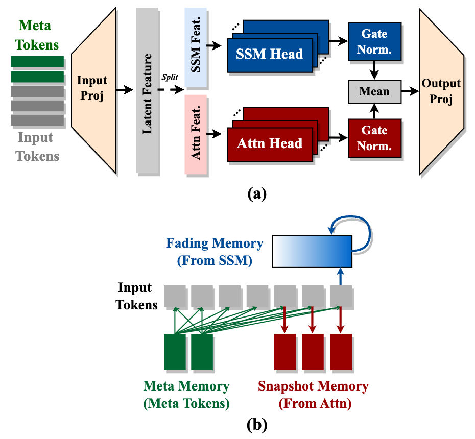
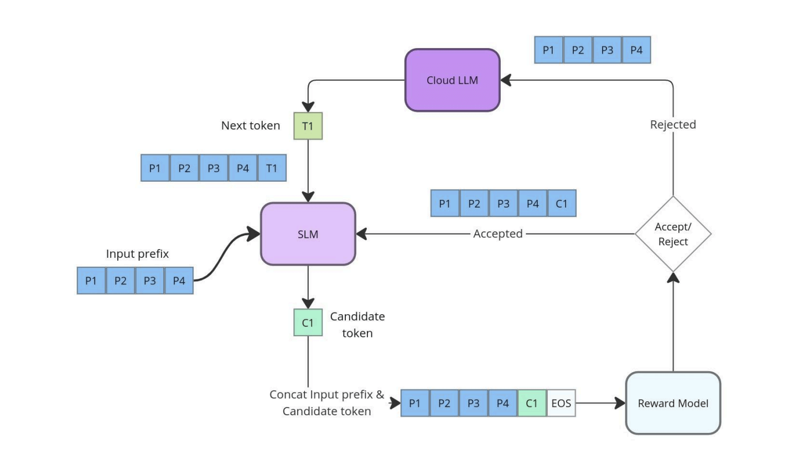
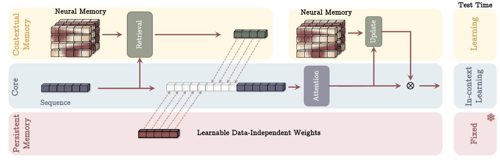
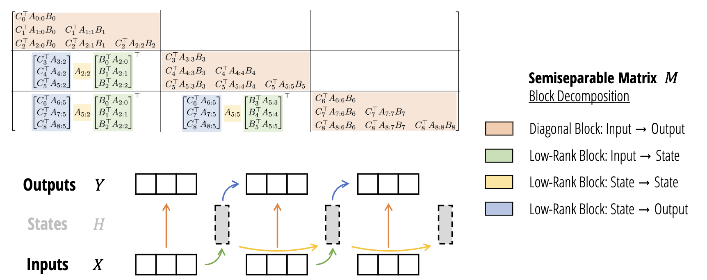
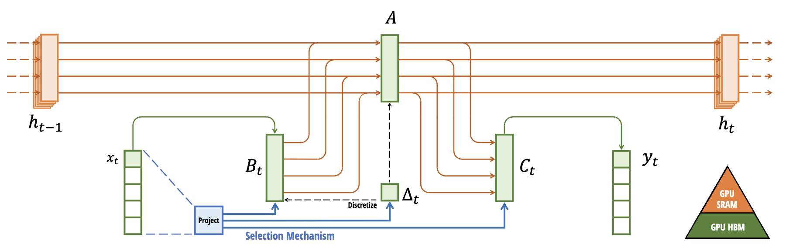
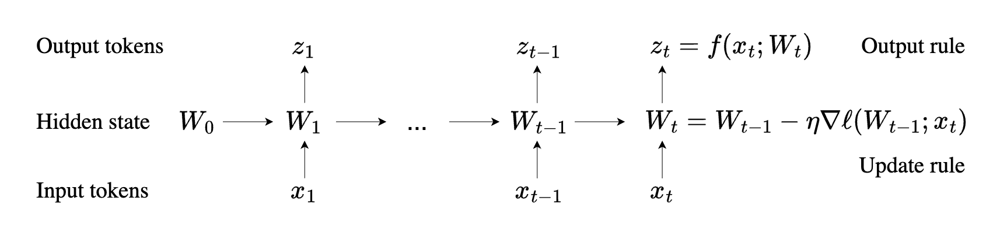
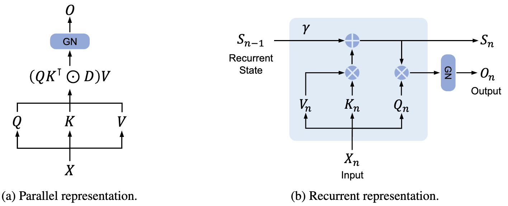
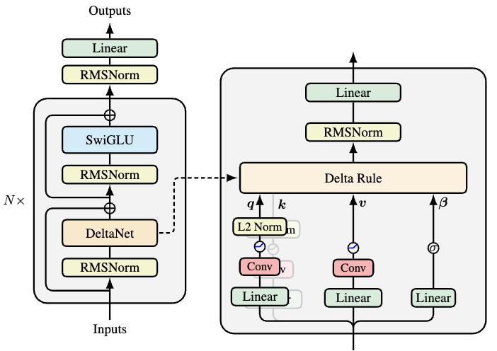
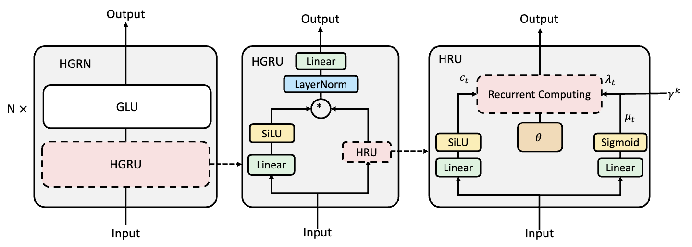
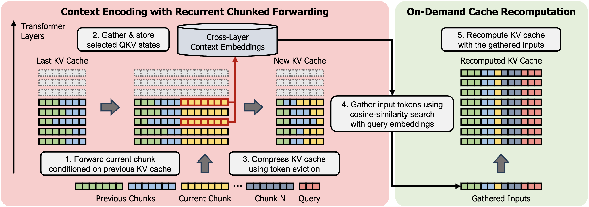

## Efficient Architecture of LLM
| Title & Authors | Introduction | Links |
|:--|  :----: | :---:|
|   [Hymba: A Hybrid-head Architecture for Small Language Models](https://www.arxiv.org/abs/2411.13676)   Xin Dong, Yonggan Fu, Shizhe Diao, Wonmin Byeon, Zijia Chen, Ameya Sunil Mahabaleshwarkar, Shih-Yang Liu, Matthijs Van Keirsbilck, Min-Hung Chen, Yoshi Suhara, Yingyan Lin, Jan Kautz, Pavlo Molchanov | |[Paper](https://www.arxiv.org/pdf/2411.13676)|
|[Efficient Hybrid Inference for LLMs: Reward-Based Token Modelling with Selective Cloud Assistance](https://arxiv.org/abs/2409.13757)   Adarsh MS, Jithin VG, Ditto PS @Bud Ecosystem | |[Paper](https://arxiv.org/pdf/2409.13757)|
| [Rethinking Optimization and Architecture for Tiny Language Models](https://arxiv.org/abs/2402.02791)   Yehui Tang, Fangcheng Liu, Yunsheng Ni, Yuchuan Tian, Zheyuan Bai, Yi-Qi Hu, Sichao Liu, Shangling Jui, Kai Han, Yunhe Wang | |[Github](https://github.com/YuchuanTian/RethinkTinyLM)   [Paper](https://arxiv.org/abs/2402.02791)|
|[Tandem Transformers for Inference Efficient LLMs](https://arxiv.org/abs/2402.08644)   Aishwarya P S, Pranav Ajit Nair, Yashas Samaga, Toby Boyd, Sanjiv Kumar, Prateek Jain, Praneeth Netrapalli | |[Paper](https://arxiv.org/abs/2402.08644)|
|[Scaling Efficient LLMs](https://arxiv.org/abs/2402.14746)   B.N. Kausik | |[Paper](https://arxiv.org/abs/2402.14746)|
|[MobileLLM: Optimizing Sub-billion Parameter Language Models for On-Device Use Cases](https://arxiv.org/abs/2402.14905)   Zechun Liu, Changsheng Zhao, Forrest Iandola, Chen Lai, Yuandong Tian, Igor Fedorov, Yunyang Xiong, Ernie Chang, Yangyang Shi, Raghuraman Krishnamoorthi, Liangzhen Lai, Vikas Chandra | |[Paper](https://arxiv.org/abs/2402.14905)|
|[Think Big, Generate Quick: LLM-to-SLM for Fast Autoregressive Decoding](https://arxiv.org/abs/2402.16844)   Benjamin Bergner, Andrii Skliar, Amelie Royer, Tijmen Blankevoort, Yuki Asano, Babak Ehteshami Bejnordi | |[Paper](https://arxiv.org/abs/2402.16844)|
| [MobiLlama: Towards Accurate and Lightweight Fully Transparent GPT](https://arxiv.org/abs/2402.16840)   Omkar Thawakar, Ashmal Vayani, Salman Khan, Hisham Cholakal, Rao M. Anwer, Michael Felsberg, Tim Baldwin, Eric P. Xing, Fahad Shahbaz Khan | |[Github](https://github.com/mbzuai-oryx/MobiLlama)   [Paper](https://arxiv.org/abs/2402.16840)  [Model](https://huggingface.co/MBZUAI/MobiLlama-05B) |
|[Griffin: Mixing Gated Linear Recurrences with Local Attention for Efficient Language Models](https://arxiv.org/abs/2402.19427)   Soham De, Samuel L. Smith, Anushan Fernando, Aleksandar Botev, George Cristian-Muraru, Albert Gu, Ruba Haroun, Leonard Berrada, Yutian Chen, Srivatsan Srinivasan, Guillaume Desjardins, Arnaud Doucet, David Budden, Yee Whye Teh, Razvan Pascanu, Nando De Freitas, Caglar Gulcehre | |[Paper](https://arxiv.org/abs/2402.19427)|
| [DiJiang: Efficient Large Language Models through Compact Kernelization](https://arxiv.org/abs/2403.19928)   Hanting Chen, Zhicheng Liu, Xutao Wang, Yuchuan Tian, Yunhe Wang | |[Github](https://github.com/YuchuanTian/DiJiang)   [Paper](https://arxiv.org/abs/2403.19928)|
| [Megalodon: Efficient LLM Pretraining and Inference with Unlimited Context Length](https://arxiv.org/abs/2404.08801)   Xuezhe Ma, Xiaomeng Yang, Wenhan Xiong, Beidi Chen, Lili Yu, Hao Zhang, Jonathan May, Luke Zettlemoyer, Omer Levy, Chunting Zhou | |[Github](https://github.com/XuezheMax/megalodon)   [Paper](https://arxiv.org/abs/2404.08801)|
| [Hierarchical Context Merging: Better Long Context Understanding for Pre-trained LLMs](https://arxiv.org/abs/2404.10308)   Woomin Song, Seunghyuk Oh, Sangwoo Mo, Jaehyung Kim, Sukmin Yun, Jung-Woo Ha, Jinwoo Shin | |[Github](https://github.com/alinlab/HOMER)   [Paper](https://arxiv.org/abs/2404.10308)|
| [Block Transformer: Global-to-Local Language Modeling for Fast Inference](https://arxiv.org/abs/2406.02657)   Namgyu Ho, Sangmin Bae, Taehyeon Kim, Hyunjik Jo, Yireun Kim, Tal Schuster, Adam Fisch, James Thorne, Se-Young Yun | |[Github](https://github.com/itsnamgyu/block-transformer)   [Paper](https://arxiv.org/abs/2406.02657)|[//]: #06/12
| [Beyond KV Caching: Shared Attention for Efficient LLMs](https://arxiv.org/abs/2407.12866)   Bingli Liao, Danilo Vasconcellos Vargas | |[Github](https://github.com/metacarbon/shareAtt)   [Paper](https://arxiv.org/abs/2407.12866)|[//]: #07/21
| [Efficient LLM Training and Serving with Heterogeneous Context Sharding among Attention Heads](https://arxiv.org/abs/2407.17678)   Xihui Lin, Yunan Zhang, Suyu Ge, Barun Patra, Vishrav Chaudhary, Xia Song | |[Github](https://github.com/linxihui/dkernel)   [Paper](https://arxiv.org/abs/2407.17678)|[//]: #07/26
|[SentenceVAE: Enable Next-sentence Prediction for Large Language Models with Faster Speed, Higher Accuracy and Longer Context](https://arxiv.org/abs/2408.00655)   Hongjun An, Yifan Chen, Zhe Sun, Xuelong Li | |[Paper](https://arxiv.org/abs/2408.00655)|[//]: #08/08
|[Rodimus*: Breaking the Accuracy-Efficiency Trade-Off with Efficient Attentions](https://arxiv.org/abs/2410.06577)   Zhihao He, Hang Yu, Zi Gong, Shizhan Liu, Jianguo Li, Weiyao Lin | |[Paper](https://arxiv.org/abs/2410.06577)|[//]: #10/14
| [Basis Sharing: Cross-Layer Parameter Sharing for Large Language Model Compression](https://arxiv.org/abs/2410.03765)   Jingcun Wang, Yu-Guang Chen, Ing-Chao Lin, Bing Li, Grace Li Zhang | |[Github](https://github.com/TUDa-HWAI/Basis_Sharing)   [Paper](https://arxiv.org/abs/2410.03765)|[//]: #10/14
| [SeerAttention: Learning Intrinsic Sparse Attention in Your LLMs](https://arxiv.org/abs/2410.13276)   Yizhao Gao, Zhichen Zeng, Dayou Du, Shijie Cao, Hayden Kwok-Hay So, Ting Cao, Fan Yang, Mao Yang | |[Github](https://github.com/microsoft/SeerAttention)   [Paper](https://arxiv.org/abs/2410.13276)|[//]: #10/21
|[Taipan: Efficient and Expressive State Space Language Models with Selective Attention](https://arxiv.org/abs/2410.18572)   Chien Van Nguyen, Huy Huu Nguyen, Thang M. Pham, Ruiyi Zhang, Hanieh Deilamsalehy, Puneet Mathur, Ryan A. Rossi, Trung Bui, Viet Dac Lai, Franck Dernoncourt, Thien Huu Nguyen | |[Paper](https://arxiv.org/abs/2410.18572)|[//]: #10/29
|[Titans: Learning to Memorize at Test Time](https://arxiv.org/abs/2501.00663)   Ali Behrouz, Peilin Zhong, Vahab Mirrokni | |[Paper](https://arxiv.org/abs/2501.00663)| [//]: #01/27
|   [Transformers are SSMs: Generalized Models and Efficient Algorithms Through Structured State Space Duality](https://arxiv.org/abs/2405.21060)   Tri Dao, Albert Gu | |[Github](https://github.com/state-spaces/mamba)   [Paper](https://arxiv.org/pdf/2405.21060)   [Model](https://huggingface.co/docs/transformers/en/model_doc/mamba2)   [Blog](https://tridao.me/blog/2024/mamba2-part1-model/)| [//]: #01/27
| [Mamba: Linear-Time Sequence Modeling with Selective State Spaces](https://arxiv.org/abs/2312.00752)   Albert Gu, Tri Dao | |[Github](https://github.com/state-spaces/mamba)   [Paper](https://arxiv.org/pdf/2312.00752)| [//]: #01/27
| [Learning to (Learn at Test Time): RNNs with Expressive Hidden States](https://arxiv.org/abs/2407.04620)   Yu Sun, Xinhao Li, Karan Dalal, Jiarui Xu, Arjun Vikram, Genghan Zhang, Yann Dubois, Xinlei Chen, Xiaolong Wang, Sanmi Koyejo, Tatsunori Hashimoto, Carlos Guestrin | |[Github](https://github.com/test-time-training/ttt-lm-pytorch)   [Paper](https://arxiv.org/abs/2407.04620)| [//]: #01/27
|[Retentive Network: A Successor to Transformer for Large Language Models](https://arxiv.org/abs/2307.08621)   Yutao Sun, Li Dong, Shaohan Huang, Shuming Ma, Yuqing Xia, Jilong Xue, Jianyong Wang, Furu Wei | |[Paper](https://arxiv.org/abs/2307.08621)| [//]: #01/27
| [Parallelizing Linear Transformers with the Delta Rule over Sequence Length](https://arxiv.org/abs/2406.06484)   Songlin Yang, Bailin Wang, Yu Zhang, Yikang Shen, Yoon Kim | |[Github](https://github.com/fla-org/flash-linear-attention)   [Paper](https://arxiv.org/abs/2406.06484)| [//]: #01/27
| [Hierarchically Gated Recurrent Neural Network for Sequence Modeling](https://arxiv.org/abs/2311.04823)   Zhen Qin, Songlin Yang, Yiran Zhong | |[Github](https://github.com/OpenNLPLab/HGRN)   [Paper](https://arxiv.org/abs/2311.04823)| [//]: #01/27
|[Compress, Gather, and Recompute: REFORMing Long-Context Processing in Transformers](https://arxiv.org/abs/2506.01215)   Woomin Song, Sai Muralidhar Jayanthi, Srikanth Ronanki, Kanthashree Mysore Sathyendra, Jinwoo Shin, Aram Galstyan, Shubham Katiyar, Sravan Babu Bodapati | |[Paper](https://arxiv.org/abs/2506.01215)|[//]: #06/03