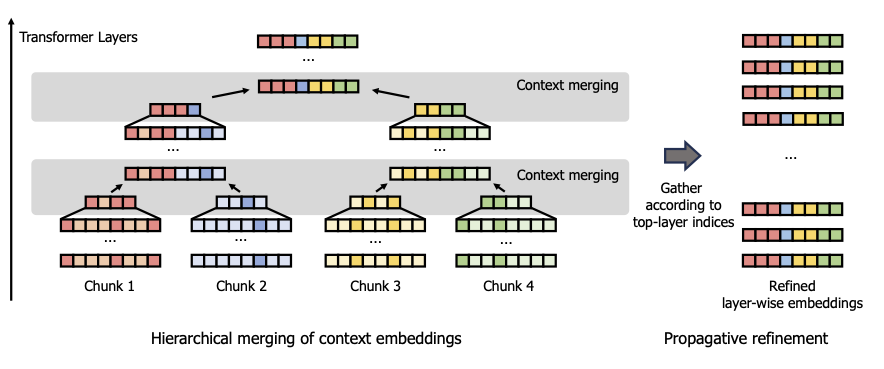

## Efficient Architecture of LLM
| Title & Authors | Introduction | Links |
|:--|  :----: | :---:|
| [Rethinking Optimization and Architecture for Tiny Language Models](https://arxiv.org/abs/2402.02791)   Yehui Tang, Fangcheng Liu, Yunsheng Ni, Yuchuan Tian, Zheyuan Bai, Yi-Qi Hu, Sichao Liu, Shangling Jui, Kai Han, Yunhe Wang | |[Github](https://github.com/YuchuanTian/RethinkTinyLM)   [Paper](https://arxiv.org/abs/2402.02791)|
|[Tandem Transformers for Inference Efficient LLMs](https://arxiv.org/abs/2402.08644)   Aishwarya P S, Pranav Ajit Nair, Yashas Samaga, Toby Boyd, Sanjiv Kumar, Prateek Jain, Praneeth Netrapalli | |[Paper](https://arxiv.org/abs/2402.08644)|
|[Scaling Efficient LLMs](https://arxiv.org/abs/2402.14746)   B.N. Kausik | |[Paper](https://arxiv.org/abs/2402.14746)|
|[MobileLLM: Optimizing Sub-billion Parameter Language Models for On-Device Use Cases](https://arxiv.org/abs/2402.14905)   Zechun Liu, Changsheng Zhao, Forrest Iandola, Chen Lai, Yuandong Tian, Igor Fedorov, Yunyang Xiong, Ernie Chang, Yangyang Shi, Raghuraman Krishnamoorthi, Liangzhen Lai, Vikas Chandra | |[Paper](https://arxiv.org/abs/2402.14905)|
|[Think Big, Generate Quick: LLM-to-SLM for Fast Autoregressive Decoding](https://arxiv.org/abs/2402.16844)   Benjamin Bergner, Andrii Skliar, Amelie Royer, Tijmen Blankevoort, Yuki Asano, Babak Ehteshami Bejnordi | |[Paper](https://arxiv.org/abs/2402.16844)|
| [MobiLlama: Towards Accurate and Lightweight Fully Transparent GPT](https://arxiv.org/abs/2402.16840)   Omkar Thawakar, Ashmal Vayani, Salman Khan, Hisham Cholakal, Rao M. Anwer, Michael Felsberg, Tim Baldwin, Eric P. Xing, Fahad Shahbaz Khan | |[Github](https://github.com/mbzuai-oryx/MobiLlama)   [Paper](https://arxiv.org/abs/2402.16840)  [Model](https://huggingface.co/MBZUAI/MobiLlama-05B) |
|[Griffin: Mixing Gated Linear Recurrences with Local Attention for Efficient Language Models](https://arxiv.org/abs/2402.19427)   Soham De, Samuel L. Smith, Anushan Fernando, Aleksandar Botev, George Cristian-Muraru, Albert Gu, Ruba Haroun, Leonard Berrada, Yutian Chen, Srivatsan Srinivasan, Guillaume Desjardins, Arnaud Doucet, David Budden, Yee Whye Teh, Razvan Pascanu, Nando De Freitas, Caglar Gulcehre | |[Paper](https://arxiv.org/abs/2402.19427)|
| [DiJiang: Efficient Large Language Models through Compact Kernelization](https://arxiv.org/abs/2403.19928)   Hanting Chen, Zhicheng Liu, Xutao Wang, Yuchuan Tian, Yunhe Wang | |[Github](https://github.com/YuchuanTian/DiJiang)   [Paper](https://arxiv.org/abs/2403.19928)|
| [Megalodon: Efficient LLM Pretraining and Inference with Unlimited Context Length](https://arxiv.org/abs/2404.08801)   Xuezhe Ma, Xiaomeng Yang, Wenhan Xiong, Beidi Chen, Lili Yu, Hao Zhang, Jonathan May, Luke Zettlemoyer, Omer Levy, Chunting Zhou | |[Github](https://github.com/XuezheMax/megalodon)   [Paper](https://arxiv.org/abs/2404.08801)|
| [Hierarchical Context Merging: Better Long Context Understanding for Pre-trained LLMs](https://arxiv.org/abs/2404.10308)   Woomin Song, Seunghyuk Oh, Sangwoo Mo, Jaehyung Kim, Sukmin Yun, Jung-Woo Ha, Jinwoo Shin | |[Github](https://github.com/alinlab/HOMER)   [Paper](https://arxiv.org/abs/2404.10308)|
| [Block Transformer: Global-to-Local Language Modeling for Fast Inference](https://arxiv.org/abs/2406.02657)   Namgyu Ho, Sangmin Bae, Taehyeon Kim, Hyunjik Jo, Yireun Kim, Tal Schuster, Adam Fisch, James Thorne, Se-Young Yun | |[Github](https://github.com/itsnamgyu/block-transformer)   [Paper](https://arxiv.org/abs/2406.02657)|[//]: #06/12
| [Beyond KV Caching: Shared Attention for Efficient LLMs](https://arxiv.org/abs/2407.12866)   Bingli Liao, Danilo Vasconcellos Vargas | |[Github](https://github.com/metacarbon/shareAtt)   [Paper](https://arxiv.org/abs/2407.12866)|[//]: #07/21
| [Efficient LLM Training and Serving with Heterogeneous Context Sharding among Attention Heads](https://arxiv.org/abs/2407.17678)   Xihui Lin, Yunan Zhang, Suyu Ge, Barun Patra, Vishrav Chaudhary, Xia Song | |[Github](https://github.com/linxihui/dkernel)   [Paper](https://arxiv.org/abs/2407.17678)|[//]: #07/26
|[SentenceVAE: Enable Next-sentence Prediction for Large Language Models with Faster Speed, Higher Accuracy and Longer Context](https://arxiv.org/abs/2408.00655)   Hongjun An, Yifan Chen, Zhe Sun, Xuelong Li | |[Paper](https://arxiv.org/abs/2408.00655)|[//]: #08/08