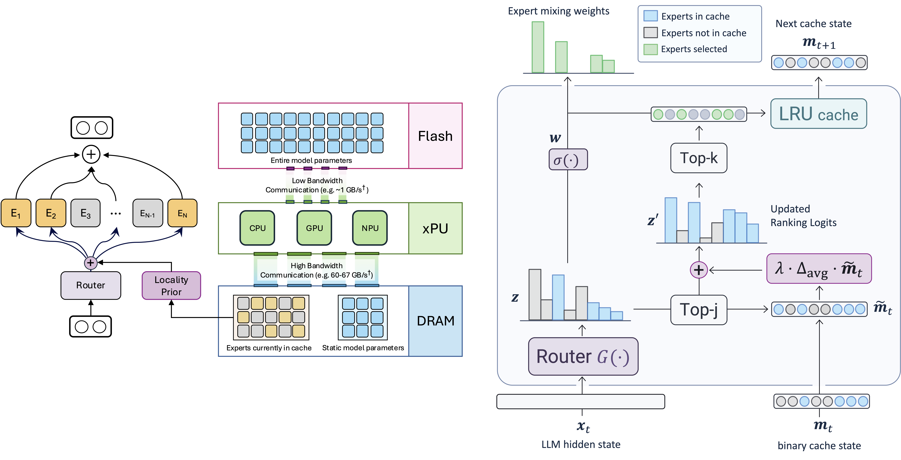

## Efficient MOE
| Title & Authors | Introduction | Links |
|:--|  :----: | :---:|
|[SiDA: Sparsity-Inspired Data-Aware Serving for Efficient and Scalable Large Mixture-of-Experts Models](https://arxiv.org/abs/2310.18859)   Zhixu Du, Shiyu Li, Yuhao Wu, Xiangyu Jiang, Jingwei Sun, Qilin Zheng, Yongkai Wu, Ang Li, Hai "Helen" Li, Yiran Chen | |[Paper](https://arxiv.org/abs/2310.18859)|
| [Fast Inference of Mixture-of-Experts Language Models with Offloading](https://arxiv.org/abs/2312.17238)   Artyom Eliseev, Denis Mazur | |[Github](https://github.com/dvmazur/mixtral-offloading)   [Paper](https://arxiv.org/abs/2312.17238)|
| [SwitchHead: Accelerating Transformers with Mixture-of-Experts Attention](https://arxiv.org/abs/2312.07987)   Róbert Csordás, Piotr Piękos, Kazuki Irie, Jürgen Schmidhuber | |[Github](https://github.com/robertcsordas/moe_attention)   [Paper](https://arxiv.org/abs/2312.07987)|
| [Exploiting Inter-Layer Expert Affinity for Accelerating Mixture-of-Experts Model Inference](https://arxiv.org/abs/2401.08383)   Jinghan Yao, Quentin Anthony, Aamir Shafi, Hari Subramoni, Dhabaleswar K. (DK)Panda | |[Github](https://github.com/YJHMITWEB/ExFlow)   [Paper](https://arxiv.org/abs/2401.08383)|
| [MoE-Infinity: Activation-Aware Expert Offloading for Efficient MoE Serving](https://arxiv.org/abs/2401.14361)   Leyang Xue, Yao Fu, Zhan Lu, Luo Mai, Mahesh Marina | |[Github](https://github.com/TorchMoE/MoE-Infinity)   [Paper](https://arxiv.org/abs/2401.14361)|
| [Fiddler: CPU-GPU Orchestration for Fast Inference of Mixture-of-Experts Models](https://arxiv.org/abs/2402.07033)   Keisuke Kamahori, Yile Gu, Kan Zhu, Baris Kasikci | |[Github](https://github.com/efeslab/fiddler)   [Paper](https://arxiv.org/abs/2402.07033)|
| [Not All Experts are Equal: Efficient Expert Pruning and Skipping for Mixture-of-Experts Large Language Models](https://arxiv.org/abs/2402.14800)   Xudong Lu, Qi Liu, Yuhui Xu, Aojun Zhou, Siyuan Huang, Bo Zhang, Junchi Yan, Hongsheng Li | |[Github](https://github.com/Lucky-Lance/Expert_Sparsity)   [Paper](https://arxiv.org/abs/2402.14800)|
|[Enhancing Efficiency in Sparse Models with Sparser Selection](https://arxiv.org/abs/2403.18926)   Yuanhang Yang, Shiyi Qi, Wenchao Gu, Chaozheng Wang, Cuiyun Gao, Zenglin Xu | |[Github](https://anonymous.4open.science/r/XMoE)   [Paper](https://arxiv.org/abs/2403.18926)|
| [Prompt-prompted Mixture of Experts for Efficient LLM Generation](https://arxiv.org/abs/2404.01365)   Harry Dong, Beidi Chen, Yuejie Chi | |[Github](https://github.com/hdong920/GRIFFIN)   [Paper](https://arxiv.org/abs/2404.01365)|
|[Shortcut-connected Expert Parallelism for Accelerating Mixture-of-Experts](https://arxiv.org/abs/2404.05019)   Weilin Cai, Juyong Jiang, Le Qin, Junwei Cui, Sunghun Kim, Jiayi Huang | |[Paper](https://arxiv.org/abs/2404.05019)|
|[SEER-MoE: Sparse Expert Efficiency through Regularization for Mixture-of-Experts](https://arxiv.org/abs/2404.05089)   Alexandre Muzio, Alex Sun, Churan He | |[Paper](https://arxiv.org/abs/2404.05089)|
|[Dense Training, Sparse Inference: Rethinking Training of Mixture-of-Experts Language Models](https://arxiv.org/abs/2404.05567)   Bowen Pan, Yikang Shen, Haokun Liu, Mayank Mishra, Gaoyuan Zhang, Aude Oliva, Colin Raffel, Rameswar Panda | |[Paper](https://arxiv.org/abs/2404.05567)|
| [Lancet: Accelerating Mixture-of-Experts Training via Whole Graph Computation-Communication Overlapping](https://arxiv.org/abs/2404.19429)   Chenyu Jiang, Ye Tian, Zhen Jia, Shuai Zheng, Chuan Wu, Yida Wang | |[Paper](https://arxiv.org/abs/2404.19429)|
| [A Provably Effective Method for Pruning Experts in Fine-tuned Sparse Mixture-of-Experts](https://arxiv.org/pdf/2405.16646)   Mohammed Nowaz Rabbani Chowdhury, Meng Wang, Kaoutar El Maghraoui, Naigang Wang, Pin-Yu Chen, Christopher Carothers | |[Paper](https://arxiv.org/pdf/2405.16646)|
| [Dynamic Mixture of Experts: An Auto-Tuning Approach for Efficient Transformer Models](https://arxiv.org/abs/2405.14297)   Yongxin Guo, Zhenglin Cheng, Xiaoying Tang, Tao Lin | |[Github](https://github.com/LINs-lab/DynMoE)   [Paper](https://arxiv.org/abs/2405.14297)|
| [MoNDE: Mixture of Near-Data Experts for Large-Scale Sparse Models](https://arxiv.org/abs/2405.18832)   Taehyun Kim, Kwanseok Choi, Youngmock Cho, Jaehoon Cho, Hyuk-Jae Lee, Jaewoong Sim | |[Paper](https://arxiv.org/abs/2405.18832)|
| [Demystifying the Compression of Mixture-of-Experts Through a Unified Framework](https://arxiv.org/abs/2406.02500)   Shwai He, Daize Dong, Liang Ding, Ang Li | |[Github](https://github.com/DaizeDong/Unified-MoE-Compression)   [Paper](https://arxiv.org/abs/2406.02500)|
|[ME-Switch: A Memory-Efficient Expert Switching Framework for Large Language Models](https://arxiv.org/abs/2406.09041)   Jing Liu, Ruihao Gong, Mingyang Zhang, Yefei He, Jianfei Cai, Bohan Zhuang | |[Paper](https://arxiv.org/abs/2406.09041)|[//]: #06/18
| [Examining Post-Training Quantization for Mixture-of-Experts: A Benchmark](https://arxiv.org/abs/2406.08155)   Pingzhi Li, Xiaolong Jin, Yu Cheng, Tianlong Chen | |[Github](https://github.com/UNITES-Lab/moe-quantization)   [Paper](https://arxiv.org/abs/2406.08155)|[//]: #06/18
| [Efficient Expert Pruning for Sparse Mixture-of-Experts Language Models: Enhancing Performance and Reducing Inference Costs](https://arxiv.org/abs/2407.00945)   Enshu Liu, Junyi Zhu, Zinan Lin, Xuefei Ning, Matthew B. Blaschko, Shengen Yan, Guohao Dai, Huazhong Yang, Yu Wang | |[Github](https://github.com/imagination-research/EEP)   [Paper](https://arxiv.org/abs/2407.00945)|[//]: #07/03
|[Diversifying the Expert Knowledge for Task-Agnostic Pruning in Sparse Mixture-of-Experts](https://arxiv.org/abs/2407.09590)   Zeliang Zhang, Xiaodong Liu, Hao Cheng, Chenliang Xu, Jianfeng Gao | |[Paper](https://arxiv.org/abs/2407.09590)|[//]: #07/16
| [MC-MoE: Mixture Compressor for Mixture-of-Experts LLMs Gains More](https://arxiv.org/abs/2410.06270)   Wei Huang, Yue Liao, Jianhui Liu, Ruifei He, Haoru Tan, Shiming Zhang, Hongsheng Li, Si Liu, Xiaojuan Qi | |[Github](https://github.com/Aaronhuang-778/MC-MoE)   [Paper](https://arxiv.org/abs/2410.06270)|[//]: #10/14
|[EPS-MoE: Expert Pipeline Scheduler for Cost-Efficient MoE Inference](https://arxiv.org/abs/2410.12247)   Yulei Qian, Fengcun Li, Xiangyang Ji, Xiaoyu Zhao, Jianchao Tan, Kefeng Zhang, Xunliang Cai | |[Paper](https://arxiv.org/abs/2410.12247)|[//]: #10/21
|[ExpertFlow: Optimized Expert Activation and Token Allocation for Efficient Mixture-of-Experts Inference](https://arxiv.org/abs/2410.17954)   Xin He, Shunkang Zhang, Yuxin Wang, Haiyan Yin, Zihao Zeng, Shaohuai Shi, Zhenheng Tang, Xiaowen Chu, Ivor Tsang, Ong Yew Soon | |[Paper](https://arxiv.org/abs/2410.17954)|[//]: #10/29
|[ProMoE: Fast MoE-based LLM Serving using Proactive Caching](https://arxiv.org/abs/2410.22134)   Xiaoniu Song, Zihang Zhong, Rong Chen | |[Paper](https://arxiv.org/abs/2410.22134)|[//]: #11/17
|[HOBBIT: A Mixed Precision Expert Offloading System for Fast MoE Inference](https://arxiv.org/abs/2411.01433)   Peng Tang, Jiacheng Liu, Xiaofeng Hou, Yifei Pu, Jing Wang, Pheng-Ann Heng, Chao Li, Minyi Guo | |[Paper](https://arxiv.org/abs/2411.01433)|[//]: #11/18
| [MoNTA: Accelerating Mixture-of-Experts Training with Network-Traffc-Aware Parallel Optimization](https://arxiv.org/abs/2411.00662)   Jingming Guo, Yan Liu, Yu Meng, Zhiwei Tao, Banglan Liu, Gang Chen, Xiang Li | |[Github](https://github.com/EnflameTechnology/DeepSpeed)   [Paper](https://arxiv.org/abs/2411.00662)|[//]: #11/18
| [MoE-I2: Compressing Mixture of Experts Models through Inter-Expert Pruning and Intra-Expert Low-Rank Decomposition](https://arxiv.org/abs/2411.01016)   Cheng Yang, Yang Sui, Jinqi Xiao, Lingyi Huang, Yu Gong, Yuanlin Duan, Wenqi Jia, Miao Yin, Yu Cheng, Bo Yuan | |[Github](https://github.com/xiaochengsky/MoEI-2)   [Paper](https://arxiv.org/abs/2411.01016)|[//]: #11/18
|[Mixture of Cache-Conditional Experts for Efficient Mobile Device Inference](https://arxiv.org/abs/2412.00099)   Andrii Skliar, Ties van Rozendaal, Romain Lepert, Todor Boinovski, Mart van Baalen, Markus Nagel, Paul Whatmough, Babak Ehteshami Bejnordi | |[Paper](https://arxiv.org/abs/2412.00099)|