## Inference Acceleration
| Title & Authors | Introduction | Links |
|:--|  :----: | :---:|
| [Deja Vu: Contextual Sparsity for Efficient LLMs at Inference Time](https://openreview.net/forum?id=wIPIhHd00i)   Zichang Liu, Jue WANG, Tri Dao, Tianyi Zhou, Binhang Yuan, Zhao Song, Anshumali Shrivastava, Ce Zhang, Yuandong Tian, Christopher Re, Beidi Chen |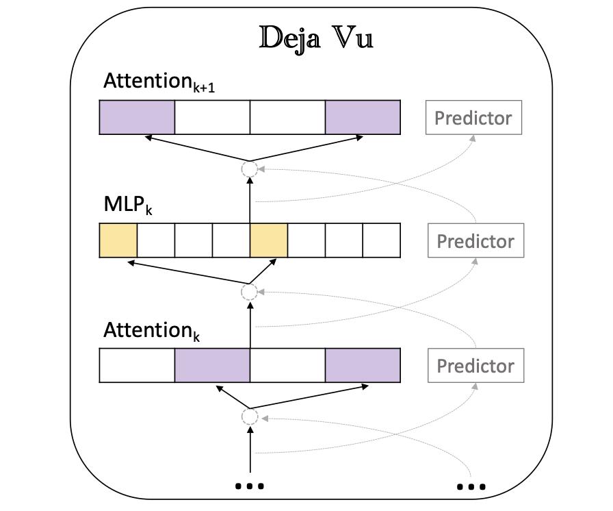 |[Github](https://github.com/FMInference/DejaVu)   [Paper](https://openreview.net/forum?id=wIPIhHd00i)|
| [Dynamic Context Pruning for Efficient and Interpretable Autoregressive Transformers](https://arxiv.org/abs/2305.15805)   Sotiris Anagnostidis, Dario Pavllo, Luca Biggio, Lorenzo Noci, Aurelien Lucchi, Thomas Hofmann |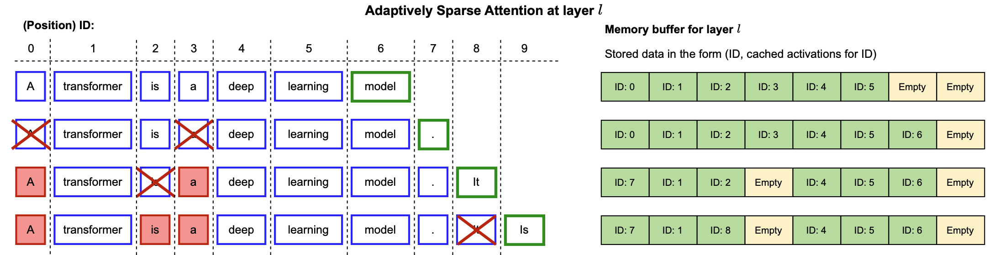 |[Paper](https://arxiv.org/abs/2305.15805)|
| [H2O: Heavy-Hitter Oracle for Efficient Generative Inference of Large Language Models](https://arxiv.org/abs/2306.14048)   Zhenyu Zhang, Ying Sheng, Tianyi Zhou, Tianlong Chen, Lianmin Zheng, Ruisi Cai, Zhao Song, Yuandong Tian, Christopher Ré, Clark Barrett, Zhangyang Wang, Beidi Chen | |[Github](https://github.com/FMInference/H2O)   [Paper](https://arxiv.org/abs/2306.14048)|
| [Fast and Robust Early-Exiting Framework for Autoregressive Language Models with Synchronized Parallel Decoding](https://arxiv.org/abs/2310.05424)   Sangmin Bae, Jongwoo Ko, Hwanjun Song, Se-Young Yun |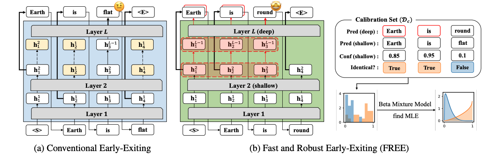 |[Github](https://github.com/raymin0223/fast_robust_early_exit)   [Paper](https://arxiv.org/abs/2310.05424)|
| [Compressing Context to Enhance Inference Efficiency of Large Language Models](https://arxiv.org/abs/2310.06201)   Yucheng Li, Bo Dong, Chenghua Lin, Frank Guerin |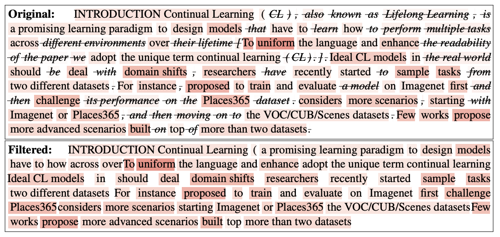 |[Github](https://github.com/liyucheng09/Selective_Context)   [Paper](https://arxiv.org/abs/2310.06201)|
| [ConsistentEE: A Consistent and Hardness-Guided Early Exiting Method for Accelerating Language Models Inference](https://arxiv.org/abs/2312.11882)   Ziqian Zeng, Yihuai Hong, Hongliang Dai, Huiping Zhuang, Cen Chen |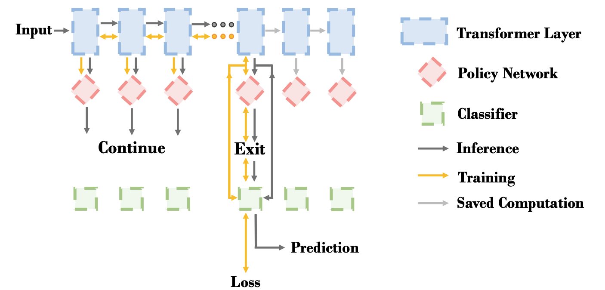 |[Paper](https://arxiv.org/abs/2312.11882)|
| [Accelerating LLM Inference with Staged Speculative Decoding](https://arxiv.org/abs/2308.04623)   Benjamin Spector, Chris Re |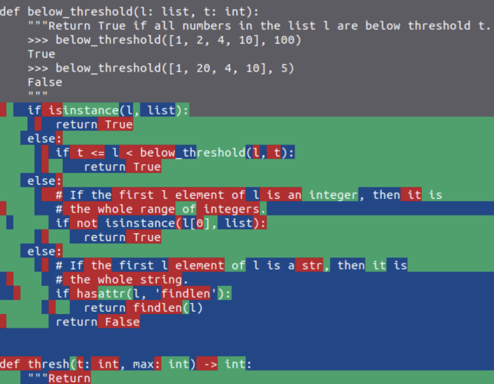 |[Paper](https://arxiv.org/abs/2308.04623)|
| [TCRA-LLM: Token Compression Retrieval Augmented Large Language Model for Inference Cost Reduction](https://arxiv.org/abs/2310.15556)   Junyi Liu, Liangzhi Li, Tong Xiang, Bowen Wang, Yiming Qian |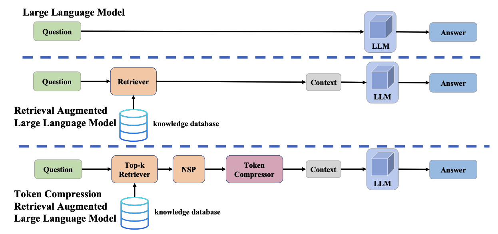 |[Paper](https://arxiv.org/abs/2310.15556)|
| [Inference with Reference: Lossless Acceleration of Large Language Models](https://arxiv.org/abs/2304.04487)   Nan Yang, Tao Ge, Liang Wang, Binxing Jiao, Daxin Jiang, Linjun Yang, Rangan Majumder, Furu Wei | 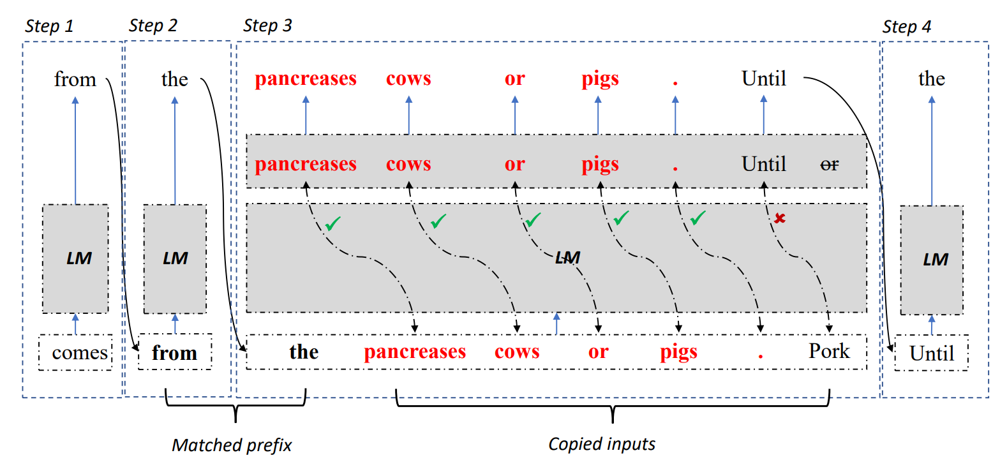 | [Github](https://github.com/microsoft/LMOps/tree/main/llma)   [paper](https://arxiv.org/abs/2304.04487) |
|    [SpecInfer: Accelerating Generative LLM Serving with Speculative Inference and Token Tree Verification](https://arxiv.org/abs/2305.09781)   Xupeng Miao, Gabriele Oliaro, Zhihao Zhang, Xinhao Cheng, Zeyu Wang, Rae Ying Yee Wong, Zhuoming Chen, Daiyaan Arfeen, Reyna Abhyankar, Zhihao Jia| | [Github](https://github.com/flexflow/FlexFlow/tree/inference)   [paper](https://arxiv.org/abs/2305.09781) |
|[SkipDecode: Autoregressive Skip Decoding with Batching and Caching for Efficient LLM Inference](https://arxiv.org/abs/2307.02628)   Luciano Del Corro, Allie Del Giorno, Sahaj Agarwal, Bin Yu, Ahmed Awadallah, Subhabrata Mukherjee |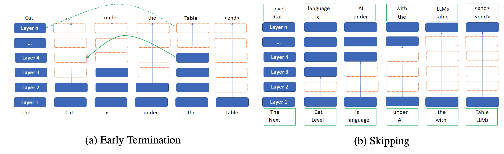 |[Paper](https://arxiv.org/abs/2307.02628)|
|[Skeleton-of-Thought: Large Language Models Can Do Parallel Decoding](https://arxiv.org/abs/2307.15337)   Xuefei Ning, Zinan Lin, Zixuan Zhou, Huazhong Yang, Yu Wang |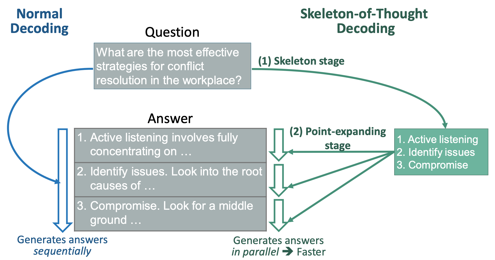 |[Paper](https://arxiv.org/abs/2307.15337)|
| [Draft & Verify: Lossless Large Language Model Acceleration via Self-Speculative Decoding](https://arxiv.org/abs/2309.08168)   Jun Zhang, Jue Wang, Huan Li, Lidan Shou, Ke Chen, Gang Chen, Sharad Mehrotra | |[Github](https://github.com/dilab-zju/self-speculative-decoding)   [Paper](https://arxiv.org/abs/2309.08168)|
| [Efficient Streaming Language Models with Attention Sinks](https://arxiv.org/abs/2309.17453)   Guangxuan Xiao, Yuandong Tian, Beidi Chen, Song Han, Mike Lewis | |[Github](https://github.com/mit-han-lab/streaming-llm)   [Paper](https://arxiv.org/abs/2309.17453)|
|[(Dynamic) Prompting might be all you need to repair Compressed LLMs](https://arxiv.org/abs/2310.00867)   Duc N.M Hoang, Minsik Cho, Thomas Merth, Mohammad Rastegari, Zhangyang Wang |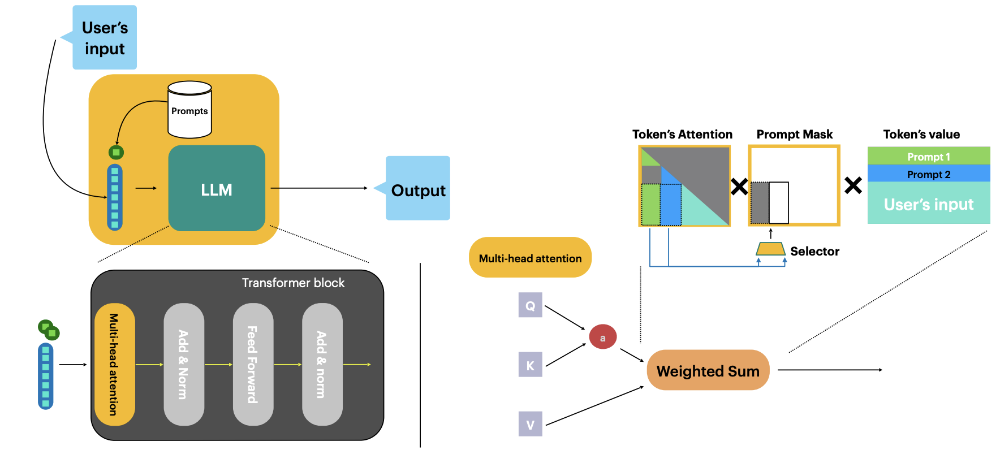 |[Paper](https://arxiv.org/abs/2310.00867)|
| [Large Language Model Cascades with Mixture of Thoughts Representations for Cost-efficient Reasoning](https://arxiv.org/abs/2310.03094)   Murong Yue, Jie Zhao, Min Zhang, Liang Du, Ziyu Yao |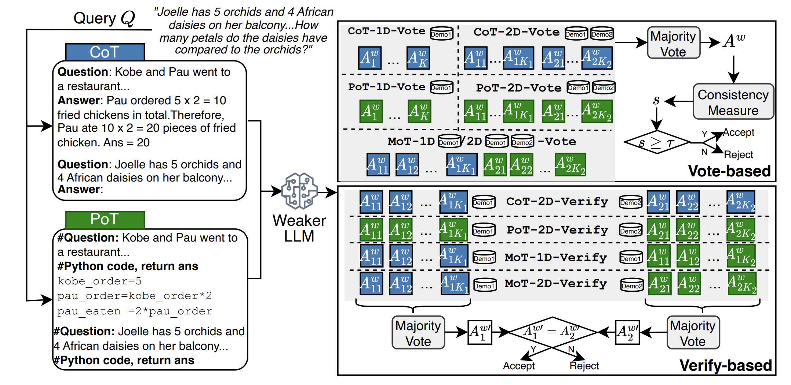 |[Github](https://github.com/MurongYue/LLM_MoT_cascade)   [Paper](https://arxiv.org/abs/2310.03094)|
|[CacheGen: Fast Context Loading for Language Model Applications](https://arxiv.org/abs/2310.07240)   Yuhan Liu, Hanchen Li, Kuntai Du, Jiayi Yao, Yihua Cheng, Yuyang Huang, Shan Lu, Michael Maire, Henry Hoffmann, Ari Holtzman, Ganesh Ananthanarayanan, Junchen Jiang |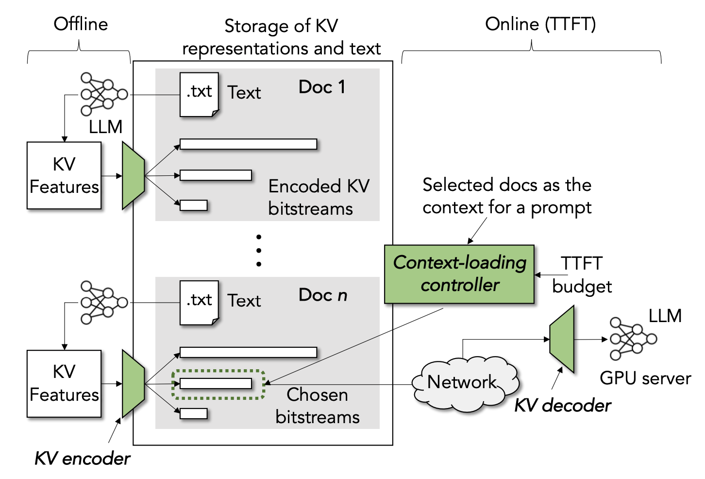 |[Paper](https://arxiv.org/abs/2310.07240)|
| [Context Compression for Auto-regressive Transformers with Sentinel Tokens](https://arxiv.org/abs/2310.08152)   Siyu Ren, Qi Jia, Kenny Q. Zhu |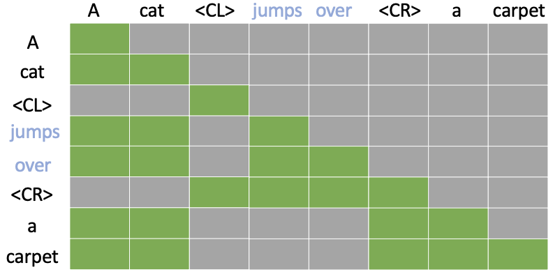 |[Github](https://github.com/DRSY/KV_Compression)   [Paper](https://arxiv.org/abs/2310.08152)|
| [A Setwise Approach for Effective and Highly Efficient Zero-shot Ranking with Large Language Models](https://arxiv.org/abs/2310.09497)   Shengyao Zhuang, Honglei Zhuang, Bevan Koopman, Guido Zuccon |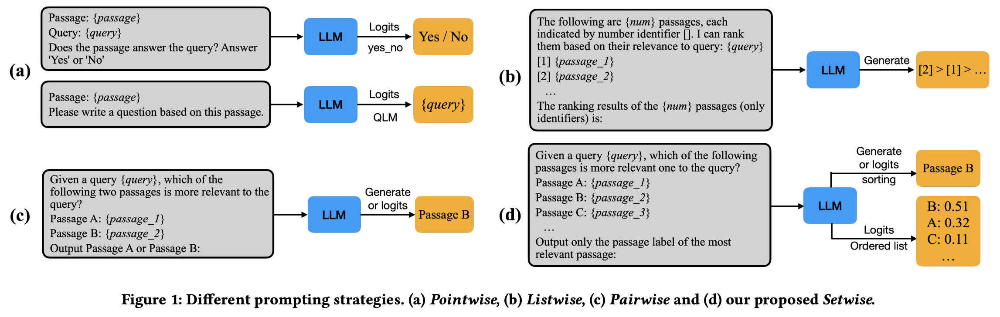 |[Github](https://github.com/ielab/llm-rankers)   [Paper](https://arxiv.org/abs/2310.09497)|
|[SPEED: Speculative Pipelined Execution for Efficient Decoding](https://arxiv.org/abs/2310.12072)   Coleman Hooper, Sehoon Kim, Hiva Mohammadzadeh, Hasan Genc, Kurt Keutzer, Amir Gholami, Sophia Shao |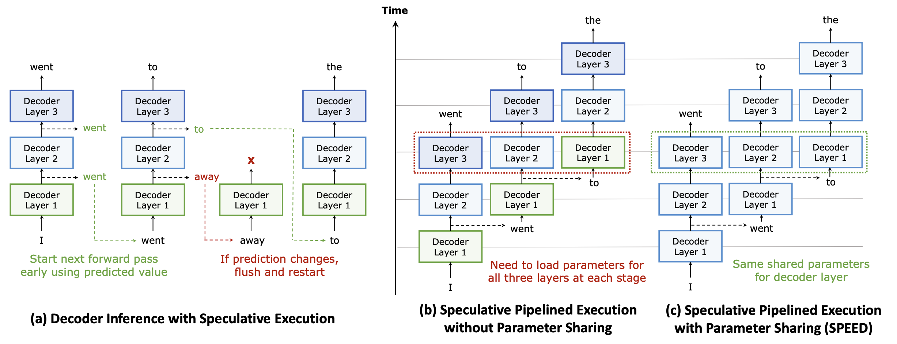 |[Paper](https://arxiv.org/abs/2310.12072)|
|[Accelerating LLM Inference by Enabling Intermediate Layer Decoding](https://arxiv.org/abs/2310.18581)   Neeraj Varshney, Agneet Chatterjee, Mihir Parmar, Chitta Baral |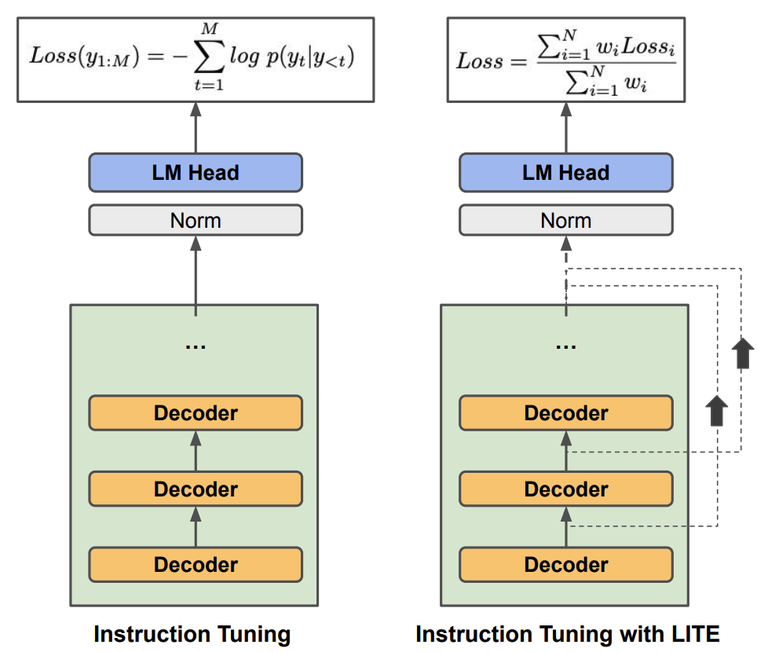 |[Paper](https://arxiv.org/abs/2310.18581)|
|[Fast Chain-of-Thought: A Glance of Future from Parallel Decoding Leads to Answers Faster](https://arxiv.org/abs/2311.08263)   Hongxuan Zhang, Zhining Liu, Jiaqi Zheng, Chenyi Zhuang, Jinjie Gu, Guihai Chen |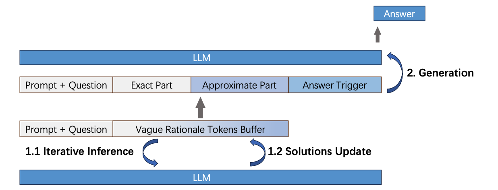 |[Paper](https://arxiv.org/abs/2311.08263)|
| [Compressed Context Memory For Online Language Model Interaction](https://arxiv.org/abs/2312.03414)   Jang-Hyun Kim, Junyoung Yeom, Sangdoo Yun, Hyun Oh Song | |[Github](https://github.com/snu-mllab/context-memory)   [Paper](https://arxiv.org/abs/2312.03414)|
|[SparQ Attention: Bandwidth-Efficient LLM Inference](https://arxiv.org/abs/2312.04985)   Luka Ribar, Ivan Chelombiev, Luke Hudlass-Galley, Charlie Blake, Carlo Luschi, Douglas Orr |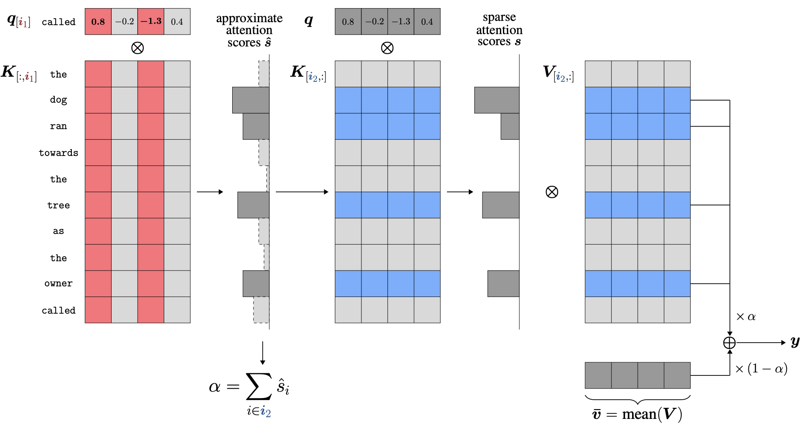 |[Paper](https://arxiv.org/abs/2312.04985)|
|[Lookahead: An Inference Acceleration Framework for Large Language Model with Lossless Generation Accuracy](https://arxiv.org/abs/2312.12728)   Yao Zhao, Zhitian Xie, Chenyi Zhuang, Jinjie Gu |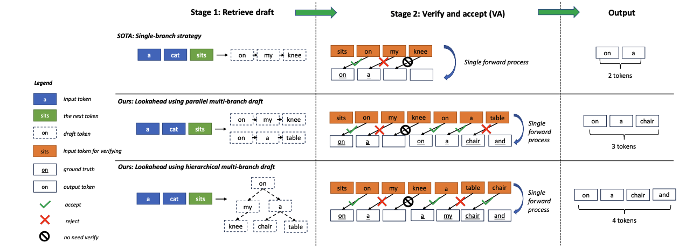 |[Paper](https://arxiv.org/abs/2312.12728)|
|[Cascade Speculative Drafting for Even Faster LLM Inference](https://arxiv.org/abs/2312.11462)   Ziyi Chen, Xiaocong Yang, Jiacheng Lin, Chenkai Sun, Jie Huang, Kevin Chen-Chuan Chang |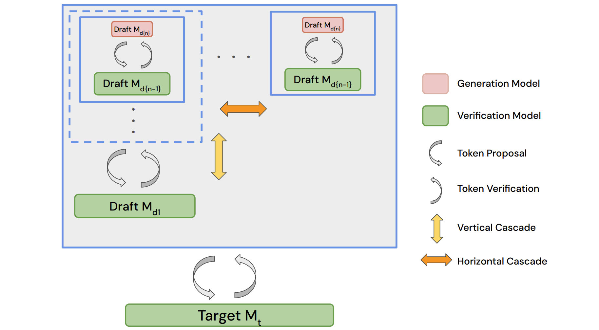 |[Paper](https://arxiv.org/abs/2312.11462)|
| [EAGLE: Lossless Acceleration of LLM Decoding by Feature Extrapolation](https://sites.google.com/view/eagle-llm)   Yuhui Li, Chao Zhang, and Hongyang Zhang | |[Github](https://github.com/SafeAILab/EAGLE)   [Blog](https://sites.google.com/view/eagle-llm)|
|[LoMA: Lossless Compressed Memory Attention](https://arxiv.org/abs/2401.09486)   Yumeng Wang, Zhenyang Xiao |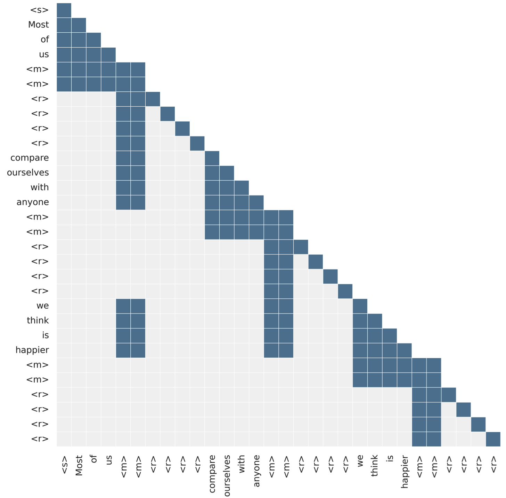 |[Paper](https://arxiv.org/abs/2401.09486)|
| [Medusa: Simple LLM Inference Acceleration Framework with Multiple Decoding Heads](https://arxiv.org/abs/2401.10774)   Tianle Cai, Yuhong Li, Zhengyang Geng, Hongwu Peng, Jason D. Lee, Deming Chen, Tri Dao | |[Github](https://github.com/FasterDecoding/Medusa)   [Paper](https://arxiv.org/abs/2401.10774)|
|[APAR: LLMs Can Do Auto-Parallel Auto-Regressive Decoding](https://arxiv.org/abs/2401.06761)   Mingdao Liu, Aohan Zeng, Bowen Wang, Peng Zhang, Jie Tang, Yuxiao Dong | |[Paper](https://arxiv.org/abs/2401.06761)|
| [BiTA: Bi-Directional Tuning for Lossless Acceleration in Large Language Models](https://arxiv.org/abs/2401.12522)   Feng Lin, Hanling Yi, Hongbin Li, Yifan Yang, Xiaotian Yu, Guangming Lu, Rong Xiao |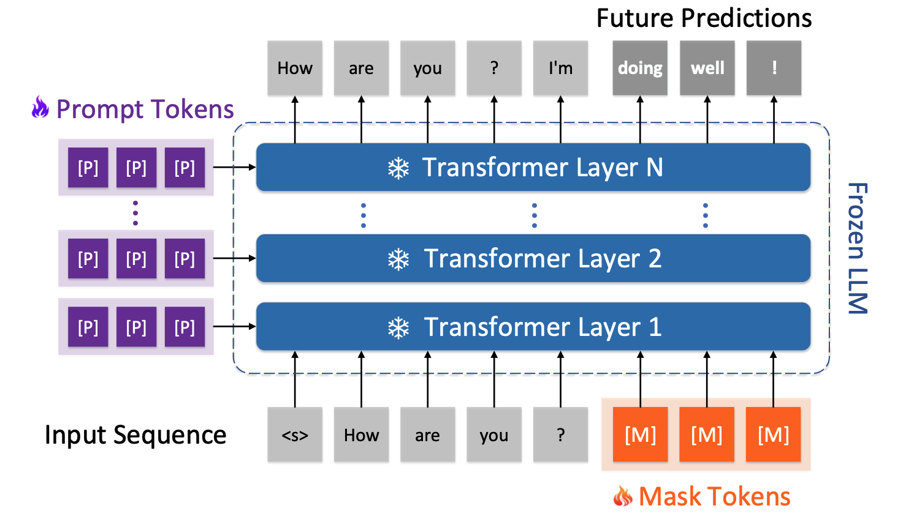 |[Github](https://github.com/linfeng93/BiTA)   [Paper](https://arxiv.org/abs/2401.12522)|
|[Speculative Streaming: Fast LLM Inference without Auxiliary Models](https://arxiv.org/abs/2402.11131)   Nikhil Bhendawade, Irina Belousova, Qichen Fu, Henry Mason, Mohammad Rastegari, Mahyar Najibi |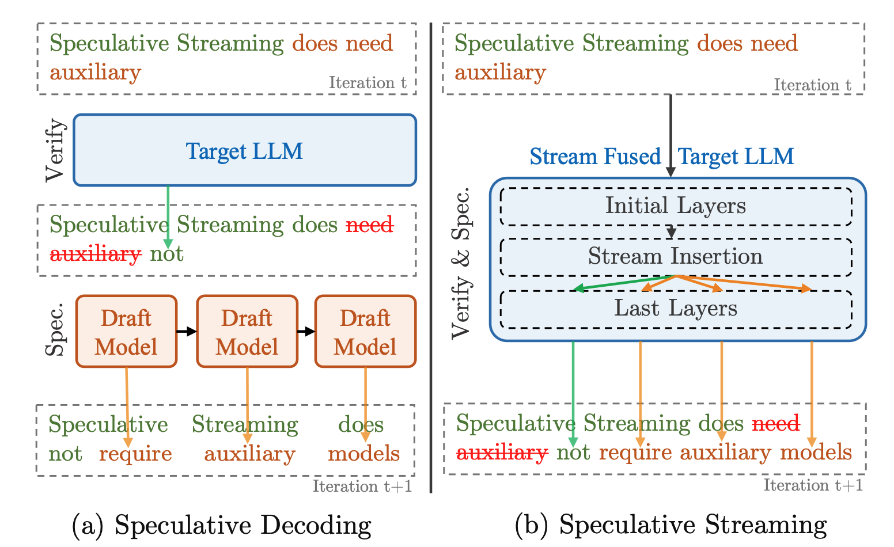 |[Paper](https://arxiv.org/abs/2402.11131)|
|[RelayAttention for Efficient Large Language Model Serving with Long System Prompts](https://arxiv.org/abs/2402.14808)   Lei Zhu, Xinjiang Wang, Wayne Zhang, Rynson W.H. Lau | |[Paper](https://arxiv.org/abs/2402.14808)|
|[Recursive Speculative Decoding: Accelerating LLM Inference via Sampling Without Replacement](https://arxiv.org/abs/2402.14160)   Wonseok Jeon, Mukul Gagrani, Raghavv Goel, Junyoung Park, Mingu Lee, Christopher Lott |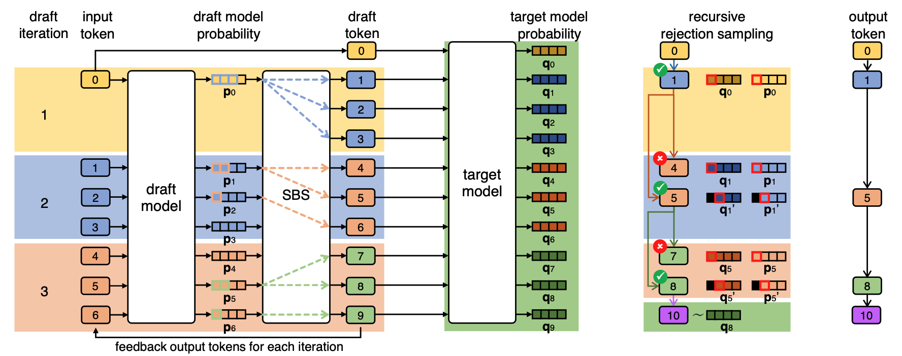 |[Paper](https://arxiv.org/abs/2402.14160)|
| [Chimera: A Lossless Decoding Method for Accelerating Large Language Models Inference by Fusing all Tokens](https://arxiv.org/abs/2402.15758)   Ziqian Zeng, Jiahong Yu, Qianshi Pang, Zihao Wang, Huiping Zhuang, Cen Chen | |[Github](https://github.com/kafkayu/Chimera)   [Paper](https://arxiv.org/abs/2402.15758)|
|[CHAI: Clustered Head Attention for Efficient LLM Inference](https://arxiv.org/abs/2403.08058)   Saurabh Agarwal, Bilge Acun, Basil Homer, Mostafa Elhoushi, Yejin Lee, Shivaram Venkataraman, Dimitris Papailiopoulos, Carole-Jean Wu |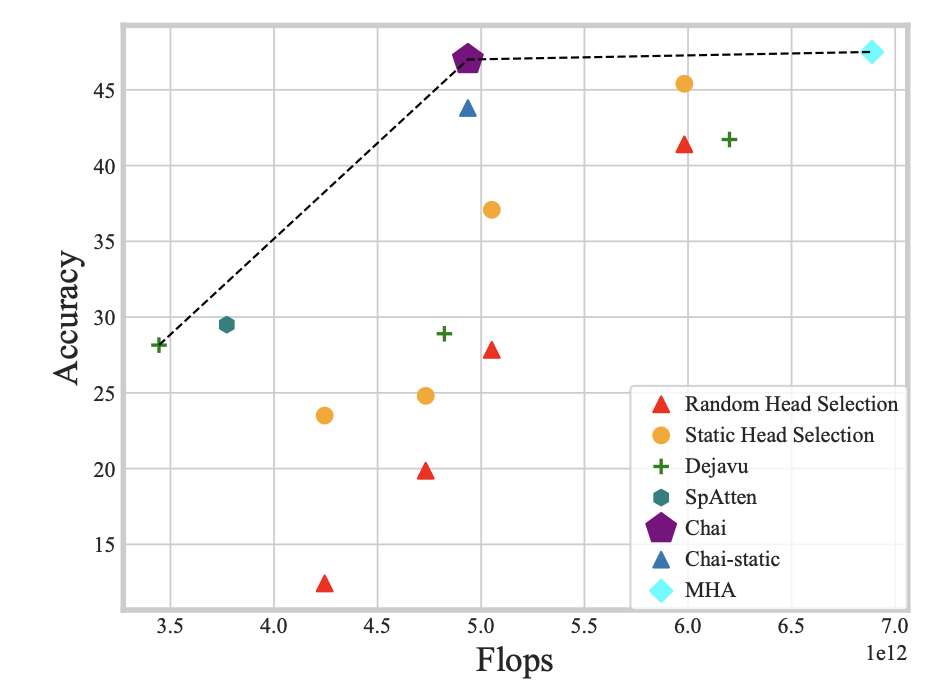 |[Paper](https://arxiv.org/abs/2403.08058)|
|[Dynamic Memory Compression: Retrofitting LLMs for Accelerated Inference](https://arxiv.org/abs/2403.09636)   Piotr Nawrot, Adrian Łańcucki, Marcin Chochowski, David Tarjan, Edoardo M. Ponti | |[Paper](https://arxiv.org/abs/2403.09636)|
|[Recurrent Drafter for Fast Speculative Decoding in Large Language Models](https://arxiv.org/abs/2403.09919)   Aonan Zhang, Chong Wang, Yi Wang, Xuanyu Zhang, Yunfei Cheng | |[Paper](https://arxiv.org/abs/2403.09919)|
|[Optimal Block-Level Draft Verification for Accelerating Speculative Decoding](https://arxiv.org/abs/2403.10444)   Ziteng Sun, Jae Hun Ro, Ahmad Beirami, Ananda Theertha Suresh | |[Paper](https://arxiv.org/abs/2403.10444)|
|[Hierarchical Skip Decoding for Efficient Autoregressive Text Generation](https://arxiv.org/abs/2403.14919)   Yunqi Zhu, Xuebing Yang, Yuanyuan Wu, Wensheng Zhang | |[Paper](https://arxiv.org/abs/2403.14919)|
| [SDSAT: Accelerating LLM Inference through Speculative Decoding with Semantic Adaptive Tokens](https://arxiv.org/abs/2403.18647)   Chengbo Liu, Yong Zhu | |[Github](https://github.com/hasuoshenyun/SDSAT)   [Paper](https://arxiv.org/abs/2403.18647)|
| [Prepacking: A Simple Method for Fast Prefilling and Increased Throughput in Large Language Models](https://arxiv.org/abs/2404.09529)   Siyan Zhao, Daniel Israel, Guy Van den Broeck, Aditya Grover | |[Github](https://github.com/siyan-zhao/prepacking)   [Paper](https://arxiv.org/abs/2404.09529)|
|[Exploring and Improving Drafts in Blockwise Parallel Decoding](https://arxiv.org/abs/2404.09221)   Taehyeon Kim, Ananda Theertha Suresh, Kishore Papineni, Michael Riley, Sanjiv Kumar, Adrian Benton |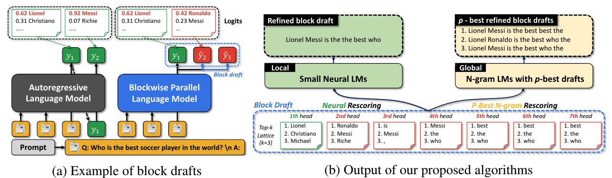 |[Paper](https://arxiv.org/abs/2404.09221)|
| [Lossless Acceleration of Large Language Model via Adaptive N-gram Parallel Decoding](https://arxiv.org/abs/2404.08698)   Jie Ou, Yueming Chen, Wenhong Tian |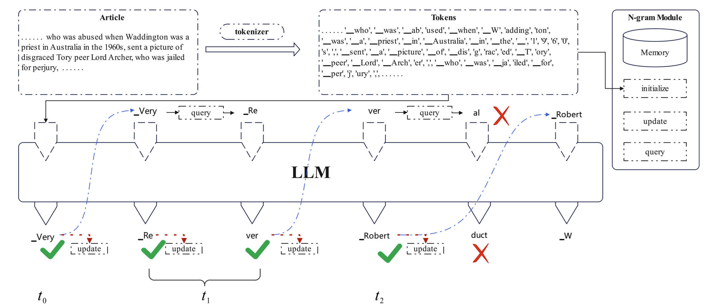 |[Github](https://github.com/oujieww/ANPD)   [Paper](https://arxiv.org/abs/2404.08698)|
|[Self-Selected Attention Span for Accelerating Large Language Model Inference](https://arxiv.org/abs/2404.09336)   Tian Jin, Wanzin Yazar, Zifei Xu, Sayeh Sharify, Xin Wang | |[Paper](https://arxiv.org/abs/2404.09336)|
|[Parallel Decoding via Hidden Transfer for Lossless Large Language Model Acceleration](https://arxiv.org/abs/2404.12022)   Pengfei Wu, Jiahao Liu, Zhuocheng Gong, Qifan Wang, Jinpeng Li, Jingang Wang, Xunliang Cai, Dongyan Zhao | |[Paper](https://arxiv.org/abs/2404.12022)|
|[XC-Cache: Cross-Attending to Cached Context for Efficient LLM Inference](https://arxiv.org/abs/2404.15420)   João Monteiro, Étienne Marcotte, Pierre-André Noël, Valentina Zantedeschi, David Vázquez, Nicolas Chapados, Christopher Pal, Perouz Taslakian | |[Paper](https://arxiv.org/abs/2404.15420)|
| [Hybrid LLM: Cost-Efficient and Quality-Aware Query Routing](https://arxiv.org/abs/2404.14618)   Dujian Ding, Ankur Mallick, Chi Wang, Robert Sim, Subhabrata Mukherjee, Victor Ruhle, Laks V.S. Lakshmanan, Ahmed Hassan Awadallah |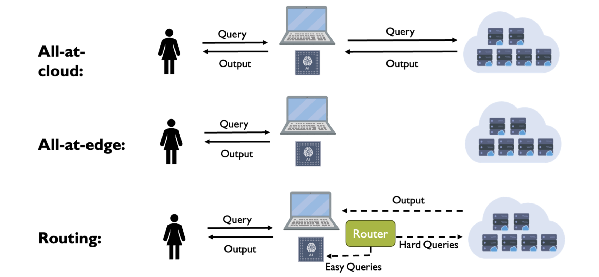 |[Github](https://github.com/m365-core/hybrid_llm_routing)   [Paper](https://arxiv.org/abs/2404.14618)|
|[Efficient LLM Inference with Kcache](https://arxiv.org/abs/2404.18057)   Qiaozhi He, Zhihua Wu |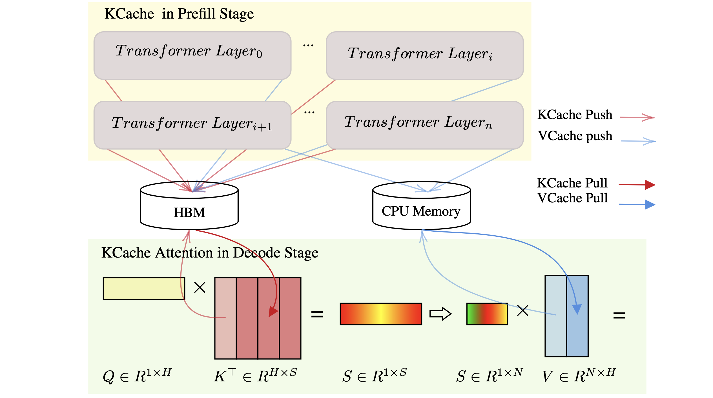 |[Paper](https://arxiv.org/abs/2404.18057)|
|[Better & Faster Large Language Models via Multi-token Prediction](https://arxiv.org/abs/2404.19737)   Fabian Gloeckle, Badr Youbi Idrissi, Baptiste Rozière, David Lopez-Paz, Gabriel Synnaeve |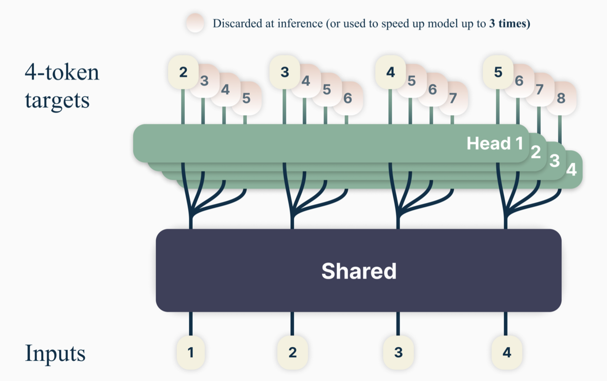 |[Paper](https://arxiv.org/abs/2404.19737)|
| [KV-Runahead: Scalable Causal LLM Inference by Parallel Key-Value Cache Generation](https://arxiv.org/abs/2405.05329)   Minsik Cho, Mohammad Rastegari, Devang Naik | |[Paper](https://arxiv.org/abs/2405.05329)|
|[You Only Cache Once: Decoder-Decoder Architectures for Language Models](https://arxiv.org/abs/2405.05254)   Yutao Sun, Li Dong, Yi Zhu, Shaohan Huang, Wenhui Wang, Shuming Ma, Quanlu Zhang, Jianyong Wang, Furu Wei |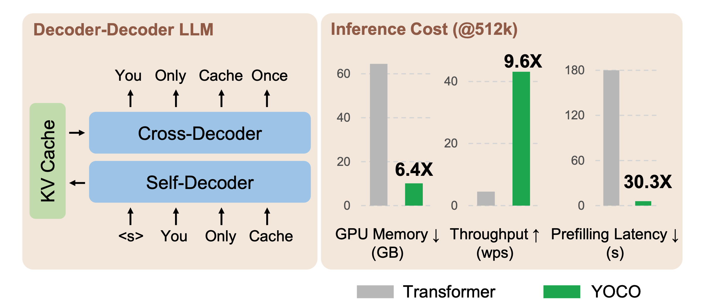 |[Github](https://github.com/microsoft/unilm/tree/master/YOCO)   [Paper](https://arxiv.org/abs/2405.05254)|
| [Kangaroo: Lossless Self-Speculative Decoding via Double Early Exiting](https://arxiv.org/abs/2404.18911)   Fangcheng Liu, Yehui Tang, Zhenhua Liu, Yunsheng Ni, Kai Han, Yunhe Wang | |[Github](https://github.com/Equationliu/Kangaroo)   [Paper](https://arxiv.org/abs/2404.18911)|
|[Accelerating Speculative Decoding using Dynamic Speculation Length](https://arxiv.org/abs/2405.04304)   Jonathan Mamou, Oren Pereg, Daniel Korat, Moshe Berchansky, Nadav Timor, Moshe Wasserblat, Roy Schwartz |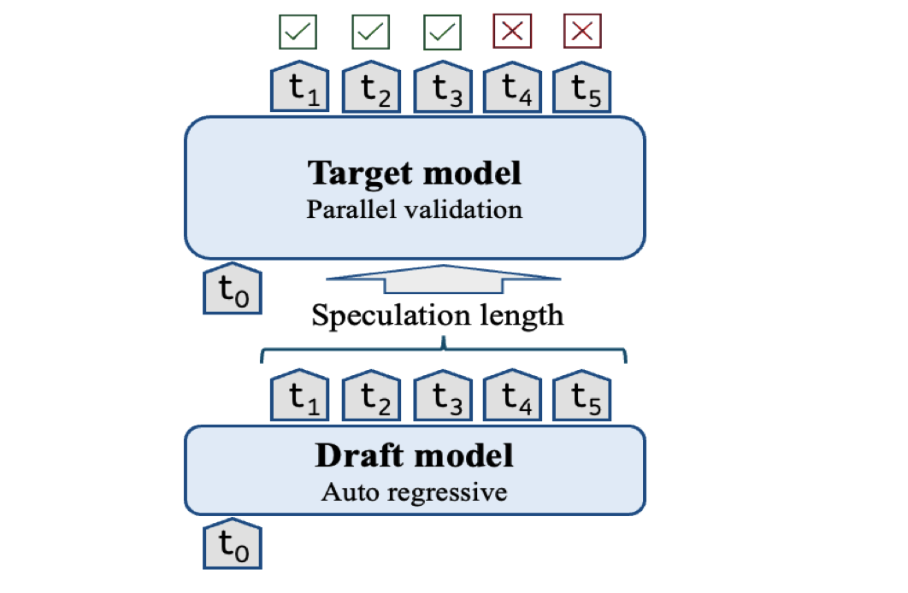 |[Paper](https://arxiv.org/abs/2405.04304)|
|[Clover: Regressive Lightweight Speculative Decoding with Sequential Knowledge](https://arxiv.org/abs/2405.00263)   Bin Xiao, Chunan Shi, Xiaonan Nie, Fan Yang, Xiangwei Deng, Lei Su, Weipeng Chen, Bin Cui |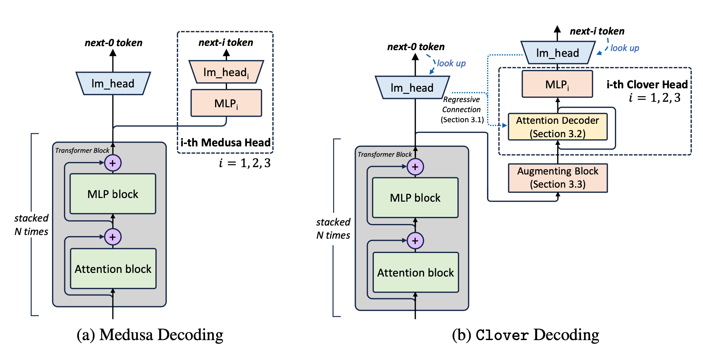 |[Paper](https://arxiv.org/abs/2405.00263)|
| [EMS-SD: Efficient Multi-sample Speculative Decoding for Accelerating Large Language Models](https://arxiv.org/abs/2405.07542)   Yunsheng Ni, Chuanjian Liu, Yehui Tang, Kai Han, Yunhe Wang | |[Github](https://github.com/niyunsheng/EMS-SD)   [Paper](https://arxiv.org/abs/2405.07542)|
|[Distributed Speculative Inference of Large Language Models](https://arxiv.org/abs/2405.14105)   Nadav Timor, Jonathan Mamou, Daniel Korat, Moshe Berchansky, Oren Pereg, Moshe Wasserblat, Tomer Galanti, Michal Gordon, David Harel |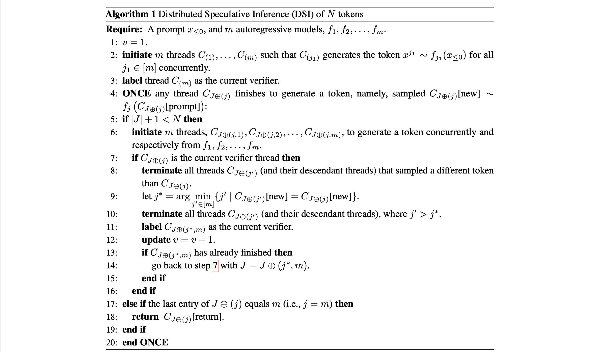 |[Paper](https://arxiv.org/abs/2405.14105)|
| [SirLLM: Streaming Infinite Retentive LLM](https://arxiv.org/abs/2405.12528)   Yao Yao, Zuchao Li, Hai Zhao | |[Github](https://github.com/Zoeyyao27/SirLLM)   [Paper](https://arxiv.org/abs/2405.12528)|
| [Hardware-Aware Parallel Prompt Decoding for Memory-Efficient Acceleration of LLM Inference](https://arxiv.org/abs/2405.18628)   Hao (Mark)Chen, Wayne Luk, Ka Fai Cedric Yiu, Rui Li, Konstantin Mishchenko, Stylianos I. Venieris, Hongxiang Fan | |[Github](https://github.com/hmarkc/parallel-prompt-decoding)   [Paper](https://arxiv.org/abs/2405.18628)|
|[Faster Cascades via Speculative Decoding](https://arxiv.org/abs/2405.19261)   Harikrishna Narasimhan, Wittawat Jitkrittum, Ankit Singh Rawat, Seungyeon Kim, Neha Gupta, Aditya Krishna Menon, Sanjiv Kumar | |[Paper](https://arxiv.org/abs/2405.19261)|
| [Speculative Decoding via Early-exiting for Faster LLM Inference with Thompson Sampling Control Mechanism](https://arxiv.org/abs/2406.03853)   Jiahao Liu, Qifan Wang, Jingang Wang, Xunliang Cai | |[Paper](https://arxiv.org/abs/2406.03853)|[//]: #06/12
| [QuickLLaMA: Query-aware Inference Acceleration for Large Language Models](https://arxiv.org/abs/2406.07528)   Jingyao Li, Han Shi, Xin Jiang, Zhenguo Li, Hong Xu, Jiaya Jia | |[Github](https://github.com/dvlab-research/Q-LLM)   [Paper](https://arxiv.org/abs/2406.07528)|[//]: #06/12
| [When Linear Attention Meets Autoregressive Decoding: Towards More Effective and Efficient Linearized Large Language Models](https://arxiv.org/abs/2406.07368)   Haoran You, Yichao Fu, Zheng Wang, Amir Yazdanbakhsh, Yingyan (Celine)Lin | |[Github](https://github.com/GATECH-EIC/Linearized-LLM)   [Paper](https://arxiv.org/abs/2406.07368)|[//]: #06/12
|[HiP Attention: Sparse Sub-Quadratic Attention with Hierarchical Attention Pruning](https://arxiv.org/abs/2406.09827)   Heejun Lee, Geon Park, Youngwan Lee, Jina Kim, Wonyoung Jeong, Myeongjae Jeon, Sung Ju Hwang | |[Paper](https://arxiv.org/abs/2406.09827)|[//]: #06/18
|[Optimized Speculative Sampling for GPU Hardware Accelerators](https://arxiv.org/abs/2406.11016)   Dominik Wagner, Seanie Lee, Ilja Baumann, Philipp Seeberger, Korbinian Riedhammer, Tobias Bocklet | |[Paper](https://arxiv.org/abs/2406.11016)|[//]: #06/24
| [MoA: Mixture of Sparse Attention for Automatic Large Language Model Compression](https://arxiv.org/abs/2406.14909)   Tianyu Fu, Haofeng Huang, Xuefei Ning, Genghan Zhang, Boju Chen, Tianqi Wu, Hongyi Wang, Zixiao Huang, Shiyao Li, Shengen Yan, Guohao Dai, Huazhong Yang, Yu Wang | |[Github](https://github.com/thu-nics/MoA)   [Paper](https://arxiv.org/abs/2406.14909)|[//]: #06/26
|[Near-Lossless Acceleration of Long Context LLM Inference with Adaptive Structured Sparse Attention](https://arxiv.org/abs/2406.15486)   Qianchao Zhu, Jiangfei Duan, Chang Chen, Siran Liu, Xiuhong Li, Guanyu Feng, Xin Lv, Huanqi Cao, Xiao Chuanfu, Xingcheng Zhang, Dahua Lin, Chao Yang | |[Paper](https://arxiv.org/abs/2406.15486)|[//]: #06/26
|[Interpreting Attention Layer Outputs with Sparse Autoencoders](https://arxiv.org/abs/2406.17759)   Connor Kissane, Robert Krzyzanowski, Joseph Isaac Bloom, Arthur Conmy, Neel Nanda | |[Paper](https://arxiv.org/abs/2406.17759)|[//]: #06/26
| [EAGLE-2: Faster Inference of Language Models with Dynamic Draft Trees](https://arxiv.org/abs/2406.16858)   Yuhui Li, Fangyun Wei, Chao Zhang, Hongyang Zhang | |[Github](https://github.com/SafeAILab/EAGLE)   [Paper](https://arxiv.org/abs/2406.16858)|[//]: #06/26
|[Sparser is Faster and Less is More: Efficient Sparse Attention for Long-Range Transformers](https://arxiv.org/abs/2406.16747)   Chao Lou, Zixia Jia, Zilong Zheng, Kewei Tu | |[Paper](https://arxiv.org/abs/2406.16747)|[//]: #06/26
|[S2D: Sorted Speculative Decoding For More Efficient Deployment of Nested Large Language Models](https://arxiv.org/abs/2407.01955)   Parsa Kavehzadeh, Mohammadreza Pourreza, Mojtaba Valipour, Tinashu Zhu, Haoli Bai, Ali Ghodsi, Boxing Chen, Mehdi Rezagholizadeh | |[Paper](https://arxiv.org/abs/2407.01955)|[//]: #07/05
| [LiveMind: Low-latency Large Language Models with Simultaneous Inference](https://arxiv.org/abs/2406.14319)   Chuangtao Chen, Grace Li Zhang, Xunzhao Yin, Cheng Zhuo, Ulf Schlichtmann, Bing Li | |[Github](https://github.com/ChuangtaoChen-TUM/LiveMind)   [Paper](https://arxiv.org/abs/2406.14319)|[//]: #07/05
|[Multi-Token Joint Speculative Decoding for Accelerating Large Language Model Inference](https://arxiv.org/abs/2407.09722)   Zongyue Qin, Ziniu Hu, Zifan He, Neha Prakriya, Jason Cong, Yizhou Sun | |[Paper](https://arxiv.org/abs/2407.09722)|[//]: #07/16
|[Adaptive Draft-Verification for Efficient Large Language Model Decoding](https://arxiv.org/abs/2407.12021)   Xukun Liu, Bowen Lei, Ruqi Zhang, Dongkuan Xu | |[Paper](https://arxiv.org/abs/2407.12021)|[//]: #07/21
|[LazyLLM: Dynamic Token Pruning for Efficient Long Context LLM Inference](https://arxiv.org/abs/2407.14057)   Qichen Fu, Minsik Cho, Thomas Merth, Sachin Mehta, Mohammad Rastegari, Mahyar Najibi | |[Paper](https://arxiv.org/abs/2407.14057)|[//]: #07/24
| [Inference acceleration for large language models using "stairs" assisted greedy generation](https://arxiv.org/abs/2407.19947)   Domas Grigaliūnas, Mantas Lukoševičius | |[Paper](https://arxiv.org/abs/2407.19947)|[//]: #08/08
|[An Efficient Inference Framework for Early-exit Large Language Models](https://arxiv.org/abs/2407.20272)   Ruijie Miao, Yihan Yan, Xinshuo Yao, Tong Yang ||[Paper](https://arxiv.org/abs/2407.20272)|[//]: #08/08
|[Accelerating Large Language Model Inference with Self-Supervised Early Exits](https://arxiv.org/abs/2407.21082)   Florian Valade | |[Paper](https://arxiv.org/abs/2407.21082)|[//]: #08/08
| [Clover-2: Accurate Inference for Regressive Lightweight Speculative Decoding](https://arxiv.org/abs/2408.00264)   Bin Xiao, Lujun Gui, Lei Su, Weipeng Chen | |[Github](https://github.com/XiaoBin1992/clover)   [Paper](https://arxiv.org/abs/2408.00264)|[//]: #08/08
|[Speculative Diffusion Decoding: Accelerating Language Generation through Diffusion](https://arxiv.org/abs/2408.05636)   Jacob K Christopher, Brian R Bartoldson, Bhavya Kailkhura, Ferdinando Fioretto | |[Paper](https://arxiv.org/abs/2408.05636)|[//]: #08/13
|[Turning Trash into Treasure: Accelerating Inference of Large Language Models with Token Recycling](https://arxiv.org/abs/2408.08696)   Xianzhen Luo, Yixuan Wang, Qingfu Zhu, Zhiming Zhang, Xuanyu Zhang, Qing Yang, Dongliang Xu, Wanxiang Che | |[Paper](https://arxiv.org/abs/2408.08696)|[//]: #08/20
|[Boosting Lossless Speculative Decoding via Feature Sampling and Partial Alignment Distillation](https://arxiv.org/abs/2408.15562)   Lujun Gui, Bin Xiao, Lei Su, Weipeng Chen | |[Paper](https://arxiv.org/abs/2408.15562)|[//]: #09/02
|[Path-Consistency: Prefix Enhancement for Efficient Inference in LLM](https://arxiv.org/abs/2409.01281)   Jiace Zhu, Yingtao Shen, Jie Zhao, An Zou | |[Paper](https://arxiv.org/abs/2409.01281)|[//]: #09/06
| [OneGen: Efficient One-Pass Unified Generation and Retrieval for LLMs](https://arxiv.org/abs/2409.05152)   Jintian Zhang, Cheng Peng, Mengshu Sun, Xiang Chen, Lei Liang, Zhiqiang Zhang, Jun Zhou, Huajun Chen, Ningyu Zhang | |[Github](https://github.com/zjunlp/OneGen)   [Paper](https://arxiv.org/abs/2409.05152)|[//]: #09/13
| [Sirius: Contextual Sparsity with Correction for Efficient LLMs](https://arxiv.org/abs/2409.03856)   Yang Zhou, Zhuoming Chen, Zhaozhuo Xu, Victoria Lin, Beidi Chen | |[Github](https://github.com/Infini-AI-Lab/Sirius)   [Paper](https://arxiv.org/abs/2409.03856)|[//]: #09/13
|[RetrievalAttention: Accelerating Long-Context LLM Inference via Vector Retrieval](https://arxiv.org/abs/2409.10516)   Di Liu, Meng Chen, Baotong Lu, Huiqiang Jiang, Zhenhua Han, Qianxi Zhang, Qi Chen, Chengruidong Zhang, Bailu Ding, Kai Zhang, Chen Chen, Fan Yang, Yuqing Yang, Lili Qiu | |[Paper](https://arxiv.org/abs/2409.10516)|[//]: #09/21
| [CritiPrefill: A Segment-wise Criticality-based Approach for Prefilling Acceleration in LLMs](https://arxiv.org/abs/2409.12490)   Junlin Lv, Yuan Feng, Xike Xie, Xin Jia, Qirong Peng, Guiming Xie | |[Github](https://github.com/66RING/CritiPrefill)   [Paper](https://arxiv.org/abs/2409.12490)|[//]: #09/21
|[Dynamic-Width Speculative Beam Decoding for Efficient LLM Inference](https://arxiv.org/abs/2409.16560)   Zongyue Qin, Zifan He, Neha Prakriya, Jason Cong, Yizhou Sun | |[Paper](https://arxiv.org/abs/2409.16560)|[//]: #09/27
| [Discovering the Gems in Early Layers: Accelerating Long-Context LLMs with 1000x Input Token Reduction](https://arxiv.org/abs/2409.17422)   Zhenmei Shi, Yifei Ming, Xuan-Phi Nguyen, Yingyu Liang, Shafiq Joty | |[Github](https://github.com/SalesforceAIResearch/GemFilter)   [Paper](https://arxiv.org/abs/2409.17422)|[//]: #09/27
|[Mnemosyne: Parallelization Strategies for Efficiently Serving Multi-Million Context Length LLM Inference Requests Without Approximations](https://arxiv.org/abs/2409.17264)   Amey Agrawal, Junda Chen, Íñigo Goiri, Ramachandran Ramjee, Chaojie Zhang, Alexey Tumanov, Esha Choukse | |[Paper](https://arxiv.org/abs/2409.17264)|[//]: #09/27
|[A Little Goes a Long Way: Efficient Long Context Training and Inference with Partial Contexts](https://arxiv.org/abs/2410.01485)   Suyu Ge, Xihui Lin, Yunan Zhang, Jiawei Han, Hao Peng | |[Paper](https://arxiv.org/abs/2410.01485)|[//]: #10/04
| [TurboRAG: Accelerating Retrieval-Augmented Generation with Precomputed KV Caches for Chunked Text](https://arxiv.org/abs/2410.07590)   Songshuo Lu, Hua Wang, Yutian Rong, Zhi Chen, Yaohua Tang | |[Github](https://github.com/MooreThreads/TurboRAG)   [Paper](https://arxiv.org/abs/2410.07590)|[//]: #10/13
| [SWIFT: On-the-Fly Self-Speculative Decoding for LLM Inference Acceleration](https://arxiv.org/abs/2410.06916)   Heming Xia, Yongqi Li, Jun Zhang, Cunxiao Du, Wenjie Li | |[Github](https://github.com/hemingkx/SWIFT)   [Paper](https://arxiv.org/abs/2410.06916)|[//]: #10/14
|[ParallelSpec: Parallel Drafter for Efficient Speculative Decoding](https://arxiv.org/abs/2410.05589)   Zilin Xiao, Hongming Zhang, Tao Ge, Siru Ouyang, Vicente Ordonez, Dong Yu | |[Paper](https://arxiv.org/abs/2410.05589)|[//]: #10/14
|[TidalDecode: Fast and Accurate LLM Decoding with Position Persistent Sparse Attention](https://arxiv.org/abs/2410.05076)   Lijie Yang, Zhihao Zhang, Zhuofu Chen, Zikun Li, Zhihao Jia | |[Paper](https://arxiv.org/abs/2410.05076)|[//]: #10/14
|[DySpec: Faster Speculative Decoding with Dynamic Token Tree Structure](https://arxiv.org/abs/2410.11744)   Yunfan Xiong, Ruoyu Zhang, Yanzeng Li, Tianhao Wu, Lei Zou | |[Paper](https://arxiv.org/abs/2410.11744)|[//]: #10/21
|[QSpec: Speculative Decoding with Complementary Quantization Schemes](https://arxiv.org/abs/2410.11305)   Juntao Zhao, Wenhao Lu, Sheng Wang, Lingpeng Kong, Chuan Wu | |[Paper](https://arxiv.org/abs/2410.11305)|[//]: #10/21
| [DuoAttention: Efficient Long-Context LLM Inference with Retrieval and Streaming Heads](https://arxiv.org/abs/2410.10819)   Guangxuan Xiao, Jiaming Tang, Jingwei Zuo, Junxian Guo, Shang Yang, Haotian Tang, Yao Fu, Song Han | |[Github](https://github.com/mit-han-lab/duo-attention)   [Paper](https://arxiv.org/abs/2410.10819)|[//]: #10/21
| [CacheBlend: Fast Large Language Model Serving for RAG with Cached Knowledge Fusion](https://arxiv.org/abs/2405.16444)   Jiayi Yao, Hanchen Li, Yuhan Liu, Siddhant Ray, Yihua Cheng, Qizheng Zhang, Kuntai Du, Shan Lu, Junchen Jiang |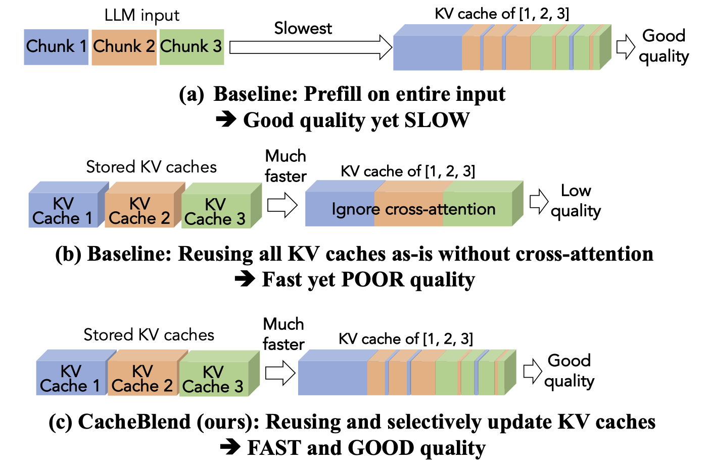 |[Github](https://github.com/LMCache/LMCache)   [Paper](https://arxiv.org/abs/2405.16444)|[//]: #10/23
| [CoreInfer: Accelerating Large Language Model Inference with Semantics-Inspired Adaptive Sparse Activation](https://arxiv.org/abs/2410.18311#)   Qinsi Wang, Saeed Vahidian, Hancheng Ye, Jianyang Gu, Jianyi Zhang, Yiran Chen | |[Github](https://github.com/wangqinsi1/CoreInfer)   [Paper](https://arxiv.org/abs/2410.18311#)|[//]: #10/29
| [Dynamic Vocabulary Pruning in Early-Exit LLMs](https://arxiv.org/abs/2410.18952)   Jort Vincenti, Karim Abdel Sadek, Joan Velja, Matteo Nulli, Metod Jazbec | |[Github](https://github.com/MatteoNulli/Vocabulary_pruning)   [Paper](https://arxiv.org/abs/2410.18952)|[//]: #10/29