## Knowledge Distillation

| Title & Authors | Introduction | Links |
|:----|  :----: | :---:|
| [Specializing Smaller Language Models towards Multi-Step Reasoning](https://arxiv.org/abs/2301.12726)   Yao Fu, Hao Peng, Litu Ou, Ashish Sabharwal, Tushar Khot |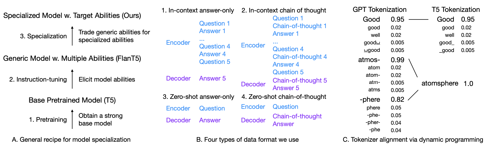 |[Github](https://github.com/FranxYao/FlanT5-CoT-Specialization)   [Paper](https://arxiv.org/abs/2301.12726)|
| [Distilling Script Knowledge from Large Language Models for Constrained Language Planning](https://arxiv.org/abs/2305.05252)   Siyu Yuan, Jiangjie Chen, Ziquan Fu, Xuyang Ge, Soham Shah, Charles Robert Jankowski, Yanghua Xiao, Deqing Yang |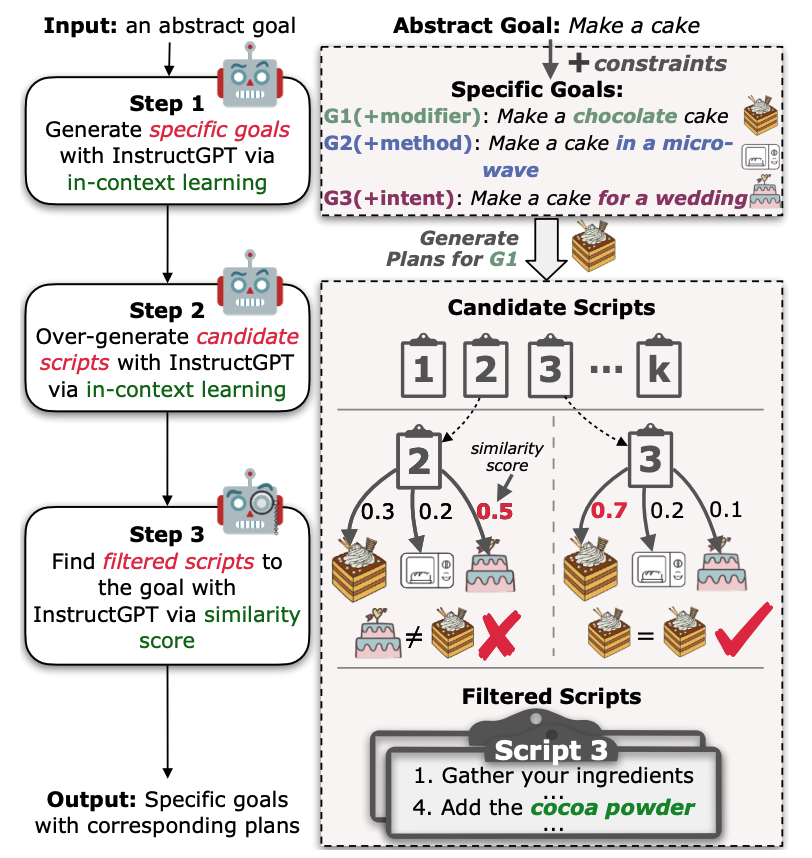 |[Github](https://github.com/siyuyuan/coscript)   [Paper](https://arxiv.org/abs/2305.05252)|
| [SCOTT: Self-Consistent Chain-of-Thought Distillation](https://arxiv.org/abs/2305.01879)   Peifeng Wang, Zhengyang Wang, Zheng Li, Yifan Gao, Bing Yin, Xiang Ren |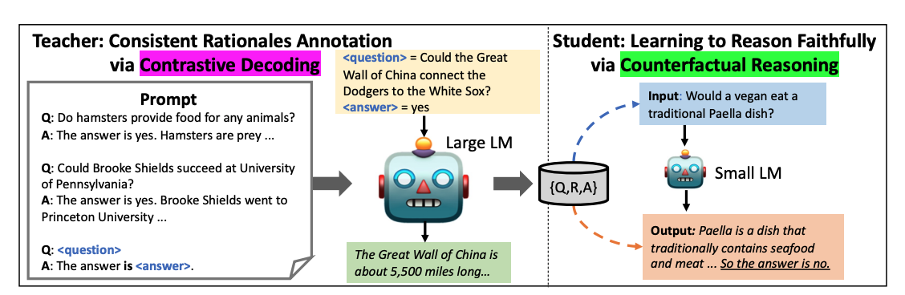 |[Paper](https://arxiv.org/abs/2305.01879)|
| [DISCO: Distilling Counterfactuals with Large Language Models](https://arxiv.org/abs/2212.10534)   Zeming Chen, Qiyue Gao, Antoine Bosselut, Ashish Sabharwal, Kyle Richardson |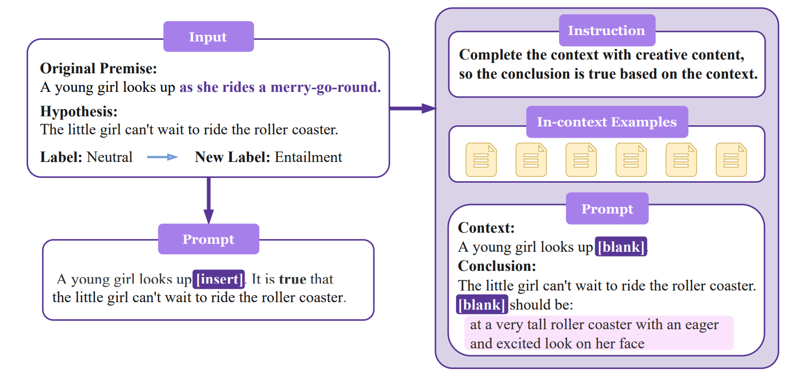 |[Github](https://github.com/eric11eca/disco)   [Paper](https://arxiv.org/abs/2212.10534)|
| [I2D2: Inductive Knowledge Distillation with NeuroLogic and Self-Imitation](https://arxiv.org/abs/2212.09246)   Chandra Bhagavatula, Jena D. Hwang, Doug Downey, Ronan Le Bras, Ximing Lu, Lianhui Qin, Keisuke Sakaguchi, Swabha Swayamdipta, Peter West, Yejin Choi | |[Github](https://github.com/allenai/i2d2)   [Paper](https://arxiv.org/abs/2212.09246)   [Project](https://i2d2.allen.ai/) |
| [Symbolic Chain-of-Thought Distillation: Small Models Can Also "Think" Step-by-Step](https://arxiv.org/abs/2306.14050)   Liunian Harold Li, Jack Hessel, Youngjae Yu, Xiang Ren, Kai-Wei Chang, Yejin Choi |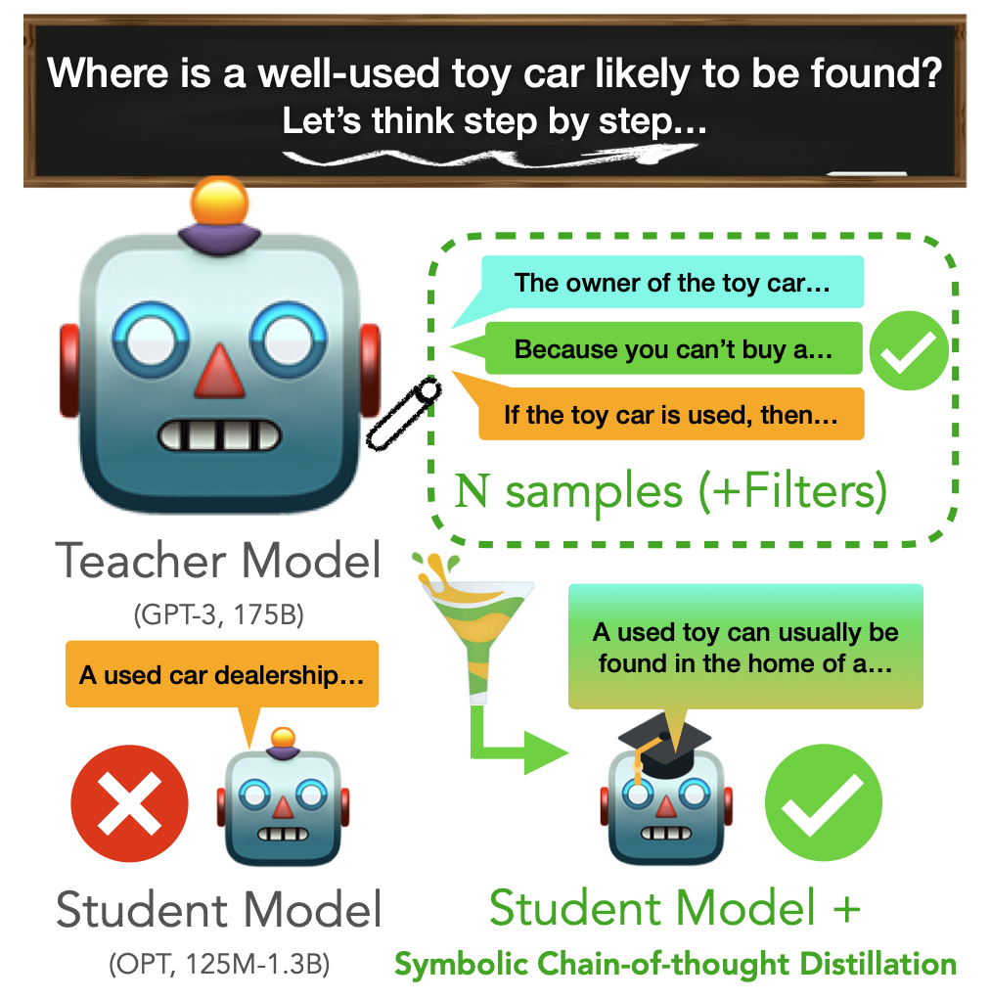 |[Github](https://github.com/allenai/cot_distillation)   [Paper](https://arxiv.org/abs/2306.14050)|
|   [Can Language Models Teach? Teacher Explanations Improve Student Performance via Theory of Mind](https://arxiv.org/abs/2306.09299)   Swarnadeep Saha, Peter Hase, and Mohit Bansal | |[Github](https://github.com/swarnaHub/ExplanationIntervention)   [Paper](https://arxiv.org/abs/2306.09299)|
| [Dialogue Chain-of-Thought Distillation for Commonsense-aware Conversational Agents](https://arxiv.org/abs/2310.09343)   Hyungjoo Chae, Yongho Song, Kai Tzu-iunn Ong, Taeyoon Kwon, Minjin Kim, Youngjae Yu, Dongha Lee, Dongyeop Kang, Jinyoung Yeo |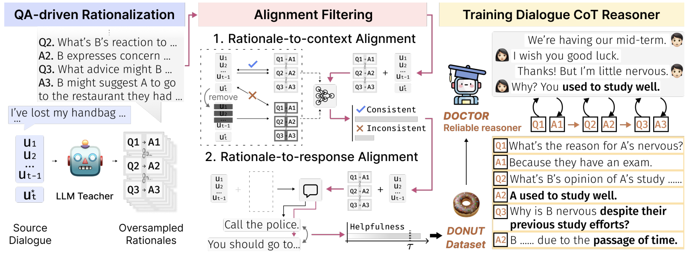 |[Paper](https://arxiv.org/abs/2310.09343)|
| [PromptMix: A Class Boundary Augmentation Method for Large Language Model Distillation](https://arxiv.org/abs/2310.14192)   Gaurav Sahu, Olga Vechtomova, Dzmitry Bahdanau, Issam H. Laradji |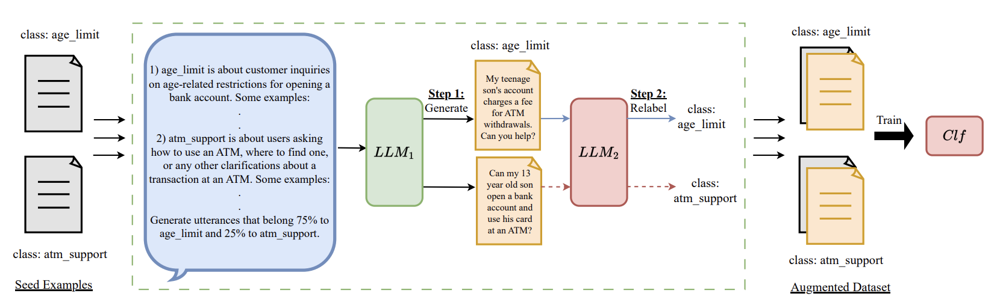 |[Github](https://github.com/ServiceNow/PromptMix-EMNLP-2023)   [Paper](https://arxiv.org/abs/2310.14192)|
| [Turning Dust into Gold: Distilling Complex Reasoning Capabilities from LLMs by Leveraging Negative Data](https://arxiv.org/abs/2312.12832)   Yiwei Li, Peiwen Yuan, Shaoxiong Feng, Boyuan Pan, Bin Sun, Xinglin Wang, Heda Wang, Kan Li | |[Github](https://github.com/Yiwei98/TDG)   [Paper](https://arxiv.org/abs/2312.12832)|
| [Democratizing Reasoning Ability: Tailored Learning from Large Language Model](https://aclanthology.org/2023.emnlp-main.120.pdf)   Zhaoyang Wang, Shaohan Huang, Yuxuan Liu, Jiahai Wang, Minghui Song, Zihan Zhang, Haizhen Huang, Furu Wei, Weiwei Deng, Feng Sun, Qi Zhang |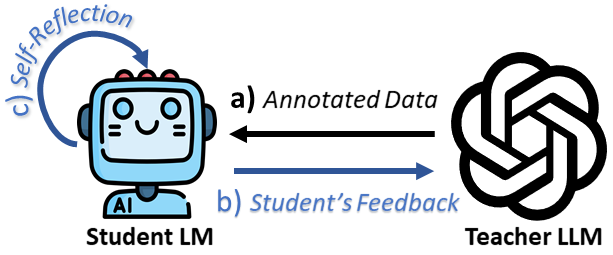 |[Github](https://github.com/Raibows/Learn-to-Reason)   [Paper](https://aclanthology.org/2023.emnlp-main.120.pdf)|
|   [GKD: A General Knowledge Distillation Framework for Large-scale Pre-trained Language Model](https://arxiv.org/abs/2306.06629)   Shicheng Tan, Weng Lam Tam, Yuanchun Wang, Wenwen Gong, Yang Yang, Hongyin Tang, Keqing He, Jiahao Liu, Jingang Wang, Shu Zhao, Peng Zhang, Jie Tang |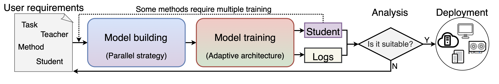 |[Github](https://github.com/aitsc/GLMKD)   [Paper](https://arxiv.org/abs/2306.06629)|
|    [Distilling Step-by-Step! Outperforming Larger Language Models with Less Training Data and Smaller Model Sizes](https://arxiv.org/abs/2305.02301)      Cheng-Yu Hsieh, Chun-Liang Li, Chih-Kuan Yeh, Hootan Nakhost, Yasuhisa Fujii, Alexander Ratner, Ranjay Krishna, Chen-Yu Lee, Tomas Pfister | 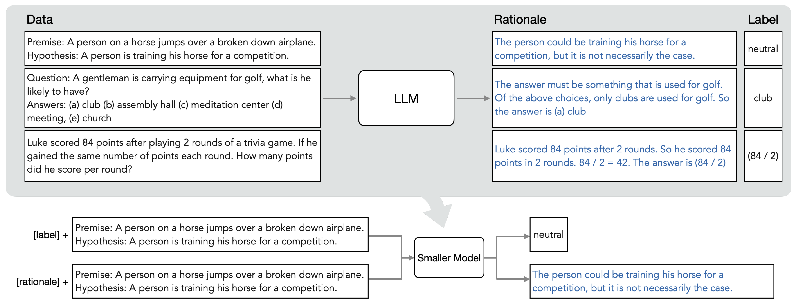| [Github](https://github.com/google-research/distilling-step-by-step)   [Paper](https://arxiv.org/abs/2305.02301) |
| [Retrieval-based Knowledge Transfer: An Effective Approach for Extreme Large Language Model Compression](https://arxiv.org/abs/2310.15594)   Jiduan Liu, Jiahao Liu, Qifan Wang, Jingang Wang, Xunliang Cai, Dongyan Zhao, Ran Lucien Wang, Rui Yan |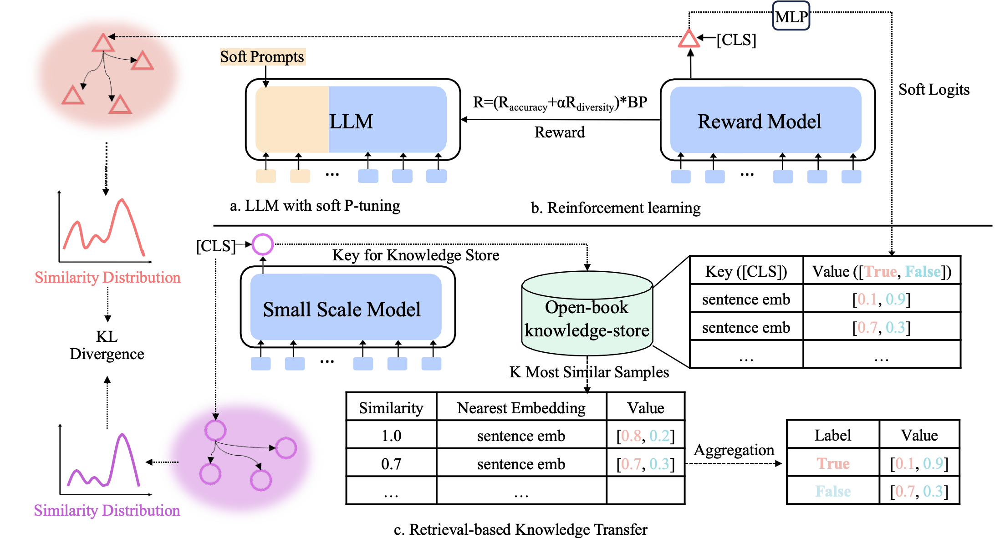 |[Paper](https://arxiv.org/abs/2310.15594)|
| [Cache me if you Can: an Online Cost-aware Teacher-Student framework to Reduce the Calls to Large Language Models](https://arxiv.org/abs/2310.13395)   Ilias Stogiannidis, Stavros Vassos, Prodromos Malakasiotis, Ion Androutsopoulos |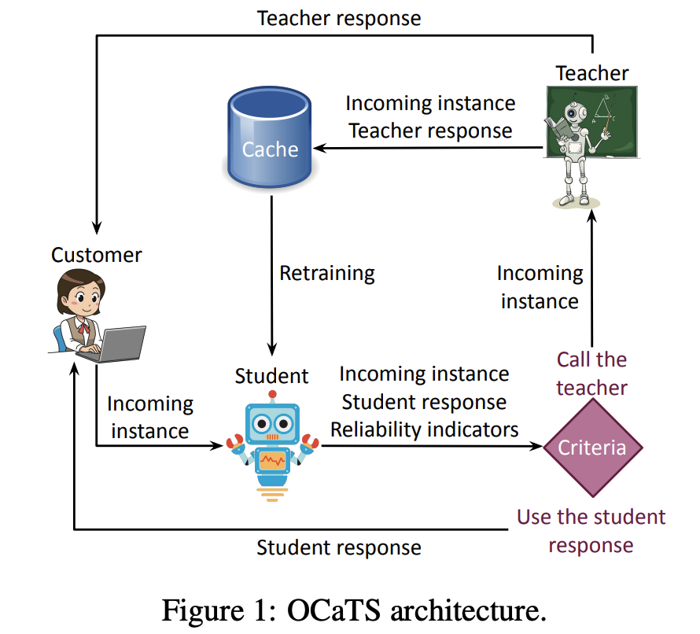 |[Github](https://github.com/stoyian/OCaTS)   [Paper](https://arxiv.org/abs/2310.13395)|
| [Efficiently Distilling LLMs for Edge Applications](https://arxiv.org/abs/2404.01353)   Achintya Kundu, Fabian Lim, Aaron Chew, Laura Wynter, Penny Chong, Rhui Dih Lee |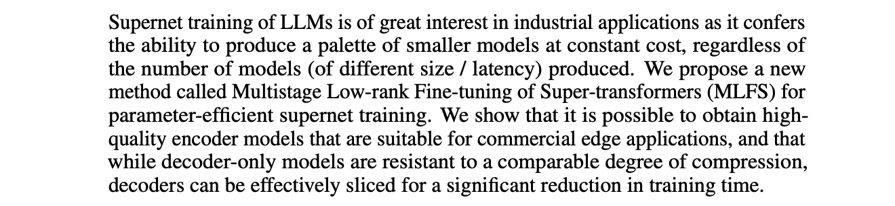 |[Paper](https://arxiv.org/abs/2404.01353)|
|    [LaMini-LM: A Diverse Herd of Distilled Models from Large-Scale Instructions](https://github.com/mbzuai-nlp/LaMini-LM)  Minghao Wu, Abdul Waheed, Chiyu Zhang, Muhammad Abdul-Mageed, Alham Fikri Aji |  | [Github](https://github.com/mbzuai-nlp/LaMini-LM) [paper](https://arxiv.org/abs/2304.14402) |
|[Knowledge Distillation of Large Language Models](https://arxiv.org/abs/2306.08543)   Yuxian Gu, Li Dong, Furu Wei, Minlie Huang | |[Github](https://github.com/microsoft/LMOps/tree/main/minillm)   [Paper](https://arxiv.org/abs/2306.08543)|
|[Teaching Small Language Models to Reason](https://arxiv.org/abs/2212.08410)   Lucie Charlotte Magister, Jonathan Mallinson, Jakub Adamek, Eric Malmi, Aliaksei Severyn.  |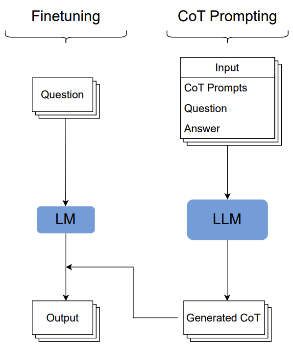 |[Paper](https://arxiv.org/abs/2212.08410)|
|    [Large Language Model Distillation Doesn't Need a Teacher](https://arxiv.org/abs/2305.14864)   Ananya Harsh Jha, Dirk Groeneveld, Emma Strubell, Iz Beltagy   | 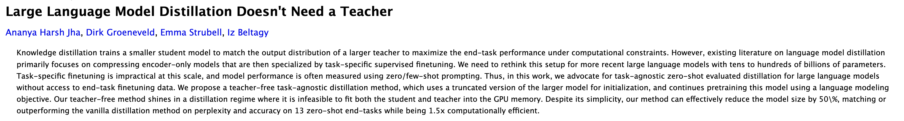 | [Github](https://github.com/ananyahjha93/llm-distill) [paper](https://arxiv.org/abs/2305.14864) |
| [The False Promise of Imitating Proprietary LLMs](https://arxiv.org/abs/2305.15717)   Arnav Gudibande, Eric Wallace, Charlie Snell, Xinyang Geng, Hao Liu, Pieter Abbeel, Sergey Levine, Dawn Song | 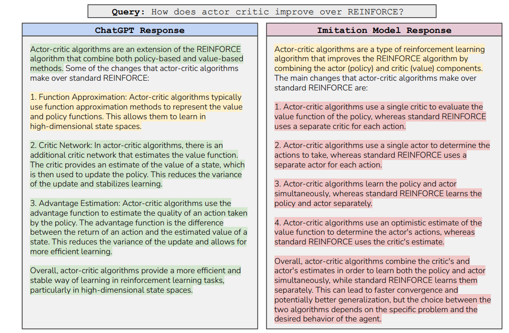 | [Paper](https://arxiv.org/abs/2305.15717) |
|  [Impossible Distillation: from Low-Quality Model to High-Quality Dataset & Model for Summarization and Paraphrasing](https://arxiv.org/abs/2305.16635)   Jaehun Jung, Peter West, Liwei Jiang, Faeze Brahman, Ximing Lu, Jillian Fisher, Taylor Sorensen, Yejin Choi |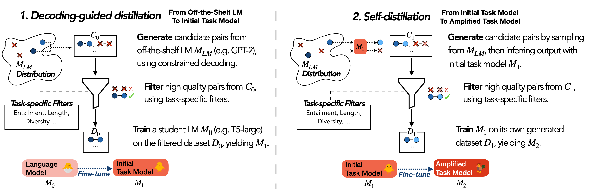 |[Github](https://github.com/jaehunjung1/impossible-distillation) [paper](https://arxiv.org/abs/2305.16635) |
|[PaD: Program-aided Distillation Specializes Large Models in Reasoning](https://arxiv.org/abs/2305.13888)   Xuekai Zhu, Biqing Qi, Kaiyan Zhang, Xingwei Long, Bowen Zhou |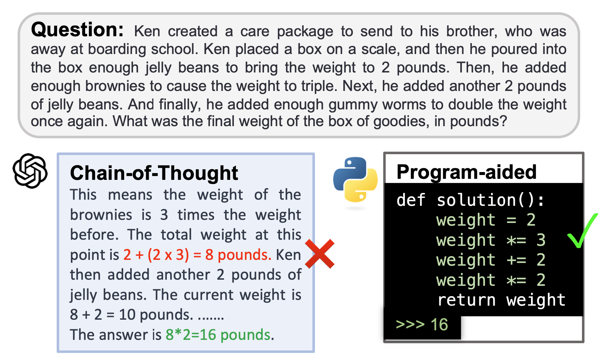 |[Paper](https://arxiv.org/abs/2305.13888)|
|[RLCD: Reinforcement Learning from Contrast Distillation for Language Model Alignment](https://arxiv.org/abs/2307.12950)   Kevin Yang, Dan Klein, Asli Celikyilmaz, Nanyun Peng, Yuandong Tian |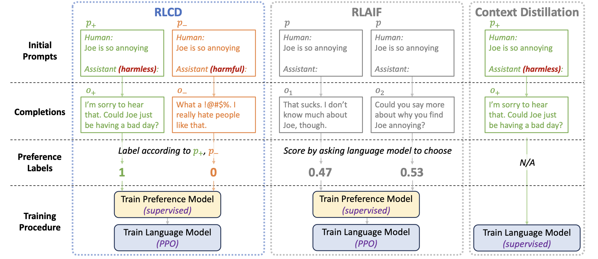 |[Paper](https://arxiv.org/abs/2307.12950)|
|[Sci-CoT: Leveraging Large Language Models for Enhanced Knowledge Distillation in Small Models for Scientific QA](https://arxiv.org/abs/2308.04679)   Yuhan Ma, Haiqi Jiang, Chenyou Fan |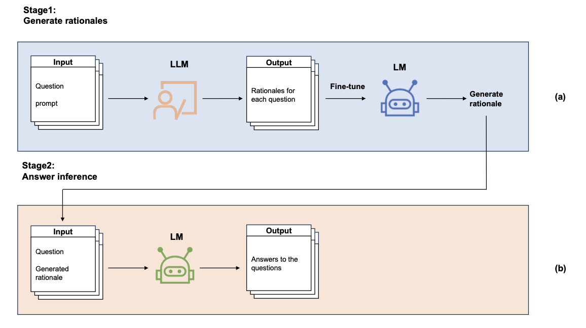 |[Paper](https://arxiv.org/abs/2308.04679)|
| [UniversalNER: Targeted Distillation from Large Language Models for Open Named Entity Recognition](https://arxiv.org/abs/2308.03279)   Wenxuan Zhou, Sheng Zhang, Yu Gu, Muhao Chen, Hoifung Poon |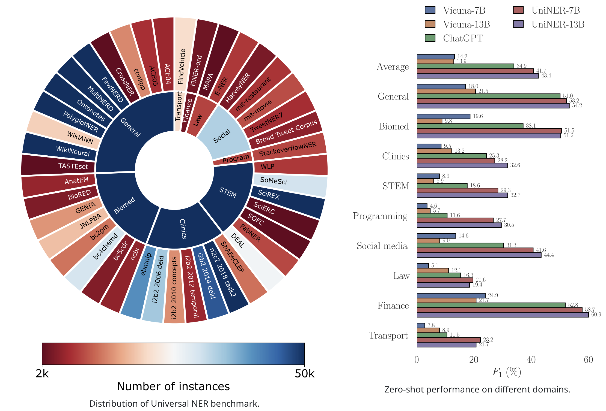 |[Github](https://github.com/universal-ner/universal-ner)   [Paper](https://arxiv.org/abs/2308.03279)   [Project](https://universal-ner.github.io) |
| [Baby Llama: knowledge distillation from an ensemble of teachers trained on a small dataset with no performance penalty](https://arxiv.org/abs/2308.02019)   Inar Timiryasov, Jean-Loup Tastet |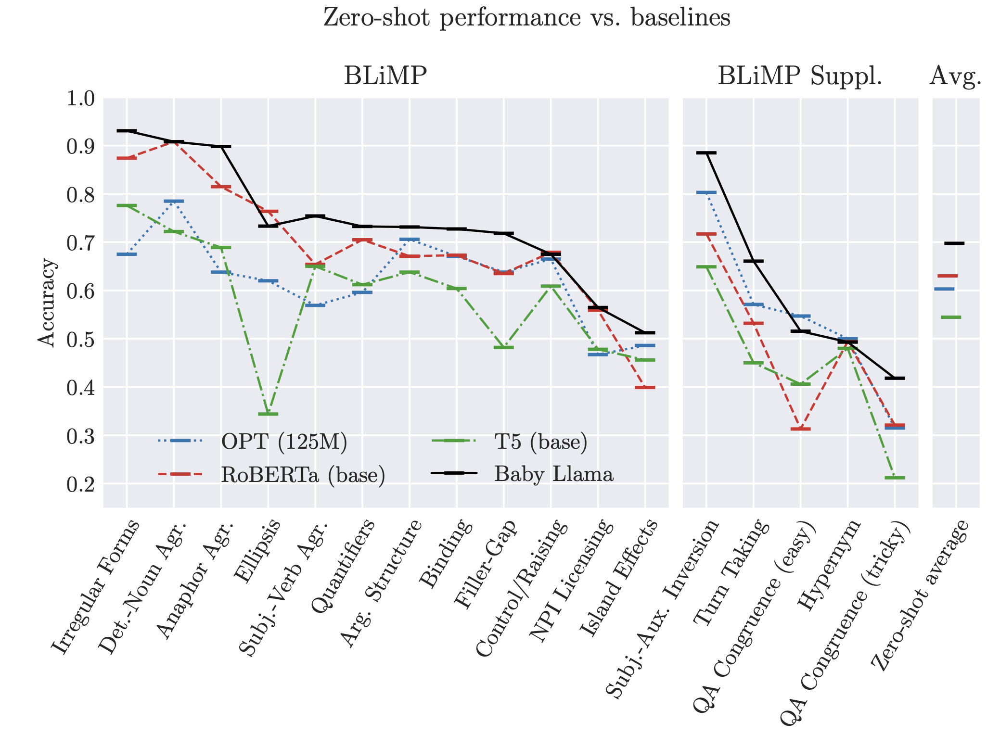 |[Github](https://github.com/timinar/BabyLlama)   [Paper](https://arxiv.org/abs/2308.02019) | [Model](https://huggingface.co/timinar/baby-llama-58m) |
|[DistillSpec: Improving Speculative Decoding via Knowledge Distillation](https://arxiv.org/abs/2310.08461)   Yongchao Zhou, Kaifeng Lyu, Ankit Singh Rawat, Aditya Krishna Menon, Afshin Rostamizadeh, Sanjiv Kumar, Jean-François Kagy, Rishabh Agarwal |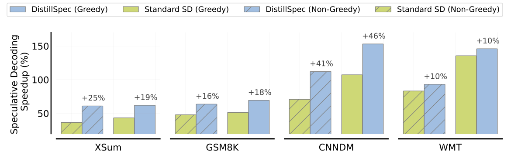 |[Paper](https://arxiv.org/abs/2310.08461)|
| [Zephyr: Direct Distillation of LM Alignment](https://arxiv.org/abs/2310.16944)   Lewis Tunstall, Edward Beeching, Nathan Lambert, Nazneen Rajani, Kashif Rasul, Younes Belkada, Shengyi Huang, Leandro von Werra, Clémentine Fourrier, Nathan Habib, Nathan Sarrazin, Omar Sanseviero, Alexander M. Rush, Thomas Wolf |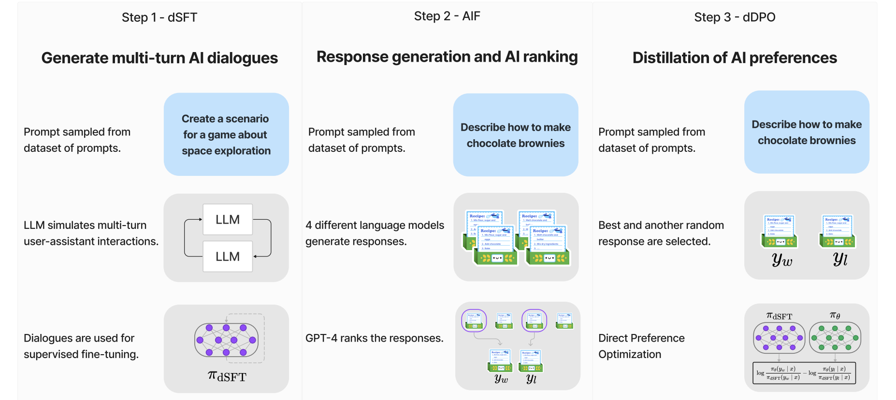 |[Github](https://github.com/huggingface/alignment-handbook)   [Paper](https://arxiv.org/abs/2310.16944)|
| [Towards the Law of Capacity Gap in Distilling Language Models](https://arxiv.org/abs/2311.07052)   Chen Zhang, Dawei Song, Zheyu Ye, Yan Gao |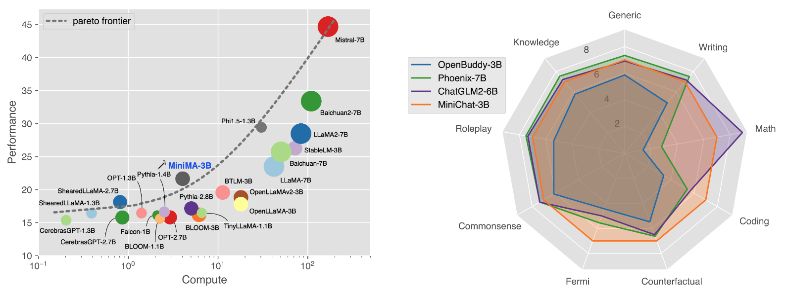 |[Github](https://github.com/GeneZC/MiniMA)   [Paper](https://arxiv.org/abs/2311.07052)|
|[Unlock the Power: Competitive Distillation for Multi-Modal Large Language Models](https://arxiv.org/abs/2311.08213)   Xinwei Li, Li Lin, Shuai Wang, Chen Qian | |[Paper](https://arxiv.org/abs/2311.08213)|
|[Mixed Distillation Helps Smaller Language Model Better Reasoning](https://arxiv.org/abs/2312.10730)   Li Chenglin, Chen Qianglong, Wang Caiyu, Zhang Yin |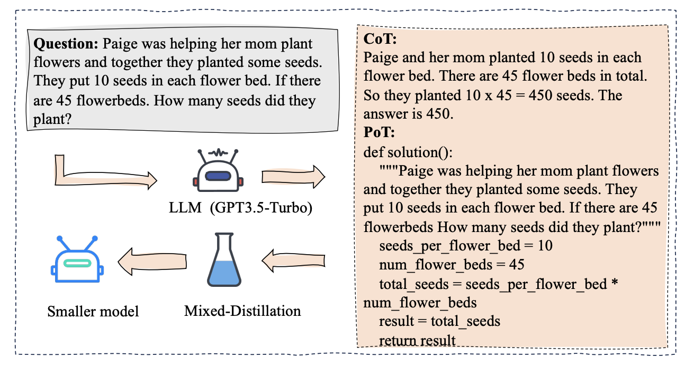 |[Paper](https://arxiv.org/abs/2312.10730)|
|[Distilling Event Sequence Knowledge From Large Language Models](https://arxiv.org/abs/2401.07237)   Somin Wadhwa, Oktie Hassanzadeh, Debarun Bhattacharjya, Ken Barker, Jian Ni |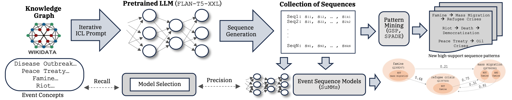 |[Paper](https://arxiv.org/abs/2401.07237)|
|[Knowledge Distillation for Closed-Source Language Models](https://arxiv.org/abs/2401.07013)   Hongzhan Chen, Xiaojun Quan, Hehong Chen, Ming Yan, Ji Zhang |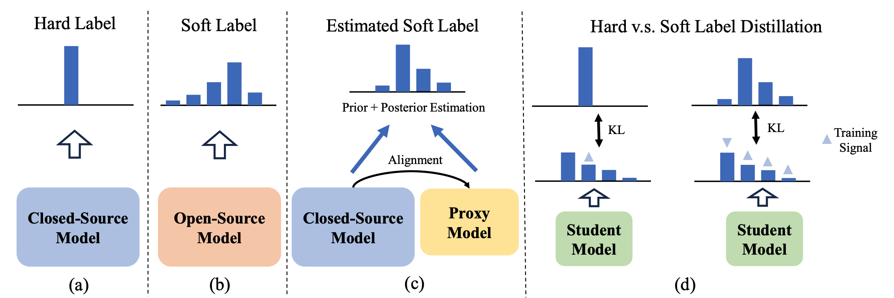 |[Paper](https://arxiv.org/abs/2401.07013)|
|[Improving Small Language Models' Mathematical Reasoning via Equation-of-Thought Distillation](https://arxiv.org/abs/2401.11864)   Xunyu Zhu, Jian Li, Yong Liu, Can Ma, Weiping Wang |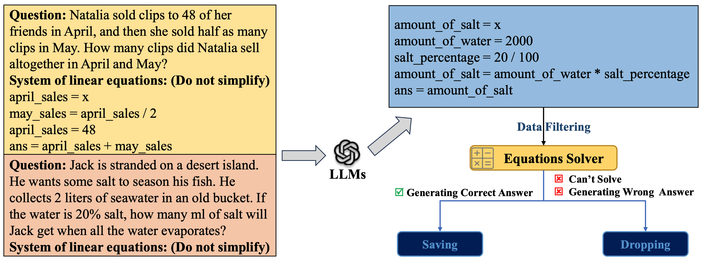 |[Paper](https://arxiv.org/abs/2401.11864)|
|[Scavenging Hyena: Distilling Transformers into Long Convolution Models](https://arxiv.org/abs/2401.17574)   Tokiniaina Raharison Ralambomihanta, Shahrad Mohammadzadeh, Mohammad Sami Nur Islam, Wassim Jabbour, Laurence Liang | |[Paper](https://arxiv.org/abs/2401.17574)|
| [DistiLLM: Towards Streamlined Distillation for Large Language Models](https://arxiv.org/abs/2402.03898)   Jongwoo Ko, Sungnyun Kim, Tianyi Chen, Se-Young Yun | |[Github](https://github.com/jongwooko/distillm)   [Paper](https://arxiv.org/abs/2402.03898)|
|[Large Language Model Meets Graph Neural Network in Knowledge Distillation](https://arxiv.org/abs/2402.05894)   Shengxiang Hu, Guobing Zou, Song Yang, Bofeng Zhang, Yixin Chen |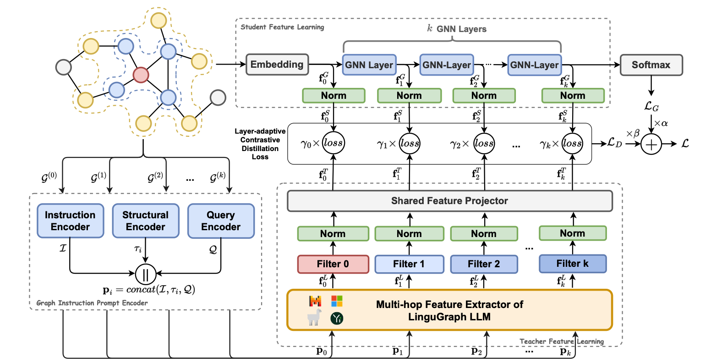 |[Paper](https://arxiv.org/abs/2402.05894)|
| [Unmemorization in Large Language Models via Self-Distillation and Deliberate Imagination](https://arxiv.org/abs/2402.10052)   Yijiang River Dong, Hongzhou Lin, Mikhail Belkin, Ramon Huerta, Ivan Vulić | |[Github](https://github.com/dong-river/LLM_unlearning)   [Paper](https://arxiv.org/abs/2402.10052)|
| [Towards Cross-Tokenizer Distillation: the Universal Logit Distillation Loss for LLMs](https://arxiv.org/abs/2402.12030)   Nicolas Boizard, Kevin El-Haddad, Céline Hudelot, Pierre Colombo |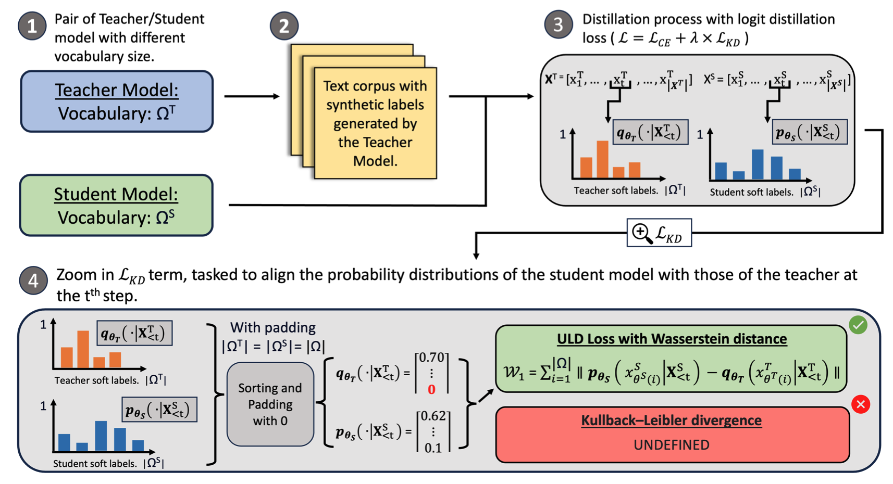 |[Github](https://github.com/Nicolas-BZRD/llm-recipes) [Github](https://github.com/Nicolas-BZRD/llm-distillation)   [Paper](https://arxiv.org/abs/2402.12030)   [Model](https://huggingface.co/collections/Nicolas-BZRD/llms-distillation-65cfa07f1e4ed7404502a9eb)|
|[Revisiting Knowledge Distillation for Autoregressive Language Models](https://arxiv.org/abs/2402.11890)   Qihuang Zhong, Liang Ding, Li Shen, Juhua Liu, Bo Du, Dacheng Tao |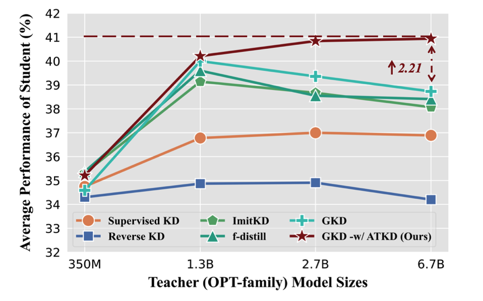 |[Paper](https://arxiv.org/abs/2402.11890)|
|[PromptKD: Distilling Student-Friendly Knowledge for Generative Language Models via Prompt Tuning](https://arxiv.org/abs/2402.12842)   Gyeongman Kim, Doohyuk Jang, Eunho Yang |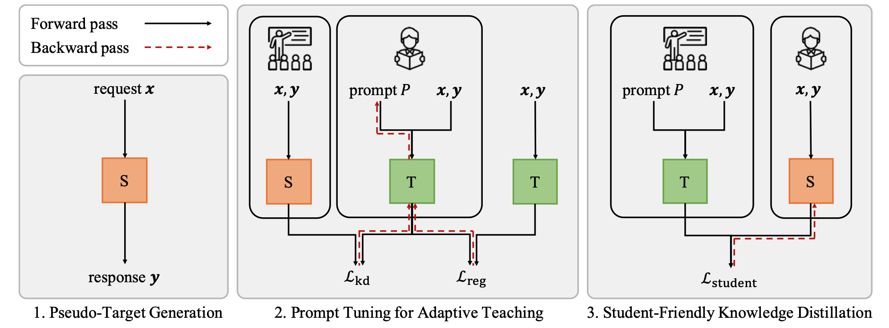 |[Paper](https://arxiv.org/abs/2402.12842)|
|[Self-Distillation Bridges Distribution Gap in Language Model Fine-Tuning](https://arxiv.org/abs/2402.13669)   Zhaorui Yang, Qian Liu, Tianyu Pang, Han Wang, Haozhe Feng, Minfeng Zhu, Wei Chen |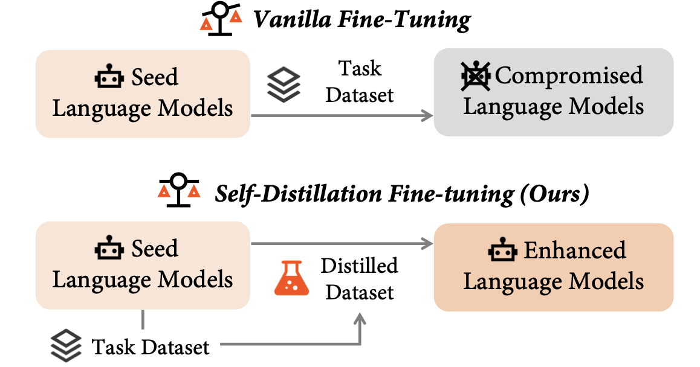 |[Paper](https://arxiv.org/abs/2402.13669)|
|[Wisdom of Committee: Distilling from Foundation Model to Specialized Application Model](https://arxiv.org/abs/2402.14035)   Zichang Liu, Qingyun Liu, Yuening Li, Liang Liu, Anshumali Shrivastava, Shuchao Bi, Lichan Hong, Ed H. Chi, Zhe Zhao | |[Paper](https://arxiv.org/abs/2402.14035)|
|[Divide-or-Conquer? Which Part Should You Distill Your LLM?](https://arxiv.org/abs/2402.15000)   Zhuofeng Wu, He Bai, Aonan Zhang, Jiatao Gu, VG Vinod Vydiswaran, Navdeep Jaitly, Yizhe Zhang | |[Paper](https://arxiv.org/abs/2402.15000)|
| [Distillation Contrastive Decoding: Improving LLMs Reasoning with Contrastive Decoding and Distillation](https://arxiv.org/abs/2402.14874)   Phuc Phan, Hieu Tran, Long Phan | |[Github](https://github.com/pphuc25/distil-cd)   [Paper](https://arxiv.org/abs/2402.14874)|
|[Leveraging Zero-Shot Prompting for Efficient Language Model Distillation](https://arxiv.org/abs/2403.15886)   Lukas Vöge, Vincent Gurgul, Stefan Lessmann | |[Paper](https://arxiv.org/abs/2403.15886)|
| [MetaIE: Distilling a Meta Model from LLM for All Kinds of Information Extraction Tasks](https://arxiv.org/abs/2404.00457)   Letian Peng, Zilong Wang, Feng Yao, Zihan Wang, Jingbo Shang | |[Github](https://github.com/KomeijiForce/MetaIE)   [Paper](https://arxiv.org/abs/2404.00457)   [Model](https://huggingface.co/KomeijiForce/roberta-large-metaie)|
|[Gecko: Versatile Text Embeddings Distilled from Large Language Models](https://arxiv.org/abs/2403.20327)   Jinhyuk Lee, Zhuyun Dai, Xiaoqi Ren, Blair Chen, Daniel Cer et al | |[Paper](https://arxiv.org/abs/2403.20327)|
|[Rethinking Kullback-Leibler Divergence in Knowledge Distillation for Large Language Models](https://arxiv.org/abs/2404.02657)   Taiqiang Wu, Chaofan Tao, Jiahao Wang, Zhe Zhao, Ngai Wong |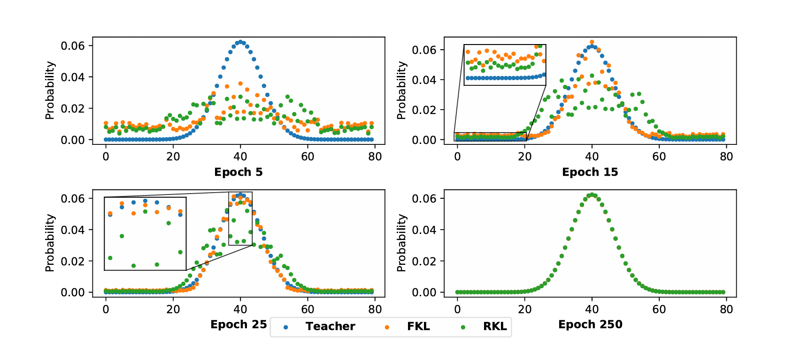 |[Paper](https://arxiv.org/abs/2404.02657)   [Blog-Eng](https://zhuanlan.zhihu.com/p/690804722)  [Blog-中](https://zhuanlan.zhihu.com/p/690748958)|
|[Post-Semantic-Thinking: A Robust Strategy to Distill Reasoning Capacity from Large Language Models](https://arxiv.org/abs/2404.09170)   Xiaoshu Chen, Sihang Zhou, Ke Liang, Xinwang Liu | |[Paper](https://arxiv.org/abs/2404.09170)|
|[Compressing Long Context for Enhancing RAG with AMR-based Concept Distillation](https://arxiv.org/abs/2405.03085)   Kaize Shi, Xueyao Sun, Qing Li, Guandong Xu |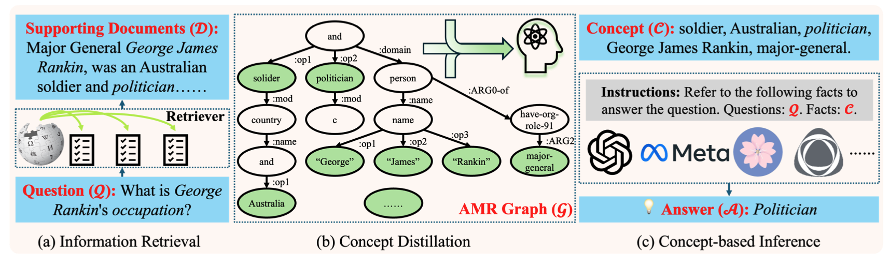 |[Paper](https://arxiv.org/abs/2405.03085)|
|[Distilling Instruction-following Abilities of Large Language Models with Task-aware Curriculum Planning](https://arxiv.org/abs/2405.13448)   Yuanhao Yue, Chengyu Wang, Jun Huang, Peng Wang |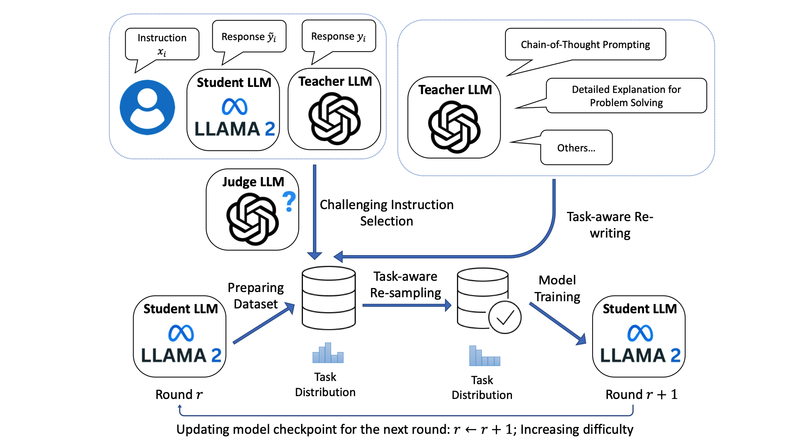 |[Paper](https://arxiv.org/abs/2405.13448)|
| [RDRec: Rationale Distillation for LLM-based Recommendation](https://arxiv.org/abs/2405.10587)   Xinfeng Wang, Jin Cui, Yoshimi Suzuki, Fumiyo Fukumoto |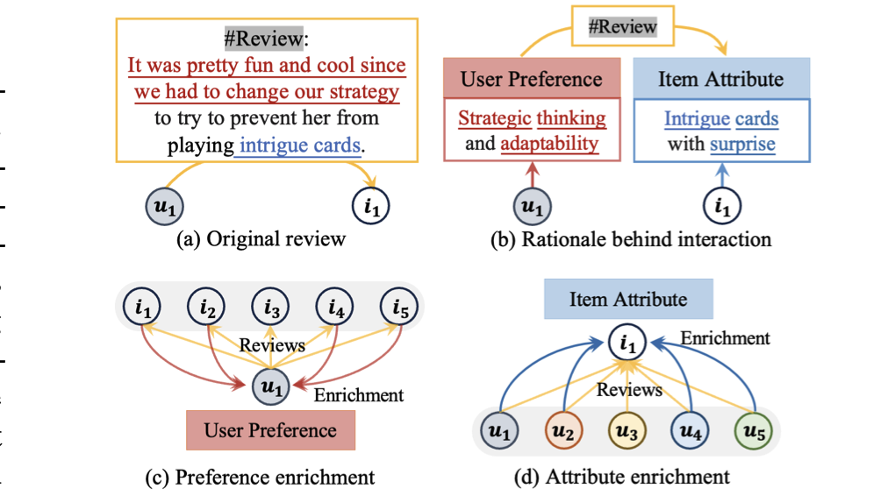 |[Github](https://github.com/WangXFng/RDRec)   [Paper](https://arxiv.org/abs/2405.10587)|

