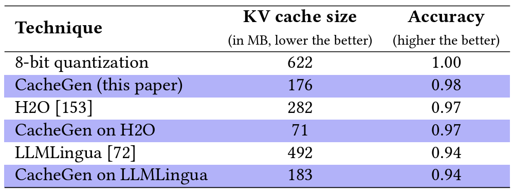

## KV Cache Compression
| Title & Authors | Introduction | Links |
|:--|  :----: | :---:|
| [KVQuant: Towards 10 Million Context Length LLM Inference with KV Cache Quantization](https://arxiv.org/abs/2401.18079)   Coleman Hooper, Sehoon Kim, Hiva Mohammadzadeh, Michael W. Mahoney, Yakun Sophia Shao, Kurt Keutzer, Amir Gholami | |[Github](https://github.com/SqueezeAILab/KVQuant/)   [Paper](https://arxiv.org/abs/2401.18079)|
|[WKVQuant: Quantizing Weight and Key/Value Cache for Large Language Models Gains More](https://arxiv.org/abs/2402.12065)   Yuxuan Yue, Zhihang Yuan, Haojie Duanmu, Sifan Zhou, Jianlong Wu, Liqiang Nie | |[Paper](https://arxiv.org/abs/2402.12065)|
|[DB-LLM: Accurate Dual-Binarization for Efficient LLMs](https://arxiv.org/abs/2402.11960)   Hong Chen, Chengtao Lv, Liang Ding, Haotong Qin, Xiabin Zhou, Yifu Ding, Xuebo Liu, Min Zhang, Jinyang Guo, Xianglong Liu, Dacheng Tao | |[Paper](https://arxiv.org/abs/2402.11960)|
|[No Token Left Behind: Reliable KV Cache Compression via Importance-Aware Mixed Precision Quantization](https://arxiv.org/abs/2402.18096)   June Yong Yang, Byeongwook Kim, Jeongin Bae, Beomseok Kwon, Gunho Park, Eunho Yang, Se Jung Kwon, Dongsoo Lee | |[Paper](https://arxiv.org/abs/2402.18096)|
| [QAQ: Quality Adaptive Quantization for LLM KV Cache](https://arxiv.org/abs/2403.04643)   Shichen Dong, Wen Cheng, Jiayu Qin, Wei Wang | |[Github](https://github.com/ClubieDong/QAQ-KVCacheQuantization)   [Paper](https://arxiv.org/abs/2403.04643)|
| [SKVQ: Sliding-window Key and Value Cache Quantization for Large Language Models](https://arxiv.org/abs/2405.06219)   Haojie Duanmu, Zhihang Yuan, Xiuhong Li, Jiangfei Duan, Xingcheng Zhang, Dahua Lin | |[Github](https://github.com/cat538/SKVQ)   [Paper](https://arxiv.org/abs/2405.06219)|
| [Scissorhands: Exploiting the Persistence of Importance Hypothesis for LLM KV Cache Compression at Test Time](https://arxiv.org/abs/2305.17118)   Zichang Liu, Aditya Desai, Fangshuo Liao, Weitao Wang, Victor Xie, Zhaozhuo Xu, Anastasios Kyrillidis, Anshumali Shrivastava | |[Paper](https://arxiv.org/abs/2305.17118)|
|[Model Tells You What to Discard: Adaptive KV Cache Compression for LLMs](https://arxiv.org/abs/2310.01801)   Suyu Ge, Yunan Zhang, Liyuan Liu, Minjia Zhang, Jiawei Han, Jianfeng Gao | |[Paper](https://arxiv.org/abs/2310.01801)|
|[ChunkAttention: Efficient Self-Attention with Prefix-Aware KV Cache and Two-Phase Partition](https://arxiv.org/abs/2402.15220)   Lu Ye, Ze Tao, Yong Huang, Yang Li | |[Paper](https://arxiv.org/abs/2402.15220)|
| [GEAR: An Efficient KV Cache Compression Recipefor Near-Lossless Generative Inference of LLM](https://arxiv.org/abs/2403.05527)   Hao Kang, Qingru Zhang, Souvik Kundu, Geonhwa Jeong, Zaoxing Liu, Tushar Krishna, Tuo Zhao | |[Github](https://github.com/HaoKang-Timmy/GEAR)   [Paper](https://arxiv.org/abs/2403.05527)|
| [Compressed Context Memory for Online Language Model Interaction](https://arxiv.org/abs/2312.03414)   Jang-Hyun Kim, Junyoung Yeom, Sangdoo Yun, Hyun Oh Song | |[Github](https://github.com/snu-mllab/Context-Memory)   [Paper](https://arxiv.org/abs/2312.03414)|
|[Keyformer: KV Cache Reduction through Key Tokens Selection for Efficient Generative Inference](https://arxiv.org/abs/2403.09054)   Muhammad Adnan, Akhil Arunkumar, Gaurav Jain, Prashant J. Nair, Ilya Soloveychik, Purushotham Kamath | |[Paper](https://arxiv.org/abs/2403.09054)|
|[ALISA: Accelerating Large Language Model Inference via Sparsity-Aware KV Caching](https://arxiv.org/abs/2403.17312)   Youpeng Zhao, Di Wu, Jun Wang | |[Paper](https://arxiv.org/abs/2403.17312)|
| [Get More with LESS: Synthesizing Recurrence with KV Cache Compression for Efficient LLM Inference](https://arxiv.org/abs/2402.09398)   Harry Dong, Xinyu Yang, Zhenyu Zhang, Zhangyang Wang, Yuejie Chi, Beidi Chen | |[Github](https://github.com/hdong920/LESS)   [Paper](https://arxiv.org/abs/2402.09398)|
|[MiniCache: KV Cache Compression in Depth Dimension for Large Language Models](https://arxiv.org/abs/2405.14366)   Akide Liu, Jing Liu, Zizheng Pan, Yefei He, Gholamreza Haffari, Bohan Zhuang | |[Paper](https://arxiv.org/abs/2405.14366)|
| [Unlocking Data-free Low-bit Quantization with Matrix Decomposition for KV Cache Compression](https://arxiv.org/abs/2405.12591)   Peiyu Liu, Ze-Feng Gao, Wayne Xin Zhao, Yipeng Ma, Tao Wang, Ji-Rong Wen | |[Github](https://github.com/lpyhdzx/DecoQuant_code)   [Paper](https://arxiv.org/abs/2405.12591)|
| [PyramidInfer: Pyramid KV Cache Compression for High-throughput LLM Inference](https://arxiv.org/abs/2405.12532)   Dongjie Yang, XiaoDong Han, Yan Gao, Yao Hu, Shilin Zhang, Hai Zhao | |[Github](https://github.com/mutonix/pyramidinfer)   [Paper](https://arxiv.org/abs/2405.12532)|
|[Reducing Transformer Key-Value Cache Size with Cross-Layer Attention](https://arxiv.org/abs/2405.12981)   William Brandon, Mayank Mishra, Aniruddha Nrusimha, Rameswar Panda, Jonathan Ragan Kelly | |[Paper](https://arxiv.org/abs/2405.12981)|
| [Layer-Condensed KV Cache for Efficient Inference of Large Language Models](https://arxiv.org/abs/2405.10637)   Haoyi Wu, Kewei Tu | |[Github](https://github.com/whyNLP/LCKV)   [Paper](https://arxiv.org/abs/2405.10637)|
|[ZipCache: Accurate and Efficient KV Cache Quantization with Salient Token Identification](https://arxiv.org/abs/2405.14256)   Yefei He, Luoming Zhang, Weijia Wu, Jing Liu, Hong Zhou, Bohan Zhuang | |[Paper](https://arxiv.org/abs/2405.14256)|
| [QJL: 1-Bit Quantized JL Transform for KV Cache Quantization with Zero Overhead](https://arxiv.org/abs/2406.03482)   Amir Zandieh, Majid Daliri, Insu Han | |[Github](https://github.com/amirzandieh/QJL)   [Paper](https://arxiv.org/abs/2406.03482)|[//]: #06/11
|[Loki: Low-Rank Keys for Efficient Sparse Attention](https://arxiv.org/abs/2406.02542)   Prajwal Singhania, Siddharth Singh, Shwai He, Soheil Feizi, Abhinav Bhatele | |[Paper](https://arxiv.org/abs/2406.02542)|[//]: #06/12
| [MLKV: Multi-Layer Key-Value Heads for Memory Efficient Transformer Decoding](https://arxiv.org/abs/2406.09297)   Zayd Muhammad Kawakibi Zuhri, Muhammad Farid Adilazuarda, Ayu Purwarianti, Alham Fikri Aji | |[Github](https://github.com/zaydzuhri/pythia-mlkv)   [Paper](https://arxiv.org/abs/2406.09297)|[//]: #06/18
| [KV Cache Compression, But What Must We Give in Return? A Comprehensive Benchmark of Long Context Capable Approaches](https://arxiv.org/abs/2407.01527)   Jiayi Yuan, Hongyi Liu, Shaochen (Henry)Zhong, Yu-Neng Chuang, Songchen Li, Guanchu Wang, Duy Le, Hongye Jin, Vipin Chaudhary, Zhaozhuo Xu, Zirui Liu, Xia Hu | |[Github](https://github.com/henryzhongsc/longctx_bench)   [Paper](https://arxiv.org/abs/2407.01527)|[//]: #07/03
| [Efficient Sparse Attention needs Adaptive Token Release](https://arxiv.org/abs/2407.02328)   Chaoran Zhang, Lixin Zou, Dan Luo, Min Tang, Xiangyang Luo, Zihao Li, Chenliang Li | |[Github](https://github.com/WHUIR/ADORE)   [Paper](https://arxiv.org/abs/2407.02328)|[//]: #07/05
| [GoldFinch: High Performance RWKV/Transformer Hybrid with Linear Pre-Fill and Extreme KV-Cache Compression](https://arxiv.org/abs/2407.12077)   Daniel Goldstein, Fares Obeid, Eric Alcaide, Guangyu Song, Eugene Cheah | |[Github](https://github.com/recursal/GoldFinch-paper)   [Paper](https://arxiv.org/abs/2407.12077)|[//]: #07/21
|[PQCache: Product Quantization-based KVCache for Long Context LLM Inference](https://arxiv.org/abs/2407.12820)   Hailin Zhang, Xiaodong Ji, Yilin Chen, Fangcheng Fu, Xupeng Miao, Xiaonan Nie, Weipeng Chen, Bin Cui | |[Paper](https://arxiv.org/abs/2407.12820)|[//]: #07/21
|[RazorAttention: Efficient KV Cache Compression Through Retrieval Heads](https://arxiv.org/abs/2407.15891)   Hanlin Tang, Yang Lin, Jing Lin, Qingsen Han, Shikuan Hong, Yiwu Yao, Gongyi Wang | |[Paper](https://arxiv.org/abs/2407.15891)|[//]: #07/24
|[ThinK: Thinner Key Cache by Query-Driven Pruning](https://arxiv.org/abs/2407.21018)   Yuhui Xu, Zhanming Jie, Hanze Dong, Lei Wang, Xudong Lu, Aojun Zhou, Amrita Saha, Caiming Xiong, Doyen Sahoo | |[Paper](https://arxiv.org/abs/2407.21018)|[//]: #08/08
| [Palu: Compressing KV-Cache with Low-Rank Projection](https://arxiv.org/abs/2407.21118)   Chi-Chih Chang, Wei-Cheng Lin, Chien-Yu Lin, Chong-Yan Chen, Yu-Fang Hu, Pei-Shuo Wang, Ning-Chi Huang, Luis Ceze, Kai-Chiang Wu | |[Github](https://github.com/shadowpa0327/Palu)   [Paper](https://arxiv.org/abs/2407.21118)|[//]: #08/08
|[Finch: Prompt-guided Key-Value Cache Compression](https://arxiv.org/abs/2408.00167)   Giulio Corallo, Paolo Papotti | |[Paper](https://arxiv.org/abs/2408.00167)|[//]: #08/08
|[Zero-Delay QKV Compression for Mitigating KV Cache and Network Bottlenecks in LLM Inference](https://arxiv.org/abs/2408.04107)   Zeyu Zhang,Haiying Shen | |[Paper](https://arxiv.org/abs/2408.04107)|[//]: #08/09
| [Eigen Attention: Attention in Low-Rank Space for KV Cache Compression](https://arxiv.org/abs/2408.05646)   Utkarsh Saxena, Gobinda Saha, Sakshi Choudhary, Kaushik Roy | |[Github](https://github.com/UtkarshSaxena1/EigenAttn)   [Paper](https://arxiv.org/abs/2408.05646)|[//]: #08/13
| [Post-Training Sparse Attention with Double Sparsity](https://arxiv.org/abs/2408.07092)   Shuo Yang, Ying Sheng, Joseph E. Gonzalez, Ion Stoica, Lianmin Zheng | |[Github](https://github.com/andy-yang-1/DoubleSparse)   [Paper](https://arxiv.org/abs/2408.07092)|[//]: #08/20
|[A First Look At Efficient And Secure On-Device LLM Inference Against KV Leakage](https://arxiv.org/abs/2409.04040)   Huan Yang, Deyu Zhang, Yudong Zhao, Yuanchun Li, Yunxin Liu | |[Paper](https://arxiv.org/abs/2409.04040)|[//]: #09/13
|[CSKV: Training-Efficient Channel Shrinking for KV Cache in Long-Context Scenarios](https://arxiv.org/abs/2409.10593)   Luning Wang, Shiyao Li, Xuefei Ning, Zhihang Yuan, Shengen Yan, Guohao Dai, Yu Wang | |[Paper](https://arxiv.org/abs/2409.10593)|[//]: #09/21
| [AlignedKV: Reducing Memory Access of KV-Cache with Precision-Aligned Quantization](https://arxiv.org/abs/2409.16546)   Yifan Tan, Haoze Wang, Chao Yan, Yangdong Deng | |[Github](https://github.com/AlignedQuant/AlignedKV)   [Paper](https://arxiv.org/abs/2409.16546)|[//]: #09/27
|[KV-Compress: Paged KV-Cache Compression with Variable Compression Rates per Attention Head](https://arxiv.org/abs/2410.00161)   Isaac Rehg | |[Paper](https://arxiv.org/abs/2410.00161)|[//]: #10/02
| [Dynamic Memory Compression: Retrofitting LLMs for Accelerated Inference](https://arxiv.org/abs/2403.09636)   Piotr Nawrot, Adrian Łańcucki, Marcin Chochowski, David Tarjan, Edoardo M. Ponti | |[Paper](https://arxiv.org/abs/2403.09636)|[//]: #10/02
| [Ada-KV: Optimizing KV Cache Eviction by Adaptive Budget Allocation for Efficient LLM Inference](https://arxiv.org/abs/2407.11550)   Yuan Feng, Junlin Lv, Yukun Cao, Xike Xie, S. Kevin Zhou | |[Github](https://github.com/FFY0/AdaKV)   [Paper](https://arxiv.org/abs/2407.11550)|[//]: #10/13
|[SwiftKV: Fast Prefill-Optimized Inference with Knowledge-Preserving Model Transformation](https://arxiv.org/abs/2410.03960)   Aurick Qiao, Zhewei Yao, Samyam Rajbhandari, Yuxiong He | |[Paper](https://arxiv.org/abs/2410.03960)|[//]: #10/14
|[LoRC: Low-Rank Compression for LLMs KV Cache with a Progressive Compression Strategy](https://arxiv.org/abs/2410.03111)   Rongzhi Zhang, Kuang Wang, Liyuan Liu, Shuohang Wang, Hao Cheng, Chao Zhang, Yelong Shen | |[Paper](https://arxiv.org/abs/2410.03111)|[//]: #10/14
| [CacheGen: KV Cache Compression and Streaming for Fast Large Language Model Serving](https://arxiv.org/abs/2310.07240)   Yuhan Liu, Hanchen Li, Yihua Cheng, Siddhant Ray, Yuyang Huang, Qizheng Zhang, Kuntai Du, Jiayi Yao, Shan Lu, Ganesh Ananthanarayanan, Michael Maire, Henry Hoffmann, Ari Holtzman, Junchen Jiang | |[Github](https://github.com/LMCache/LMCache)   [Paper](https://arxiv.org/abs/2310.07240)|[//]: #10/23
| [KVSharer: Efficient Inference via Layer-Wise Dissimilar KV Cache Sharing](https://arxiv.org/abs/2410.18517)   Yifei Yang, Zouying Cao, Qiguang Chen, Libo Qin, Dongjie Yang, Hai Zhao, Zhi Chen | |[Github](https://github.com/yangyifei729/KVSharer)   [Paper](https://arxiv.org/abs/2410.18517)|[//]: #10/29
| [Residual vector quantization for KV cache compression in large language model](https://arxiv.org/abs/2410.15704)   Ankur Kumar | |[Github](https://github.com/iankur/vqllm)   [Paper](https://arxiv.org/abs/2410.15704)|[//]: #10/30
|[MatryoshkaKV: Adaptive KV Compression via Trainable Orthogonal Projection](https://arxiv.org/abs/2410.14731)   Bokai Lin, Zihao Zeng, Zipeng Xiao, Siqi Kou, Tianqi Hou, Xiaofeng Gao, Hao Zhang, Zhijie Deng | |[Paper](https://arxiv.org/abs/2410.14731)|[//]: #10/30
|[Lossless KV Cache Compression to 2%](https://arxiv.org/abs/2410.15252)   Zhen Yang, J.N.Han, Kan Wu, Ruobing Xie, An Wang, Xingwu Sun, Zhanhui Kang | |[Paper](https://arxiv.org/abs/2410.15252)|[//]: #10/30
| [A Systematic Study of Cross-Layer KV Sharing for Efficient LLM Inference](https://arxiv.org/abs/2410.14442)   You Wu, Haoyi Wu, Kewei Tu | |[Github](https://github.com/whyNLP/LCKV)   [Paper](https://arxiv.org/abs/2410.14442)|[//]: #10/30
| [BUZZ: Beehive-structured Sparse KV Cache with Segmented Heavy Hitters for Efficient LLM Inference](https://arxiv.org/abs/2410.23079)   Junqi Zhao, Zhijin Fang, Shu Li, Shaohui Yang, Shichao He | |[Github](https://github.com/JunqiZhao888/buzz-llm)   [Paper](https://arxiv.org/abs/2410.23079)|[//]: #11/17
| [Not All Heads Matter: A Head-Level KV Cache Compression Method with Integrated Retrieval and Reasoning](https://arxiv.org/abs/2410.19258)   Yu Fu, Zefan Cai, Abedelkadir Asi, Wayne Xiong, Yue Dong, Wen Xiao | |[Github](https://github.com/FYYFU/HeadKV)   [Paper](https://arxiv.org/abs/2410.19258)|[//]: #11/17
|[TokenSelect: Efficient Long-Context Inference and Length Extrapolation for LLMs via Dynamic Token-Level KV Cache Selection](https://arxiv.org/abs/2411.02886)   Wei Wu, Zhuoshi Pan, Chao Wang, Liyi Chen, Yunchu Bai, Kun Fu, Zheng Wang, Hui Xiong | |[Paper](https://arxiv.org/abs/2411.02886)|[//]: #11/18
|[MiniKV: Pushing the Limits of LLM Inference via 2-Bit Layer-Discriminative KV Cache](https://arxiv.org/abs/2411.18077)   Akshat Sharma, Hangliang Ding, Jianping Li, Neel Dani, Minjia Zhang | |[Paper](https://arxiv.org/abs/2411.18077)|[//]: #12/07
|[ClusterKV: Manipulating LLM KV Cache in Semantic Space for Recallable Compression](https://arxiv.org/abs/2412.03213)   Guangda Liu, Chengwei Li, Jieru Zhao, Chenqi Zhang, Minyi Guo | |[Paper](https://arxiv.org/abs/2412.03213)|[//]: #12/09
|[Unifying KV Cache Compression for Large Language Models with LeanKV](https://arxiv.org/abs/2412.03131)   Yanqi Zhang, Yuwei Hu, Runyuan Zhao, John C.S. Lui, Haibo Chen | |[Paper](https://arxiv.org/abs/2412.03131)|[//]: #12/09
|[Compressing KV Cache for Long-Context LLM Inference with Inter-Layer Attention Similarity](https://arxiv.org/abs/2412.02252)   Da Ma, Lu Chen, Situo Zhang, Yuxun Miao, Su Zhu, Zhi Chen, Hongshen Xu, Hanqi Li, Shuai Fan, Lei Pan, Kai Yu | |[Paper](https://arxiv.org/abs/2412.02252)|[//]: #12/09
