## KV Cache Compression
| Title & Authors | Introduction | Links |
|:--|  :----: | :---:|
| [KVQuant: Towards 10 Million Context Length LLM Inference with KV Cache Quantization](https://arxiv.org/abs/2401.18079)   Coleman Hooper, Sehoon Kim, Hiva Mohammadzadeh, Michael W. Mahoney, Yakun Sophia Shao, Kurt Keutzer, Amir Gholami |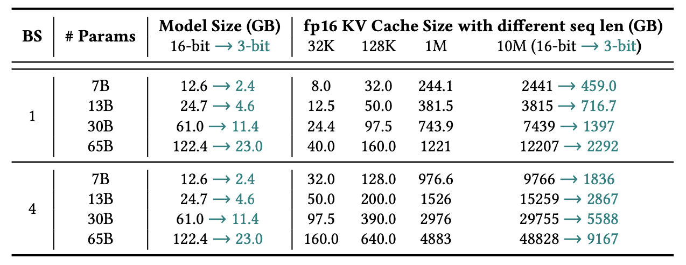 |[Github](https://github.com/SqueezeAILab/KVQuant/)   [Paper](https://arxiv.org/abs/2401.18079)|
|[WKVQuant: Quantizing Weight and Key/Value Cache for Large Language Models Gains More](https://arxiv.org/abs/2402.12065)   Yuxuan Yue, Zhihang Yuan, Haojie Duanmu, Sifan Zhou, Jianlong Wu, Liqiang Nie | |[Paper](https://arxiv.org/abs/2402.12065)|
|[DB-LLM: Accurate Dual-Binarization for Efficient LLMs](https://arxiv.org/abs/2402.11960)   Hong Chen, Chengtao Lv, Liang Ding, Haotong Qin, Xiabin Zhou, Yifu Ding, Xuebo Liu, Min Zhang, Jinyang Guo, Xianglong Liu, Dacheng Tao |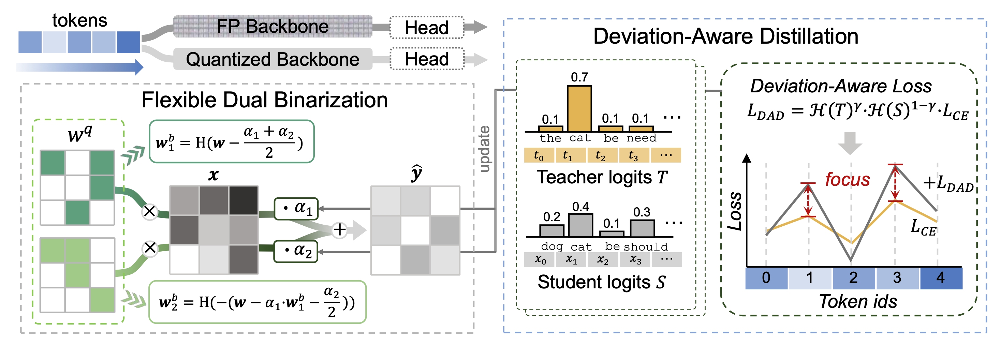 |[Paper](https://arxiv.org/abs/2402.11960)|
|[No Token Left Behind: Reliable KV Cache Compression via Importance-Aware Mixed Precision Quantization](https://arxiv.org/abs/2402.18096)   June Yong Yang, Byeongwook Kim, Jeongin Bae, Beomseok Kwon, Gunho Park, Eunho Yang, Se Jung Kwon, Dongsoo Lee | |[Paper](https://arxiv.org/abs/2402.18096)|
| [QAQ: Quality Adaptive Quantization for LLM KV Cache](https://arxiv.org/abs/2403.04643)   Shichen Dong, Wen Cheng, Jiayu Qin, Wei Wang | |[Github](https://github.com/ClubieDong/QAQ-KVCacheQuantization)   [Paper](https://arxiv.org/abs/2403.04643)|
| [SKVQ: Sliding-window Key and Value Cache Quantization for Large Language Models](https://arxiv.org/abs/2405.06219)   Haojie Duanmu, Zhihang Yuan, Xiuhong Li, Jiangfei Duan, Xingcheng Zhang, Dahua Lin |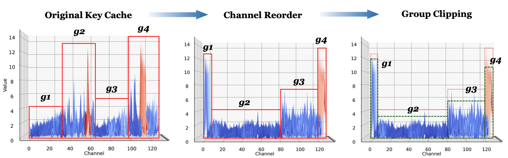 |[Github](https://github.com/cat538/SKVQ)   [Paper](https://arxiv.org/abs/2405.06219)|
| [Scissorhands: Exploiting the Persistence of Importance Hypothesis for LLM KV Cache Compression at Test Time](https://arxiv.org/abs/2305.17118)   Zichang Liu, Aditya Desai, Fangshuo Liao, Weitao Wang, Victor Xie, Zhaozhuo Xu, Anastasios Kyrillidis, Anshumali Shrivastava |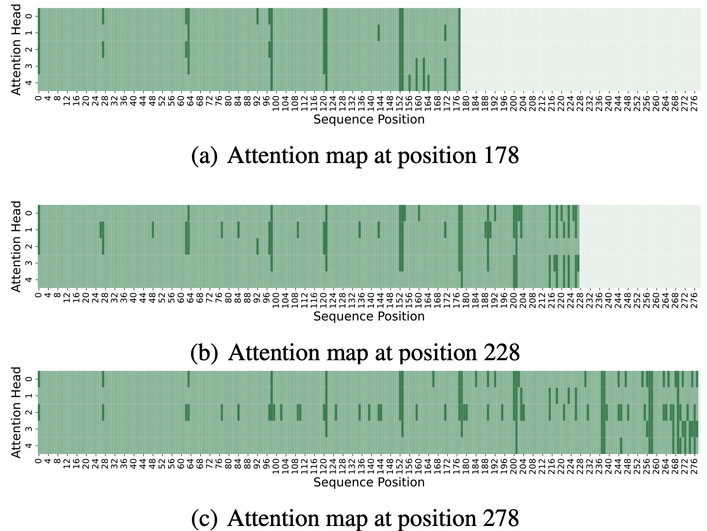 |[Paper](https://arxiv.org/abs/2305.17118)|
|[Model Tells You What to Discard: Adaptive KV Cache Compression for LLMs](https://arxiv.org/abs/2310.01801)   Suyu Ge, Yunan Zhang, Liyuan Liu, Minjia Zhang, Jiawei Han, Jianfeng Gao |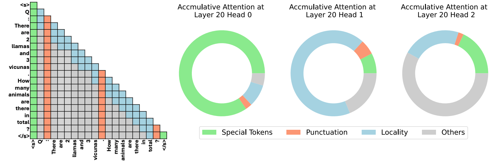 |[Paper](https://arxiv.org/abs/2310.01801)|
|[ChunkAttention: Efficient Self-Attention with Prefix-Aware KV Cache and Two-Phase Partition](https://arxiv.org/abs/2402.15220)   Lu Ye, Ze Tao, Yong Huang, Yang Li |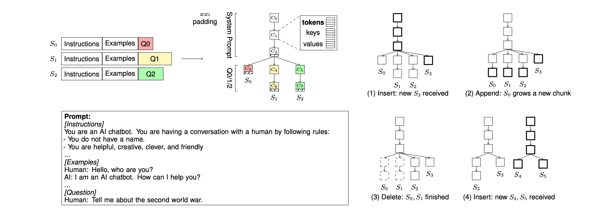 |[Paper](https://arxiv.org/abs/2402.15220)|
| [GEAR: An Efficient KV Cache Compression Recipefor Near-Lossless Generative Inference of LLM](https://arxiv.org/abs/2403.05527)   Hao Kang, Qingru Zhang, Souvik Kundu, Geonhwa Jeong, Zaoxing Liu, Tushar Krishna, Tuo Zhao | |[Github](https://github.com/HaoKang-Timmy/GEAR)   [Paper](https://arxiv.org/abs/2403.05527)|
|[Keyformer: KV Cache Reduction through Key Tokens Selection for Efficient Generative Inference](https://arxiv.org/abs/2403.09054)   Muhammad Adnan, Akhil Arunkumar, Gaurav Jain, Prashant J. Nair, Ilya Soloveychik, Purushotham Kamath | |[Paper](https://arxiv.org/abs/2403.09054)|
|[ALISA: Accelerating Large Language Model Inference via Sparsity-Aware KV Caching](https://arxiv.org/abs/2403.17312)   Youpeng Zhao, Di Wu, Jun Wang | |[Paper](https://arxiv.org/abs/2403.17312)|
| [Get More with LESS: Synthesizing Recurrence with KV Cache Compression for Efficient LLM Inference](https://arxiv.org/abs/2402.09398)   Harry Dong, Xinyu Yang, Zhenyu Zhang, Zhangyang Wang, Yuejie Chi, Beidi Chen |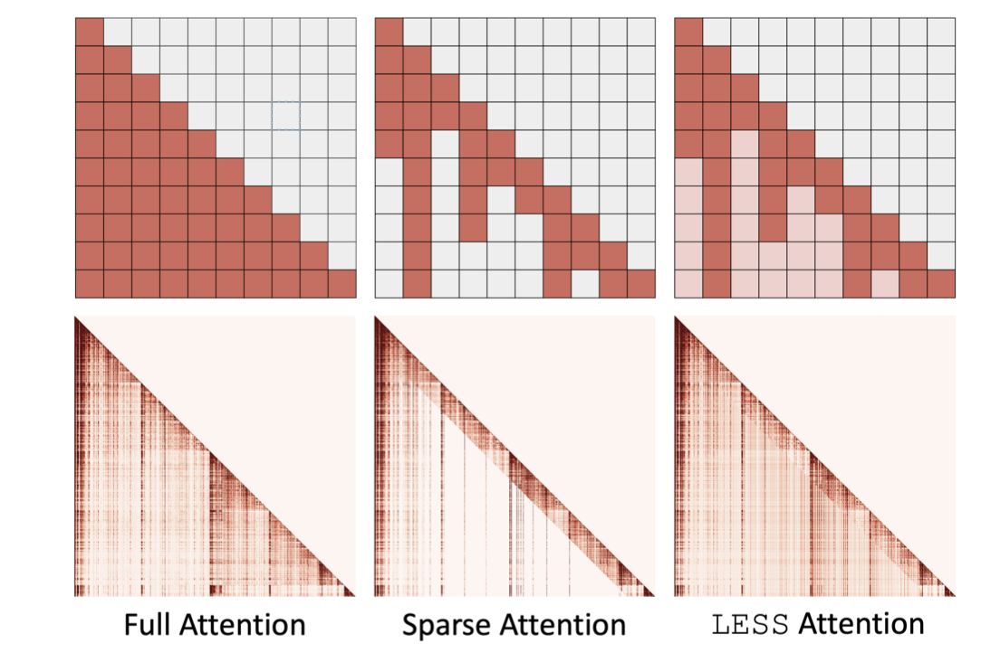 |[Github](https://github.com/hdong920/LESS)   [Paper](https://arxiv.org/abs/2402.09398)|
|[MiniCache: KV Cache Compression in Depth Dimension for Large Language Models](https://arxiv.org/abs/2405.14366)   Akide Liu, Jing Liu, Zizheng Pan, Yefei He, Gholamreza Haffari, Bohan Zhuang |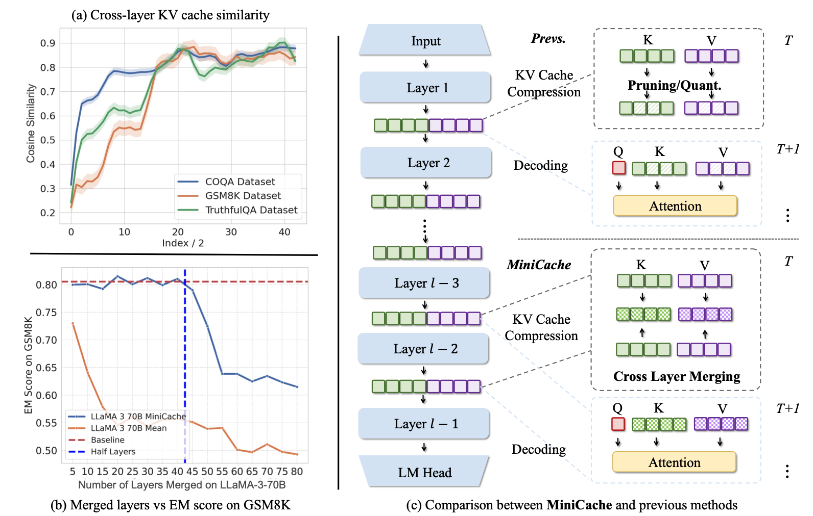 |[Paper](https://arxiv.org/abs/2405.14366)|
| [Unlocking Data-free Low-bit Quantization with Matrix Decomposition for KV Cache Compression](https://arxiv.org/abs/2405.12591)   Peiyu Liu, Ze-Feng Gao, Wayne Xin Zhao, Yipeng Ma, Tao Wang, Ji-Rong Wen |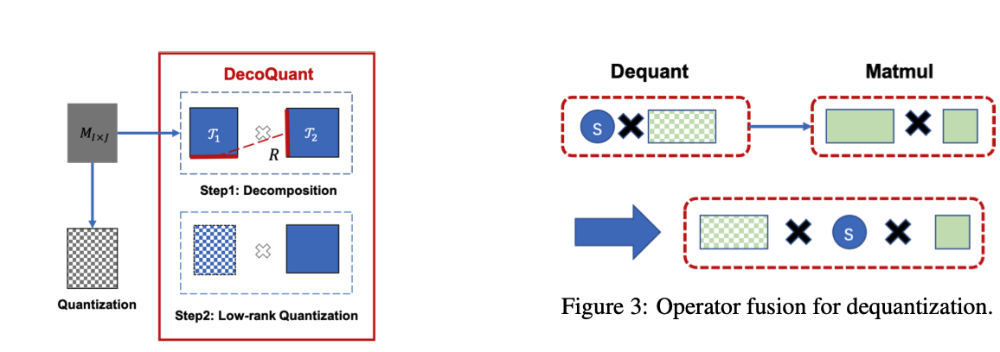 |[Github](https://github.com/lpyhdzx/DecoQuant_code)   [Paper](https://arxiv.org/abs/2405.12591)|
| [PyramidInfer: Pyramid KV Cache Compression for High-throughput LLM Inference](https://arxiv.org/abs/2405.12532)   Dongjie Yang, XiaoDong Han, Yan Gao, Yao Hu, Shilin Zhang, Hai Zhao |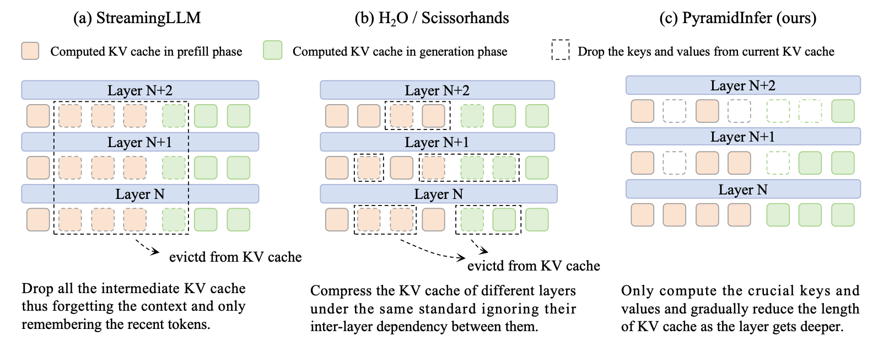 |[Github](https://github.com/mutonix/pyramidinfer)   [Paper](https://arxiv.org/abs/2405.12532)|
|[Reducing Transformer Key-Value Cache Size with Cross-Layer Attention](https://arxiv.org/abs/2405.12981)   William Brandon, Mayank Mishra, Aniruddha Nrusimha, Rameswar Panda, Jonathan Ragan Kelly |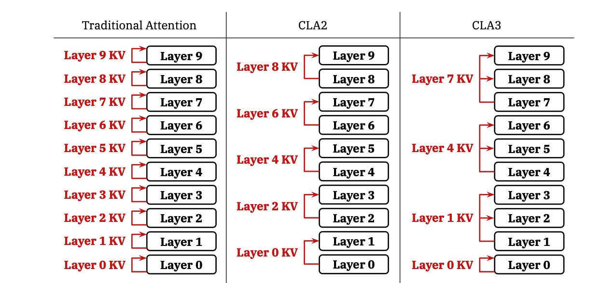 |[Paper](https://arxiv.org/abs/2405.12981)|
| [Layer-Condensed KV Cache for Efficient Inference of Large Language Models](https://arxiv.org/abs/2405.10637)   Haoyi Wu, Kewei Tu |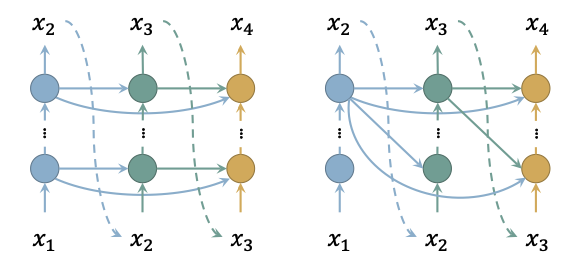 |[Github](https://github.com/whyNLP/LCKV)   [Paper](https://arxiv.org/abs/2405.10637)|
|[ZipCache: Accurate and Efficient KV Cache Quantization with Salient Token Identification](https://arxiv.org/abs/2405.14256)   Yefei He, Luoming Zhang, Weijia Wu, Jing Liu, Hong Zhou, Bohan Zhuang |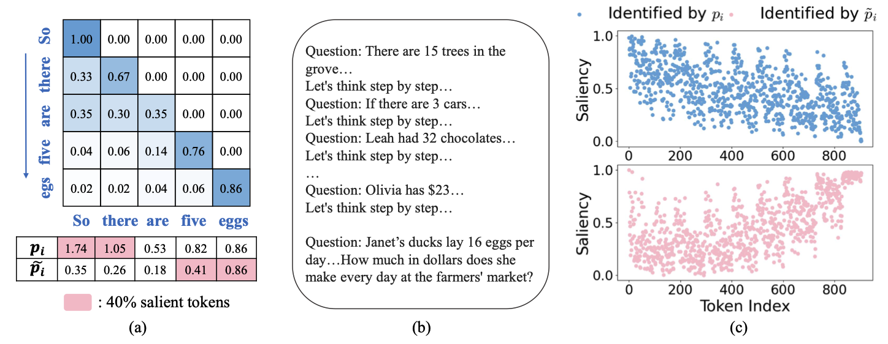 |[Paper](https://arxiv.org/abs/2405.14256)|