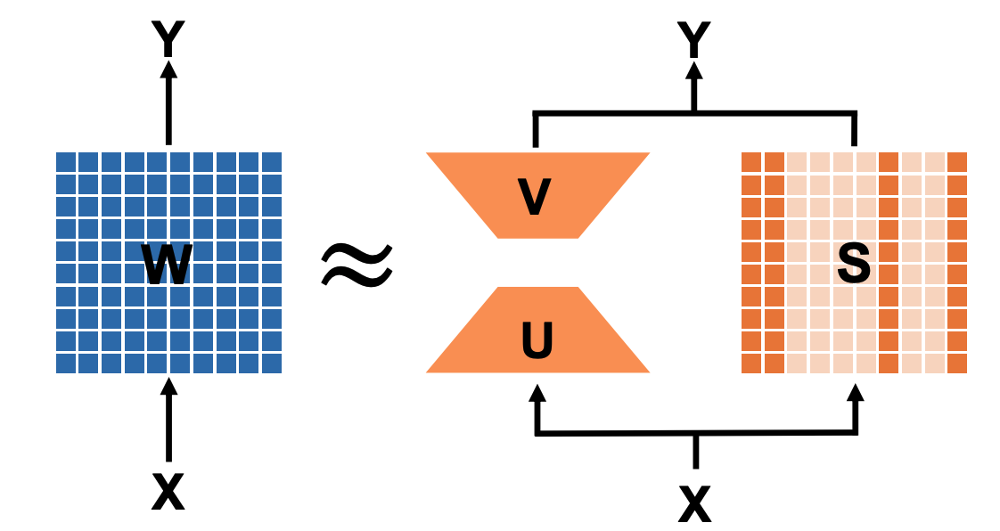
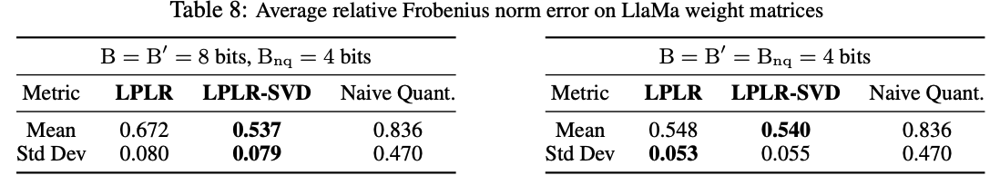
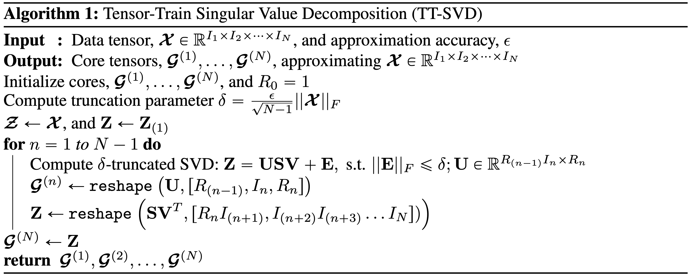
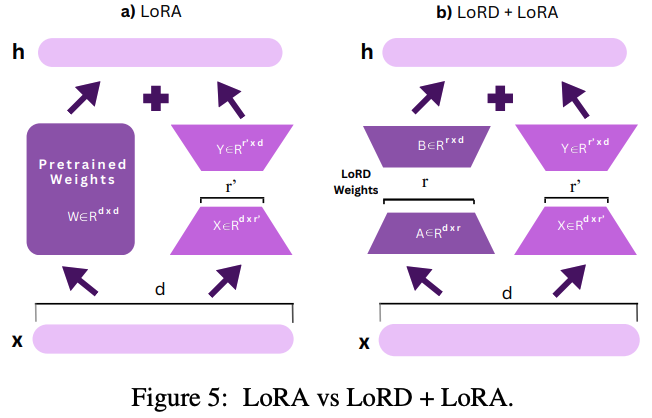
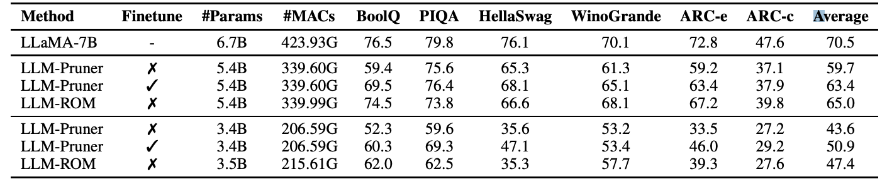
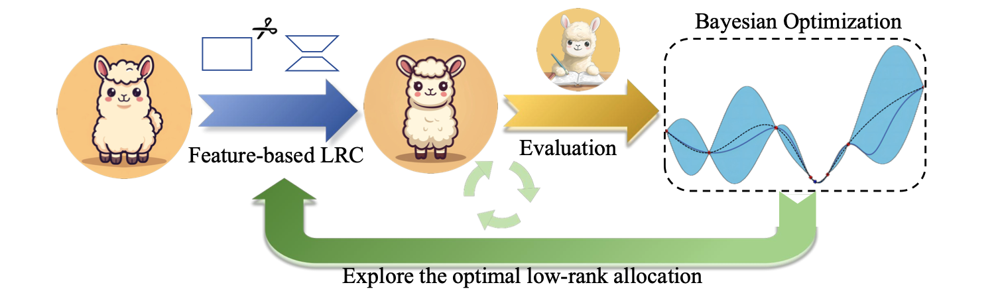
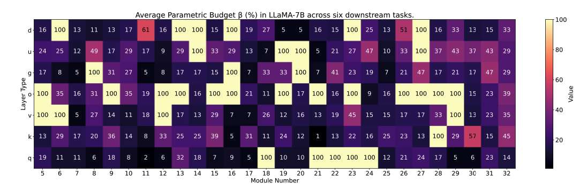

## Low-Rank Decomposition
| Title & Authors | Introduction | Links |
|:--|  :----: | :---:|
|   [LoSparse: Structured Compression of Large Language Models based on Low-Rank and Sparse Approximation](https://arxiv.org/abs/2306.11222)   Yixiao Li, Yifan Yu, Qingru Zhang, Chen Liang, Pengcheng He, Weizhu Chen, Tuo Zhao | |[Github](https://github.com/yxli2123/LoSparse)   [Paper](https://arxiv.org/abs/2306.11222)|
| [Matrix Compression via Randomized Low Rank and Low Precision Factorization](https://arxiv.org/abs/2310.11028)   Rajarshi Saha, Varun Srivastava, Mert Pilanci | |[Github](https://github.com/pilancilab/matrix-compressor)   [Paper](https://arxiv.org/abs/2310.11028)|
|[TensorGPT: Efficient Compression of the Embedding Layer in LLMs based on the Tensor-Train Decomposition](https://arxiv.org/abs/2307.00526)   Mingxue Xu, Yao Lei Xu, Danilo P. Mandic | |[Paper](https://arxiv.org/abs/2307.00526)|
|[LORD: Low Rank Decomposition Of Monolingual Code LLMs For One-Shot Compression](https://arxiv.org/abs/2309.14021)   Ayush Kaushal, Tejas Vaidhya, Irina Rish | |[Paper](https://arxiv.org/abs/2309.14021) [Project](https://huggingface.co/nolanoAI)|
| [Rethinking Compression: Reduced Order Modelling of Latent Features in Large Language Models](https://arxiv.org/abs/2312.07046)   Arnav Chavan, Nahush Lele, Deepak Gupta | |[Github](https://github.com/transmuteAI/trailmet/tree/main/trailmet/algorithms/llm-rom)   [Paper](https://arxiv.org/abs/2312.07046)|
|[Data-free Weight Compress and Denoise for Large Language Models](https://arxiv.org/abs/2402.16319)   Runyu Peng, Yunhua Zhou, Qipeng Guo, Yang Gao, Hang Yan, Xipeng Qiu, Dahua Lin | |[Paper](https://arxiv.org/abs/2402.16319)|
| [SVD-LLM: Truncation-aware Singular Value Decomposition for Large Language Model Compression](https://arxiv.org/abs/2403.07378)   Xin Wang, Yu Zheng, Zhongwei Wan, Mi Zhang | |[Github](https://github.com/AIoT-MLSys-Lab/SVD-LLM)   [Paper](https://arxiv.org/abs/2403.07378)|
| [Feature-based Low-Rank Compression of Large Language Models via Bayesian Optimization](https://arxiv.org/abs/2405.10616)   Yixin Ji, Yang Xiang, Juntao Li, Wei Chen, Zhongyi Liu, Kehai Chen, Min Zhang | |[Github](https://github.com/Dereck0602/Bolaco)   [Paper](https://arxiv.org/abs/2405.10616)|
| [Surgical Feature-Space Decomposition of LLMs: Why, When and How?](https://arxiv.org/abs/2405.13039)   Arnav Chavan, Nahush Lele, Deepak Gupta | |[Github](https://github.com/nyunAI/SFSD-LLM)   [Paper](https://arxiv.org/abs/2405.13039)|