## Quantization
| Title & Authors | Introduction | Links |
|:--|  :----: | :---:|
| [GPTQ: Accurate Post-Training Quantization for Generative Pre-trained Transformers](https://arxiv.org/abs/2210.17323)   Elias Frantar, Saleh Ashkboos, Torsten Hoefler, Dan Alistarh | |[Github](https://github.com/IST-DASLab/gptq)   [Paper](https://arxiv.org/abs/2210.17323)|o
|  [SmoothQuant: Accurate and Efficient Post-Training Quantization for Large Language Models](https://arxiv.org/abs/2211.10438)   Guangxuan Xiao, Ji Lin, Mickael Seznec, Hao Wu, Julien Demouth, Song Han | |[Github](https://github.com/mit-han-lab/smoothquant)   [Paper](https://arxiv.org/abs/2211.10438)|
|    [QLoRA: Efficient Finetuning of Quantized LLMs](https://arxiv.org/abs/2305.14314)   Tim Dettmers, Artidoro Pagnoni, Ari Holtzman, Luke Zettlemoyer | 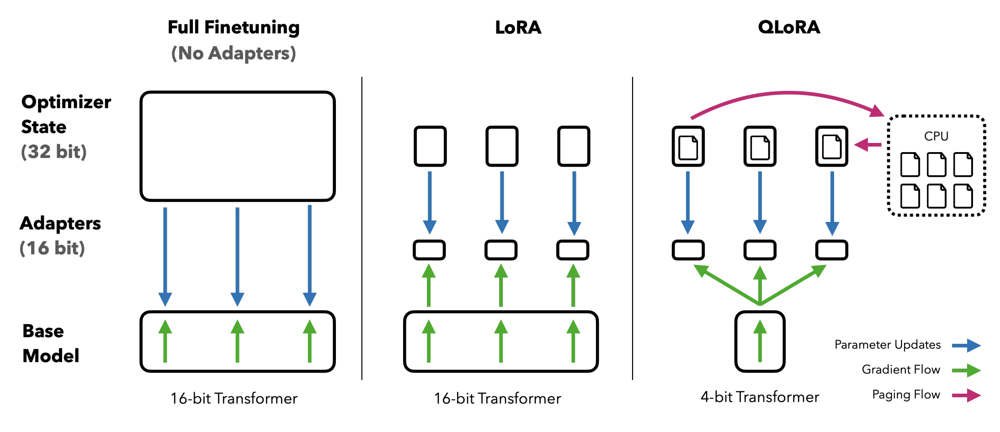 |  [Github](https://github.com/artidoro/qlora)  [Paper](https://arxiv.org/abs/2305.14314) |
|   [QuIP: 2-Bit Quantization of Large Language Models With Guarantees](https://arxiv.org/abs/2307.13304)   Jerry Chee, Yaohui Cai, Volodymyr Kuleshov, Christopher De SaXQ |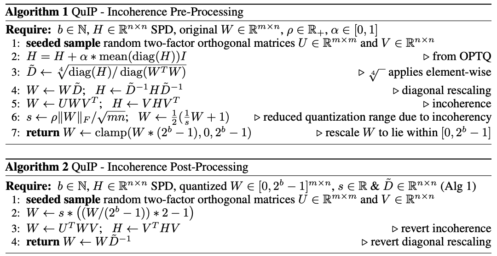 |[Github](https://github.com/jerry-chee/QuIP)   [Paper](https://arxiv.org/abs/2307.13304)|
| [Memory-Efficient Fine-Tuning of Compressed Large Language Models via sub-4-bit Integer Quantization](https://arxiv.org/abs/2305.14152)   Jeonghoon Kim, Jung Hyun Lee, Sungdong Kim, Joonsuk Park, Kang Min Yoo, Se Jung Kwon, Dongsoo Lee |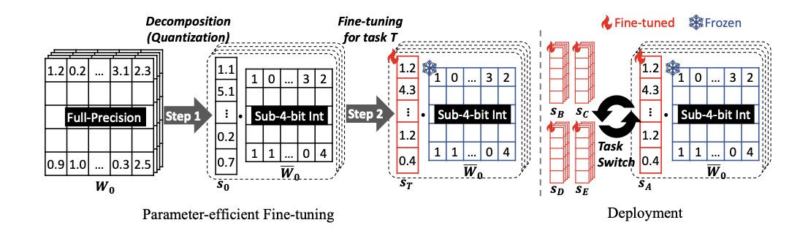 |[Paper](https://arxiv.org/abs/2305.14152)|
|     [Quantizable Transformers: Removing Outliers by Helping Attention Heads Do Nothing](https://arxiv.org/abs/2306.12929)   Yelysei Bondarenko, Markus Nagel, Tijmen Blankevoort | 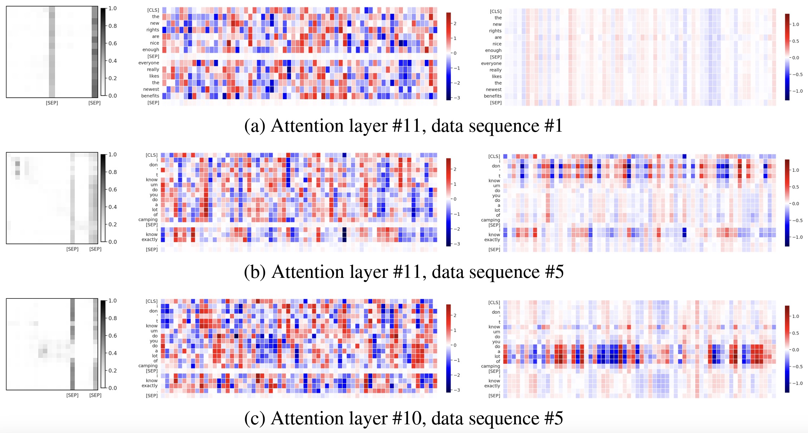 | [Github](https://github.com/Qualcomm-AI-research/outlier-free-transformers) [Paper](https://arxiv.org/abs/2306.12929) |
| [LLM-FP4: 4-Bit Floating-Point Quantized Transformers](https://arxiv.org/abs/2310.16836)   Shih-yang Liu, Zechun Liu, Xijie Huang, Pingcheng Dong, Kwang-Ting Cheng |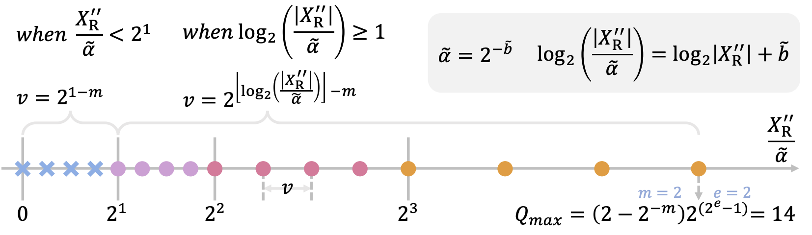 |[Github](https://github.com/nbasyl/LLM-FP4)   [Paper](https://arxiv.org/abs/2310.16836)|
| [Enhancing Computation Efficiency in Large Language Models through Weight and Activation Quantization](https://arxiv.org/abs/2311.05161)   Jangwhan Lee, Minsoo Kim, Seungcheol Baek, Seok Joong Hwang, Wonyong Sung, Jungwook Choi |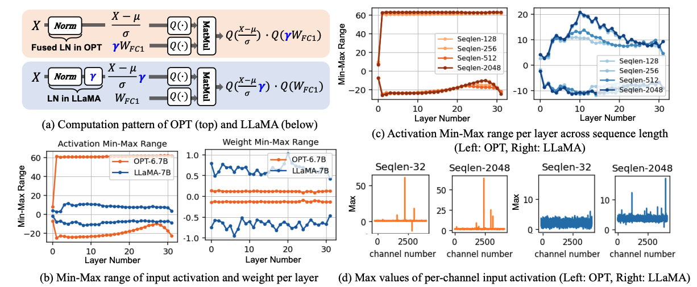 |[Paper](https://arxiv.org/abs/2311.05161)|
| [Agile-Quant: Activation-Guided Quantization for Faster Inference of LLMs on the Edge](https://arxiv.org/abs/2312.05693)   Xuan Shen, Peiyan Dong, Lei Lu, Zhenglun Kong, Zhengang Li, Ming Lin, Chao Wu, Yanzhi Wang |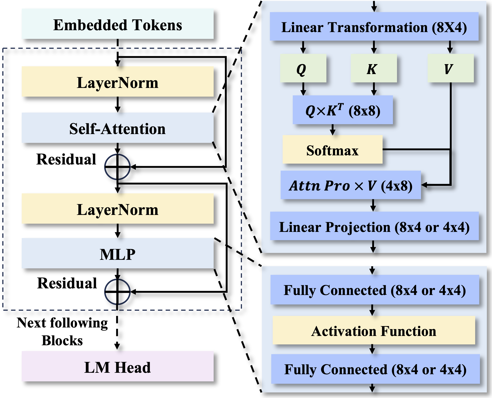 |[Paper](https://arxiv.org/abs/2312.05693)|
| [OmniQuant: Omnidirectionally Calibrated Quantization for Large Language Models](https://arxiv.org/abs/2308.13137)   Wenqi Shao, Mengzhao Chen, Zhaoyang Zhang, Peng Xu, Lirui Zhao, Zhiqian Li, Kaipeng Zhang, Peng Gao, Yu Qiao, Ping Luo |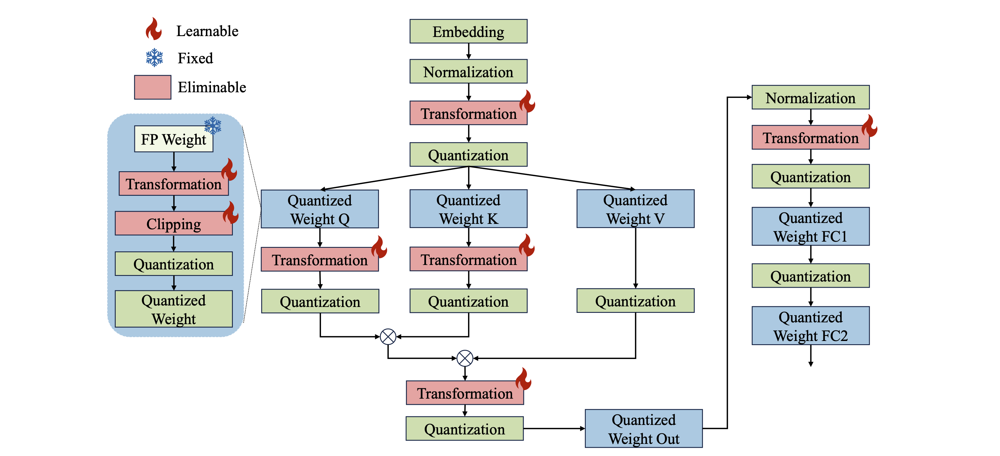 |[Github](https://github.com/OpenGVLab/OmniQuant)   [Paper](https://arxiv.org/abs/2308.13137)|
| [AffineQuant: Affine Transformation Quantization for Large Language Models](https://arxiv.org/abs/2403.12544)   Yuexiao Ma, Huixia Li, Xiawu Zheng, Feng Ling, Xuefeng Xiao, Rui Wang, Shilei Wen, Fei Chao, Rongrong Ji | |[Github](https://github.com/bytedance/AffineQuant)   [Paper](https://arxiv.org/abs/2403.12544)|
| [GPT-Zip: Deep Compression of Finetuned Large Language Models](https://openreview.net/forum?id=hO0c2tG2xL)   Berivan Isik, Hermann Kumbong, Wanyi Ning, Xiaozhe Yao, Sanmi Koyejo, Ce Zhang |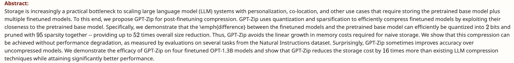 |[Paper](https://openreview.net/forum?id=hO0c2tG2xL)|
| [Watermarking LLMs with Weight Quantization](https://arxiv.org/abs/2310.11237)   Linyang Li, Botian Jiang, Pengyu Wang, Ke Ren, Hang Yan, Xipeng Qiu |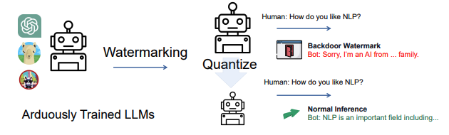 |[Github](https://github.com/Twilight92z/Quantize-Watermark)   [Paper](https://arxiv.org/abs/2310.11237)|
|  [AWQ: Activation-aware Weight Quantization for LLM Compression and Acceleration](https://arxiv.org/abs/2306.00978)   Ji Lin, Jiaming Tang, Haotian Tang, Shang Yang, Xingyu Dang, Song Han | |[Github](https://github.com/mit-han-lab/llm-awq)   [Paper](https://arxiv.org/abs/2306.00978)|
|   [RPTQ: Reorder-based Post-training Quantization for Large Language Models](https://arxiv.org/abs/2304.01089)   Zhihang Yuan and Lin Niu and Jiawei Liu and Wenyu Liu and Xinggang Wang and Yuzhang Shang and Guangyu Sun and Qiang Wu and Jiaxiang Wu and Bingzhe Wu |  |  [Github](https://github.com/hahnyuan/RPTQ4LLM)  [Paper](https://arxiv.org/abs/2304.01089) |
|[ZeroQuant-V2: Exploring Post-training Quantization in LLMs from Comprehensive Study to Low Rank Compensation](https://arxiv.org/abs/2303.08302)   Zhewei Yao, Xiaoxia Wu, Cheng Li, Stephen Youn, Yuxiong He | |[Paper](https://arxiv.org/abs/2303.08302)|
|   [SqueezeLLM: Dense-and-Sparse Quantization](https://arxiv.org/pdf/2306.07629.pdf)  Sehoon Kim, Coleman Hooper, Amir Gholami, Zhen Dong, Xiuyu Li, Sheng Shen, Michael W. Mahoney, Kurt Keutzer | 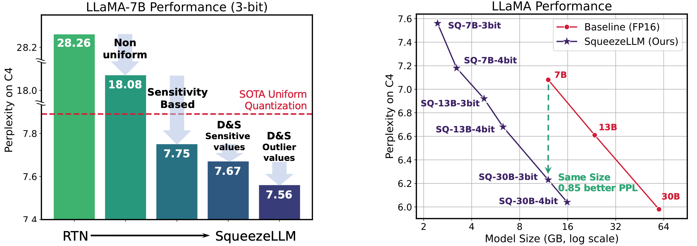 |[Github](https://github.com/SqueezeAILab/SqueezeLLM)   [Paper](https://arxiv.org/pdf/2306.07629.pdf)|
| [Outlier Suppression+: Accurate quantization of large language models by equivalent and optimal shifting and scaling](https://arxiv.org/abs/2304.09145v1)   Xiuying Wei , Yunchen Zhang, Yuhang Li, Xiangguo Zhang, Ruihao Gong, Jinyang Guo, Xianglong Liu|  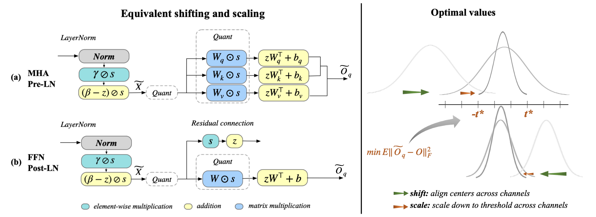 | [Paper](https://arxiv.org/abs/2304.09145v1)|
|[Integer or Floating Point? New Outlooks for Low-Bit Quantization on Large Language Models](https://arxiv.org/abs/2305.12356)   Yijia Zhang, Lingran Zhao, Shijie Cao, Wenqiang Wang, Ting Cao, Fan Yang, Mao Yang, Shanghang Zhang, Ningyi Xu |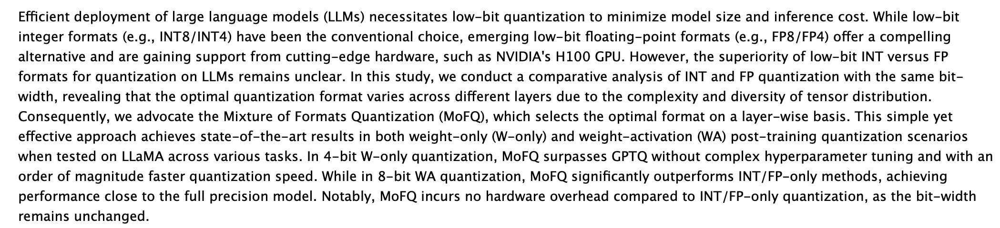 |[Paper](https://arxiv.org/abs/2305.12356)|
|[LLM-QAT: Data-Free Quantization Aware Training for Large Language Models](https://arxiv.org/abs/2305.17888)   Zechun Liu, Barlas Oguz, Changsheng Zhao, Ernie Chang, Pierre Stock, Yashar Mehdad, Yangyang Shi, Raghuraman Krishnamoorthi, Vikas Chandra |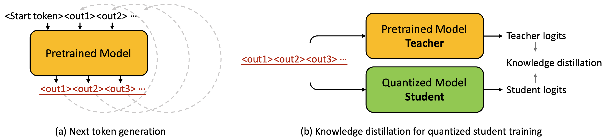 |[Paper](https://arxiv.org/abs/2305.17888)|
|  [SpQR: A Sparse-Quantized Representation for Near-Lossless LLM Weight Compression](https://arxiv.org/abs/2306.03078)   Tim Dettmers, Ruslan Svirschevski, Vage Egiazarian, Denis Kuznedelev, Elias Frantar, Saleh Ashkboos, Alexander Borzunov, Torsten Hoefler, Dan Alistarh |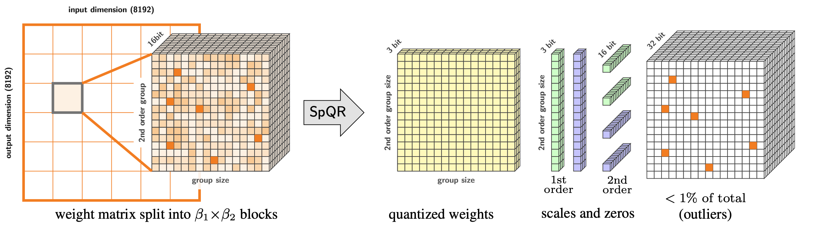 |[Github](https://github.com/Vahe1994/SpQR)   [Paper](https://arxiv.org/abs/2306.03078)|
|  [OWQ: Lessons learned from activation outliers for weight quantization in large language models](https://arxiv.org/abs/2306.02272)   Changhun Lee, Jungyu Jin, Taesu Kim, Hyungjun Kim, Eunhyeok Park |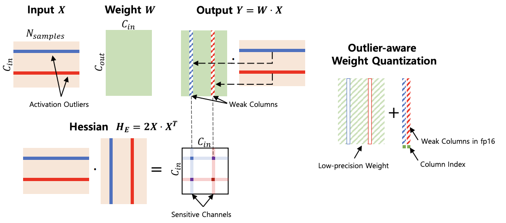 |[Github](https://github.com/xvyaward/owq)   [Paper](https://arxiv.org/abs/2306.02272)|
| [Do Emergent Abilities Exist in Quantized Large Language Models: An Empirical Study](https://arxiv.org/abs/2307.08072)   Peiyu Liu, Zikang Liu, Ze-Feng Gao, Dawei Gao, Wayne Xin Zhao, Yaliang Li, Bolin Ding, Ji-Rong Wen |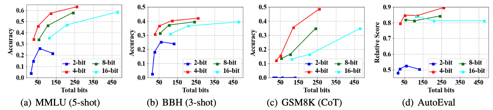 |[Github](https://github.com/RUCAIBox/QuantizedEmpirical)   [Paper](https://arxiv.org/abs/2307.08072)|
|[ZeroQuant-FP: A Leap Forward in LLMs Post-Training W4A8 Quantization Using Floating-Point Formats](https://arxiv.org/abs/2307.09782)   Xiaoxia Wu, Zhewei Yao, Yuxiong He |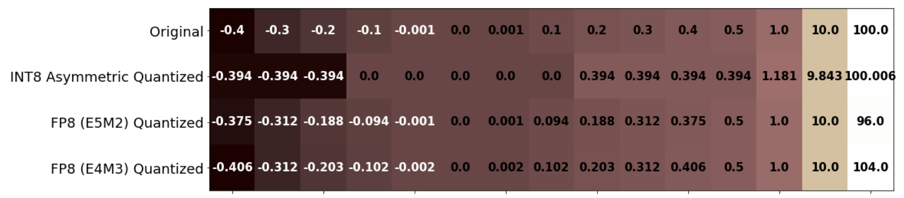 |[Paper](https://arxiv.org/abs/2307.09782)|
|[FPTQ: Fine-grained Post-Training Quantization for Large Language Models](https://arxiv.org/abs/2308.15987)   Qingyuan Li, Yifan Zhang, Liang Li, Peng Yao, Bo Zhang, Xiangxiang Chu, Yerui Sun, Li Du, Yuchen Xie |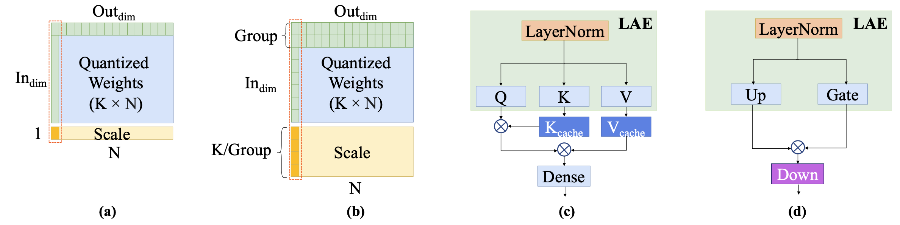 |[Paper](https://arxiv.org/abs/2308.15987)|
|[QuantEase: Optimization-based Quantization for Language Models - An Efficient and Intuitive Algorithm](https://arxiv.org/abs/2309.01885)   Kayhan Behdin, Ayan Acharya, Aman Gupta, Qingquan Song, Siyu Zhu, Sathiya Keerthi, Rahul Mazumder |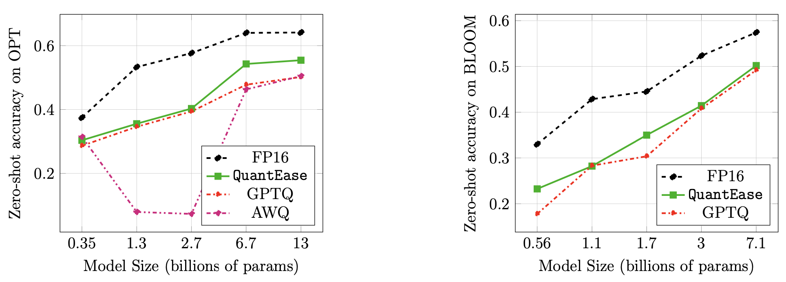 |[Github](https://github.com/linkedin/QuantEase)   [Paper](https://arxiv.org/abs/2309.01885)|
|[Norm Tweaking: High-performance Low-bit Quantization of Large Language Models](https://arxiv.org/abs/2309.02784)   Liang Li, Qingyuan Li, Bo Zhang, Xiangxiang Chu |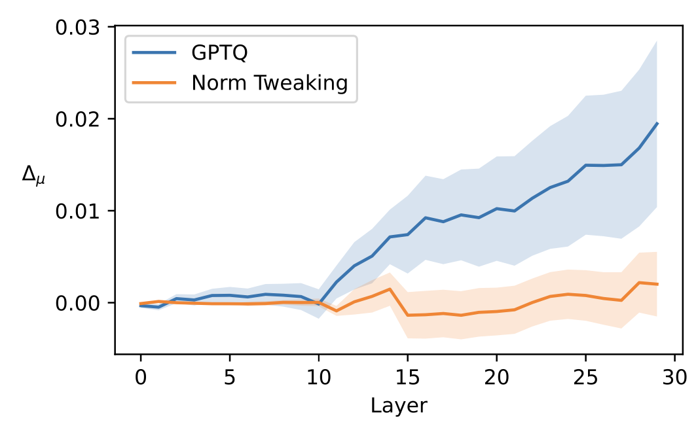 |[Paper](https://arxiv.org/abs/2309.02784)|
|[Optimize Weight Rounding via Signed Gradient Descent for the Quantization of LLMs](https://arxiv.org/abs/2309.05516)   Wenhua Cheng, Weiwei Zhang, Haihao Shen, Yiyang Cai, Xin He, Kaokao Lv |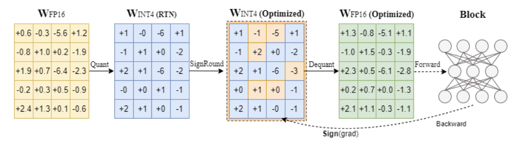 |[Github](https://github.com/intel/neural-compressor)   [Paper](https://arxiv.org/abs/2309.05516)|
| [QA-LoRA: Quantization-Aware Low-Rank Adaptation of Large Language Models](https://arxiv.org/abs/2309.14717)   Yuhui Xu, Lingxi Xie, Xiaotao Gu, Xin Chen, Heng Chang, Hengheng Zhang, Zhensu Chen, Xiaopeng Zhang, Qi Tian | |[Github](https://github.com/yuhuixu1993/qa-lora)   [Paper](https://arxiv.org/abs/2309.14717)|
|[ModuLoRA: Finetuning 3-Bit LLMs on Consumer GPUs by Integrating with Modular Quantizers](https://arxiv.org/abs/2309.16119)   Junjie Yin, Jiahao Dong, Yingheng Wang, Christopher De Sa, Volodymyr Kuleshov |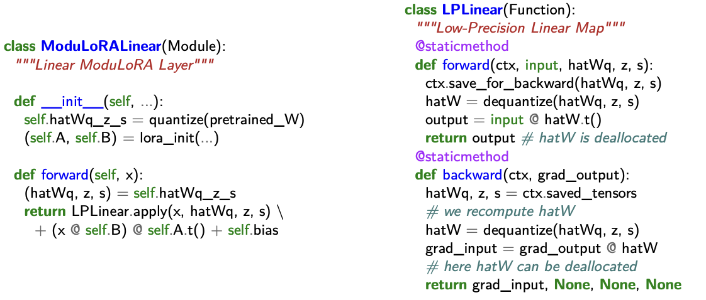 |[Paper](https://arxiv.org/abs/2309.16119)|
| [PB-LLM: Partially Binarized Large Language Models](https://arxiv.org/abs/2310.00034)   Yuzhang Shang, Zhihang Yuan, Qiang Wu, Zhen Dong |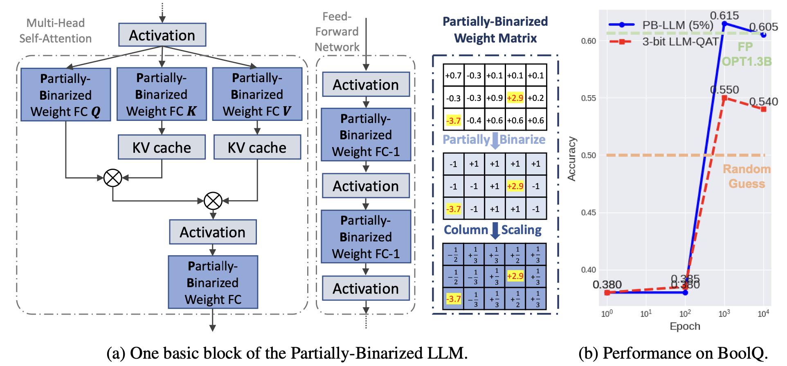 |[Github](https://github.com/hahnyuan/PB-LLM)   [Paper](https://arxiv.org/abs/2310.00034)|
|[Dual Grained Quantization: Efficient Fine-Grained Quantization for LLM](https://arxiv.org/abs/2310.04836)   Luoming Zhang, Wen Fei, Weijia Wu, Yefei He, Zhenyu Lou, Hong Zhou |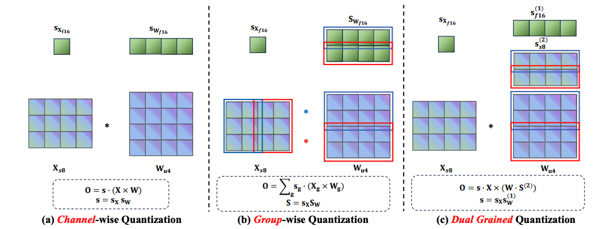 |[Paper](https://arxiv.org/abs/2310.04836)|
|[QFT: Quantized Full-parameter Tuning of LLMs with Affordable Resources](https://arxiv.org/abs/2310.07147)   Zhikai Li, Xiaoxuan Liu, Banghua Zhu, Zhen Dong, Qingyi Gu, Kurt Keutzer |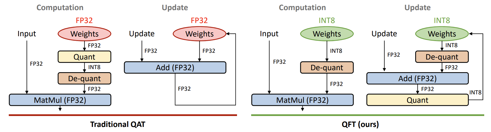 |[Paper](https://arxiv.org/abs/2310.07147)|
|[QLLM: Accurate and Efficient Low-Bitwidth Quantization for Large Language Models](https://arxiv.org/abs/2310.08041)   Jing Liu, Ruihao Gong, Xiuying Wei, Zhiwei Dong, Jianfei Cai, Bohan Zhuang |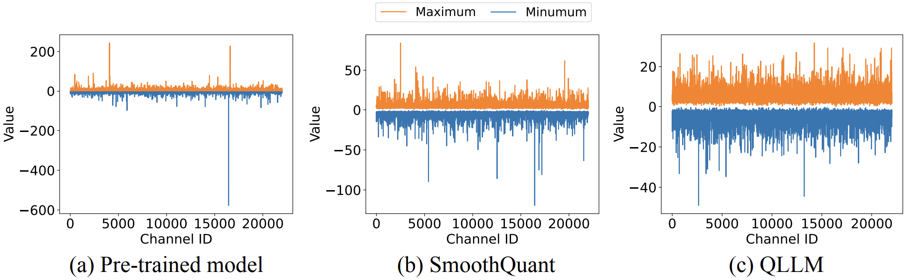 |[Paper](https://arxiv.org/abs/2310.08041)|
|[LoftQ: LoRA-Fine-Tuning-Aware Quantization for Large Language Models](https://arxiv.org/abs/2310.08659)   Yixiao Li, Yifan Yu, Chen Liang, Pengcheng He, Nikos Karampatziakis, Weizhu Chen, Tuo Zhao |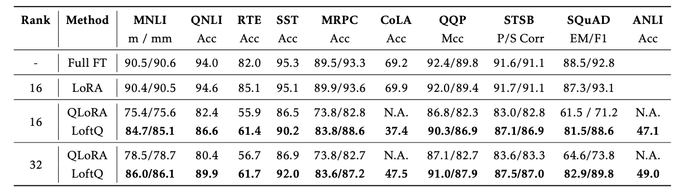 |[Paper](https://arxiv.org/abs/2310.08659)|
|[TEQ: Trainable Equivalent Transformation for Quantization of LLMs](https://arxiv.org/abs/2310.10944)   Wenhua Cheng, Yiyang Cai, Kaokao Lv, Haihao Shen |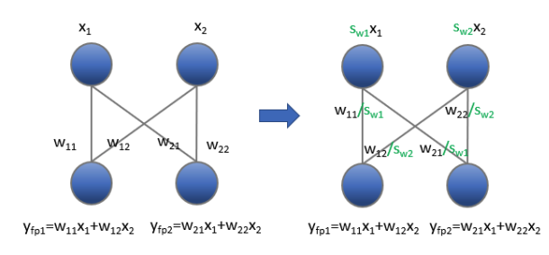 |[Github](https://github.com/intel/neural-compressor)   [Paper](https://arxiv.org/abs/2310.10944)|
|[BitNet: Scaling 1-bit Transformers for Large Language Models](https://arxiv.org/abs/2310.11453)   Hongyu Wang, Shuming Ma, Li Dong, Shaohan Huang, Huaijie Wang, Lingxiao Ma, Fan Yang, Ruiping Wang, Yi Wu, Furu Wei | |[Paper](https://arxiv.org/abs/2310.11453)|
|[Atom: Low-bit Quantization for Efficient and Accurate LLM Serving](https://arxiv.org/abs/2310.19102)   Yilong Zhao, Chien-Yu Lin, Kan Zhu, Zihao Ye, Lequn Chen, Size Zheng, Luis Ceze, Arvind Krishnamurthy, Tianqi Chen, Baris Kasikci |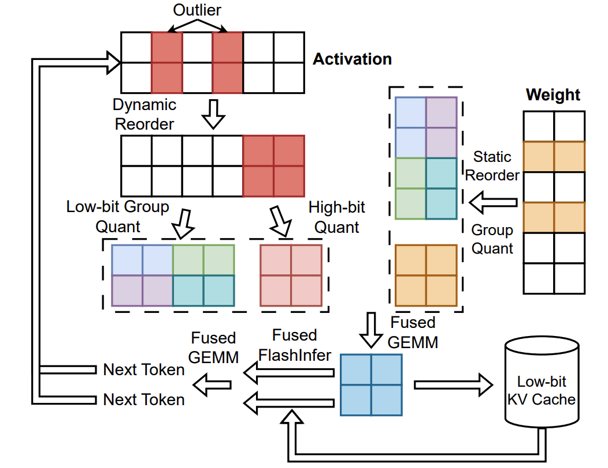 |[Paper](https://arxiv.org/abs/2310.19102)|
|[AWEQ: Post-Training Quantization with Activation-Weight Equalization for Large Language Models](https://arxiv.org/abs/2311.01305)   Baisong Li, Xingwang Wang, Haixiao Xu |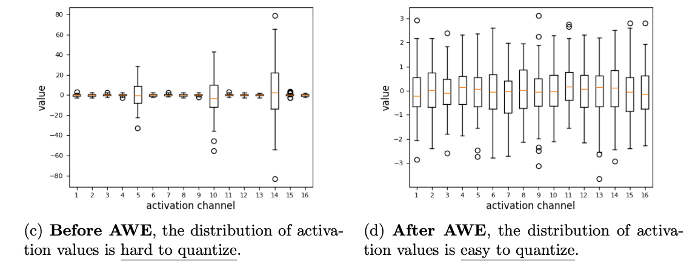 |[Paper](https://arxiv.org/abs/2311.01305)|
| [AFPQ: Asymmetric Floating Point Quantization for LLMs](https://arxiv.org/abs/2311.01792)   Yijia Zhang, Sicheng Zhang, Shijie Cao, Dayou Du, Jianyu Wei, Ting Cao, Ningyi Xu |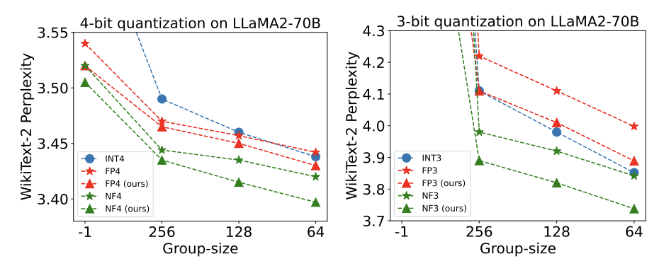 |[Github](https://github.com/zhangsichengsjtu/AFPQ)   [Paper](https://arxiv.org/abs/2311.01792)|
|[A Speed Odyssey for Deployable Quantization of LLMs](https://arxiv.org/abs/2311.09550)   Qingyuan Li, Ran Meng, Yiduo Li, Bo Zhang, Liang Li, Yifan Lu, Xiangxiang Chu, Yerui Sun, Yuchen Xie |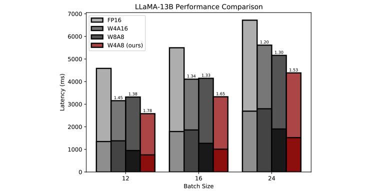 |[Paper](https://arxiv.org/abs/2311.09550)|
| [LQ-LoRA: Low-rank Plus Quantized Matrix Decomposition for Efficient Language Model Finetuning](https://arxiv.org/abs/2311.12023)   Han Guo, Philip Greengard, Eric P. Xing, Yoon Kim |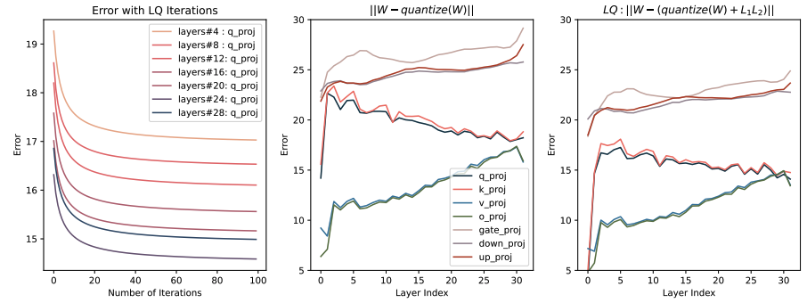 |[Github](https://github.com/HanGuo97/lq-lora)   [Paper](https://arxiv.org/abs/2311.12023)|
|[Enabling Fast 2-bit LLM on GPUs: Memory Alignment, Sparse Outlier, and Asynchronous Dequantization](https://arxiv.org/abs/2311.16442)   Jinhao Li, Shiyao Li, Jiaming Xu, Shan Huang, Yaoxiu Lian, Jun Liu, Yu Wang, Guohao Dai |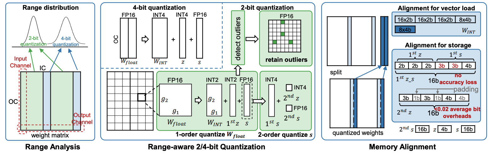 |[Paper](https://arxiv.org/abs/2311.16442)|
| [SmoothQuant+: Accurate and Efficient 4-bit Post-Training WeightQuantization for LLM](https://arxiv.org/abs/2312.03788)   Jiayi Pan, Chengcan Wang, Kaifu Zheng, Yangguang Li, Zhenyu Wang, Bin Feng |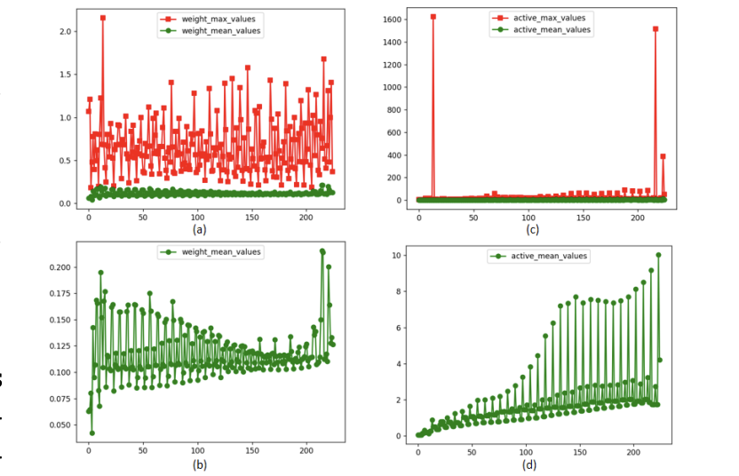 |[Github](https://github.com/adlik/smoothquant+)   [Paper](https://arxiv.org/abs/2312.03788)|
|[ZeroQuant(4+2): Redefining LLMs Quantization with a New FP6-Centric Strategy for Diverse Generative Tasks](https://arxiv.org/abs/2312.08583)   Xiaoxia Wu, Haojun Xia, Stephen Youn, Zhen Zheng, Shiyang Chen, Arash Bakhtiari, Michael Wyatt, Yuxiong He, Olatunji Ruwase, Leon Song, Zhewei Yao |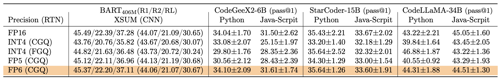 |[Github](https://github.com/microsoft/DeepSpeed)   [Paper](https://arxiv.org/abs/2312.08583)|
| [Extreme Compression of Large Language Models via Additive Quantization](https://arxiv.org/abs/2401.06118)   Vage Egiazarian, Andrei Panferov, Denis Kuznedelev, Elias Frantar, Artem Babenko, Dan Alistarh |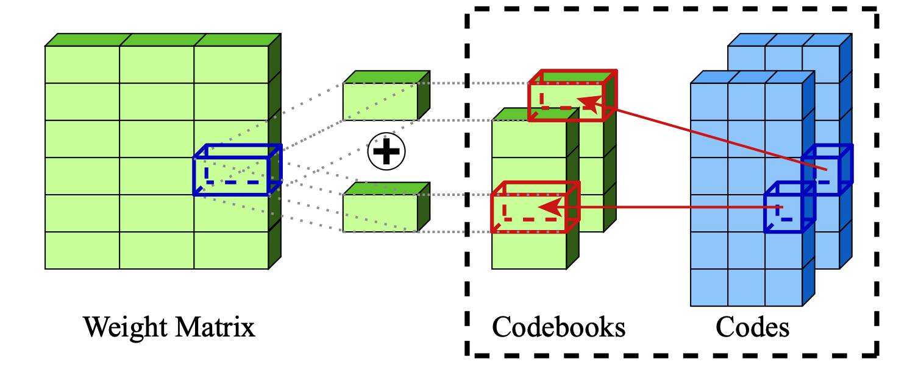 |[Github](https://github.com/vahe1994/AQLM)   [Paper](https://arxiv.org/abs/2401.06118)|
|[FP6-LLM: Efficiently Serving Large Language Models Through FP6-Centric Algorithm-System Co-Design](https://arxiv.org/abs/2401.14112)   Haojun Xia, Zhen Zheng, Xiaoxia Wu, Shiyang Chen, Zhewei Yao, Stephen Youn, Arash Bakhtiari, Michael Wyatt, Donglin Zhuang, Zhongzhu Zhou, Olatunji Ruwase, Yuxiong He, Shuaiwen Leon Song |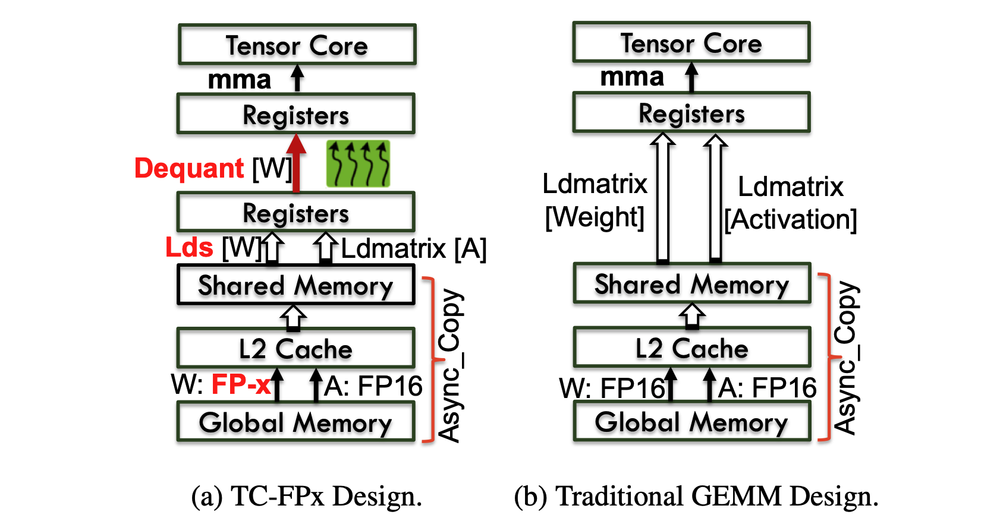 |[Paper](https://arxiv.org/abs/2401.14112)|
|[L4Q: Parameter Efficient Quantization-Aware Training on Large Language Models via LoRA-wise LSQ](https://arxiv.org/abs/2402.04902)   Hyesung Jeon, Yulhwa Kim, Jae-joon Kim |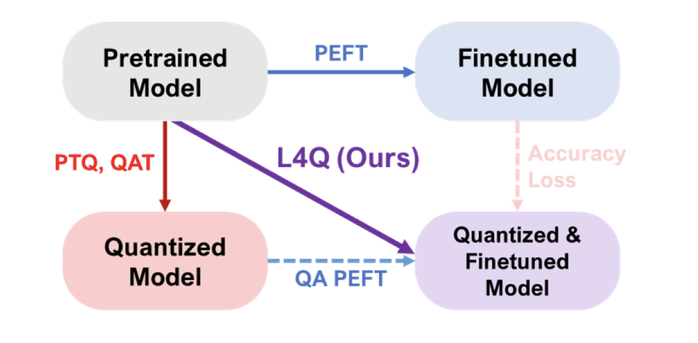 |[Paper](https://arxiv.org/abs/2402.04902)|
| [QuIP#: Even Better LLM Quantization with Hadamard Incoherence and Lattice Codebooks](https://arxiv.org/abs/2402.04396)   Albert Tseng, Jerry Chee, Qingyao Sun, Volodymyr Kuleshov, Christopher De Sa | |[Github](https://github.com/Cornell-RelaxML/quip-sharp)   [Paper](https://arxiv.org/abs/2402.04396)|
| [BiLLM: Pushing the Limit of Post-Training Quantization for LLMs](https://arxiv.org/abs/2402.04291)   Wei Huang, Yangdong Liu, Haotong Qin, Ying Li, Shiming Zhang, Xianglong Liu, Michele Magno, Xiaojuan Qi | |[Github](https://github.com/Aaronhuang-778/BiLLM)   [Paper](https://arxiv.org/abs/2402.04291)|
| [Accurate LoRA-Finetuning Quantization of LLMs via Information Retention](https://arxiv.org/abs/2402.05445)   Haotong Qin, Xudong Ma, Xingyu Zheng, Xiaoyang Li, Yang Zhang, Shouda Liu, Jie Luo, Xianglong Liu, Michele Magno | |[Github](https://github.com/htqin/ir-qlora)   [Paper](https://arxiv.org/abs/2402.05445)|
|[ApiQ: Finetuning of 2-Bit Quantized Large Language Model](https://arxiv.org/abs/2402.05147)   Baohao Liao, Christof Monz |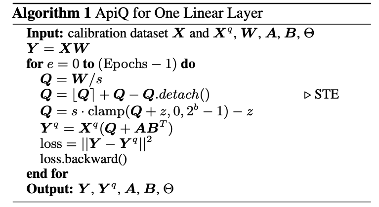 |[Paper](https://arxiv.org/abs/2402.05147)|
|[Towards Next-Level Post-Training Quantization of Hyper-Scale Transformers](https://arxiv.org/abs/2402.08958)   Junhan Kim, Kyungphil Park, Chungman Lee, Ho-young Kim, Joonyoung Kim, Yongkweon Jeon | |[Paper](https://arxiv.org/abs/2402.08958)|
| [EdgeQAT: Entropy and Distribution Guided Quantization-Aware Training for the Acceleration of Lightweight LLMs on the Edge](https://arxiv.org/abs/2402.10787)   Xuan Shen, Zhenglun Kong, Changdi Yang, Zhaoyang Han, Lei Lu, Peiyan Dong, Cheng Lyu, Chih-hsiang Li, Xuehang Guo, Zhihao Shu, Wei Niu, Miriam Leeser, Pu Zhao, Yanzhi Wang |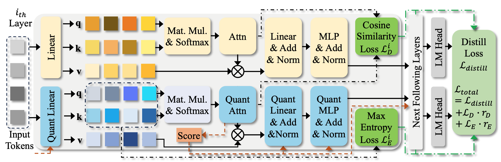 |[Github](https://github.com/shawnricecake/EdgeQAT)   [Paper](https://arxiv.org/abs/2402.10787)|
| [BitDistiller: Unleashing the Potential of Sub-4-Bit LLMs via Self-Distillation](https://arxiv.org/abs/2402.10631)   Dayou Du, Yijia Zhang, Shijie Cao, Jiaqi Guo, Ting Cao, Xiaowen Chu, Ningyi Xu | |[Github](https://github.com/DD-DuDa/BitDistiller)   [Paper](https://arxiv.org/abs/2402.10631)|
|[OneBit: Towards Extremely Low-bit Large Language Models](https://arxiv.org/abs/2402.11295)   Yuzhuang Xu, Xu Han, Zonghan Yang, Shuo Wang, Qingfu Zhu, Zhiyuan Liu, Weidong Liu, Wanxiang Che |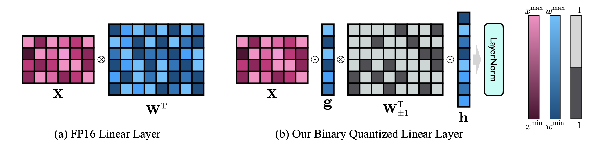 |[Paper](https://arxiv.org/abs/2402.11295)|
| [BitDelta: Your Fine-Tune May Only Be Worth One Bit](https://arxiv.org/abs/2402.10193)   James Liu, Guangxuan Xiao, Kai Li, Jason D. Lee, Song Han, Tri Dao, Tianle Cai | |[Github](https://github.com/FasterDecoding/BitDelta)   [Paper](https://arxiv.org/abs/2402.10193)|
|[Any-Precision LLM: Low-Cost Deployment of Multiple, Different-Sized LLMs](https://arxiv.org/abs/2402.10517)   Yeonhong Park, Jake Hyun, SangLyul Cho, Bonggeun Sim, Jae W. Lee |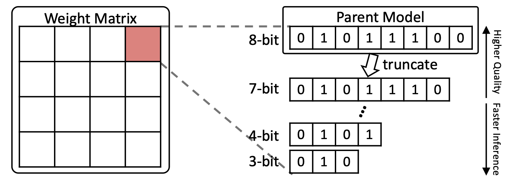 |[Paper](https://arxiv.org/abs/2402.10517)|
| [APTQ: Attention-aware Post-Training Mixed-Precision Quantization for Large Language Models](https://arxiv.org/abs/2402.14866)   Ziyi Guan, Hantao Huang, Yupeng Su, Hong Huang, Ngai Wong, Hao Yu | |[Paper](https://arxiv.org/abs/2402.14866)|
| [GPTVQ: The Blessing of Dimensionality for LLM Quantization](https://arxiv.org/abs/2402.15319)   Mart van Baalen, Andrey Kuzmin, Markus Nagel, Peter Couperus, Cedric Bastoul, Eric Mahurin, Tijmen Blankevoort, Paul Whatmough | |[Github](https://github.com/qualcomm-ai-research/gptvq)   [Paper](https://arxiv.org/abs/2402.15319)|
|[A Comprehensive Evaluation of Quantization Strategies for Large Language Models](https://arxiv.org/abs/2402.16775)   Renren Jin, Jiangcun Du, Wuwei Huang, Wei Liu, Jian Luan, Bin Wang, Deyi Xiong |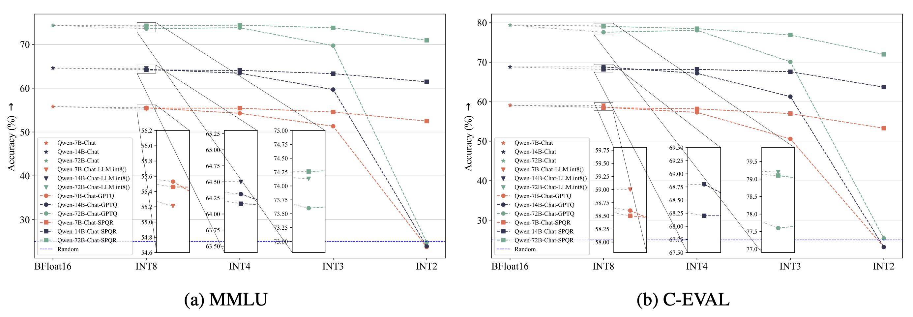 |[Paper](https://arxiv.org/abs/2402.16775)|
|[The Era of 1-bit LLMs: All Large Language Models are in 1.58 Bits](https://arxiv.org/abs/2402.17764)   Shuming Ma, Hongyu Wang, Lingxiao Ma, Lei Wang, Wenhui Wang, Shaohan Huang, Li Dong, Ruiping Wang, Jilong Xue, Furu Wei | |[Paper](https://arxiv.org/abs/2402.17764)|
| [Evaluating Quantized Large Language Models](https://arxiv.org/abs/2402.18158)   Shiyao Li, Xuefei Ning, Luning Wang, Tengxuan Liu, Xiangsheng Shi, Shengen Yan, Guohao Dai, Huazhong Yang, Yu Wang |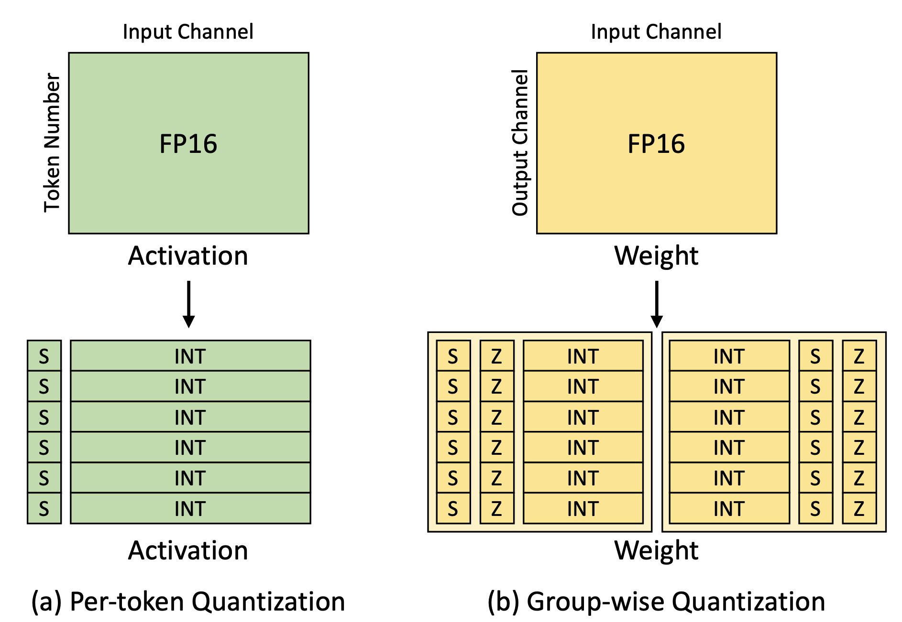 |[Github](https://github.com/thu-nics/qllm-eval)   [Paper](https://arxiv.org/abs/2402.18158)|
|[FlattenQuant: Breaking Through the Inference Compute-bound for Large Language Models with Per-tensor Quantization](https://arxiv.org/abs/2402.17985)   Yi Zhang, Fei Yang, Shuang Peng, Fangyu Wang, Aimin Pan | |[Paper](https://arxiv.org/abs/2402.17985)|
|[What Makes Quantization for Large Language Models Hard? An Empirical Study from the Lens of Perturbation](https://arxiv.org/abs/2403.06408)   Zhuocheng Gong, Jiahao Liu, Jingang Wang, Xunliang Cai, Dongyan Zhao, Rui Yan | |[Paper](https://arxiv.org/abs/2403.06408)|
|[FrameQuant: Flexible Low-Bit Quantization for Transformers](https://arxiv.org/abs/2403.06082)   Harshavardhan Adepu, Zhanpeng Zeng, Li Zhang, Vikas Singh | |[Paper](https://arxiv.org/abs/2403.06082)|
| [QuaRot: Outlier-Free 4-Bit Inference in Rotated LLMs](https://arxiv.org/abs/2404.00456)   Saleh Ashkboos, Amirkeivan Mohtashami, Maximilian L. Croci, Bo Li, Martin Jaggi, Dan Alistarh, Torsten Hoefler, James Hensman | |[Github](https://github.com/spcl/QuaRot)   [Paper](https://arxiv.org/abs/2404.00456)|
|[Accurate Block Quantization in LLMs with Outliers](https://arxiv.org/abs/2403.20137)   Nikita Trukhanov, Ilya Soloveychik | |[Paper](https://arxiv.org/abs/2403.20137)|
|[Cherry on Top: Parameter Heterogeneity and Quantization in Large Language Models](https://arxiv.org/abs/2404.02837)   Wanyun Cui, Qianle Wang | |[Paper](https://arxiv.org/abs/2404.02837)|
|[Increased LLM Vulnerabilities from Fine-tuning and Quantization](https://arxiv.org/abs/2404.04392)   Divyanshu Kumar, Anurakt Kumar, Sahil Agarwal, Prashanth Harshangi | |[Paper](https://arxiv.org/abs/2404.04392)|
|[Quantization of Large Language Models with an Overdetermined Basis](https://arxiv.org/abs/2404.09737)   Daniil Merkulov, Daria Cherniuk, Alexander Rudikov, Ivan Oseledets, Ekaterina Muravleva, Aleksandr Mikhalev, Boris Kashin | |[Paper](https://arxiv.org/abs/2404.09737)|
| [decoupleQ: Towards 2-bit Post-Training Uniform Quantization via decoupling Parameters into Integer and Floating Points](https://arxiv.org/abs/2404.12759)   Yi Guo, Fanliu Kong, Xiaoyang Li, Hui Li, Wei Chen, Xiaogang Tian, Jinping Cai, Yang Zhang, Shouda Liu | |[Github](https://github.com/bytedance/decoupleQ)   [Paper](https://arxiv.org/abs/2404.12759)|
|[Lossless and Near-Lossless Compression for Foundation Models](https://arxiv.org/abs/2404.15198)   Moshik Hershcovitch, Leshem Choshen, Andrew Wood, Ilias Enmouri, Peter Chin, Swaminathan Sundararaman, Danny Harnik |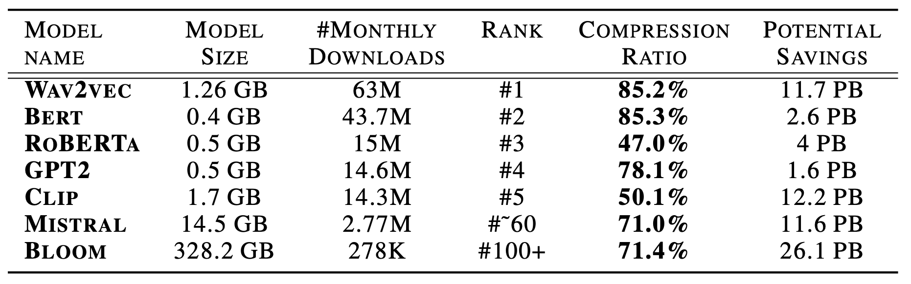 |[Paper](https://arxiv.org/abs/2404.15198)|
| [How Good Are Low-bit Quantized LLaMA3 Models? An Empirical Study](https://arxiv.org/abs/2404.14047)   Wei Huang, Xudong Ma, Haotong Qin, Xingyu Zheng, Chengtao Lv, Hong Chen, Jie Luo, Xiaojuan Qi, Xianglong Liu, Michele Magno | |[Github](https://github.com/Macaronlin/LLaMA3-Quantization)   [Paper](https://arxiv.org/abs/2404.14047)   [Model](https://huggingface.co/LLMQ)|
| [When Quantization Affects Confidence of Large Language Models?](https://arxiv.org/abs/2405.00632)   Irina Proskurina, Luc Brun, Guillaume Metzler, Julien Velcin |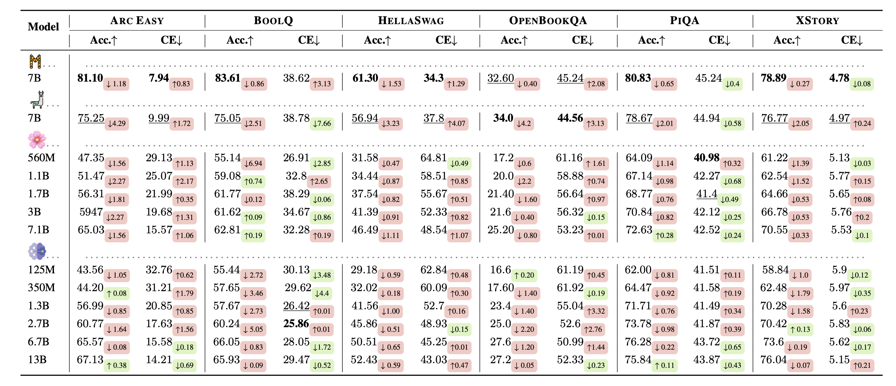 |[Github](https://github.com/upunaprosk/quantized-lm-confidence)   [Paper](https://arxiv.org/abs/2405.00632)|
| [QServe: W4A8KV4 Quantization and System Co-design for Efficient LLM Serving](https://arxiv.org/abs/2405.04532)   Yujun Lin, Haotian Tang, Shang Yang, Zhekai Zhang, Guangxuan Xiao, Chuang Gan, Song Han | |[Github](https://github.com/mit-han-lab/qserve)   [Paper](https://arxiv.org/abs/2405.04532)|
| [LLM-QBench: A Benchmark Towards the Best Practice for Post-training Quantization of Large Language Models](https://arxiv.org/abs/2405.06001)   Ruihao Gong, Yang Yong, Shiqiao Gu, Yushi Huang, Yunchen Zhang, Xianglong Liu, Dacheng Tao | |[Github](https://github.com/ModelTC/llmc)   [Paper](https://arxiv.org/abs/2405.06001)|
| [Exploiting LLM Quantization](https://arxiv.org/abs/2405.18137)   Kazuki Egashira, Mark Vero, Robin Staab, Jingxuan He, Martin Vechev |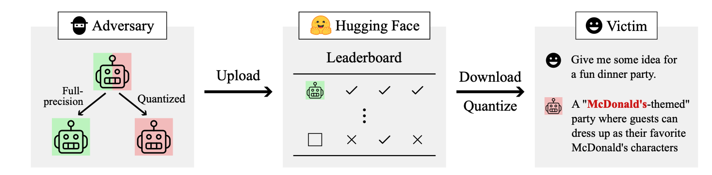 |[Github](https://github.com/eth-sri/llm-quantization-attack)   [Paper](https://arxiv.org/abs/2405.18137)|
|[CLAQ: Pushing the Limits of Low-Bit Post-Training Quantization for LLMs](https://arxiv.org/abs/2405.17233)   Haoyu Wang, Bei Liu, Hang Shao, Bo Xiao, Ke Zeng, Guanglu Wan, Yanmin Qian | |[Paper](https://arxiv.org/abs/2405.17233)|
|[SpinQuant -- LLM quantization with learned rotations](https://arxiv.org/abs/2405.16406)   Zechun Liu, Changsheng Zhao, Igor Fedorov, Bilge Soran, Dhruv Choudhary, Raghuraman Krishnamoorthi, Vikas Chandra, Yuandong Tian, Tijmen Blankevoort |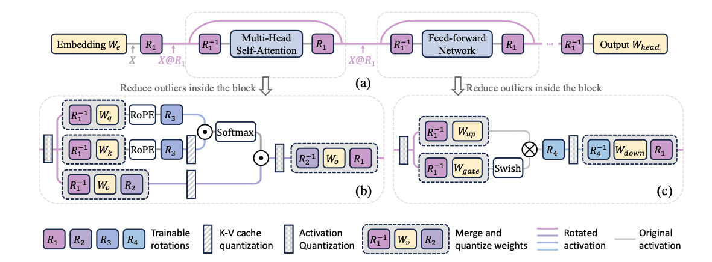 |[Paper](https://arxiv.org/abs/2405.16406)|
| [SliM-LLM: Salience-Driven Mixed-Precision Quantization for Large Language Models](https://arxiv.org/abs/2405.14917)   Wei Huang, Haotong Qin, Yangdong Liu, Yawei Li, Xianglong Liu, Luca Benini, Michele Magno, Xiaojuan Qi | |[Github](https://github.com/Aaronhuang-778/SliM-LLM)   [Paper](https://arxiv.org/abs/2405.14917)|
| [PV-Tuning: Beyond Straight-Through Estimation for Extreme LLM Compression](https://arxiv.org/abs/2405.14852)   Vladimir Malinovskii, Denis Mazur, Ivan Ilin, Denis Kuznedelev, Konstantin Burlachenko, Kai Yi, Dan Alistarh, Peter Richtarik |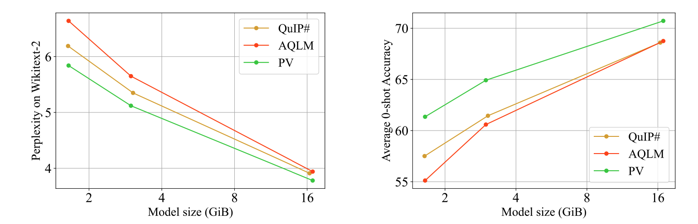 |[Github](https://github.com/Vahe1994/AQLM/tree/pv-tuning)   [Paper](https://arxiv.org/abs/2405.14852)|
|[Integer Scale: A Free Lunch for Faster Fine-grained Quantization of LLMs](https://arxiv.org/abs/2405.14597)   Qingyuan Li, Ran Meng, Yiduo Li, Bo Zhang, Yifan Lu, Yerui Sun, Lin Ma, Yuchen Xie | |[Paper](https://arxiv.org/abs/2405.14597)|
|[I-LLM: Efficient Integer-Only Inference for Fully-Quantized Low-Bit Large Language Models](https://arxiv.org/abs/2405.17849)   Xing Hu, Yuan Chen, Dawei Yang, Sifan Zhou, Zhihang Yuan, Jiangyong Yu, Chen Xu |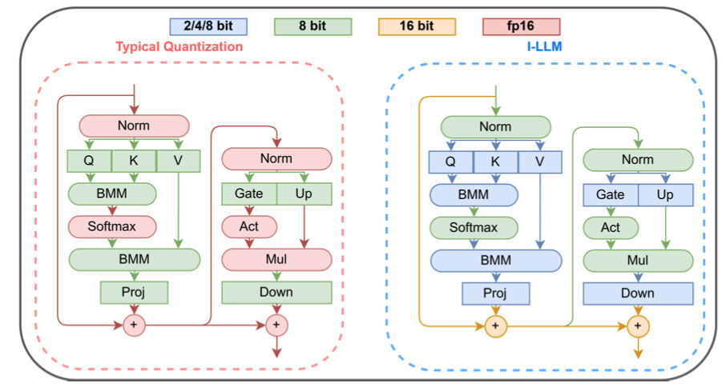 |[Paper](https://arxiv.org/abs/2405.17849)|
| [Compressing Large Language Models using Low Rank and Low Precision Decomposition](https://arxiv.org/abs/2405.18886)   Rajarshi Saha, Naomi Sagan, Varun Srivastava, Andrea J. Goldsmith, Mert Pilanci | |[Github](https://github.com/pilancilab/caldera)   [Paper](https://arxiv.org/abs/2405.18886)|