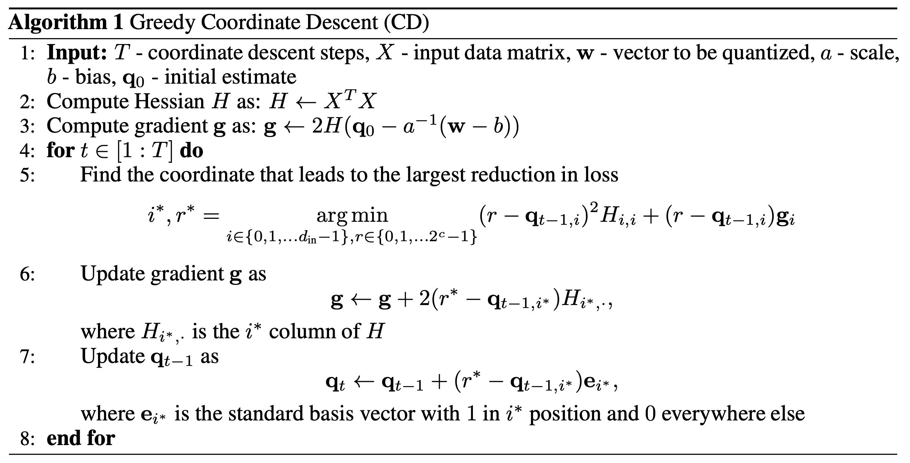

## Quantization
| Title & Authors | Introduction | Links |
|:--|  :----: | :---:|
| [GPTQ: Accurate Post-Training Quantization for Generative Pre-trained Transformers](https://arxiv.org/abs/2210.17323)   Elias Frantar, Saleh Ashkboos, Torsten Hoefler, Dan Alistarh | |[Github](https://github.com/IST-DASLab/gptq)   [Paper](https://arxiv.org/abs/2210.17323)|o
|  [SmoothQuant: Accurate and Efficient Post-Training Quantization for Large Language Models](https://arxiv.org/abs/2211.10438)   Guangxuan Xiao, Ji Lin, Mickael Seznec, Hao Wu, Julien Demouth, Song Han | |[Github](https://github.com/mit-han-lab/smoothquant)   [Paper](https://arxiv.org/abs/2211.10438)|
|    [QLoRA: Efficient Finetuning of Quantized LLMs](https://arxiv.org/abs/2305.14314)   Tim Dettmers, Artidoro Pagnoni, Ari Holtzman, Luke Zettlemoyer |  |  [Github](https://github.com/artidoro/qlora)  [Paper](https://arxiv.org/abs/2305.14314) |
|   [QuIP: 2-Bit Quantization of Large Language Models With Guarantees](https://arxiv.org/abs/2307.13304)   Jerry Chee, Yaohui Cai, Volodymyr Kuleshov, Christopher De SaXQ | |[Github](https://github.com/jerry-chee/QuIP)   [Paper](https://arxiv.org/abs/2307.13304)|
| [Memory-Efficient Fine-Tuning of Compressed Large Language Models via sub-4-bit Integer Quantization](https://arxiv.org/abs/2305.14152)   Jeonghoon Kim, Jung Hyun Lee, Sungdong Kim, Joonsuk Park, Kang Min Yoo, Se Jung Kwon, Dongsoo Lee | |[Paper](https://arxiv.org/abs/2305.14152)|
|     [Quantizable Transformers: Removing Outliers by Helping Attention Heads Do Nothing](https://arxiv.org/abs/2306.12929)   Yelysei Bondarenko, Markus Nagel, Tijmen Blankevoort |  | [Github](https://github.com/Qualcomm-AI-research/outlier-free-transformers) [Paper](https://arxiv.org/abs/2306.12929) |
| [LLM-FP4: 4-Bit Floating-Point Quantized Transformers](https://arxiv.org/abs/2310.16836)   Shih-yang Liu, Zechun Liu, Xijie Huang, Pingcheng Dong, Kwang-Ting Cheng | |[Github](https://github.com/nbasyl/LLM-FP4)   [Paper](https://arxiv.org/abs/2310.16836)|
| [Enhancing Computation Efficiency in Large Language Models through Weight and Activation Quantization](https://arxiv.org/abs/2311.05161)   Jangwhan Lee, Minsoo Kim, Seungcheol Baek, Seok Joong Hwang, Wonyong Sung, Jungwook Choi | |[Paper](https://arxiv.org/abs/2311.05161)|
| [Agile-Quant: Activation-Guided Quantization for Faster Inference of LLMs on the Edge](https://arxiv.org/abs/2312.05693)   Xuan Shen, Peiyan Dong, Lei Lu, Zhenglun Kong, Zhengang Li, Ming Lin, Chao Wu, Yanzhi Wang | |[Paper](https://arxiv.org/abs/2312.05693)|
| [OmniQuant: Omnidirectionally Calibrated Quantization for Large Language Models](https://arxiv.org/abs/2308.13137)   Wenqi Shao, Mengzhao Chen, Zhaoyang Zhang, Peng Xu, Lirui Zhao, Zhiqian Li, Kaipeng Zhang, Peng Gao, Yu Qiao, Ping Luo | |[Github](https://github.com/OpenGVLab/OmniQuant)   [Paper](https://arxiv.org/abs/2308.13137)|
| [AffineQuant: Affine Transformation Quantization for Large Language Models](https://arxiv.org/abs/2403.12544)   Yuexiao Ma, Huixia Li, Xiawu Zheng, Feng Ling, Xuefeng Xiao, Rui Wang, Shilei Wen, Fei Chao, Rongrong Ji | |[Github](https://github.com/bytedance/AffineQuant)   [Paper](https://arxiv.org/abs/2403.12544)|
| [GPT-Zip: Deep Compression of Finetuned Large Language Models](https://openreview.net/forum?id=hO0c2tG2xL)   Berivan Isik, Hermann Kumbong, Wanyi Ning, Xiaozhe Yao, Sanmi Koyejo, Ce Zhang | |[Paper](https://openreview.net/forum?id=hO0c2tG2xL)|
| [Watermarking LLMs with Weight Quantization](https://arxiv.org/abs/2310.11237)   Linyang Li, Botian Jiang, Pengyu Wang, Ke Ren, Hang Yan, Xipeng Qiu | |[Github](https://github.com/Twilight92z/Quantize-Watermark)   [Paper](https://arxiv.org/abs/2310.11237)|
|  [AWQ: Activation-aware Weight Quantization for LLM Compression and Acceleration](https://arxiv.org/abs/2306.00978)   Ji Lin, Jiaming Tang, Haotian Tang, Shang Yang, Xingyu Dang, Song Han | |[Github](https://github.com/mit-han-lab/llm-awq)   [Paper](https://arxiv.org/abs/2306.00978)|
|   [RPTQ: Reorder-based Post-training Quantization for Large Language Models](https://arxiv.org/abs/2304.01089)   Zhihang Yuan and Lin Niu and Jiawei Liu and Wenyu Liu and Xinggang Wang and Yuzhang Shang and Guangyu Sun and Qiang Wu and Jiaxiang Wu and Bingzhe Wu |  |  [Github](https://github.com/hahnyuan/RPTQ4LLM)  [Paper](https://arxiv.org/abs/2304.01089) |
|[ZeroQuant-V2: Exploring Post-training Quantization in LLMs from Comprehensive Study to Low Rank Compensation](https://arxiv.org/abs/2303.08302)   Zhewei Yao, Xiaoxia Wu, Cheng Li, Stephen Youn, Yuxiong He | |[Paper](https://arxiv.org/abs/2303.08302)|
|   [SqueezeLLM: Dense-and-Sparse Quantization](https://arxiv.org/pdf/2306.07629.pdf)  Sehoon Kim, Coleman Hooper, Amir Gholami, Zhen Dong, Xiuyu Li, Sheng Shen, Michael W. Mahoney, Kurt Keutzer |  |[Github](https://github.com/SqueezeAILab/SqueezeLLM)   [Paper](https://arxiv.org/pdf/2306.07629.pdf)|
| [Outlier Suppression+: Accurate quantization of large language models by equivalent and optimal shifting and scaling](https://arxiv.org/abs/2304.09145v1)   Xiuying Wei , Yunchen Zhang, Yuhang Li, Xiangguo Zhang, Ruihao Gong, Jinyang Guo, Xianglong Liu|   | [Paper](https://arxiv.org/abs/2304.09145v1)|
|[Integer or Floating Point? New Outlooks for Low-Bit Quantization on Large Language Models](https://arxiv.org/abs/2305.12356)   Yijia Zhang, Lingran Zhao, Shijie Cao, Wenqiang Wang, Ting Cao, Fan Yang, Mao Yang, Shanghang Zhang, Ningyi Xu | |[Paper](https://arxiv.org/abs/2305.12356)|
|[LLM-QAT: Data-Free Quantization Aware Training for Large Language Models](https://arxiv.org/abs/2305.17888)   Zechun Liu, Barlas Oguz, Changsheng Zhao, Ernie Chang, Pierre Stock, Yashar Mehdad, Yangyang Shi, Raghuraman Krishnamoorthi, Vikas Chandra | |[Paper](https://arxiv.org/abs/2305.17888)|
|  [SpQR: A Sparse-Quantized Representation for Near-Lossless LLM Weight Compression](https://arxiv.org/abs/2306.03078)   Tim Dettmers, Ruslan Svirschevski, Vage Egiazarian, Denis Kuznedelev, Elias Frantar, Saleh Ashkboos, Alexander Borzunov, Torsten Hoefler, Dan Alistarh | |[Github](https://github.com/Vahe1994/SpQR)   [Paper](https://arxiv.org/abs/2306.03078)|
|  [OWQ: Lessons learned from activation outliers for weight quantization in large language models](https://arxiv.org/abs/2306.02272)   Changhun Lee, Jungyu Jin, Taesu Kim, Hyungjun Kim, Eunhyeok Park | |[Github](https://github.com/xvyaward/owq)   [Paper](https://arxiv.org/abs/2306.02272)|
| [Do Emergent Abilities Exist in Quantized Large Language Models: An Empirical Study](https://arxiv.org/abs/2307.08072)   Peiyu Liu, Zikang Liu, Ze-Feng Gao, Dawei Gao, Wayne Xin Zhao, Yaliang Li, Bolin Ding, Ji-Rong Wen | |[Github](https://github.com/RUCAIBox/QuantizedEmpirical)   [Paper](https://arxiv.org/abs/2307.08072)|
|[ZeroQuant-FP: A Leap Forward in LLMs Post-Training W4A8 Quantization Using Floating-Point Formats](https://arxiv.org/abs/2307.09782)   Xiaoxia Wu, Zhewei Yao, Yuxiong He | |[Paper](https://arxiv.org/abs/2307.09782)|
|[FPTQ: Fine-grained Post-Training Quantization for Large Language Models](https://arxiv.org/abs/2308.15987)   Qingyuan Li, Yifan Zhang, Liang Li, Peng Yao, Bo Zhang, Xiangxiang Chu, Yerui Sun, Li Du, Yuchen Xie | |[Paper](https://arxiv.org/abs/2308.15987)|
|[QuantEase: Optimization-based Quantization for Language Models - An Efficient and Intuitive Algorithm](https://arxiv.org/abs/2309.01885)   Kayhan Behdin, Ayan Acharya, Aman Gupta, Qingquan Song, Siyu Zhu, Sathiya Keerthi, Rahul Mazumder | |[Github](https://github.com/linkedin/QuantEase)   [Paper](https://arxiv.org/abs/2309.01885)|
|[Norm Tweaking: High-performance Low-bit Quantization of Large Language Models](https://arxiv.org/abs/2309.02784)   Liang Li, Qingyuan Li, Bo Zhang, Xiangxiang Chu | |[Paper](https://arxiv.org/abs/2309.02784)|
|[Optimize Weight Rounding via Signed Gradient Descent for the Quantization of LLMs](https://arxiv.org/abs/2309.05516)   Wenhua Cheng, Weiwei Zhang, Haihao Shen, Yiyang Cai, Xin He, Kaokao Lv | |[Github](https://github.com/intel/neural-compressor)   [Paper](https://arxiv.org/abs/2309.05516)|
| [QA-LoRA: Quantization-Aware Low-Rank Adaptation of Large Language Models](https://arxiv.org/abs/2309.14717)   Yuhui Xu, Lingxi Xie, Xiaotao Gu, Xin Chen, Heng Chang, Hengheng Zhang, Zhensu Chen, Xiaopeng Zhang, Qi Tian | |[Github](https://github.com/yuhuixu1993/qa-lora)   [Paper](https://arxiv.org/abs/2309.14717)|
|[ModuLoRA: Finetuning 3-Bit LLMs on Consumer GPUs by Integrating with Modular Quantizers](https://arxiv.org/abs/2309.16119)   Junjie Yin, Jiahao Dong, Yingheng Wang, Christopher De Sa, Volodymyr Kuleshov | |[Paper](https://arxiv.org/abs/2309.16119)|
| [PB-LLM: Partially Binarized Large Language Models](https://arxiv.org/abs/2310.00034)   Yuzhang Shang, Zhihang Yuan, Qiang Wu, Zhen Dong | |[Github](https://github.com/hahnyuan/PB-LLM)   [Paper](https://arxiv.org/abs/2310.00034)|
|[Dual Grained Quantization: Efficient Fine-Grained Quantization for LLM](https://arxiv.org/abs/2310.04836)   Luoming Zhang, Wen Fei, Weijia Wu, Yefei He, Zhenyu Lou, Hong Zhou | |[Paper](https://arxiv.org/abs/2310.04836)|
|[QFT: Quantized Full-parameter Tuning of LLMs with Affordable Resources](https://arxiv.org/abs/2310.07147)   Zhikai Li, Xiaoxuan Liu, Banghua Zhu, Zhen Dong, Qingyi Gu, Kurt Keutzer | |[Paper](https://arxiv.org/abs/2310.07147)|
|[QLLM: Accurate and Efficient Low-Bitwidth Quantization for Large Language Models](https://arxiv.org/abs/2310.08041)   Jing Liu, Ruihao Gong, Xiuying Wei, Zhiwei Dong, Jianfei Cai, Bohan Zhuang | |[Paper](https://arxiv.org/abs/2310.08041)|
|[LoftQ: LoRA-Fine-Tuning-Aware Quantization for Large Language Models](https://arxiv.org/abs/2310.08659)   Yixiao Li, Yifan Yu, Chen Liang, Pengcheng He, Nikos Karampatziakis, Weizhu Chen, Tuo Zhao | |[Paper](https://arxiv.org/abs/2310.08659)|
|[TEQ: Trainable Equivalent Transformation for Quantization of LLMs](https://arxiv.org/abs/2310.10944)   Wenhua Cheng, Yiyang Cai, Kaokao Lv, Haihao Shen | |[Github](https://github.com/intel/neural-compressor)   [Paper](https://arxiv.org/abs/2310.10944)|
|[BitNet: Scaling 1-bit Transformers for Large Language Models](https://arxiv.org/abs/2310.11453)   Hongyu Wang, Shuming Ma, Li Dong, Shaohan Huang, Huaijie Wang, Lingxiao Ma, Fan Yang, Ruiping Wang, Yi Wu, Furu Wei | |[Paper](https://arxiv.org/abs/2310.11453)|
|[Atom: Low-bit Quantization for Efficient and Accurate LLM Serving](https://arxiv.org/abs/2310.19102)   Yilong Zhao, Chien-Yu Lin, Kan Zhu, Zihao Ye, Lequn Chen, Size Zheng, Luis Ceze, Arvind Krishnamurthy, Tianqi Chen, Baris Kasikci | |[Paper](https://arxiv.org/abs/2310.19102)|
|[AWEQ: Post-Training Quantization with Activation-Weight Equalization for Large Language Models](https://arxiv.org/abs/2311.01305)   Baisong Li, Xingwang Wang, Haixiao Xu | |[Paper](https://arxiv.org/abs/2311.01305)|
| [AFPQ: Asymmetric Floating Point Quantization for LLMs](https://arxiv.org/abs/2311.01792)   Yijia Zhang, Sicheng Zhang, Shijie Cao, Dayou Du, Jianyu Wei, Ting Cao, Ningyi Xu | |[Github](https://github.com/zhangsichengsjtu/AFPQ)   [Paper](https://arxiv.org/abs/2311.01792)|
|[A Speed Odyssey for Deployable Quantization of LLMs](https://arxiv.org/abs/2311.09550)   Qingyuan Li, Ran Meng, Yiduo Li, Bo Zhang, Liang Li, Yifan Lu, Xiangxiang Chu, Yerui Sun, Yuchen Xie | |[Paper](https://arxiv.org/abs/2311.09550)|
| [LQ-LoRA: Low-rank Plus Quantized Matrix Decomposition for Efficient Language Model Finetuning](https://arxiv.org/abs/2311.12023)   Han Guo, Philip Greengard, Eric P. Xing, Yoon Kim | |[Github](https://github.com/HanGuo97/lq-lora)   [Paper](https://arxiv.org/abs/2311.12023)|
|[Enabling Fast 2-bit LLM on GPUs: Memory Alignment, Sparse Outlier, and Asynchronous Dequantization](https://arxiv.org/abs/2311.16442)   Jinhao Li, Shiyao Li, Jiaming Xu, Shan Huang, Yaoxiu Lian, Jun Liu, Yu Wang, Guohao Dai | |[Paper](https://arxiv.org/abs/2311.16442)|
| [SmoothQuant+: Accurate and Efficient 4-bit Post-Training WeightQuantization for LLM](https://arxiv.org/abs/2312.03788)   Jiayi Pan, Chengcan Wang, Kaifu Zheng, Yangguang Li, Zhenyu Wang, Bin Feng | |[Github](https://github.com/adlik/smoothquantplus)   [Paper](https://arxiv.org/abs/2312.03788)|
|[ZeroQuant(4+2): Redefining LLMs Quantization with a New FP6-Centric Strategy for Diverse Generative Tasks](https://arxiv.org/abs/2312.08583)   Xiaoxia Wu, Haojun Xia, Stephen Youn, Zhen Zheng, Shiyang Chen, Arash Bakhtiari, Michael Wyatt, Yuxiong He, Olatunji Ruwase, Leon Song, Zhewei Yao | |[Github](https://github.com/microsoft/DeepSpeed)   [Paper](https://arxiv.org/abs/2312.08583)|
| [Extreme Compression of Large Language Models via Additive Quantization](https://arxiv.org/abs/2401.06118)   Vage Egiazarian, Andrei Panferov, Denis Kuznedelev, Elias Frantar, Artem Babenko, Dan Alistarh | |[Github](https://github.com/vahe1994/AQLM)   [Paper](https://arxiv.org/abs/2401.06118)|
|[FP6-LLM: Efficiently Serving Large Language Models Through FP6-Centric Algorithm-System Co-Design](https://arxiv.org/abs/2401.14112)   Haojun Xia, Zhen Zheng, Xiaoxia Wu, Shiyang Chen, Zhewei Yao, Stephen Youn, Arash Bakhtiari, Michael Wyatt, Donglin Zhuang, Zhongzhu Zhou, Olatunji Ruwase, Yuxiong He, Shuaiwen Leon Song | |[Paper](https://arxiv.org/abs/2401.14112)|
|[L4Q: Parameter Efficient Quantization-Aware Training on Large Language Models via LoRA-wise LSQ](https://arxiv.org/abs/2402.04902)   Hyesung Jeon, Yulhwa Kim, Jae-joon Kim | |[Paper](https://arxiv.org/abs/2402.04902)|
| [QuIP#: Even Better LLM Quantization with Hadamard Incoherence and Lattice Codebooks](https://arxiv.org/abs/2402.04396)   Albert Tseng, Jerry Chee, Qingyao Sun, Volodymyr Kuleshov, Christopher De Sa | |[Github](https://github.com/Cornell-RelaxML/quip-sharp)   [Paper](https://arxiv.org/abs/2402.04396)|
| [BiLLM: Pushing the Limit of Post-Training Quantization for LLMs](https://arxiv.org/abs/2402.04291)   Wei Huang, Yangdong Liu, Haotong Qin, Ying Li, Shiming Zhang, Xianglong Liu, Michele Magno, Xiaojuan Qi | |[Github](https://github.com/Aaronhuang-778/BiLLM)   [Paper](https://arxiv.org/abs/2402.04291)|
| [Accurate LoRA-Finetuning Quantization of LLMs via Information Retention](https://arxiv.org/abs/2402.05445)   Haotong Qin, Xudong Ma, Xingyu Zheng, Xiaoyang Li, Yang Zhang, Shouda Liu, Jie Luo, Xianglong Liu, Michele Magno | |[Github](https://github.com/htqin/ir-qlora)   [Paper](https://arxiv.org/abs/2402.05445)|
|[ApiQ: Finetuning of 2-Bit Quantized Large Language Model](https://arxiv.org/abs/2402.05147)   Baohao Liao, Christof Monz | |[Paper](https://arxiv.org/abs/2402.05147)|
|[Towards Next-Level Post-Training Quantization of Hyper-Scale Transformers](https://arxiv.org/abs/2402.08958)   Junhan Kim, Kyungphil Park, Chungman Lee, Ho-young Kim, Joonyoung Kim, Yongkweon Jeon | |[Paper](https://arxiv.org/abs/2402.08958)|
| [EdgeQAT: Entropy and Distribution Guided Quantization-Aware Training for the Acceleration of Lightweight LLMs on the Edge](https://arxiv.org/abs/2402.10787)   Xuan Shen, Zhenglun Kong, Changdi Yang, Zhaoyang Han, Lei Lu, Peiyan Dong, Cheng Lyu, Chih-hsiang Li, Xuehang Guo, Zhihao Shu, Wei Niu, Miriam Leeser, Pu Zhao, Yanzhi Wang | |[Github](https://github.com/shawnricecake/EdgeQAT)   [Paper](https://arxiv.org/abs/2402.10787)|
| [BitDistiller: Unleashing the Potential of Sub-4-Bit LLMs via Self-Distillation](https://arxiv.org/abs/2402.10631)   Dayou Du, Yijia Zhang, Shijie Cao, Jiaqi Guo, Ting Cao, Xiaowen Chu, Ningyi Xu | |[Github](https://github.com/DD-DuDa/BitDistiller)   [Paper](https://arxiv.org/abs/2402.10631)|
|[OneBit: Towards Extremely Low-bit Large Language Models](https://arxiv.org/abs/2402.11295)   Yuzhuang Xu, Xu Han, Zonghan Yang, Shuo Wang, Qingfu Zhu, Zhiyuan Liu, Weidong Liu, Wanxiang Che | |[Paper](https://arxiv.org/abs/2402.11295)|
| [BitDelta: Your Fine-Tune May Only Be Worth One Bit](https://arxiv.org/abs/2402.10193)   James Liu, Guangxuan Xiao, Kai Li, Jason D. Lee, Song Han, Tri Dao, Tianle Cai | |[Github](https://github.com/FasterDecoding/BitDelta)   [Paper](https://arxiv.org/abs/2402.10193)|
|[Any-Precision LLM: Low-Cost Deployment of Multiple, Different-Sized LLMs](https://arxiv.org/abs/2402.10517)   Yeonhong Park, Jake Hyun, SangLyul Cho, Bonggeun Sim, Jae W. Lee | |[Paper](https://arxiv.org/abs/2402.10517)|
| [APTQ: Attention-aware Post-Training Mixed-Precision Quantization for Large Language Models](https://arxiv.org/abs/2402.14866)   Ziyi Guan, Hantao Huang, Yupeng Su, Hong Huang, Ngai Wong, Hao Yu | |[Paper](https://arxiv.org/abs/2402.14866)|
| [GPTVQ: The Blessing of Dimensionality for LLM Quantization](https://arxiv.org/abs/2402.15319)   Mart van Baalen, Andrey Kuzmin, Markus Nagel, Peter Couperus, Cedric Bastoul, Eric Mahurin, Tijmen Blankevoort, Paul Whatmough | |[Github](https://github.com/qualcomm-ai-research/gptvq)   [Paper](https://arxiv.org/abs/2402.15319)|
|[A Comprehensive Evaluation of Quantization Strategies for Large Language Models](https://arxiv.org/abs/2402.16775)   Renren Jin, Jiangcun Du, Wuwei Huang, Wei Liu, Jian Luan, Bin Wang, Deyi Xiong | |[Paper](https://arxiv.org/abs/2402.16775)|
|[The Era of 1-bit LLMs: All Large Language Models are in 1.58 Bits](https://arxiv.org/abs/2402.17764)   Shuming Ma, Hongyu Wang, Lingxiao Ma, Lei Wang, Wenhui Wang, Shaohan Huang, Li Dong, Ruiping Wang, Jilong Xue, Furu Wei | |[Paper](https://arxiv.org/abs/2402.17764)|
| [Evaluating Quantized Large Language Models](https://arxiv.org/abs/2402.18158)   Shiyao Li, Xuefei Ning, Luning Wang, Tengxuan Liu, Xiangsheng Shi, Shengen Yan, Guohao Dai, Huazhong Yang, Yu Wang | |[Github](https://github.com/thu-nics/qllm-eval)   [Paper](https://arxiv.org/abs/2402.18158)|
|[FlattenQuant: Breaking Through the Inference Compute-bound for Large Language Models with Per-tensor Quantization](https://arxiv.org/abs/2402.17985)   Yi Zhang, Fei Yang, Shuang Peng, Fangyu Wang, Aimin Pan | |[Paper](https://arxiv.org/abs/2402.17985)|
|[What Makes Quantization for Large Language Models Hard? An Empirical Study from the Lens of Perturbation](https://arxiv.org/abs/2403.06408)   Zhuocheng Gong, Jiahao Liu, Jingang Wang, Xunliang Cai, Dongyan Zhao, Rui Yan | |[Paper](https://arxiv.org/abs/2403.06408)|
|[FrameQuant: Flexible Low-Bit Quantization for Transformers](https://arxiv.org/abs/2403.06082)   Harshavardhan Adepu, Zhanpeng Zeng, Li Zhang, Vikas Singh | |[Paper](https://arxiv.org/abs/2403.06082)|
| [QuaRot: Outlier-Free 4-Bit Inference in Rotated LLMs](https://arxiv.org/abs/2404.00456)   Saleh Ashkboos, Amirkeivan Mohtashami, Maximilian L. Croci, Bo Li, Martin Jaggi, Dan Alistarh, Torsten Hoefler, James Hensman | |[Github](https://github.com/spcl/QuaRot)   [Paper](https://arxiv.org/abs/2404.00456)|
|[Accurate Block Quantization in LLMs with Outliers](https://arxiv.org/abs/2403.20137)   Nikita Trukhanov, Ilya Soloveychik | |[Paper](https://arxiv.org/abs/2403.20137)|
|[Cherry on Top: Parameter Heterogeneity and Quantization in Large Language Models](https://arxiv.org/abs/2404.02837)   Wanyun Cui, Qianle Wang | |[Paper](https://arxiv.org/abs/2404.02837)|
|[Increased LLM Vulnerabilities from Fine-tuning and Quantization](https://arxiv.org/abs/2404.04392)   Divyanshu Kumar, Anurakt Kumar, Sahil Agarwal, Prashanth Harshangi | |[Paper](https://arxiv.org/abs/2404.04392)|
|[Quantization of Large Language Models with an Overdetermined Basis](https://arxiv.org/abs/2404.09737)   Daniil Merkulov, Daria Cherniuk, Alexander Rudikov, Ivan Oseledets, Ekaterina Muravleva, Aleksandr Mikhalev, Boris Kashin | |[Paper](https://arxiv.org/abs/2404.09737)|
| [decoupleQ: Towards 2-bit Post-Training Uniform Quantization via decoupling Parameters into Integer and Floating Points](https://arxiv.org/abs/2404.12759)   Yi Guo, Fanliu Kong, Xiaoyang Li, Hui Li, Wei Chen, Xiaogang Tian, Jinping Cai, Yang Zhang, Shouda Liu | |[Github](https://github.com/bytedance/decoupleQ)   [Paper](https://arxiv.org/abs/2404.12759)|
|[Lossless and Near-Lossless Compression for Foundation Models](https://arxiv.org/abs/2404.15198)   Moshik Hershcovitch, Leshem Choshen, Andrew Wood, Ilias Enmouri, Peter Chin, Swaminathan Sundararaman, Danny Harnik | |[Paper](https://arxiv.org/abs/2404.15198)|
| [How Good Are Low-bit Quantized LLaMA3 Models? An Empirical Study](https://arxiv.org/abs/2404.14047)   Wei Huang, Xudong Ma, Haotong Qin, Xingyu Zheng, Chengtao Lv, Hong Chen, Jie Luo, Xiaojuan Qi, Xianglong Liu, Michele Magno | |[Github](https://github.com/Macaronlin/LLaMA3-Quantization)   [Paper](https://arxiv.org/abs/2404.14047)   [Model](https://huggingface.co/LLMQ)|
| [When Quantization Affects Confidence of Large Language Models?](https://arxiv.org/abs/2405.00632)   Irina Proskurina, Luc Brun, Guillaume Metzler, Julien Velcin | |[Github](https://github.com/upunaprosk/quantized-lm-confidence)   [Paper](https://arxiv.org/abs/2405.00632)|
| [QServe: W4A8KV4 Quantization and System Co-design for Efficient LLM Serving](https://arxiv.org/abs/2405.04532)   Yujun Lin, Haotian Tang, Shang Yang, Zhekai Zhang, Guangxuan Xiao, Chuang Gan, Song Han | |[Github](https://github.com/mit-han-lab/qserve)   [Paper](https://arxiv.org/abs/2405.04532)|
| [LLM-QBench: A Benchmark Towards the Best Practice for Post-training Quantization of Large Language Models](https://arxiv.org/abs/2405.06001)   Ruihao Gong, Yang Yong, Shiqiao Gu, Yushi Huang, Yunchen Zhang, Xianglong Liu, Dacheng Tao | |[Github](https://github.com/ModelTC/llmc)   [Paper](https://arxiv.org/abs/2405.06001)|
| [Exploiting LLM Quantization](https://arxiv.org/abs/2405.18137)   Kazuki Egashira, Mark Vero, Robin Staab, Jingxuan He, Martin Vechev | |[Github](https://github.com/eth-sri/llm-quantization-attack)   [Paper](https://arxiv.org/abs/2405.18137)|
|[CLAQ: Pushing the Limits of Low-Bit Post-Training Quantization for LLMs](https://arxiv.org/abs/2405.17233)   Haoyu Wang, Bei Liu, Hang Shao, Bo Xiao, Ke Zeng, Guanglu Wan, Yanmin Qian | |[Paper](https://arxiv.org/abs/2405.17233)|
|[SpinQuant -- LLM quantization with learned rotations](https://arxiv.org/abs/2405.16406)   Zechun Liu, Changsheng Zhao, Igor Fedorov, Bilge Soran, Dhruv Choudhary, Raghuraman Krishnamoorthi, Vikas Chandra, Yuandong Tian, Tijmen Blankevoort | |[Paper](https://arxiv.org/abs/2405.16406)|
| [SliM-LLM: Salience-Driven Mixed-Precision Quantization for Large Language Models](https://arxiv.org/abs/2405.14917)   Wei Huang, Haotong Qin, Yangdong Liu, Yawei Li, Xianglong Liu, Luca Benini, Michele Magno, Xiaojuan Qi | |[Github](https://github.com/Aaronhuang-778/SliM-LLM)   [Paper](https://arxiv.org/abs/2405.14917)|
| [PV-Tuning: Beyond Straight-Through Estimation for Extreme LLM Compression](https://arxiv.org/abs/2405.14852)   Vladimir Malinovskii, Denis Mazur, Ivan Ilin, Denis Kuznedelev, Konstantin Burlachenko, Kai Yi, Dan Alistarh, Peter Richtarik | |[Github](https://github.com/Vahe1994/AQLM/tree/pv-tuning)   [Paper](https://arxiv.org/abs/2405.14852)|
|[Integer Scale: A Free Lunch for Faster Fine-grained Quantization of LLMs](https://arxiv.org/abs/2405.14597)   Qingyuan Li, Ran Meng, Yiduo Li, Bo Zhang, Yifan Lu, Yerui Sun, Lin Ma, Yuchen Xie | |[Paper](https://arxiv.org/abs/2405.14597)|
|[I-LLM: Efficient Integer-Only Inference for Fully-Quantized Low-Bit Large Language Models](https://arxiv.org/abs/2405.17849)   Xing Hu, Yuan Chen, Dawei Yang, Sifan Zhou, Zhihang Yuan, Jiangyong Yu, Chen Xu | |[Paper](https://arxiv.org/abs/2405.17849)|
| [Compressing Large Language Models using Low Rank and Low Precision Decomposition](https://arxiv.org/abs/2405.18886)   Rajarshi Saha, Naomi Sagan, Varun Srivastava, Andrea J. Goldsmith, Mert Pilanci | |[Github](https://github.com/pilancilab/caldera)   [Paper](https://arxiv.org/abs/2405.18886)|
|[MagR: Weight Magnitude Reduction for Enhancing Post-Training Quantization](https://arxiv.org/abs/2406.00800)   Aozhong Zhang, Naigang Wang, Yanxia Deng, Xin Li, Zi Yang, Penghang Yin | |[Paper](https://arxiv.org/abs/2406.00800)|[//]: #06/05
|[LCQ: Low-Rank Codebook based Quantization for Large Language Models](https://arxiv.org/abs/2405.20973)   Wen-Pu Cai, Wu-Jun Li | |[Paper](https://arxiv.org/abs/2405.20973)|[//]: #06/05
|[Outliers and Calibration Sets have Diminishing Effect on Quantization of Modern LLMs](https://arxiv.org/abs/2405.20835)   Davide Paglieri, Saurabh Dash, Tim Rocktäschel, Jack Parker-Holder | |[Paper](https://arxiv.org/abs/2405.20835)|[//]: #06/05
|[Low-Rank Quantization-Aware Training for LLMs](https://arxiv.org/abs/2406.06385)   Yelysei Bondarenko, Riccardo Del Chiaro, Markus Nagel | |[Paper](https://arxiv.org/abs/2406.06385)|[//]: #06/11
| [ShiftAddLLM: Accelerating Pretrained LLMs via Post-Training Multiplication-Less Reparameterization](https://arxiv.org/abs/2406.05981)   Haoran You, Yipin Guo, Yichao Fu, Wei Zhou, Huihong Shi, Xiaofan Zhang, Souvik Kundu, Amir Yazdanbakhsh, Yingyan Lin | |[Github](https://github.com/GATECH-EIC/ShiftAddLLM)   [Paper](https://arxiv.org/abs/2406.05981)|[//]: #06/11
| [QQQ: Quality Quattuor-Bit Quantization for Large Language Models](https://arxiv.org/abs/2406.09904)   Ying Zhang, Peng Zhang, Mincong Huang, Jingyang Xiang, Yujie Wang, Chao Wang, Yineng Zhang, Lei Yu, Chuan Liu, Wei Lin | |[Github](https://github.com/HandH1998/QQQ)   [Paper](https://arxiv.org/abs/2406.09904)|[//]: #06/18
|[Attention-aware Post-training Quantization without Backpropagation](https://arxiv.org/abs/2406.13474)   Junhan Kim, Ho-young Kim, Eulrang Cho, Chungman Lee, Joonyoung Kim, Yongkweon Jeon | |[Paper](https://arxiv.org/abs/2406.13474)|[//]: #06/24
|[Prefixing Attention Sinks can Mitigate Activation Outliers for Large Language Model Quantization](https://arxiv.org/abs/2406.12016)   Seungwoo Son, Wonpyo Park, Woohyun Han, Kyuyeun Kim, Jaeho Lee | |[Paper](https://arxiv.org/abs/2406.12016)|[//]: #06/24
|[SDQ: Sparse Decomposed Quantization for LLM Inference](https://arxiv.org/abs/2406.13868)   Geonhwa Jeong, Po-An Tsai, Stephen W. Keckler, Tushar Krishna | |[Paper](https://arxiv.org/abs/2406.13868)|[//]: #06/24
|[CDQuant: Accurate Post-training Weight Quantization of Large Pre-trained Models using Greedy Coordinate Descent](https://arxiv.org/abs/2406.17542)   Pranav Ajit Nair, Arun Sai Suggala | |[Paper](https://arxiv.org/abs/2406.17542)|[//]: #06/26
| [Variable Layer-Wise Quantization: A Simple and Effective Approach to Quantize LLMs](https://arxiv.org/abs/2406.17415)   Razvan-Gabriel Dumitru, Vikas Yadav, Rishabh Maheshwary, Paul-Ioan Clotan, Sathwik Tejaswi Madhusudhan, Mihai Surdeanu | |[Github](https://github.com/RazvanDu/LayerwiseQuant)   [Paper](https://arxiv.org/abs/2406.17415)|[//]: #06/26
| [T-MAC: CPU Renaissance via Table Lookup for Low-Bit LLM Deployment on Edge](https://arxiv.org/abs/2407.00088)   Jianyu Wei, Shijie Cao, Ting Cao, Lingxiao Ma, Lei Wang, Yanyong Zhang, Mao Yang | |[Github](https://github.com/microsoft/T-MAC)   [Paper](https://arxiv.org/abs/2407.00088)|[//]: #07/03
| [GPTQT: Quantize Large Language Models Twice to Push the Efficiency](https://arxiv.org/abs/2407.02891)   Yipin Guo, Yilin Lang, Qinyuan Ren | |[Paper](https://arxiv.org/abs/2407.02891)|[//]: #07/05
| [FBI-LLM: Scaling Up Fully Binarized LLMs from Scratch via Autoregressive Distillation](https://arxiv.org/abs/2407.07093)   Liqun Ma, Mingjie Sun, Zhiqiang Shen | |[Github](https://github.com/LiqunMa/FBI-LLM)   [Paper](https://arxiv.org/abs/2407.07093)|[//]: #07/10
| [RoLoRA: Fine-tuning Rotated Outlier-free LLMs for Effective Weight-Activation Quantization](https://arxiv.org/abs/2407.08044)   Xijie Huang, Zechun Liu, Shih-Yang Liu, Kwang-Ting Cheng | |[Github](https://github.com/HuangOwen/RoLoRA)   [Paper](https://arxiv.org/abs/2407.08044)|[//]: #07/12
|[Prefixing Attention Sinks can Mitigate Activation Outliers for Large Language Model Quantization](https://arxiv.org/abs/2406.12016)   Seungwoo Son, Wonpyo Park, Woohyun Han, Kyuyeun Kim, Jaeho Lee | |[Paper](https://arxiv.org/abs/2406.12016)|[//]: #07/16
|[LeanQuant: Accurate Large Language Model Quantization with Loss-Error-Aware Grid](https://arxiv.org/abs/2407.10032)   Tianyi Zhang, Anshumali Shrivastava | |[Paper](https://arxiv.org/abs/2407.10032)|[//]: #07/16
| [Fast Matrix Multiplications for Lookup Table-Quantized LLMs](https://arxiv.org/abs/2407.10960)   Han Guo, William Brandon, Radostin Cholakov, Jonathan Ragan-Kelley, Eric P. Xing, Yoon Kim | |[Github](https://github.com/HanGuo97/flute)   [Paper](https://arxiv.org/abs/2407.10960)|[//]: #07/16
| [Spectra: A Comprehensive Study of Ternary, Quantized, and FP16 Language Models](https://arxiv.org/abs/2407.12327)   Ayush Kaushal, Tejas Pandey, Tejas Vaidhya, Aaryan Bhagat, Irina Rish | |[Github](https://github.com/NolanoOrg/SpectraSuite)   [Paper](https://arxiv.org/abs/2407.12327)|[//]: #07/21
| [LRQ: Optimizing Post-Training Quantization for Large Language Models by Learning Low-Rank Weight-Scaling Matrices](https://arxiv.org/abs/2407.11534)   Jung Hyun Lee, Jeonghoon Kim, June Yong Yang, Se Jung Kwon, Eunho Yang, Kang Min Yoo, Dongsoo Lee | |[Github](https://github.com/onliwad101/FlexRound_LRQ)   [Paper](https://arxiv.org/abs/2407.11534)|[//]: #07/21
| [EfficientQAT: Efficient Quantization-Aware Training for Large Language Models](https://arxiv.org/abs/2407.11062)   Mengzhao Chen, Wenqi Shao, Peng Xu, Jiahao Wang, Peng Gao, Kaipeng Zhang, Yu Qiao, Ping Luo | |[Github](https://github.com/OpenGVLab/EfficientQAT)   [Paper](https://arxiv.org/abs/2407.11062)|[//]: #07/21
| [Scalify: scale propagation for efficient low-precision LLM training](https://arxiv.org/abs/2407.17353)   Paul Balança, Sam Hosegood, Carlo Luschi, Andrew Fitzgibbon | |[Github](https://github.com/graphcore-research/jax-scalify)   [Paper](https://arxiv.org/abs/2407.17353)|[//]: #07/26
| [Accurate and Efficient Fine-Tuning of Quantized Large Language Models Through Optimal Balance](https://arxiv.org/abs/2407.17029)   Ao Shen, Qiang Wang, Zhiquan Lai, Xionglve Li, Dongsheng Li | |[Github](https://github.com/xiaocaigou/qbaraqahira)   [Paper](https://arxiv.org/abs/2407.17029)|[//]: #07/26
|[STBLLM: Breaking the 1-Bit Barrier with Structured Binary LLMs](https://arxiv.org/abs/2408.01803)   Peijie Dong, Lujun Li, Dayou Du, Yuhan Chen, Zhenheng Tang, Qiang Wang, Wei Xue, Wenhan Luo, Qifeng Liu, Yike Guo, Xiaowen Chu | |[Paper](https://arxiv.org/abs/2408.01803)|[//]: #08/08
| [ABQ-LLM: Arbitrary-Bit Quantized Inference Acceleration for Large Language Models](https://arxiv.org/abs/2408.08554)   Chao Zeng, Songwei Liu, Yusheng Xie, Hong Liu, Xiaojian Wang, Miao Wei, Shu Yang, Fangmin Chen, Xing Mei | |[Github](https://github.com/bytedance/ABQ-LLM)   [Paper](https://arxiv.org/abs/2408.08554)|[//]: #08/20
|[Matmul or No Matmal in the Era of 1-bit LLMs](https://arxiv.org/abs/2408.11939)   Jinendra Malekar, Mohammed E. Elbtity, Ramtin Zand Co | |[Paper](https://arxiv.org/abs/2408.11939)|[//]: #08/27
| [MobileQuant: Mobile-friendly Quantization for On-device Language Models](https://arxiv.org/abs/2408.13933)   Fuwen Tan, Royson Lee, Łukasz Dudziak, Shell Xu Hu, Sourav Bhattacharya, Timothy Hospedales, Georgios Tzimiropoulos, Brais Martinez | |[Github](https://github.com/saic-fi/MobileQuant)   [Paper](https://arxiv.org/abs/2408.13933)|[//]: #08/27
|[The Uniqueness of LLaMA3-70B with Per-Channel Quantization: An Empirical Study](https://arxiv.org/abs/2408.15301)   Minghai Qin | |[Paper](https://arxiv.org/abs/2408.15301)|[//]: #09/02
|[A Comprehensive Evaluation of Quantized Instruction-Tuned Large Language Models: An Experimental Analysis up to 405B](https://arxiv.org/abs/2409.11055)   Jemin Lee, Sihyeong Park, Jinse Kwon, Jihun Oh, Yongin Kwon | |[Paper](https://arxiv.org/abs/2409.11055)|[//]: #09/21
| [DuQuant: Distributing Outliers via Dual Transformation Makes Stronger Quantized LLMs](https://arxiv.org/abs/2406.01721)   Haokun Lin, Haobo Xu, Yichen Wu, Jingzhi Cui, Yingtao Zhang, Linzhan Mou, Linqi Song, Zhenan Sun, Ying Wei | |[Github](https://github.com/Hsu1023/DuQuant?tab=readme-ov-file)   [Paper](https://arxiv.org/abs/2406.01721)|[//]: #09/27
|[Accumulator-Aware Post-Training Quantization](https://arxiv.org/abs/2409.17092)   Ian Colbert, Fabian Grob, Giuseppe Franco, Jinjie Zhang, Rayan Saab | |[Paper](https://arxiv.org/abs/2409.17092)|[//]: #09/27
| [INT-FlashAttention: Enabling Flash Attention for INT8 Quantization](https://arxiv.org/abs/2409.16997)   Shimao Chen, Zirui Liu, Zhiying Wu, Ce Zheng, Peizhuang Cong, Zihan Jiang, Yuhan Wu, Lei Su, Tong Yang | |[Github](https://github.com/INT-FlashAttention2024/INT-FlashAttention)   [Paper](https://arxiv.org/abs/2409.16997)|[//]: #09/27
| [VPTQ: Extreme Low-bit Vector Post-Training Quantization for Large Language Models](https://arxiv.org/abs/2409.17066)   Yifei Liu, Jicheng Wen, Yang Wang, Shengyu Ye, Li Lyna Zhang, Ting Cao, Cheng Li, Mao Yang | |[Github](https://github.com/microsoft/VPTQ)   [Paper](https://arxiv.org/abs/2409.17066)|[//]: #09/27
|[Addition is All You Need for Energy-efficient Language Models](https://arxiv.org/abs/2410.00907)   Hongyin Luo, Wei Sun | |[Paper](https://arxiv.org/abs/2410.00907)|[//]: #10/02
|[SageAttention: Accurate 8-Bit Attention for Plug-and-play Inference Acceleration](https://arxiv.org/abs/2410.02367)   Jintao Zhang, Jia wei, Pengle Zhang, Jun Zhu, Jianfei Chen | |[Paper](https://arxiv.org/abs/2410.02367)|[//]: #10/04
|[CrossQuant: A Post-Training Quantization Method with Smaller Quantization Kernel for Precise Large Language Model Compression](https://arxiv.org/abs/2410.07505)   Wenyuan Liu, Xindian Ma, Peng Zhang, Yan Wang | |[Paper](https://arxiv.org/abs/2410.07505)|[//]: #10/13
|[PalmBench: A Comprehensive Benchmark of Compressed Large Language Models on Mobile Platforms](https://arxiv.org/abs/2410.05315)   Yilong Li, Jingyu Liu, Hao Zhang, M Badri Narayanan, Utkarsh Sharma, Shuai Zhang, Pan Hu, Yijing Zeng, Jayaram Raghuram, Suman Banerjee | |[Paper](https://arxiv.org/abs/2410.05315)|[//]: #10/14
|[Scaling Laws for Mixed quantization in Large Language Models](https://arxiv.org/abs/2410.06722)   Zeyu Cao, Cheng Zhang, Pedro Gimenes, Jianqiao Lu, Jianyi Cheng, Yiren Zhao | |[Paper](https://arxiv.org/abs/2410.06722)|[//]: #10/14
| [PrefixQuant: Static Quantization Beats Dynamic through Prefixed Outliers in LLMs](https://arxiv.org/abs/2410.05265)   Mengzhao Chen, Yi Liu, Jiahao Wang, Yi Bin, Wenqi Shao, Ping Luo | |[Github](https://github.com/ChenMnZ/PrefixQuant)   [Paper](https://arxiv.org/abs/2410.05265)|[//]: #10/14
| [EXAQ: Exponent Aware Quantization For LLMs Acceleration](https://arxiv.org/abs/2410.03185)   Moran Shkolnik, Maxim Fishman, Brian Chmiel, Hilla Ben-Yaacov, Ron Banner, Kfir Yehuda Levy | |[Github](https://github.com/Anonymous1252022/EXAQ)   [Paper](https://arxiv.org/abs/2410.03185)|[//]: #10/14
| [Quamba: A Post-Training Quantization Recipe for Selective State Space Models](https://arxiv.org/abs/2410.13229)   Hung-Yueh Chiang, Chi-Chih Chang, Natalia Frumkin, Kai-Chiang Wu, Diana Marculescu | |[Github](https://github.com/enyac-group/Quamba)   [Paper](https://arxiv.org/abs/2410.13229)|[//]: #10/21
|[AsymKV: Enabling 1-Bit Quantization of KV Cache with Layer-Wise Asymmetric Quantization Configurations](https://arxiv.org/abs/2410.13212)   Qian Tao, Wenyuan Yu, Jingren Zhou | |[Paper](https://arxiv.org/abs/2410.13212)|[//]: #10/21
|[Channel-Wise Mixed-Precision Quantization for Large Language Models](https://arxiv.org/abs/2410.13056)   Zihan Chen, Bike Xie, Jundong Li, Cong Shen | |[Paper](https://arxiv.org/abs/2410.13056)|[//]: #10/21
|[Progressive Mixed-Precision Decoding for Efficient LLM Inference](https://arxiv.org/abs/2410.13461)   Hao Mark Chen, Fuwen Tan, Alexandros Kouris, Royson Lee, Hongxiang Fan, Stylianos I. Venieris | |[Paper](https://arxiv.org/abs/2410.13461)|[//]: #10/21
| [DAQ: Density-Aware Post-Training Weight-Only Quantization For LLMs](https://arxiv.org/abs/2410.12187)   Yingsong Luo, Ling Chen | |[Github](https://github.com/LuoYingSong/DAQ)   [Paper](https://arxiv.org/abs/2410.12187)|[//]: #10/21
|[Continuous Approximations for Improving Quantization Aware Training of LLMs](https://arxiv.org/abs/2410.10849)   He Li, Jianhang Hong, Yuanzhuo Wu, Snehal Adbol, Zonglin Li | |[Paper](https://arxiv.org/abs/2410.10849)|[//]: #10/21
|[Scaling laws for post-training quantized large language models](https://arxiv.org/abs/2410.12119)   Zifei Xu, Alexander Lan, Wanzin Yazar, Tristan Webb, Sayeh Sharify, Xin Wang | |[Paper](https://arxiv.org/abs/2410.12119)|[//]: #10/21
| [SLiM: One-shot Quantized Sparse Plus Low-rank Approximation of LLMs](https://arxiv.org/abs/2410.09615)   Mohammad Mozaffari, Maryam Mehri Dehnavi | |[Github](https://github.com/Mohammad-Mozaffari/slim)   [Paper](https://arxiv.org/abs/2410.09615)|[//]: #10/21
|[SeedLM: Compressing LLM Weights into Seeds of Pseudo-Random Generators](https://arxiv.org/abs/2410.10714)   Rasoul Shafipour, David Harrison, Maxwell Horton, Jeffrey Marker, Houman Bedayat, Sachin Mehta, Mohammad Rastegari, Mahyar Najibi, Saman Naderiparizi | |[Paper](https://arxiv.org/abs/2410.10714)|[//]: #10/21
| [FlatQuant: Flatness Matters for LLM Quantization](https://arxiv.org/abs/2410.09426)   Yuxuan Sun, Ruikang Liu, Haoli Bai, Han Bao, Kang Zhao, Yuening Li, Jiaxin Hu, Xianzhi Yu, Lu Hou, Chun Yuan, Xin Jiang, Wulong Liu, Jun Yao | |[Github](https://github.com/ruikangliu/FlatQuant)   [Paper](https://arxiv.org/abs/2410.09426)|[//]: #10/21
|[Pyramid Vector Quantization for LLMs](https://arxiv.org/abs/2410.16926)   Tycho F. A. van der Ouderaa, Maximilian L. Croci, Agrin Hilmkil, James Hensman | |[Paper](https://arxiv.org/abs/2410.16926)|[//]: #10/29
|[Evaluating Quantized Large Language Models for Code Generation on Low-Resource Language Benchmarks](https://arxiv.org/abs/2410.14766)   Enkhbold Nyamsuren | |[Paper](https://arxiv.org/abs/2410.14766)|[//]: #10/30
|[QuAILoRA: Quantization-Aware Initialization for LoRA](https://arxiv.org/abs/2410.14713)   Neal Lawton, Aishwarya Padmakumar, Judith Gaspers, Jack FitzGerald, Anoop Kumar, Greg Ver Steeg, Aram Galstyan | |[Paper](https://arxiv.org/abs/2410.14713)|[//]: #10/30
| [1-bit AI Infra: Part 1.1, Fast and Lossless BitNet b1.58 Inference on CPUs](https://arxiv.org/abs/2410.16144)   Jinheng Wang, Hansong Zhou, Ting Song, Shaoguang Mao, Shuming Ma, Hongyu Wang, Yan Xia, Furu Wei | |[Github](https://github.com/microsoft/BitNet)   [Paper](https://arxiv.org/abs/2410.16144)|[//]: #10/30
|[Understanding the difficulty of low-precision post-training quantization of large language models](https://arxiv.org/abs/2410.14570)   Zifei Xu, Sayeh Sharify, Wanzin Yazar, Tristan Webb, Xin Wang | |[Paper](https://arxiv.org/abs/2410.14570)|[//]: #10/30
|[The Impact of Inference Acceleration Strategies on Bias of LLMs](https://arxiv.org/abs/2410.22118)   Elisabeth Kirsten, Ivan Habernal, Vedant Nanda, Muhammad Bilal Zafar | |[Paper](https://arxiv.org/abs/2410.22118)|[//]: #11/17
| [BitStack: Fine-Grained Size Control for Compressed Large Language Models in Variable Memory Environments](https://arxiv.org/abs/2410.23918)   Xinghao Wang, Pengyu Wang, Bo Wang, Dong Zhang, Yunhua Zhou, Xipeng Qiu | |[Github](https://github.com/xinghaow99/BitStack)   [Paper](https://arxiv.org/abs/2410.23918)|[//]: #11/17
| [TesseraQ: Ultra Low-Bit LLM Post-Training Quantization with Block Reconstruction](https://arxiv.org/abs/2410.19103)   Yuhang Li, Priyadarshini Panda | |[Github](https://github.com/Intelligent-Computing-Lab-Yale/TesseraQ)   [Paper](https://arxiv.org/abs/2410.19103)|[//]: #11/17
|[BitNet a4.8: 4-bit Activations for 1-bit LLMs](https://arxiv.org/abs/2411.04965)   Hongyu Wang, Shuming Ma, Furu Wei | |[Paper](https://arxiv.org/abs/2411.04965)|[//]: #11/18
|["Give Me BF16 or Give Me Death"? Accuracy-Performance Trade-Offs in LLM Quantization](https://arxiv.org/abs/2411.02355)   Eldar Kurtic, Alexandre Marques, Shubhra Pandit, Mark Kurtz, Dan Alistarh | |[Paper](https://arxiv.org/abs/2411.02355)|[//]: #11/18
|[GWQ: Gradient-Aware Weight Quantization for Large Language Models](https://arxiv.org/abs/2411.00850)   Yihua Shao, Siyu Liang, Xiaolin Lin, Zijian Ling, Zixian Zhu et al  | |[Paper](https://arxiv.org/abs/2411.00850)|[//]: #11/18
|[A Comprehensive Study on Quantization Techniques for Large Language Models](https://arxiv.org/abs/2411.02530)   Jiedong Lang, Zhehao Guo, Shuyu Huang | |[Paper](https://arxiv.org/abs/2411.02530)|[//]: #11/18
|[Bi-Mamba: Towards Accurate 1-Bit State Space Models](https://arxiv.org/abs/2411.11843)   Shengkun Tang, Liqun Ma, Haonan Li, Mingjie Sun, Zhiqiang Shen | |[Paper](https://arxiv.org/abs/2411.11843)|[//]: #11/24
|[AMXFP4: Taming Activation Outliers with Asymmetric Microscaling Floating-Point for 4-bit LLM Inference](https://arxiv.org/abs/2411.09909)   Janghwan Lee, Jiwoong Park, Jinseok Kim, Yongjik Kim, Jungju Oh, Jinwook Oh, Jungwook Choi | |[Paper](https://arxiv.org/abs/2411.09909)|[//]: #11/24