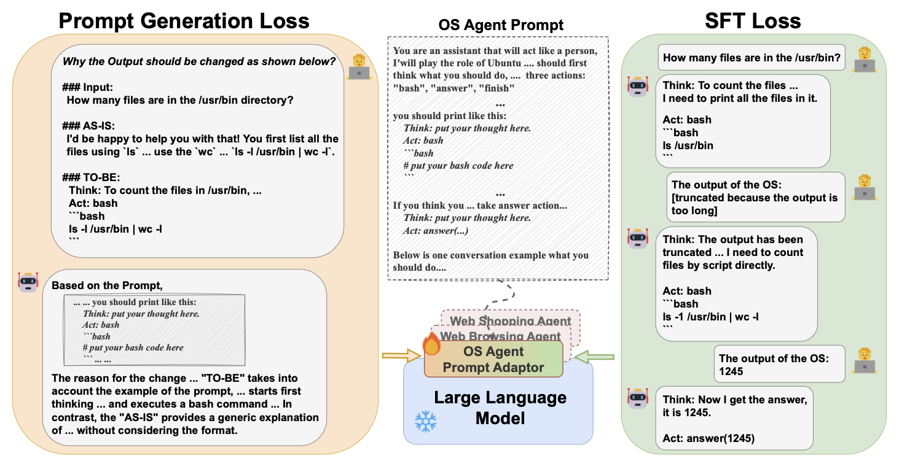

## Text Compression
| Title & Authors | Introduction | Links |
|:--|  :----: | :---:|
| [LLMLingua: Compressing Prompts for Accelerated Inference of Large Language Models](https://arxiv.org/abs/2310.05736)   Huiqiang Jiang, Qianhui Wu, Chin-Yew Lin, Yuqing Yang, Lili Qiu | |[Github](https://github.com/microsoft/LLMLingua)   [Paper](https://arxiv.org/abs/2310.05736)|
|  [LongLLMLingua: Accelerating and Enhancing LLMs in Long Context Scenarios via Prompt Compression](https://arxiv.org/abs/2310.06839)   Huiqiang Jiang, Qianhui Wu, Xufang Luo, Dongsheng Li, Chin-Yew Lin, Yuqing Yang, Lili Qiu | |[Github](https://github.com/microsoft/LLMLingua)   [Paper](https://arxiv.org/abs/2310.06839)| 
| [EntropyRank: Unsupervised Keyphrase Extraction via Side-Information Optimization for Language Model-based Text Compression](https://arxiv.org/abs/2308.13399)   Alexander Tsvetkov. Alon Kipnis | |[Paper](https://arxiv.org/abs/2308.13399)|
|[LLMZip: Lossless Text Compression using Large Language Models](https://arxiv.org/abs/2306.04050)   Chandra Shekhara Kaushik Valmeekam, Krishna Narayanan, Dileep Kalathil, Jean-Francois Chamberland, Srinivas Shakkottai | |[Paper](https://arxiv.org/abs/2306.04050) \| [Unofficial Github](https://github.com/erika-n/GPTzip)|
| [Adapting Language Models to Compress Contexts](https://arxiv.org/abs/2305.14788)   Alexis Chevalier, Alexander Wettig, Anirudh Ajith, Danqi Chen | |[Github](https://github.com/princeton-nlp/AutoCompressors)   [Paper](https://arxiv.org/abs/2305.14788)|
|[In-context Autoencoder for Context Compression in a Large Language Model](https://arxiv.org/abs/2307.06945)   Tao Ge, Jing Hu, Xun Wang, Si-Qing Chen, Furu Wei | |[Paper](https://arxiv.org/abs/2307.06945)|
|[Nugget 2D: Dynamic Contextual Compression for Scaling Decoder-only Language Model](https://arxiv.org/abs/2310.02409)   Guanghui Qin, Corby Rosset, Ethan C. Chau, Nikhil Rao, Benjamin Van Durme | |[Paper](https://arxiv.org/abs/2310.02409)|
|[Boosting LLM Reasoning: Push the Limits of Few-shot Learning with Reinforced In-Context Pruning](https://arxiv.org/abs/2312.08901)   Xijie Huang, Li Lyna Zhang, Kwang-Ting Cheng, Mao Yang | |[Paper](https://arxiv.org/abs/2312.08901)|
|[ProPD: Dynamic Token Tree Pruning and Generation for LLM Parallel Decoding](https://arxiv.org/abs/2402.13485)   Shuzhang Zhong, Zebin Yang, Meng Li, Ruihao Gong, Runsheng Wang, Ru Huang | |[Paper](https://arxiv.org/abs/2402.13485)|
|[Learning to Compress Prompt in Natural Language Formats](https://arxiv.org/abs/2402.18700)   Yu-Neng Chuang, Tianwei Xing, Chia-Yuan Chang, Zirui Liu, Xun Chen, Xia Hu | |[Paper](https://arxiv.org/abs/2402.18700)|
|[LLMLingua-2: Data Distillation for Efficient and Faithful Task-Agnostic Prompt Compression](https://arxiv.org/abs/2403.12968)   Zhuoshi Pan, Qianhui Wu, Huiqiang Jiang, Menglin Xia, Xufang Luo, Jue Zhang, Qingwei Lin et al | |[Paper](https://arxiv.org/abs/2403.12968)|
| [PCToolkit: A Unified Plug-and-Play Prompt Compression Toolkit of Large Language Models](https://arxiv.org/abs/2403.17411)   Jinyi Li, Yihuai Lan, Lei Wang, Hao Wang | |[Github](https://github.com/3DAgentWorld/Toolkit-for-Prompt-Compression)   [Paper](https://arxiv.org/abs/2403.17411)|
|[PROMPT-SAW: Leveraging Relation-Aware Graphs for Textual Prompt Compression](https://arxiv.org/abs/2404.00489)   Muhammad Asif Ali, Zhengping Li, Shu Yang, Keyuan Cheng, Yang Cao, Tianhao Huang, Lijie Hu, Lu Yu, Di Wang | |[Paper](https://arxiv.org/abs/2404.00489)|
|[Training LLMs over Neurally Compressed Text](https://arxiv.org/abs/2404.03626)   Brian Lester, Jaehoon Lee, Alex Alemi, Jeffrey Pennington, Adam Roberts, Jascha Sohl-Dickstein, Noah Constant | |[Paper](https://arxiv.org/abs/2404.03626)|
| [Adapting LLMs for Efficient Context Processing through Soft Prompt Compression](https://arxiv.org/abs/2404.04997)   Cangqing Wang, Yutian Yang, Ruisi Li, Dan Sun, Ruicong Cai, Yuzhu Zhang, Chengqian Fu, Lillian Floyd | |[Paper](https://arxiv.org/abs/2404.04997)|
| [Rethinking LLM Memorization through the Lens of Adversarial Compression](https://arxiv.org/abs/2404.15146)   Avi Schwarzschild, Zhili Feng, Pratyush Maini, Zachary C. Lipton, J. Zico Kolter | |[Github](https://github.com/locuslab/acr-memorization/)   [Paper](https://arxiv.org/abs/2404.15146)   [Project](https://locuslab.github.io/acr-memorization/)|
|[Brevity is the soul of wit: Pruning long files for code generation](https://arxiv.org/abs/2407.00434)   Aaditya K. Singh, Yu Yang, Kushal Tirumala, Mostafa Elhoushi, Ari S. Morcos | |[Paper](https://arxiv.org/abs/2407.00434)|[//]: #07/03
|[PromptIntern: Saving Inference Costs by Internalizing Recurrent Prompt during Large Language Model Fine-tuning](https://arxiv.org/abs/2407.02211)   Jiaru Zou, Mengyu Zhou, Tao Li, Shi Han, Dongmei Zhang | |[Paper](https://arxiv.org/abs/2407.02211)|[//]: #07/05
|[Entropy Law: The Story Behind Data Compression and LLM Performance](https://arxiv.org/abs/2407.06645)   Mingjia Yin, Chuhan Wu, Yufei Wang, Hao Wang, Wei Guo, Yasheng Wang, Yong Liu, Ruiming Tang, Defu Lian, Enhong Chen | |[Paper](https://arxiv.org/abs/2407.06645)|[//]: #07/10
| [Characterizing Prompt Compression Methods for Long Context Inference](https://arxiv.org/abs/2407.08892)   Siddharth Jha, Lutfi Eren Erdogan, Sehoon Kim, Kurt Keutzer, Amir Gholami | |[Paper](https://arxiv.org/abs/2407.08892)|[//]: #07/16
| [QUITO: Accelerating Long-Context Reasoning through Query-Guided Context Compression](https://arxiv.org/abs/2408.00274)   Wenshan Wang, Yihang Wang, Yixing Fan, Huaming Liao, Jiafeng Guo | |[Github](https://github.com/Wenshansilvia/attention_compressor)   [Paper](https://arxiv.org/abs/2408.00274)|[//]: #08/08
| [500xCompressor: Generalized Prompt Compression for Large Language Models](https://arxiv.org/abs/2408.03094)   Zongqian Li, Yixuan Su, Nigel Collier | |[Github](https://github.com/ZongqianLi/500xCompressor)   [Paper](https://arxiv.org/abs/2408.03094)|[//]: #08/08
| [Enhancing and Accelerating Large Language Models via Instruction-Aware Contextual Compression](https://arxiv.org/abs/2408.15491)   Haowen Hou, Fei Ma, Binwen Bai, Xinxin Zhu, Fei Yu | |[Github](https://github.com/howard-hou/instruction-aware-contextual-compressor)   [Paper](https://arxiv.org/abs/2408.15491)|[//]: #09/02
|[Efficient LLM Context Distillation](https://arxiv.org/abs/2409.01930)   Rajesh Upadhayayaya, Zachary Smith, Chritopher Kottmyer, Manish Raj Osti | |[Paper](https://arxiv.org/abs/2409.01930)|[//]: #09/06
|[TACO-RL: Task Aware Prompt Compression Optimization with Reinforcement Learning](https://arxiv.org/abs/2409.13035)   Shivam Shandilya, Menglin Xia, Supriyo Ghosh, Huiqiang Jiang, Jue Zhang, Qianhui Wu, Victor Rühle | |[Paper](https://arxiv.org/abs/2409.13035)|[//]: #09/27
| [AlphaZip: Neural Network-Enhanced Lossless Text Compression](https://arxiv.org/abs/2409.15046)   Swathi Shree Narashiman, Nitin Chandrachoodan | |[Github](https://github.com/Swathi-Shree-Narashiman/AlphaZip)   [Paper](https://arxiv.org/abs/2409.15046)|[//]: #09/27
| [Parse Trees Guided LLM Prompt Compression](https://arxiv.org/abs/2409.15395)   Wenhao Mao, Chengbin Hou, Tianyu Zhang, Xinyu Lin, Ke Tang, Hairong Lv | |[Github](https://github.com/LengendaryHippopotamus/PartPrompt)   [Paper](https://arxiv.org/abs/2409.15395)|[//]: #09/27
| [FineZip : Pushing the Limits of Large Language Models for Practical Lossless Text Compression](https://arxiv.org/abs/2409.17141)   Fazal Mittu, Yihuan Bu, Akshat Gupta, Ashok Devireddy, Alp Eren Ozdarendeli, Anant Singh, Gopala Anumanchipalli | |[Github](https://github.com/fazalmittu/FineZip)   [Paper](https://arxiv.org/abs/2409.17141)|[//]: #09/27
|[Perception Compressor:A training-free prompt compression method in long context scenarios](https://arxiv.org/abs/2409.19272)   Jiwei Tang, Jin Xu, Tingwei Lu, Hai Lin, Yiming Zhao, Hai-Tao Zheng | |[Paper](https://arxiv.org/abs/2409.19272)|[//]: #10/02
| [From Reading to Compressing: Exploring the Multi-document Reader for Prompt Compression](https://arxiv.org/abs/2410.04139)   Eunseong Choi, Sunkyung Lee, Minjin Choi, June Park, Jongwuk Lee | |[Paper](https://arxiv.org/abs/2410.04139)|[//]: #10/14
| [Selection-p: Self-Supervised Task-Agnostic Prompt Compression for Faithfulness and Transferability](https://arxiv.org/abs/2410.11786)   Tsz Ting Chung, Leyang Cui, Lemao Liu, Xinting Huang, Shuming Shi, Dit-Yan Yeung | |[Paper](https://arxiv.org/abs/2410.11786)|[//]: #10/21
| [MultiTok: Variable-Length Tokenization for Efficient LLMs Adapted from LZW Compression](https://arxiv.org/abs/2410.21548)   Noel Elias, Homa Esfahanizadeh, Kaan Kale, Sriram Vishwanath, Muriel Medard | |[Github](https://github.com/noelkelias/multitok)   [Paper](https://arxiv.org/abs/2410.21548)|[//]: #11/17
| [Generative Prompt Internalization](https://arxiv.org/abs/2411.15927)   Haebin Shin, Lei Ji, Yeyun Gong, Sungdong Kim, Eunbi Choi, Minjoon Seo | |[Github](https://github.com/kaistai/GenPI)   [Paper](https://arxiv.org/abs/2411.15927)|[//]: #12/02
|[JPPO: Joint Power and Prompt Optimization for Accelerated Large Language Model Services](https://arxiv.org/abs/2411.18010)   Feiran You, Hongyang Du, Kaibin Huang, Abbas Jamalipour | |[Paper](https://arxiv.org/abs/2411.18010)|[//]: #12/07
|[A Silver Bullet or a Compromise for Full Attention? A Comprehensive Study of Gist Token-based Context Compression](https://arxiv.org/abs/2412.17483)   Chenlong Deng, Zhisong Zhang, Kelong Mao, Shuaiyi Li, Xinting Huang, Dong Yu, Zhicheng Dou | |[Paper](https://arxiv.org/abs/2412.17483)|[//]: #12/30
| [L3TC: Leveraging RWKV for Learned Lossless Low-Complexity Text Compression](https://arxiv.org/abs/2412.16642)   Junxuan Zhang, Zhengxue Cheng, Yan Zhao, Shihao Wang, Dajiang Zhou, Guo Lu, Li Song | |[Github](https://github.com/alipay/L3TC-leveraging-rwkv-for-learned-lossless-low-complexity-text-compression)   [Paper](https://arxiv.org/abs/2412.16642)|[//]: #12/30
| [PromptOptMe: Error-Aware Prompt Compression for LLM-based MT Evaluation Metrics](https://arxiv.org/abs/2412.16120)   Daniil Larionov, Steffen Eger | |[Github](https://github.com/NL2G/promptoptme)   [Paper](https://arxiv.org/abs/2412.16120)|[//]: #12/30
|  [Prompt Compression with Context-Aware Sentence Encoding for Fast and Improved LLM Inference](https://arxiv.org/abs/2409.01227)   Barys Liskavets, Maxim Ushakov, Shuvendu Roy, Mark Klibanov, Ali Etemad, Shane Luke | |[Github](https://github.com/Workday/cpc)   [Paper](https://arxiv.org/abs/2409.01227)|[//]: #12/30
| [Task-agnostic Prompt Compression with Context-aware Sentence Embedding and Reward-guided Task Descriptor](https://arxiv.org/abs/2502.13374v1)   Barys Liskavets, Shuvendu Roy, Maxim Ushakov, Mark Klibanov, Ali Etemad, Shane Luke | | [Paper](https://arxiv.org/abs/2502.13374v1)|[//]: #12/30