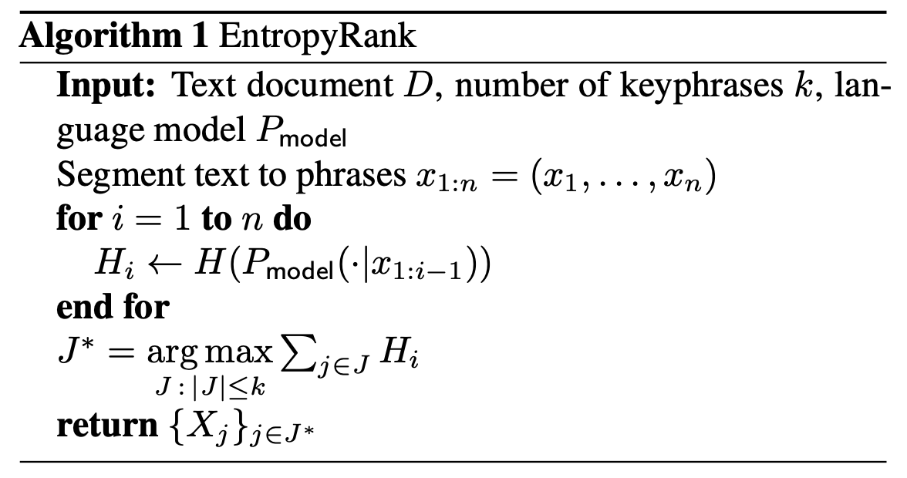
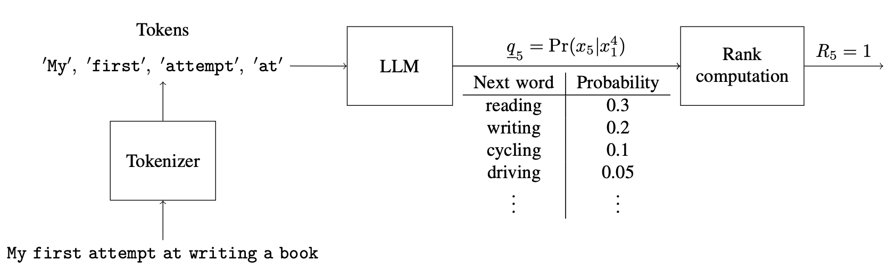
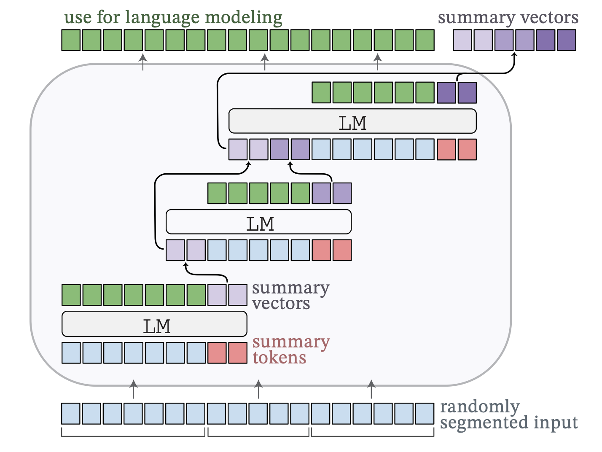
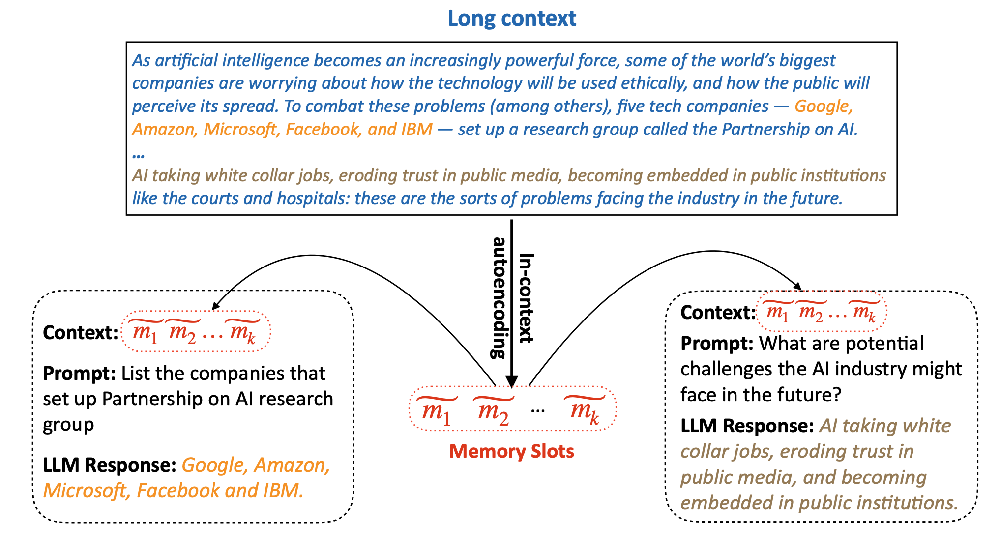
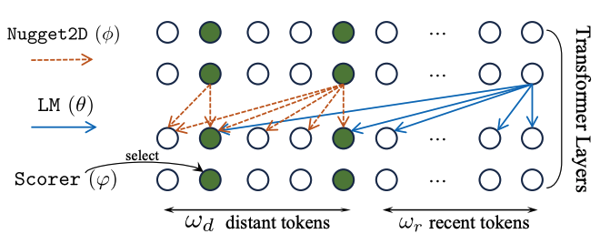
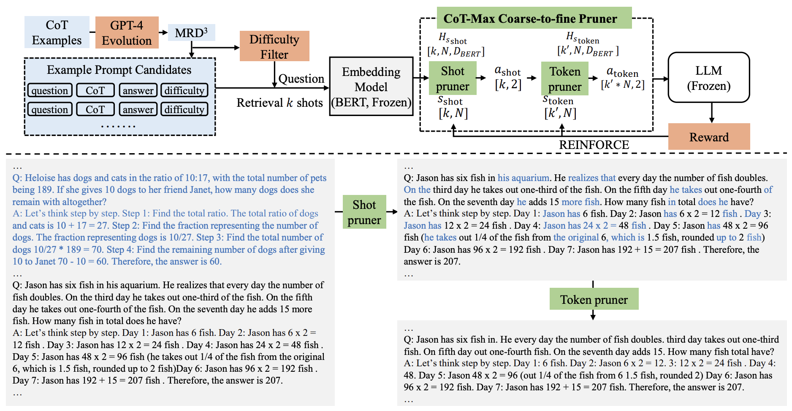
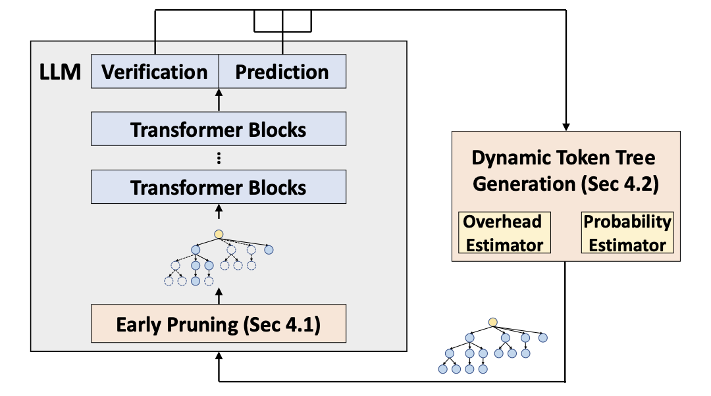

## Text Compression
| Title & Authors | Introduction | Links |
|:--|  :----: | :---:|
| [EntropyRank: Unsupervised Keyphrase Extraction via Side-Information Optimization for Language Model-based Text Compression](https://arxiv.org/abs/2308.13399)   Alexander Tsvetkov. Alon Kipnis | |[Paper](https://arxiv.org/abs/2308.13399)|
|[LLMZip: Lossless Text Compression using Large Language Models](https://arxiv.org/abs/2306.04050)   Chandra Shekhara Kaushik Valmeekam, Krishna Narayanan, Dileep Kalathil, Jean-Francois Chamberland, Srinivas Shakkottai | |[Paper](https://arxiv.org/abs/2306.04050) \| [Unofficial Github](https://github.com/erika-n/GPTzip)|
| [Adapting Language Models to Compress Contexts](https://arxiv.org/abs/2305.14788)   Alexis Chevalier, Alexander Wettig, Anirudh Ajith, Danqi Chen | |[Github](https://github.com/princeton-nlp/AutoCompressors)   [Paper](https://arxiv.org/abs/2305.14788)|
|[In-context Autoencoder for Context Compression in a Large Language Model](https://arxiv.org/abs/2307.06945)   Tao Ge, Jing Hu, Xun Wang, Si-Qing Chen, Furu Wei | |[Paper](https://arxiv.org/abs/2307.06945)|
|[Nugget 2D: Dynamic Contextual Compression for Scaling Decoder-only Language Model](https://arxiv.org/abs/2310.02409)   Guanghui Qin, Corby Rosset, Ethan C. Chau, Nikhil Rao, Benjamin Van Durme | |[Paper](https://arxiv.org/abs/2310.02409)|
|[Boosting LLM Reasoning: Push the Limits of Few-shot Learning with Reinforced In-Context Pruning](https://arxiv.org/abs/2312.08901)   Xijie Huang, Li Lyna Zhang, Kwang-Ting Cheng, Mao Yang | |[Paper](https://arxiv.org/abs/2312.08901)|
|[ProPD: Dynamic Token Tree Pruning and Generation for LLM Parallel Decoding](https://arxiv.org/abs/2402.13485)   Shuzhang Zhong, Zebin Yang, Meng Li, Ruihao Gong, Runsheng Wang, Ru Huang | |[Paper](https://arxiv.org/abs/2402.13485)|
|[Learning to Compress Prompt in Natural Language Formats](https://arxiv.org/abs/2402.18700)   Yu-Neng Chuang, Tianwei Xing, Chia-Yuan Chang, Zirui Liu, Xun Chen, Xia Hu | |[Paper](https://arxiv.org/abs/2402.18700)|
|[LLMLingua-2: Data Distillation for Efficient and Faithful Task-Agnostic Prompt Compression](https://arxiv.org/abs/2403.12968)   Zhuoshi Pan, Qianhui Wu, Huiqiang Jiang, Menglin Xia, Xufang Luo, Jue Zhang, Qingwei Lin et al | |[Paper](https://arxiv.org/abs/2403.12968)|
| [PCToolkit: A Unified Plug-and-Play Prompt Compression Toolkit of Large Language Models](https://arxiv.org/abs/2403.17411)   Jinyi Li, Yihuai Lan, Lei Wang, Hao Wang | |[Github](https://github.com/3DAgentWorld/Toolkit-for-Prompt-Compression)   [Paper](https://arxiv.org/abs/2403.17411)|
|[PROMPT-SAW: Leveraging Relation-Aware Graphs for Textual Prompt Compression](https://arxiv.org/abs/2404.00489)   Muhammad Asif Ali, Zhengping Li, Shu Yang, Keyuan Cheng, Yang Cao, Tianhao Huang, Lijie Hu, Lu Yu, Di Wang | |[Paper](https://arxiv.org/abs/2404.00489)|
|[Training LLMs over Neurally Compressed Text](https://arxiv.org/abs/2404.03626)   Brian Lester, Jaehoon Lee, Alex Alemi, Jeffrey Pennington, Adam Roberts, Jascha Sohl-Dickstein, Noah Constant | |[Paper](https://arxiv.org/abs/2404.03626)|
| [Adapting LLMs for Efficient Context Processing through Soft Prompt Compression](https://arxiv.org/abs/2404.04997)   Cangqing Wang, Yutian Yang, Ruisi Li, Dan Sun, Ruicong Cai, Yuzhu Zhang, Chengqian Fu, Lillian Floyd | |[Paper](https://arxiv.org/abs/2404.04997)|
| [Rethinking LLM Memorization through the Lens of Adversarial Compression](https://arxiv.org/abs/2404.15146)   Avi Schwarzschild, Zhili Feng, Pratyush Maini, Zachary C. Lipton, J. Zico Kolter | |[Github](https://github.com/locuslab/acr-memorization/)   [Paper](https://arxiv.org/abs/2404.15146)   [Project](https://locuslab.github.io/acr-memorization/)|